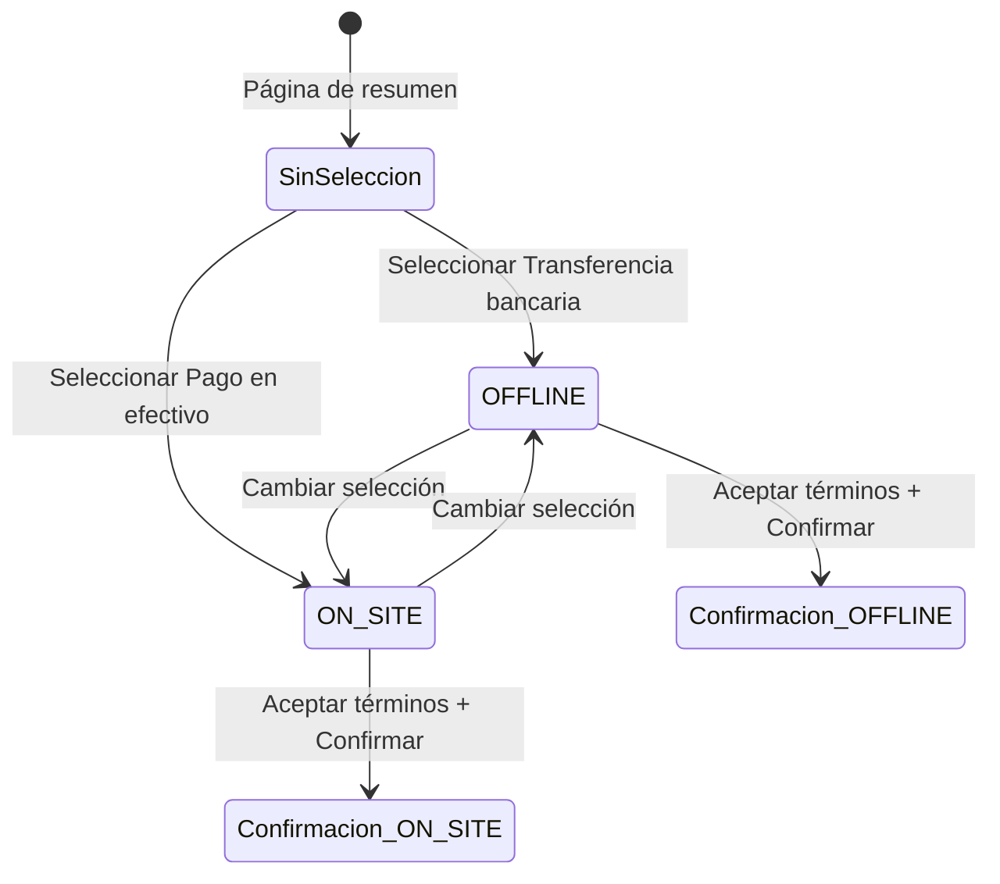
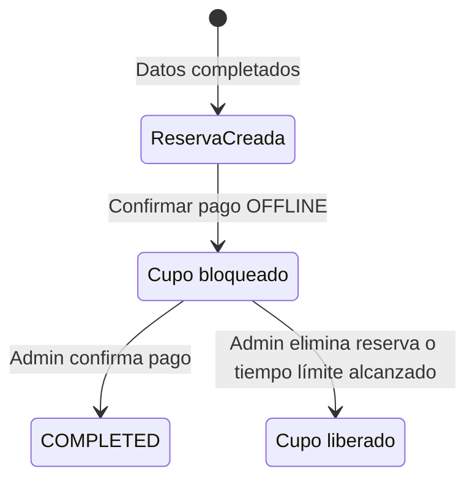
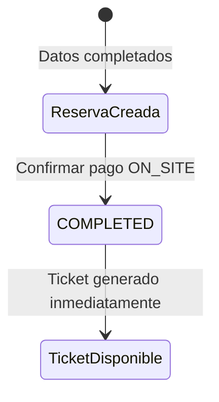
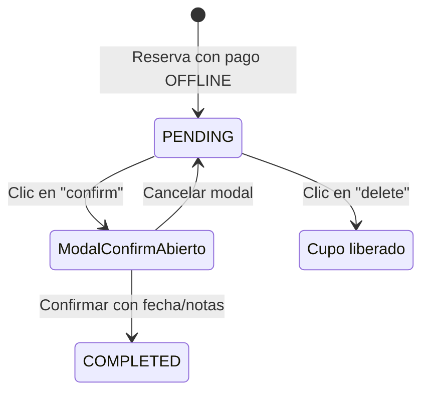

# Diseño de Casos de Prueba Funcionales del Sistema alf.io

## Índice
- [1. Propósito](#1-propósito)
- [2. Alcance de las Pruebas](#2-alcance-de-las-pruebas)
- [3. Referencias](#3-referencias)
- [4. Criterios de Entrada y Salida](#4-criterios-de-entrada-y-salida)
- [5. Entorno y Datos de Prueba](#5-entorno-y-datos-de-prueba)
- [6. Técnicas de Prueba](#6-técnicas-de-prueba)
- [7. Diseño de Casos de Prueba](#7-diseño-de-casos-de-prueba)
- [8. Matriz de Trazabilidad](#8-matriz-de-trazabilidad)
- [9. Métodos y Herramientas](#9-métodos-y-herramientas)
- [10. Conclusiones](#10-conclusiones)

## 1. Propósito

El propósito de este documento es definir y estructurar el diseño de casos de prueba funcionales para el sistema alf.io, con el fin de asegurar la calidad funcional del sistema mediante la aplicación de técnicas de prueba de caja negra.

Entre los objetivos específicos se incluyen: establecer casos de prueba basados en los requisitos funcionales, aplicar técnicas como partición por equivalencia, análisis de valores límite, pruebas de casos de uso y tablas de decisión y desarrollar una matriz de trazabilidad entre requisitos y pruebas.

## 2. Alcance de las Pruebas

### 2.1 Funcionalidades en Alcance

- **Creación y configuración de eventos:** Validar la capacidad de los administradores y organizadores para crear eventos, configurar categorías de tickets, precios y cupos.
- **Proceso de reserva y compra de tickets:** Flujo completo desde la selección del ticket por parte del asistente hasta la confirmación de la reserva y generación de la entrada.
- **Autenticación y autorización:** Verificación de roles (administrador global, propietario del evento, personal del evento) y control de acceso a las rutas.
- **Integración de pagos (Modo Test):** Simulación de pagos exitosos y fallidos utilizando proveedores compatibles (ej. Stripe Test Mode o pagos offline).

### 2.2 Funcionalidades Fuera de Alcance

- **Integraciones reales con pasarelas de pago:** Para evitar transacciones financieras reales y costos asociados, todas las pruebas se realizarán en modo de pruebas (sandbox).
- **Pruebas de estrés y rendimiento:** El enfoque de este plan es puramente funcional. El rendimiento bajo carga será abordado en una fase o plan de pruebas independiente.
- **Generación masiva de facturas PDF:** Solo se probarán las facturas generadas unitariamente durante el flujo normal de reserva.

## 3. Referencias

1. Estándares de Ingeniería de Software y Pruebas
   - **ISO/IEC/IEEE 29119:** Estándar internacional para pruebas de software (conceptos, procesos, documentación y técnicas de diseño de pruebas).
2. Documentación del Proyecto
   - **Documento de Plan de Pruebas Unitarias:** [[Plan de Pruebas Unitarias]]
   - **Repositorio oficial de alf.io:** [GitHub - alfio-event/alf.io](https://github.com/alfio-event/alf.io)
   - **Documentación de Arquitectura de alf.io:** [[Arquitectura]] del proyecto.

## 4. Criterios de Entrada y Salida

### 4.1 Criterios de Entrada

- El código de la aplicación (alf.io) debe estar compilado y desplegado correctamente en el entorno de pruebas.
- Las pruebas unitarias base deben pasar exitosamente en el entorno de CI (GitHub Actions).
- La base de datos de pruebas (PostgreSQL) debe estar inicializada con los esquemas actualizados.

### 4.2 Criterios de Salida

- Se han ejecutado todos los casos de prueba funcionales diseñados y documentados en la sección de la wiki correspondiente.
- Se han reportado todos los defectos encontrados durante la ejecución.

## 5. Entorno y Datos de Prueba

### 5.1 Entorno de Pruebas

- **Servidor / Hosting:** Entorno remoto de pruebas configurado con Kubernetes, replicando la arquitectura de producción.
- **Base de datos:** PostgreSQL en versión 16, compatible con los requerimientos actuales del proyecto, corriendo en un pod aislado.
- **Navegadores soportados:** Pruebas funcionales frontend orientadas a las últimas versiones estables de Google Chrome (148.0.7778.215) y Mozilla Firefox (151.0.2).

### 5.2 Datos de Prueba

- **Cuentas de usuario:** Cuenta de Administrador Global pre-configurada (datos de las variables de entorno de prueba).

## 6. Técnicas de Prueba

### 6.1 Técnicas de Caja Negra

Se aplicarán las siguientes técnicas de diseño de pruebas basadas en los requisitos funcionales del sistema:

- **Partición por equivalencia:** Los datos de entrada se agrupan en clases válidas e inválidas. Por ejemplo, los roles de usuario (administrador, organizador, operador de check-in) se prueban para verificar que cada uno tenga acceso exclusivo a las operaciones permitidas.
- **Análisis de valores límite:** Se prueban valores en los extremos de los rangos permitidos, como límites de caracteres en campos de texto, fechas próximas al evento, cupos mínimos y máximos de entradas, y montos de dinero en los límites de precisión de BigDecimal.
- **Pruebas de casos de uso:** Se recorren paso a paso los flujos principales del sistema: creación de un evento, configuración de categorías de entradas, proceso de compra, generación de entradas (incluyendo Apple Wallet), check-in y reporting.
- **Tablas de decisión:** Se aplican para validar reglas complejas de negocio, como el cálculo de precios con descuentos, impuestos (IVA), tarifas de servicio y promociones combinadas, donde múltiples condiciones booleanas determinan el resultado final.

## 7. Diseño de Casos de Prueba

### Edición de Tickets Adquiridos (Nombre, Apellido y Correo)
| ID | CPF-0001 |
| :--- | :--- |
| **Funcionalidad** | Edición de información del asistente post-compra |
| **Descripción** | Permite a un administrador modificar los datos críticos (nombre, apellido y correo) de un ticket que ya ha sido emitido, validando la integridad de los datos. |
| **Requisito Asociado** | RF-001 (Gestión de Tickets) |
| **Precondiciones** | El ticket debe estar en estado 'Purchased'. El usuario debe tener permisos de edición sobre la reserva. |
| **Datos de Entrada** | Nombre, Apellido, Correo Electrónico. |
| **Pasos de Ejecución** | 1. Acceder al detalle de la reserva. 2. Hacer clic en la opción de edición del ticket. 3. Modificar los campos de Nombre/Apellido o Correo. 4. Presionar el botón "Guardar". |
| **Técnicas de Pruebas** | Partición de Equivalencia, Análisis de Valores Límite. |
| **Prioridad** | Alta |

**Análisis de Técnicas**

**Partición de Equivalencia**
| Campo | Clase Válida | Clases No Válidas |
| :--- | :--- | :--- |
| Nombre/Apellido | Texto alfabético (1-255 caracteres) | Vacío, > 255 caracteres, incluye números. |
| Correo | Formato estándar (user@domain.com) | Vacío, formato incorrecto (sin @), longitud excesiva. |

**Valores Límite**
| Campo | Límite Inf. Válido | Límite Inf. No Válido | Límite Sup. Válido | Límite Sup. No Válido |
| :--- | :--- | :--- | :--- | :--- |
| Nombre/Apellido | 1 carácter | 0 caracteres (vacío) | 255 caracteres | 256 caracteres |
| Correo | Longitud mínima válida | 0 caracteres | Máximo soportado (64 chars local) | Excede límite (65 chars local) |

**Catálogo de Pruebas**
| #CP | Datos de Entrada | Resultado Esperado | Obs |
| :--- | :--- | :--- | :--- |
| CPF-01-001 | Nombre: "" (vacío) | Rechazar: Error de campo obligatorio | f- |
| CPF-01-002 | Nombre: "A" (1 carácter) | Aceptar: Cambio guardado exitosamente | f+ |
| CPF-01-003 | Nombre: (Cadena de 254 caracteres) | Aceptar: Cambio guardado exitosamente | f+ |
| CPF-01-004 | Nombre: (Cadena de 255 caracteres) | Aceptar: Cambio guardado exitosamente | f+ |
| CPF-01-005 | Nombre: (Cadena de 256 caracteres) | Rechazar: Error de longitud excedida | f- |
| CPF-01-006 | Nombre: "Juan123" (con números) | Rechazar: Error de formato (solo letras) | f- |
| CPF-01-007 | Correo: "" (vacío) | Rechazar: Error de campo obligatorio | f- |
| CPF-01-008 | Correo: "aaaaa" (sin formato @) | Rechazar: Error de formato de correo | f- |
| CPF-01-009 | Correo con longitud de 63 caracteres | Aceptar: Cambio guardado exitosamente | f+ |
| CPF-01-010 | Correo con longitud de 64 caracteres | Aceptar: Cambio guardado exitosamente | f+ |
| CPF-01-011 | Correo con longitud de 65 caracteres | Rechazar: Error de longitud excedida | f- |

### Búsqueda de Reservas (Panel de Administración)
| ID | CPF-0002 |
| :--- | :--- |
| **Funcionalidad** | Búsqueda y filtrado de reservas |
| **Descripción** | Valida que el sistema de búsqueda administrativa recupere correctamente las reservas basándose en el ID único o el apellido del asistente. |
| **Requisito Asociado** | RF-002 (Búsqueda de Reservas) |
| **Precondiciones** | Deben existir reservas previas en el sistema. |
| **Datos de Entrada** | ID de reserva, Apellido. |
| **Pasos de Ejecución** | 1. Ingresar al listado de reservas. 2. Introducir el criterio en la barra de búsqueda. 3. Ejecutar la búsqueda. |
| **Técnicas de Pruebas** | Partición de Equivalencia. |
| **Prioridad** | Media |

**Análisis de Técnicas**

**Partición de Equivalencia**
| Cod. | Clase Válida | Clases No Válidas |
| :--- | :--- | :--- |
| PE-B01 | ID de reserva existente en el sistema | ID inexistente o mal formado |
| PE-B02 | Apellido exacto de un comprador | Apellido que no figura en ninguna reserva |

**Catálogo de Pruebas**
| #CP | Criterio de Búsqueda | Resultado Esperado | Obs |
| :--- | :--- | :--- | :--- |
| CPF-02-001 | ID: "ID-EXISTENTE" | El sistema muestra la reserva específica | f+ |
| CPF-02-002 | Apellido: "Pérez" | El sistema lista todas las reservas bajo ese apellido | f+ |
| CPF-02-003 | Valor: "ValorInexistente" | El sistema muestra mensaje "Sin resultados" | f- |

### Gestión de Estados de Reserva y Pagos
| ID | CPF-0003 |
| :--- | :--- |
| **Funcionalidad** | Transiciones de estado por pagos manuales |
| **Descripción** | Verifica que las reservas transicionen correctamente entre estados tras acciones manuales (aceptar/cancelar pago) y que la UI responda a las reglas de negocio. |
| **Requisito Asociado** | RF-003 (Gestión de Estados) |
| **Precondiciones** | Reserva en estado pendiente de pago. |
| **Datos de Entrada** | Interacción con botones de acción y modales. |
| **Pasos de Ejecución** | 1. Seleccionar una reserva pendiente. 2. Ejecutar acción de pago/cancelación. 3. Validar cambio de estado en la tabla. |
| **Técnicas de Pruebas** | Transición de Estados, Tablas de Decisión. |
| **Prioridad** | Alta |

**Análisis de Técnicas**

**Transición de Estados**

**Tabla de Decisión: Visibilidad del botón "Marcar como Completa"**
| Condición | C1 | C2 | C3 | C4 |
| :--- | :--- | :--- | :--- | :--- |
| ¿Se completó el llenado? | SI | SI | SI | NO |
| Tipo de Pago | Presencial | Offline | Proveedor | - |
| ¿Pago Aprobado? | NO | SI | NO | NO |
| **Mostrar Botón** | **NO** | **SI** | **NO** | **NO** |

**Catálogo de Pruebas**
| #CP | Acción / Escenario | Resultado Esperado | Obs |
| :--- | :--- | :--- | :--- |
| CPF-03-001 | Clic en "Aceptar Pago" -> Confirmar | La reserva cambia a estado COMPLETE | f+ |
| CPF-03-002 | Clic en "Cancelar Pago" -> Confirmar | La reserva cambia a estado CANCELLED | f+ |
| CPF-03-003 | Iniciar transición -> Clic fuera del modal | El modal se cierra y el estado se mantiene | f+ |
| CPF-03-004 | Llenado=SI, Pago=Offline, Aprobado=SI | Se visualiza el botón para marcar como completa | f+ |
| CPF-03-005 | Llenado=SI, Pago=Presencial, Aprobado=NO | El botón de marcar como completa se oculta | f+ |
| CPF-03-006 | Llenado=NO | El botón de marcar como completa se oculta | f+ |

### Disponibilidad de Descarga de Tickets
| ID | CPF-0004 |
| :--- | :--- |
| **Funcionalidad** | Lógica de emisión y descarga de entradas |
| **Descripción** | Valida las condiciones bajo las cuales un usuario puede descargar su ticket en PDF, basándose en la temporalidad, modalidad y estado financiero. |
| **Requisito Asociado** | RF-004 (Emisión de Entradas) |
| **Precondiciones** | Reserva realizada por el usuario. |
| **Técnicas de Pruebas** | Tablas de Decisión. |
| **Prioridad** | Alta |

**Análisis de Técnicas**

**Tabla de Decisión: Mostrar botón de descarga de ticket**
| Condición | C1 | C2 | C3 | C4 | C5 | C6 |
| :--- | :--- | :--- | :--- | :--- | :--- | :--- |
| ¿El evento ya pasó? | SI | NO | NO | NO | NO | NO |
| Modalidad del evento | - | Presencial | Presencial | Híbrido | Híbrido | Virtual |
| ¿Pago Aprobado? | - | SI | NO | SI | NO | - |
| **Mostrar Botón** | **NO** | **SI** | **NO** | **SI** | **NO** | **NO** |

**Catálogo de Pruebas**
| #CP | Escenario | Resultado Esperado | Obs |
| :--- | :--- | :--- | :--- |
| CPF-04-001 | Fecha del evento en el pasado | El botón de descarga no se muestra | f- |
| CPF-04-002 | Futuro, Presencial, Pago aprobado | El botón de descarga es visible y funcional | f+ |
| CPF-04-003 | Futuro, Presencial, Pago pendiente | El botón de descarga permanece oculto | f- |
| CPF-04-004 | Futuro, Híbrido, Pago aprobado | El botón de descarga es visible y funcional | f+ |
| CPF-04-005 | Futuro, Híbrido, Pago pendiente | El botón de descarga permanece oculto | f- |
| CPF-04-006 | Futuro, Modalidad Virtual | El botón de descarga no se muestra (acceso digital) | f- |

### Proceso de Pago

#### Selección de Método de Pago
| ID | CPF-0005 |
| :--- | :--- |
| **Funcionalidad** | Selección de método de pago durante checkout |
| **Descripción** | Valida que el sistema muestre correctamente las opciones de pago disponibles (Transferencia bancaria / Pago en efectivo) y que la interfaz cambie según el método seleccionado. |
| **Requisito Asociado** | RF-005 (Selección de Método de Pago) |
| **Precondiciones** | Reserva creada con tickets seleccionados y datos del comprador completados. Página de resumen de pedido visible. |
| **Datos de Entrada** | Selección de método de pago (radio button), aceptación de términos y condiciones. |
| **Pasos de Ejecución** | 1. Llegar a la página de resumen de pedido. 2. Observar opciones de pago disponibles. 3. Seleccionar un método de pago. 4. Verificar cambio en la interfaz (texto informativo y botón). |
| **Técnicas de Pruebas** | Partición de Equivalencia, Tabla de Decisión, Transición de Estados. |
| **Prioridad** | Alta |

**Análisis de Técnicas**

**Partición de Equivalencia**
| Cod. | Campo | Clase Válida | Clases No Válidas |
| :--- | :--- | :--- | :--- |
| FN5-PE-001 | Método de pago | "Transferencia bancaria" (OFFLINE) | - |
| FN5-PE-002 | Método de pago | "Pago en efectivo al llegar" (ON_SITE) | - |
| FN5-PE-003 | Método de pago | Ninguno seleccionado | - |

**Tabla de Decisión**
| Cod. | Método seleccionado | Términos aceptados | Texto informativo | Botón | Acción Sistema |
| :--- | :--- | :--- | :--- | :--- | :--- |
| FN5-TD-001 | OFFLINE | Sí | "Tiene X día(s) para completar su pago" | "Pagar PEN X.XX" (habilitado) | Permite continuar |
| FN5-TD-002 | OFFLINE | No | "Tiene X día(s) para completar su pago" | "Pagar PEN X.XX" (deshabilitado) | No permite continuar |
| FN5-TD-003 | ON_SITE | Sí | "Recibirá su entrada pero para acceder al evento deberá pagar en la entrada." | "Confirmar" (habilitado) | Permite continuar |
| FN5-TD-004 | ON_SITE | No | "Recibirá su entrada pero para acceder al evento deberá pagar en la entrada." | "Confirmar" (deshabilitado) | No permite continuar |
| FN5-TD-005 | Ninguno | - | "Por favor selecciona un método de pago para continuar" | - | No permite continuar |

**Transición de Estados**

| Cod. | Estado Origen | Estado Destino | Acción |
| :--- | :--- | :--- | :--- |
| FN5-TS-001 | Sin selección | OFFLINE | Seleccionar "Transferencia bancaria" |
| FN5-TS-002 | Sin selección | ON_SITE | Seleccionar "Pago en efectivo al llegar" |
| FN5-TS-003 | OFFLINE | ON_SITE | Cambiar selección a "Pago en efectivo" |
| FN5-TS-004 | ON_SITE | OFFLINE | Cambiar selección a "Transferencia bancaria" |

**Catálogo de Pruebas**
| #CP | Datos de Entrada | Resultado Esperado | Obs |
| :--- | :--- | :--- | :--- |
| CPF-05-001 | Método: OFFLINE, Términos: Aceptados | Texto: "Tiene X día(s) para completar su pago", Botón: "Pagar PEN X.XX" habilitado | f+ |
| CPF-05-002 | Método: OFFLINE, Términos: No aceptados | Botón: "Pagar PEN X.XX" deshabilitado | f- |
| CPF-05-003 | Método: ON_SITE, Términos: Aceptados | Texto: "Recibirá su entrada...", Botón: "Confirmar" habilitado | f+ |
| CPF-05-004 | Método: ON_SITE, Términos: No aceptados | Botón: "Confirmar" deshabilitado | f- |
| CPF-05-005 | Método: Ninguno | Mensaje: "Por favor selecciona un método de pago para continuar" | f- |
| CPF-05-006 | Cambiar de OFFLINE a ON_SITE | La interfaz cambia según método seleccionado | f+ |

> **Nota:** CPF-05-006 deriva de FN5-TS-003 (OFFLINE → ON_SITE) y FN5-TS-004 (ON_SITE → OFFLINE).

#### Procesamiento de Pago OFFLINE (Transferencia Bancaria)
| ID | CPF-0006 |
| :--- | :--- |
| **Funcionalidad** | Procesamiento de pago por transferencia bancaria |
| **Descripción** | Valida el flujo completo de pago OFFLINE desde la confirmación hasta la gestión de su ciclo de vida: instrucciones de pago, fecha de expiración, bloqueo temporal de cupo y liberación automática al expirar. |
| **Requisito Asociado** | RF-006 (Pago OFFLINE) |
| **Precondiciones** | Reserva creada con tickets seleccionados y datos del comprador completados. Método de pago OFFLINE disponible en la configuración del evento. |
| **Datos de Entrada** | Método de pago seleccionado (Transferencia bancaria), aceptación de términos y condiciones. |
| **Pasos de Ejecución** | 1. Seleccionar "Transferencia bancaria". 2. Aceptar términos y condiciones. 3. Hacer clic en "Confirmar". 4. Verificar página de instrucciones de pago. 5. Verificar bloqueo de cupo. 6. Verificar expiración y liberación de cupo. |
| **Técnicas de Pruebas** | Tabla de Decisión, Transición de Estados. |
| **Prioridad** | Alta |

**Análisis de Técnicas**

> **Nota:** La validación de aceptación de términos y condiciones (botón deshabilitado cuando no se aceptan) ya se encuentra cubierta por CPF-0005 (Selección de Método de Pago), por lo que no se duplica en esta sección.

**Tabla de Decisión**
| Cod. | Método | Términos aceptados | Acción Sistema |
| :--- | :--- | :--- | :--- |
| FN6-TD-001 | OFFLINE | Sí | Redirige a página "waiting-payment" con instrucciones de pago, fecha de expiración y concepto de pago (ID) |

**Transición de Estados**

| Cod. | Estado Origen | Estado Destino | Acción / Verificación |
| :--- | :--- | :--- | :--- |
| FN6-TS-001 | ReservaCreada | PENDING | Confirmar pago OFFLINE, cupo se bloquea |
| FN6-TS-002 | PENDING | (propiedad) | Estado PENDING muestra: monto, ID, fecha expiración, instrucciones |
| FN6-TS-003 | PENDING | (propiedad) | Estado PENDING tiene fecha de expiración visible |
| FN6-TS-004 | PENDING | (propiedad) | Estado PENDING bloquea cupo del inventario |
| FN6-TS-005 | PENDING | CANCELLED | Tiempo límite alcanzado o admin elimina, cupo se libera |

**Catálogo de Pruebas**
| #CP | Datos de Entrada | Resultado Esperado | Obs |
| :--- | :--- | :--- | :--- |
| CPF-06-001 | Método: OFFLINE, Términos: Aceptados | Redirige a "waiting-payment", muestra instrucciones de transferencia, fecha de expiración, ID de reserva | f+ |
| CPF-06-002 | Verificar página waiting-payment | Muestra: monto a transferir, concepto de pago (ID), fecha límite de pago, instrucciones para envío de comprobante | f+ |
| CPF-06-003 | Verificar expiración de reserva OFFLINE | La reserva muestra fecha de expiración visible y el sistema tiene mecanismo para cancelar reservas expiradas | f+ |
| CPF-06-004 | Crear reserva OFFLINE y verificar inventario | El contador de tickets disponibles disminuye inmediatamente tras crear la reserva | f+ |
| CPF-06-005 | Verificar liberación de cupo tras expiración | Al expirar la reserva, el cupo vuelve a estar disponible en el inventario del evento | f+ |

> **Notas de trazabilidad:**
> - CPF-06-001 deriva de FN6-TD-001 (Tabla de Decisión).
> - CPF-06-002 deriva de FN6-TS-002 (propiedad del estado PENDING).
> - CPF-06-003 deriva de FN6-TS-003 (propiedad del estado PENDING).
> - CPF-06-004 deriva de FN6-TS-001 (transición ReservaCreada → PENDING, bloqueo de cupo).
> - CPF-06-005 deriva de FN6-TS-005 (transición PENDING → CANCELLED, liberación de cupo).

#### Procesamiento de Pago ON_SITE (Efectivo)
| ID | CPF-0007 |
| :--- | :--- |
| **Funcionalidad** | Procesamiento de pago en efectivo al llegar al evento |
| **Descripción** | Valida el flujo completo de pago ON_SITE: confirmación directa, generación inmediata del ticket, visualización, descarga PDF, y verificación de que la reserva no tiene expiración de pago (a diferencia de OFFLINE). |
| **Requisito Asociado** | RF-007 (Pago ON_SITE) |
| **Precondiciones** | Reserva creada con tickets seleccionados y datos del comprador completados. Método de pago ON_SITE disponible en la configuración del evento. |
| **Datos de Entrada** | Método de pago seleccionado (Pago en efectivo), aceptación de términos y condiciones. |
| **Pasos de Ejecución** | 1. Seleccionar "Pago en efectivo al llegar". 2. Aceptar términos y condiciones. 3. Hacer clic en "Confirmar". 4. Verificar página de éxito. 5. Verificar ticket (Ver y Descargar). 6. Verificar ausencia de expiración. |
| **Técnicas de Pruebas** | Partición de Equivalencia, Tabla de Decisión, Transición de Estados. |
| **Prioridad** | Alta |

**Análisis de Técnicas**

> **Nota:** La validación de aceptación de términos y condiciones (botón deshabilitado cuando no se aceptan) ya se encuentra cubierta por CPF-0005 (Selección de Método de Pago, caso CPF-05-004), por lo que no se duplica en esta sección.

**Partición de Equivalencia**

Acciones disponibles sobre el ticket tras pago ON_SITE:
| Cod. | Acción | Clase |
| :--- | :--- | :--- |
| FN7-PE-001 | Ver | Clase válida: visualiza la página del ticket con su información |
| FN7-PE-002 | Descargar | Clase válida: descarga el PDF del ticket |
| FN7-PE-003 | Email | Clase válida: reenvía el ticket por correo |
| FN7-PE-004 | Actualizar | Clase válida: actualiza los datos del ticket |

**Tabla de Decisión: Diferencias entre ON_SITE y OFFLINE**
| Cod. | Característica | ON_SITE | OFFLINE |
| :--- | :--- | :--- | :--- |
| FN7-TD-001 | Página destino tras confirmar | success (ticket inmediato) | waiting-payment (instrucciones de pago) |
| FN7-TD-002 | Fecha de expiración de pago | No aplica | Sí (48 horas) |
| FN7-TD-003 | Ticket disponible | Inmediatamente | Tras confirmación del admin |

**Transición de Estados**

| Cod. | Estado Origen | Estado Destino | Acción / Verificación |
| :--- | :--- | :--- | :--- |
| FN7-TS-001 | ReservaCreada | COMPLETED | Confirmar pago ON_SITE, ticket se genera inmediatamente |
| FN7-TS-002 | COMPLETED | TicketDisponible | Ticket muestra info completa: Titular, Tipo, Ref, Mensaje |

**Catálogo de Pruebas**
| #CP | Datos de Entrada | Resultado Esperado | Obs |
| :--- | :--- | :--- | :--- |
| CPF-07-001 | Método: ON_SITE, Términos: Aceptados | Redirige a "success", muestra confirmación, ticket con nombre del asistente, opciones Ver, Descargar, Email, Actualizar | f+ |
| CPF-07-002 | Ver ticket tras pago ON_SITE | Muestra: Titular, Tipo, Número de referencia, Info. del pedido, mensaje "Esta entrada no ha sido pagada, por lo que debe pagar la cantidad requerida al llegar" | f+ |
| CPF-07-003 | Descargar ticket PDF | El PDF se descarga correctamente con la información del ticket | f+ |
| CPF-07-004 | Verificar que ON_SITE no muestra fecha de expiración | La página de éxito NO muestra "Pago requerido no más tarde de" | f+ |
| CPF-07-005 | Verificar que ticket ON_SITE está disponible inmediatamente | El ticket está disponible desde el momento de la confirmación, sin necesidad de aprobación administrativa | f+ |

> **Notas de trazabilidad:**
> - CPF-07-001 deriva de FN7-TD-001 (Tabla de Decisión: ON_SITE → success) y FN7-TS-001 (transición).
> - CPF-07-002 deriva de FN7-TS-002 (propiedad del estado TicketDisponible).
> - CPF-07-003 deriva de FN7-PE-002 (Partición de Equivalencia: acción Descargar).
> - CPF-07-004 deriva de FN7-TD-002 (Tabla de Decisión: fecha expiración = No aplica).
> - CPF-07-005 deriva de FN7-TD-003 (Tabla de Decisión: ticket disponible = Inmediatamente).

#### Gestión de Pagos Pendientes (Administrador)
| ID | CPF-0008 |
| :--- | :--- |
| **Funcionalidad** | Gestión de pagos pendientes por parte del administrador (confirmación y eliminación) |
| **Descripción** | Valida que el administrador pueda confirmar pagos OFFLINE pendientes mediante un modal, cancelar la operación manteniendo el estado pendiente, y eliminar reservas pendientes liberando el cupo del evento. |
| **Requisito Asociado** | RF-008 (Gestión de Pagos Pendientes) |
| **Precondiciones** | Existe al menos una reserva con pago OFFLINE en estado PENDING. Usuario autenticado como administrador. |
| **Datos de Entrada** | Fecha/hora de recepción (pre-rellenada), Notas (opcional), Confirmación de eliminación. |
| **Pasos de Ejecución** | 1. Ingresar a "Pending Payments" del evento. 2. Localizar la reserva pendiente. 3. Hacer clic en "confirm" o "delete". 4. Completar la acción correspondiente. |
| **Técnicas de Pruebas** | Partición de Equivalencia, Transición de Estados. |
| **Prioridad** | Alta |

**Análisis de Técnicas**

**Partición de Equivalencia**
| Cod. | Campo | Clase Válida | Clases No Válidas |
| :--- | :--- | :--- | :--- |
| FN8-PE-001 | Fecha/hora de recepción | Fecha válida (pre-rellenada por el sistema) | - |
| FN8-PE-002 | Notas | Con contenido (texto libre) | - |
| FN8-PE-003 | Notas | Vacío (campo opcional) | - |

**Transición de Estados**

| Cod. | Estado Origen | Estado Destino | Acción / Verificación |
| :--- | :--- | :--- | :--- |
| FN8-TS-001 | PENDING | COMPLETED | Admin confirma pago con fecha válida (notas opcionales) |
| FN8-TS-002 | PENDING | PENDING | Admin cancela modal de confirmación, estado se mantiene |
| FN8-TS-003 | PENDING | CANCELLED | Admin elimina reserva, cupo se libera |

**Catálogo de Pruebas**
| #CP | Datos de Entrada | Resultado Esperado | Obs |
| :--- | :--- | :--- | :--- |
| CPF-08-001 | Confirmar pago con fecha pre-rellenada (notas opcionales) | Pago cambia a COMPLETED, reserva desaparece de Pending Payments, contador disminuye | f+ |
| CPF-08-002 | Clic en "Cancel" del modal de confirmación | Modal se cierra, pago permanece PENDING, reserva permanece en lista | f+ |
| CPF-08-003 | Clic en "delete" de reserva pendiente | Reserva desaparece de Pending Payments, contador disminuye, cupo se libera | f+ |
| CPF-08-004 | Verificar estado tras eliminación | Reserva aparece en estado "Cancelled" en la lista de reservas del evento | f+ |

> **Notas de trazabilidad:**
> - CPF-08-001 deriva de FN8-TS-001 (transición PENDING → COMPLETED) y FN8-PE-001 (fecha válida). Las notas (FN8-PE-002 con contenido, FN8-PE-003 vacío) son variaciones de entrada que no alteran el resultado.
> - CPF-08-002 deriva de FN8-TS-002 (transición PENDING → PENDING al cancelar).
> - CPF-08-003 deriva de FN8-TS-003 (transición PENDING → CANCELLED).
> - CPF-08-004 deriva de FN8-TS-003 (verificación de la transición PENDING → CANCELLED).

## Matriz de Trazabilidad

En esta sección se relacionan los requisitos funcionales con los casos de prueba que los verifican:

| Requisito Funcional | Casos de Prueba Asociados |
| :--- | :--- |
| **RF-001:** Gestión de información del asistente (Edición de Ticket) | CPF-0001 (001-011) |
| **RF-002:** Búsqueda administrativa de reservas | CPF-0002 (001-003) |
| **RF-003:** Gestión de estados y flujos de pago | CPF-0003 (001-006) |
| **RF-004:** Emisión y visualización de entradas (PDF) | CPF-0004 (001-006) |
| **RF-005:** Selección de método de pago | CPF-0005 (001-006) |
| **RF-006:** Procesamiento de pago OFFLINE | CPF-0006 (001-005) |
| **RF-007:** Procesamiento de pago ON_SITE | CPF-0007 (001-005) |
| **RF-008:** Gestión de pagos pendientes | CPF-0008 (001-004) |

## 9. Métodos y Herramientas

### 9.1 Gestión y Planificación

- **Gestión de tareas, casos de prueba y defectos:** GitHub Issues (empleando templates estandarizados) y GitHub Projects para visualización en tablero Kanban.
- **Documentación de Pruebas:** GitHub Wiki del repositorio para el mantenimiento de este plan de pruebas y documentación relacionada.

### 9.2 Automatización e Integración Continua

- **CI/CD:** GitHub Actions para ejecución automática de pruebas unitarias en cada Pull Request.
- **Reportes de Cobertura:** Herramientas como JaCoCo (backend) y herramientas de cobertura de Vitest (frontend) integradas en el pipeline de GitHub Actions.

## 10. Conclusiones

Las técnicas de caja negra aplicadas al diseño de casos de prueba para alf.io permiten estructurar una validación eficiente y exhaustiva, orientada a descubrir errores de lógica en la gestión de eventos, reservas y pagos, así como defectos en la interacción con el usuario. Al combinar partición por equivalencia, análisis de valores límite, pruebas de casos de uso y tablas de decisión, se optimiza la selección de casos de prueba para cubrir amplios escenarios de entrada sin redundancias innecesarias.

La organización del diseño en casos de prueba estandarizados y la matriz de trazabilidad proporcionan una visión clara del cubrimiento funcional, facilitando la ejecución, el seguimiento y la mejora continua del proceso de pruebas.
