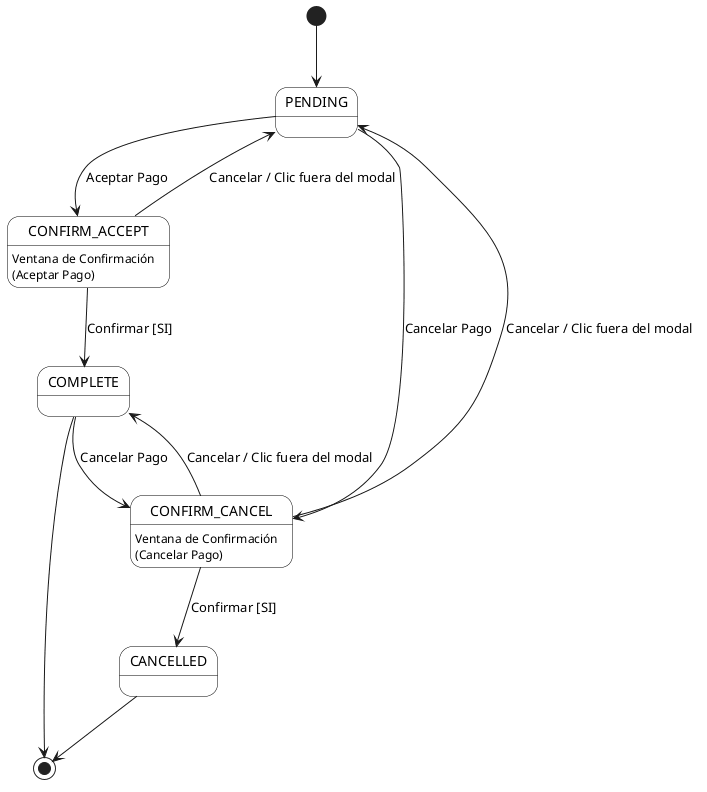
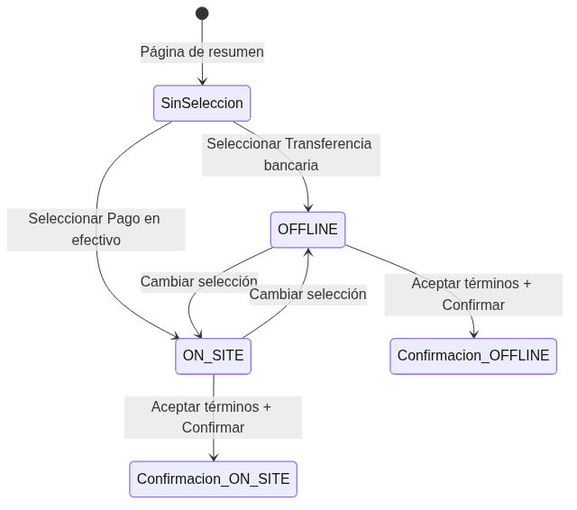
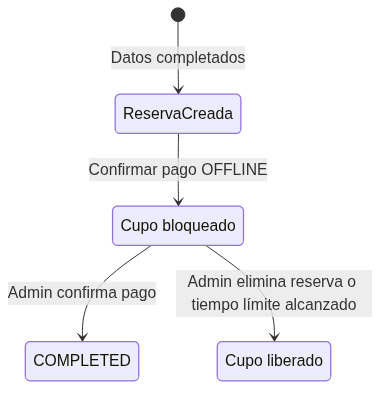
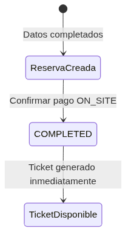
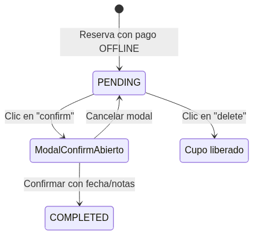
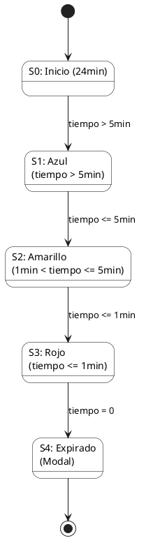

# Diseño de Casos de Prueba Funcionales del Sistema alf.io

## Índice
- [1. Propósito](#1-propósito)
- [2. Alcance de las Pruebas](#2-alcance-de-las-pruebas)
- [3. Referencias](#3-referencias)
- [4. Criterios de Entrada y Salida](#4-criterios-de-entrada-y-salida)
- [5. Entorno y Datos de Prueba](#5-entorno-y-datos-de-prueba)
- [6. Técnicas de Prueba](#6-técnicas-de-prueba)
- [7. Diseño de Casos de Prueba](#7-diseño-de-casos-de-prueba)
- [8. Matriz de Trazabilidad](#8-matriz-de-trazabilidad)
- [9. Métodos y Herramientas](#9-métodos-y-herramientas)
- [10. Conclusiones](#10-conclusiones)

## 1. Propósito

El propósito de este documento es definir y estructurar el diseño de casos de prueba funcionales para el sistema alf.io, con el fin de asegurar la calidad funcional del sistema mediante la aplicación de técnicas de prueba de caja negra.

Entre los objetivos específicos se incluyen: establecer casos de prueba basados en los requisitos funcionales, aplicar técnicas como partición por equivalencia, análisis de valores límite, pruebas de casos de uso y tablas de decisión y desarrollar una matriz de trazabilidad entre requisitos y pruebas.


## 2. Alcance de las Pruebas


### 2.1 Funcionalidades en Alcance

- **Creación y configuración de eventos:** Validar la capacidad de los administradores y organizadores para crear eventos, configurar categorías de tickets, precios y cupos.
- **Proceso de reserva y compra de tickets:** Flujo completo desde la selección del ticket por parte del asistente hasta la confirmación de la reserva y generación de la entrada.
- **Autenticación y autorización:** Verificación de roles (administrador global, propietario del evento, personal del evento) y control de acceso a las rutas.
- **Integración de pagos (Modo Test):** Simulación de pagos exitosos y fallidos utilizando proveedores compatibles (ej. Stripe Test Mode o pagos offline).
### 2.2 Funcionalidades Fuera de Alcance

- **Integraciones reales con pasarelas de pago:** Para evitar transacciones financieras reales y costos asociados, todas las pruebas se realizarán en modo de pruebas (sandbox).
- **Pruebas de estrés y rendimiento:** El enfoque de este plan es puramente funcional. El rendimiento bajo carga será abordado en una fase o plan de pruebas independiente.
- **Generación masiva de facturas PDF:** Solo se probarán las facturas generadas unitariamente durante el flujo normal de reserva.

## 3. Referencias

1. Estándares de Ingeniería de Software y Pruebas
   - **ISO/IEC/IEEE 29119:** Estándar internacional para pruebas de software (conceptos, procesos, documentación y técnicas de diseño de pruebas).
2. Documentación del Proyecto
   - **Documento de Plan de Pruebas Unitarias:** [[Plan de Pruebas Unitarias]]
   - **Repositorio oficial de alf.io:** [GitHub - alfio-event/alf.io](https://github.com/alfio-event/alf.io)
   - **Documentación de Arquitectura de alf.io:** [[Arquitectura]] del proyecto.


## 4. Criterios de Entrada y Salida


### 4.1 Criterios de Entrada

- El código de la aplicación (alf.io) debe estar compilado y desplegado correctamente en el entorno de pruebas.
- Las pruebas unitarias base deben pasar exitosamente en el entorno de CI (GitHub Actions).
- La base de datos de pruebas (PostgreSQL) debe estar inicializada con los esquemas actualizados.
### 4.2 Criterios de Salida

- Se han ejecutado todos los casos de prueba funcionales diseñados y documentados en la sección de la wiki correspondiente.
- Se han reportado todos los defectos encontrados durante la ejecución.

## 5. Entorno y Datos de Prueba


### 5.1 Entorno de Pruebas

- **Servidor / Hosting:** Entorno remoto de pruebas configurado con Kubernetes, replicando la arquitectura de producción.
- **Base de datos:** PostgreSQL en versión 16, compatible con los requerimientos actuales del proyecto, corriendo en un pod aislado.
- **Navegadores soportados:** Pruebas funcionales frontend orientadas a las últimas versiones estables de Google Chrome (148.0.7778.215) y Mozilla Firefox (151.0.2).
### 5.2 Datos de Prueba

- **Cuentas de usuario:** Cuenta de Administrador Global pre-configurada (datos de las variables de entorno de prueba).

## 6. Técnicas de Prueba


### 6.1 Técnicas de Caja Negra

Se aplicarán las siguientes técnicas de diseño de pruebas basadas en los requisitos funcionales del sistema:

- **Partición por equivalencia:** Los datos de entrada se agrupan en clases válidas e inválidas. Por ejemplo, los roles de usuario (administrador, organizador, operador de check-in) se prueban para verificar que cada uno tenga acceso exclusivo a las operaciones permitidas.
- **Análisis de valores límite:** Se prueban valores en los extremos de los rangos permitidos, como límites de caracteres en campos de texto, fechas próximas al evento, cupos mínimos y máximos de entradas, y montos de dinero en los límites de precisión de BigDecimal.
- **Pruebas de casos de uso:** Se recorren paso a paso los flujos principales del sistema: creación de un evento, configuración de categorías de entradas, proceso de compra, generación de entradas (incluyendo Apple Wallet), check-in y reporting.
- **Tablas de decisión:** Se aplican para validar reglas complejas de negocio, como el cálculo de precios con descuentos, impuestos (IVA), tarifas de servicio y promociones combinadas, donde múltiples condiciones booleanas determinan el resultado final.

## 7. Diseño de Casos de Prueba

### Edición de Tickets Adquiridos (Nombre, Apellido y Correo)
| ID | CPF-0001 |
| :--- | :--- |
| **Funcionalidad** | Edición de información del asistente post-compra |
| **Descripción** | Permite a un administrador modificar los datos críticos (nombre, apellido y correo) de un ticket que ya ha sido emitido, validando la integridad de los datos. |
| **Requisito Asociado** | RF-001 (Gestión de Tickets) |
| **Precondiciones** | El ticket debe estar en estado 'Purchased'. El usuario debe tener permisos de edición sobre la reserva. |
| **Datos de Entrada** | Nombre, Apellido, Correo Electrónico. |
| **Pasos de Ejecución** | 1. Acceder al detalle de la reserva. 2. Hacer clic en la opción de edición del ticket. 3. Modificar los campos de Nombre/Apellido o Correo. 4. Presionar el botón "Guardar". |
| **Técnicas de Pruebas** | Partición de Equivalencia, Análisis de Valores Límite. |
| **Prioridad** | Alta |

**Análisis de Técnicas**

**Partición de Equivalencia**
| Campo | Clase Válida | Clases No Válidas |
| :--- | :--- | :--- |
| Nombre/Apellido | Texto alfabético (1-255 caracteres) | Vacío, > 255 caracteres, incluye números. |
| Correo | Formato estándar (user@domain.com) | Vacío, formato incorrecto (sin @), longitud excesiva. |

**Valores Límite**
| Campo | Límite Inf. Válido | Límite Inf. No Válido | Límite Sup. Válido | Límite Sup. No Válido |
| :--- | :--- | :--- | :--- | :--- |
| Nombre/Apellido | 1 carácter | 0 caracteres (vacío) | 255 caracteres | 256 caracteres |
| Correo | Longitud mínima válida | 0 caracteres | Máximo soportado (64 chars local) | Excede límite (65 chars local) |


**Catálogo de Pruebas**
| #CP | Datos de Entrada | Resultado Esperado | Obs |
| :--- | :--- | :--- | :--- |
| CPF-01-001 | Nombre: "" (vacío) | Rechazar: Error de campo obligatorio | f- |
| CPF-01-002 | Nombre: "A" (1 carácter) | Aceptar: Cambio guardado exitosamente | f+ |
| CPF-01-003 | Nombre: (Cadena de 254 caracteres) | Aceptar: Cambio guardado exitosamente | f+ |
| CPF-01-004 | Nombre: (Cadena de 255 caracteres) | Aceptar: Cambio guardado exitosamente | f+ |
| CPF-01-005 | Nombre: (Cadena de 256 caracteres) | Rechazar: Error de longitud excedida | f- |
| CPF-01-006 | Nombre: "Juan123" (con números) | Rechazar: Error de formato (solo letras) | f- |
| CPF-01-007 | Correo: "" (vacío) | Rechazar: Error de campo obligatorio | f- |
| CPF-01-008 | Correo: "aaaaa" (sin formato @) | Rechazar: Error de formato de correo | f- |
| CPF-01-009 | Correo con longitud de 63 caracteres | Aceptar: Cambio guardado exitosamente | f+ |
| CPF-01-010 | Correo con longitud de 64 caracteres | Aceptar: Cambio guardado exitosamente | f+ |
| CPF-01-011 | Correo con longitud de 65 caracteres | Rechazar: Error de longitud excedida | f- |

### Búsqueda de Reservas (Panel de Administración)
| ID | CPF-0002 |
| :--- | :--- |
| **Funcionalidad** | Búsqueda y filtrado de reservas |
| **Descripción** | Valida que el sistema de búsqueda administrativa recupere correctamente las reservas basándose en el ID único o el apellido del asistente. |
| **Requisito Asociado** | RF-002 (Búsqueda de Reservas) |
| **Precondiciones** | Deben existir reservas previas en el sistema. |
| **Datos de Entrada** | ID de reserva, Apellido. |
| **Pasos de Ejecución** | 1. Ingresar al listado de reservas. 2. Introducir el criterio en la barra de búsqueda. 3. Ejecutar la búsqueda. |
| **Técnicas de Pruebas** | Partición de Equivalencia. |
| **Prioridad** | Media |

**Análisis de Técnicas**

**Partición de Equivalencia**
| Campo | Clase Válida | Clases No Válidas |
| :--- | :--- | :--- |
| PE-B01 | ID de reserva existente en el sistema | ID inexistente o mal formado |
| PE-B02 | Apellido exacto de un comprador | Apellido que no figura en ninguna reserva |


**Catálogo de Pruebas**
| #CP | Criterio de Búsqueda | Resultado Esperado | Obs |
| :--- | :--- | :--- | :--- |
| CPF-02-001 | ID: "ID-EXISTENTE" | El sistema muestra la reserva específica | f+ |
| CPF-02-002 | Apellido: "Pérez" | El sistema lista todas las reservas bajo ese apellido | f+ |
| CPF-02-003 | Valor: "ValorInexistente" | El sistema muestra mensaje "Sin resultados" | f- |

### Gestión de Estados de Reserva y Pagos
| ID | CPF-0003 |
| :--- | :--- |
| **Funcionalidad** | Transiciones de estado por pagos manuales |
| **Descripción** | Verifica que las reservas transicionen correctamente entre estados tras acciones manuales (aceptar/cancelar pago) y que la UI responda a las reglas de negocio. |
| **Requisito Asociado** | RF-003 (Gestión de Estados) |
| **Precondiciones** | Reserva en estado pendiente de pago. |
| **Datos de Entrada** | Interacción con botones de acción y modales. |
| **Pasos de Ejecución** | 1. Seleccionar una reserva pendiente. 2. Ejecutar acción de pago/cancelación. 3. Validar cambio de estado en la tabla. |
| **Técnicas de Pruebas** | Transición de Estados, Tablas de Decisión. |
| **Prioridad** | Alta |

**Análisis de Técnicas**


**Tabla de Decisión: Visibilidad del botón "Marcar como Completa"**
| Condición | C1 | C2 | C3 | C4 |
| :--- | :--- | :--- | :--- | :--- |
| ¿Se completó el llenado? | SI | SI | SI | NO |
| Tipo de Pago | Presencial | Offline | Proveedor | - |
| ¿Pago Aprobado? | NO | SI | NO | NO |
| **Mostrar Botón** | **NO** | **SI** | **NO** | **NO** |

**Transición de Estados**



**Catálogo de Pruebas**
| #CP | Acción / Escenario | Resultado Esperado | Obs |
| :--- | :--- | :--- | :--- |
| CPF-03-001 | Clic en "Aceptar Pago" -> Confirmar | La reserva cambia a estado COMPLETE | f+ |
| CPF-03-002 | Clic en "Cancelar Pago" -> Confirmar | La reserva cambia a estado CANCELLED | f+ |
| CPF-03-003 | Iniciar transición -> Clic fuera del modal | El modal se cierra y el estado se mantiene | f+ |
| CPF-03-004 | Llenado=SI, Pago=Offline, Aprobado=SI | Se visualiza el botón para marcar como completa | f+ |
| CPF-03-005 | Llenado=SI, Pago=Presencial, Aprobado=NO | El botón de marcar como completa se oculta | f+ |
| CPF-03-006 | Llenado=NO | El botón de marcar como completa se oculta | f+ |

### Disponibilidad de Descarga de Tickets
| ID | CPF-0004 |
| :--- | :--- |
| **Funcionalidad** | Lógica de emisión y descarga de entradas |
| **Descripción** | Valida las condiciones bajo las cuales un usuario puede descargar su ticket en PDF, basándose en la temporalidad, modalidad y estado financiero. |
| **Requisito Asociado** | RF-004 (Emisión de Entradas) |
| **Precondiciones** | Reserva realizada por el usuario. |
| **Datos de Entrada** |  |
| **Pasos de Ejecución** | |
| **Técnicas de Pruebas** | Tablas de Decisión. |
| **Prioridad** | Alta |

**Análisis de Técnicas**


**Tabla de Decisión: Mostrar botón de descarga de ticket**
| Condición | C1 | C2 | C3 | C4 | C5 | C6 |
| :--- | :--- | :--- | :--- | :--- | :--- | :--- |
| ¿El evento ya pasó? | SI | NO | NO | NO | NO | NO |
| Modalidad del evento | - | Presencial | Presencial | Híbrido | Híbrido | Virtual |
| ¿Pago Aprobado? | - | SI | NO | SI | NO | - |
| **Mostrar Botón** | **NO** | **SI** | **NO** | **SI** | **NO** | **NO** |


**Catálogo de Pruebas**
| #CP | Escenario | Resultado Esperado | Obs |
| :--- | :--- | :--- | :--- |
| CPF-04-001 | Fecha del evento en el pasado | El botón de descarga no se muestra | f- |
| CPF-04-002 | Futuro, Presencial, Pago aprobado | El botón de descarga es visible y funcional | f+ |
| CPF-04-003 | Futuro, Presencial, Pago pendiente | El botón de descarga permanece oculto | f- |
| CPF-04-004 | Futuro, Híbrido, Pago aprobado | El botón de descarga es visible y funcional | f+ |
| CPF-04-005 | Futuro, Híbrido, Pago pendiente | El botón de descarga permanece oculto | f- |
| CPF-04-006 | Futuro, Modalidad Virtual | El botón de descarga no se muestra (acceso digital) | f- |

### Selección de Método de Pago
| ID | CPF-0005 |
| :--- | :--- |
| **Funcionalidad** | Selección de método de pago durante checkout |
| **Descripción** | Valida que el sistema muestre correctamente las opciones de pago disponibles (Transferencia bancaria / Pago en efectivo) y que la interfaz cambie según el método seleccionado. |
| **Requisito Asociado** | RF-005 (Selección de Método de Pago) |
| **Precondiciones** | Reserva creada con tickets seleccionados y datos del comprador completados. Página de resumen de pedido visible. |
| **Datos de Entrada** | Selección de método de pago (radio button), aceptación de términos y condiciones. |
| **Pasos de Ejecución** | 1. Llegar a la página de resumen de pedido. 2. Observar opciones de pago disponibles. 3. Seleccionar un método de pago. 4. Verificar cambio en la interfaz (texto informativo y botón). |
| **Técnicas de Pruebas** | Partición de Equivalencia, Tabla de Decisión, Transición de Estados |
| **Prioridad** | Alta |

**Análisis de Técnicas**

**Partición de Equivalencia**
| Campo | Clase Válida | Clases No Válidas |
| :--- | :--- | :--- |
| Método de pago | "Transferencia bancaria" (OFFLINE) | - |
| Método de pago | "Pago en efectivo al llegar" (ON_SITE) | - |
| Método de pago | Ninguno seleccionado | - |


**Tabla de Decisión: Comportamiento según método seleccionado y aceptación de términos**
| Condición | C1 | C2 | C3 | C4 | C5 |
| :--- | :--- | :--- | :--- | :--- | :--- |
| Método seleccionado | OFFLINE | OFFLINE | ON_SITE | ON_SITE | Ninguno |
| Términos aceptados | Sí | No | Sí | No | - |
| Texto informativo | "Tiene X día(s) para completar su pago" | "Tiene X día(s) para completar su pago" | "Recibirá su entrada pero para acceder al evento deberá pagar en la entrada." | "Recibirá su entrada pero para acceder al evento deberá pagar en la entrada." | "Por favor selecciona un método de pago para continuar" |
| Botón | "Pagar PEN X.XX" (habilitado) | "Pagar PEN X.XX" (deshabilitado) | "Confirmar" (habilitado) | "Confirmar" (deshabilitado) | - |
| **Acción Sistema** | **Permite continuar** | **No permite continuar** | **Permite continuar** | **No permite continuar** | **No permite continuar** |

**Transición de Estados**



**Catálogo de Pruebas**
| #CP | Datos de Entrada | Resultado Esperado | Obs |
| :--- | :--- | :--- | :--- |
| CPF-05-001 | Método: OFFLINE, Términos: Aceptados | Texto: "Tiene X día(s) para completar su pago", Botón: "Pagar PEN X.XX" habilitado | f+ |
| CPF-05-002 | Método: OFFLINE, Términos: No aceptados | Botón: "Pagar PEN X.XX" deshabilitado | f- |
| CPF-05-003 | Método: ON_SITE, Términos: Aceptados | Texto: "Recibirá su entrada...", Botón: "Confirmar" habilitado | f+ |
| CPF-05-004 | Método: ON_SITE, Términos: No aceptados | Botón: "Confirmar" deshabilitado | f- |
| CPF-05-005 | Método: Ninguno | Mensaje: "Por favor selecciona un método de pago para continuar" | f- |
| CPF-05-006 | Cambiar de OFFLINE a ON_SITE | La interfaz cambia según método seleccionado | f+ |

### Procesamiento de Pago OFFLINE (Transferencia Bancaria)
| ID | CPF-0006 |
| :--- | :--- |
| **Funcionalidad** | Procesamiento de pago por transferencia bancaria |
| **Descripción** | Valida el flujo completo de pago OFFLINE desde la confirmación hasta la gestión de su ciclo de vida: instrucciones de pago, fecha de expiración, bloqueo temporal de cupo y liberación automática al expirar. |
| **Requisito Asociado** | RF-006 (Pago OFFLINE) |
| **Precondiciones** | Reserva creada con tickets seleccionados y datos del comprador completados. Método de pago OFFLINE disponible en la configuración del evento. |
| **Datos de Entrada** | Método de pago seleccionado (Transferencia bancaria), aceptación de términos y condiciones. |
| **Pasos de Ejecución** | 1. Seleccionar "Transferencia bancaria". 2. Aceptar términos y condiciones. 3. Hacer clic en "Confirmar". 4. Verificar página de instrucciones de pago. 5. Verificar bloqueo de cupo. 6. Verificar expiración y liberación de cupo. |
| **Técnicas de Pruebas** | Tabla de Decisión, Transición de Estados |
| **Prioridad** | Alta |

**Análisis de Técnicas**


**Tabla de Decisión: Redirección tras confirmar pago OFFLINE**
| Condición | C1 |
| :--- | :--- |
| Método | OFFLINE |
| Términos aceptados | Sí |
| **Acción Sistema** | **Redirige a página "waiting-payment" con instrucciones de pago, fecha de expiración y concepto de pago (ID)** |

**Transición de Estados**



**Catálogo de Pruebas**
| #CP | Datos de Entrada | Resultado Esperado | Obs |
| :--- | :--- | :--- | :--- |
| CPF-06-001 | Método: OFFLINE, Términos: Aceptados | Redirige a "waiting-payment", muestra instrucciones de transferencia, fecha de expiración, ID de reserva | f+ |
| CPF-06-002 | Verificar página waiting-payment | Muestra: monto a transferir, concepto de pago (ID), fecha límite de pago, instrucciones para envío de comprobante | f+ |
| CPF-06-003 | Verificar expiración de reserva OFFLINE | La reserva muestra fecha de expiración visible y el sistema tiene mecanismo para cancelar reservas expiradas | f+ |
| CPF-06-004 | Crear reserva OFFLINE y verificar inventario | El contador de tickets disponibles disminuye inmediatamente tras crear la reserva | f+ |
| CPF-06-005 | Verificar liberación de cupo tras expiración | Al expirar la reserva, el cupo vuelve a estar disponible en el inventario del evento | f+ |

### Procesamiento de Pago ON_SITE (Efectivo)
| ID | CPF-0007 |
| :--- | :--- |
| **Funcionalidad** | Procesamiento de pago en efectivo al llegar al evento |
| **Descripción** | Valida el flujo completo de pago ON_SITE: confirmación directa, generación inmediata del ticket, visualización, descarga PDF, y verificación de que la reserva no tiene expiración de pago (a diferencia de OFFLINE). |
| **Requisito Asociado** | RF-007 (Pago ON_SITE) |
| **Precondiciones** | Reserva creada con tickets seleccionados y datos del comprador completados. Método de pago ON_SITE disponible en la configuración del evento. |
| **Datos de Entrada** | Método de pago seleccionado (Pago en efectivo), aceptación de términos y condiciones. |
| **Pasos de Ejecución** | 1. Seleccionar "Pago en efectivo al llegar". 2. Aceptar términos y condiciones. 3. Hacer clic en "Confirmar". 4. Verificar página de éxito. 5. Verificar ticket (Ver y Descargar). 6. Verificar ausencia de expiración. |
| **Técnicas de Pruebas** | Partición de Equivalencia, Tabla de Decisión, Transición de Estados |
| **Prioridad** | Alta |

**Análisis de Técnicas**

**Partición de Equivalencia**
| Campo | Clase Válida | Clases No Válidas |
| :--- | :--- | :--- |
| Acción sobre ticket | Ver: visualiza la página del ticket con su información | - |
| Acción sobre ticket | Descargar: descarga el PDF del ticket | - |
| Acción sobre ticket | Email: reenvía el ticket por correo | - |
| Acción sobre ticket | Actualizar: actualiza los datos del ticket | - |


**Tabla de Decisión: Diferencias entre ON_SITE y OFFLINE**
| Característica | ON_SITE | OFFLINE |
| :--- | :--- | :--- |
| Página destino tras confirmar | success (ticket inmediato) | waiting-payment (instrucciones de pago) |
| Fecha de expiración de pago | No aplica | Sí (48 horas) |
| **Ticket disponible** | **Inmediatamente** | **Tras confirmación del admin** |

**Transición de Estados**



**Catálogo de Pruebas**
| #CP | Datos de Entrada | Resultado Esperado | Obs |
| :--- | :--- | :--- | :--- |
| CPF-07-001 | Método: ON_SITE, Términos: Aceptados | Redirige a "success", muestra confirmación, ticket con nombre del asistente, opciones Ver, Descargar, Email, Actualizar | f+ |
| CPF-07-002 | Ver ticket tras pago ON_SITE | Muestra: Titular, Tipo, Número de referencia, Info. del pedido, mensaje "Esta entrada no ha sido pagada, por lo que debe pagar la cantidad requerida al llegar" | f+ |
| CPF-07-003 | Descargar ticket PDF | El PDF se descarga correctamente con la información del ticket | f+ |
| CPF-07-004 | Verificar que ON_SITE no muestra fecha de expiración | La página de éxito NO muestra "Pago requerido no más tarde de" | f+ |
| CPF-07-005 | Verificar que ticket ON_SITE está disponible inmediatamente | El ticket está disponible desde el momento de la confirmación, sin necesidad de aprobación administrativa | f+ |

### Gestión de Pagos Pendientes (Administrador)
| ID | CPF-0008 |
| :--- | :--- |
| **Funcionalidad** | Gestión de pagos pendientes por parte del administrador (confirmación y eliminación) |
| **Descripción** | Valida que el administrador pueda confirmar pagos OFFLINE pendientes mediante un modal, cancelar la operación manteniendo el estado pendiente, y eliminar reservas pendientes liberando el cupo del evento. |
| **Requisito Asociado** | RF-008 (Gestión de Pagos Pendientes) |
| **Precondiciones** | Existe al menos una reserva con pago OFFLINE en estado PENDING. Usuario autenticado como administrador. |
| **Datos de Entrada** | Fecha/hora de recepción (pre-rellenada), Notas (opcional), Confirmación de eliminación. |
| **Pasos de Ejecución** | 1. Ingresar a "Pending Payments" del evento. 2. Localizar la reserva pendiente. 3. Hacer clic en "confirm" o "delete". 4. Completar la acción correspondiente. |
| **Técnicas de Pruebas** | Partición de Equivalencia, Transición de Estados |
| **Prioridad** | Alta |

**Análisis de Técnicas**

**Partición de Equivalencia**
| Campo | Clase Válida | Clases No Válidas |
| :--- | :--- | :--- |
| Fecha/hora de recepción | Fecha válida (pre-rellenada por el sistema) | - |
| Notas | Con contenido (texto libre) | - |
| Notas | Vacío (campo opcional) | - |


**Transición de Estados**



**Catálogo de Pruebas**
| #CP | Datos de Entrada | Resultado Esperado | Obs |
| :--- | :--- | :--- | :--- |
| CPF-08-001 | Confirmar pago con fecha pre-rellenada (notas opcionales) | Pago cambia a COMPLETED, reserva desaparece de Pending Payments, contador disminuye | f+ |
| CPF-08-002 | Clic en "Cancel" del modal de confirmación | Modal se cierra, pago permanece PENDING, reserva permanece en lista | f+ |
| CPF-08-003 | Clic en "delete" de reserva pendiente | Reserva desaparece de Pending Payments, contador disminuye, cupo se libera | f+ |
| CPF-08-004 | Verificar estado tras eliminación | Reserva aparece en estado "Cancelled" en la lista de reservas del evento | f+ |

### Check-in Online (Auto-check-in)
| ID | CPF-0016 |
| :--- | :--- |
| **Funcionalidad** | Proceso de auto-check-in por parte del usuario asistente |
| **Descripción** | Valida si un usuario asistente puede realizar el check-in digital de su ticket de manera autónoma desde la interfaz web. |
| **Requisito Asociado** | RF-009 (Auto-Check-in) |
| **Precondiciones** | El usuario posee un enlace válido a la página de su ticket personal. |
| **Datos de Entrada** |  |
| **Pasos de Ejecución** | |
| **Técnicas de Pruebas** | Tablas de Decisión. |
| **Prioridad** | Alta |

**Análisis de Técnicas**


**Tabla de Decisión: Habilitar botón de auto-check-in**
| Condición | C1 | C2 | C3 | C4 | C5 |
| :--- | :--- | :--- | :--- | :--- | :--- |
| ¿Auto-check-in habilitado en el evento? | NO | SI | SI | SI | SI |
| ¿Estado del ticket es pagado/aprobado? | - | NO | SI | SI | SI |
| ¿Está dentro del rango de tiempo permitido? | - | - | NO | SI | SI |
| ¿El ticket ya fue ingresado/usado? | - | - | - | SI | NO |
| **Habilitar Botón / Permitir Acción** | **NO** | **NO** | **NO** | **NO** | **SI** |


**Catálogo de Pruebas**
| #CP | Escenario | Resultado Esperado | Obs |
| :--- | :--- | :--- | :--- |
| CPF-16-001 | Auto-check-in deshabilitado en evento | El botón no aparece | f- |
| CPF-16-002 | Con pago pendiente | El botón se muestra inactivo o bloqueado | f- |
| CPF-16-003 | Fuera de la ventana de tiempo (muy temprano/tarde) | El botón permanece deshabilitado o muestra un aviso con la hora exacta de habilitación. | f- |
| CPF-16-004 | Ticket ya ingresado | El botón se oculta o cambia a estado "Ingresado" | f- |
| CPF-16-005 | Condiciones válidas (Habilitado, pagado, a tiempo, sin usar) | Botón visible y funcional; al hacer clic cambia el estado a "Checked-In" | f+ |

### Validación de QR (Escaneo de Ticket en Puerta)
| ID | CPF-0017 |
| :--- | :--- |
| **Funcionalidad** | Validación y control de acceso mediante códigos QR |
| **Descripción** | Define el comportamiento e indicativo visual del lector de entrada según el estado y validez del QR escaneado. |
| **Requisito Asociado** | RF-010 (Control de Acceso) |
| **Precondiciones** | Dispositivo móvil de puerta logueado en la aplicación de check-in del evento. |
| **Datos de Entrada** |  |
| **Pasos de Ejecución** | |
| **Técnicas de Pruebas** | Tablas de Decisión. |
| **Prioridad** | Crítica |

**Análisis de Técnicas**


**Tabla de Decisión: Resultado visual del escaneo**
| Condición | C1 | C2 | C3 | C4 |
| :--- | :--- | :--- | :--- | :--- |
| ¿El ticket existe en el sistema? | NO | SI | SI | SI |
| ¿El estado del ticket es "Cancelado"? | - | SI | NO | NO |
| ¿El ticket ya figura como ingresado? | - | - | SI | NO |
| **Resultado de Escaneo** | **Rojo (Inexistente)** | **Rojo (Cancelado)** | **Amarillo (Duplicado)** | **Verde (Éxito)** |


**Catálogo de Pruebas**
| #CP | Escenario | Resultado Esperado | Obs |
| :--- | :--- | :--- | :--- |
| CPF-17-001 | Escaneo de código QR inválido/inexistente | Pantalla roja indicando: "Ticket no encontrado" | f- |
| CPF-17-002 | Escaneo de ticket cancelado previamente | Pantalla roja indicando: "Acceso denegado - Ticket Cancelado" | f- |
| CPF-17-003 | Escaneo de ticket ya ingresado | Pantalla amarilla indicando: "Alerta - Ticket duplicado" (con fecha/hora del 1er ingreso) | f- |
| CPF-17-004 | Escaneo de ticket válido por primera vez | Pantalla verde indicando: "Acceso Permitido" y registra el ingreso | f+ |

### Generación de Acreditaciones (Badges)
| ID | CPF-0018 |
| :--- | :--- |
| **Funcionalidad** | Emisión e impresión de credenciales físicas |
| **Descripción** | Determina si el sistema permite la descarga/impresión del badge o carnet del asistente en PDF según las reglas del evento y del ticket. |
| **Requisito Asociado** | RF-011 (Generación de Acreditaciones) |
| **Precondiciones** | Diseño de badge cargado y asignado para el evento. |
| **Datos de Entrada** |  |
| **Pasos de Ejecución** | |
| **Técnicas de Pruebas** | Tablas de Decisión. |
| **Prioridad** | Media |

**Análisis de Técnicas**


**Tabla de Decisión: Permitir descarga e impresión de Badge**
| Condición | C1 | C2 | C3 | C4 | C5 |
| :--- | :--- | :--- | :--- | :--- | :--- |
| ¿Categoría de ticket incluye badge? | NO | SI | SI | SI | SI |
| ¿El ticket está confirmado y pagado? | - | NO | SI | SI | SI |
| ¿Evento requiere check-in previo para badge? | - | - | NO | SI | SI |
| ¿Asistente ya realizó el check-in físico? | - | - | - | NO | SI |
| **Permitir Descarga de PDF** | **NO** | **NO** | **SI** | **NO** | **SI** |


**Catálogo de Pruebas**
| #CP | Escenario | Resultado Esperado | Obs |
| :--- | :--- | :--- | :--- |
| CPF-18-001 | Categoría sin derecho a badge (ej. Pase Virtual) | El botón o enlace de descarga de badge no está visible | f- |
| CPF-18-002 | Ticket con derecho a badge pero pago pendiente | Se muestra un aviso indicando que requiere pago completo para emitir | f- |
| CPF-18-003 | Ticket pagado, evento sin restricción de check-in previo | El botón es visible y permite descargar el PDF del badge antes del evento | f+ |
| CPF-18-004 | Ticket pagado, requiere check-in previo, pero no ha ingresado | El botón de badge permanece inactivo o ausente en el portal del usuario | f- |
| CPF-18-005 | Ticket pagado, requiere check-in y ya ingresó al evento | El botón se activa en el panel de puerta/usuario y descarga el PDF generado | f+ |

### Configuración de la Organización (CONF-09)
| ID | CPF-0009 |
| :--- | :--- |
| **Funcionalidad** | Configuración de la Organización |
| **Descripción** | Permite registrar y modificar la información de una organización, incluyendo el nombre, descripción, correo de contacto, y otros campos relacionados. |
| **Requisito Asociado** | RF-CONF-01 (Configuración de la Organización) |
| **Precondiciones** | El usuario debe estar autenticado con rol de Administrador Global. |
| **Datos de Entrada** | Nombre de la organización, descripción, correo electrónico de contacto. |
| **Pasos de Ejecución** | 1. Acceder al panel de administración. <br>Ir a la sección de Organizaciones. <br>Crear una nueva organización o seleccionar una existente para editar. <br>Completar/modificar los campos de información. <br>Guardar los cambios. |
| **Técnicas de Pruebas** | Partición de Equivalencia, Análisis de Valores Límite. |
| **Prioridad** | Alta |

**Análisis de Técnicas**

**Partición de Equivalencia**
| Campo | Clase Válida | Clases No Válidas |
| :--- | :--- | :--- |
| Nombre | Texto no vacío (1-255 caracteres) | Vacío, > 255 caracteres |
| Correo | Formato estándar de correo | Vacío, formato incorrecto (sin @) |

**Valores Límite**
| Campo | Límite Inf. Válido | Límite Inf. No Válido | Límite Sup. Válido | Límite Sup. No Válido |
| :--- | :--- | :--- | :--- | :--- |
| Nombre | 1 carácter | 0 caracteres (vacío) | 255 caracteres | 256 caracteres |


**Catálogo de Pruebas**
| #CP | Datos de Entrada / Escenario | Resultado Esperado | Obs |
| :--- | :--- | :--- | :--- |
| CPF-09-001 | Crear organización con datos válidos | Registro y redirección exitosa. | f+ |
| CPF-09-002 | Intentar crear organización con nombre vacío | Rechazar guardado indicando campo requerido. | f- |
| CPF-09-003 | Nombre con caracteres especiales permitidos | Registro y redirección exitosa. | f+ |
| CPF-09-004 | Correo de contacto inválido | Rechazar indicando formato de correo incorrecto. | f- |
| CPF-09-005 | Modificar datos de una organización existente de forma exitosa | Registro y redirección exitosa. | f+ |
| CPF-09-006 | Cambiar el nombre de una organización por uno ya existente | Rechazar indicando que el nombre ya existe. | f- |

### Configuración del Evento (CONF-10)
| ID | CPF-0010 |
| :--- | :--- |
| **Funcionalidad** | Configuración del Evento |
| **Descripción** | Permite crear y modificar las propiedades básicas de un evento, incluyendo fechas, descripción y códigos de acceso. |
| **Requisito Asociado** | RF-CONF-02 (Configuración del Evento) |
| **Precondiciones** | El usuario debe estar autenticado y tener permisos de edición sobre el evento. |
| **Datos de Entrada** | Nombre del evento, fecha de inicio, fecha de fin, descripción, códigos de acceso. |
| **Pasos de Ejecución** | 1. Acceder al panel de administración del evento. <br>Configurar las fechas e información básica. <br>Configurar disponibilidad y fin de venta para las categorías. <br>Guardar los cambios. |
| **Técnicas de Pruebas** | Partición de Equivalencia. |
| **Prioridad** | Alta |

**Análisis de Técnicas**

**Partición de Equivalencia**
| Campo | Clase Válida | Clases No Válidas |
| :--- | :--- | :--- |
| Fechas | Fecha de fin posterior a la de inicio | Fecha de inicio en el pasado, fecha de fin anterior a la de inicio |
| Códigos Ocultos | Código único por categoría | Códigos duplicados en categorías del mismo evento |


**Catálogo de Pruebas**
| #CP | Datos de Entrada / Escenario | Resultado Esperado | Obs |
| :--- | :--- | :--- | :--- |
| CPF-10-001 | Crear evento con datos válidos | Guardar exitosamente. | f+ |
| CPF-10-002 | Crear evento con fecha de inicio en el pasado | Rechazar indicando error en la fecha. | f- |
| CPF-10-003 | Crear evento con fecha de fin anterior a la de inicio | Rechazar indicando incoherencia en las fechas. | f- |
| CPF-10-004 | Modificar la descripción de un evento existente | Guardar los cambios de forma exitosa. | f+ |
| CPF-10-005 | Configurar disponibilidad de categoría después de inicio del evento | Guardar la configuración correctamente. | f+ |
| CPF-10-006 | Configurar fin de venta de categoría después del fin del evento | Guardar la configuración correctamente. | f+ |
| CPF-10-007 | Configurar códigos ocultos duplicados en diferentes categorías | Guardar el mismo código en múltiples categorías. | f+ |

### Configuración de Categorías de Tickets (CONF-11)
| ID | CPF-0011 |
| :--- | :--- |
| **Funcionalidad** | Configuración de Categorías de Tickets |
| **Descripción** | Permite configurar los tipos de tickets, sus precios, disponibilidad, si son internos u ocultos con código de acceso. |
| **Requisito Asociado** | RF-CONF-03 (Configuración de Categorías de Tickets) |
| **Precondiciones** | El evento debe estar creado y en estado de configuración. |
| **Datos de Entrada** | Nombre de la categoría, precio, cantidad de tickets, código de acceso. |
| **Pasos de Ejecución** | 1. Acceder a la sección de categorías de tickets en el evento. <br>Modificar el precio o crear una categoría nueva. <br>Configurar código de acceso si es una categoría oculta. <br>Guardar la configuración. |
| **Técnicas de Pruebas** | Tablas de Decisión, Partición de Equivalencia. |
| **Prioridad** | Alta |

**Análisis de Técnicas**

**Partición de Equivalencia**
| Campo | Clase Válida | Clases No Válidas |
| :--- | :--- | :--- |
| Precio | Valor decimal >= 0 | Valor decimal < 0 |


**Tabla de Decisión: Comportamiento por Categoría de Ticket**
| ID Caso de Prueba | Escenario / Columna Origen | Dato de Entrada: ¿Es Ticket Interno? | Dato de Entrada: Precio | Resultado Esperado: ¿Visible en página? | Resultado Esperado: ¿Requiere Pago? |
| :--- | :--- | :--- | :--- | :--- | :--- |
| CP-01 | C1 (Expansión del -) | SÍ | $15.00 (Precio > 0) | NO | NO |
| CP-02 | C2 (Expansión del -) | SÍ | $0.00 (Precio = 0) | NO | NO |
| CP-03 | C3 | NO | $25.50 (Precio > 0) | SÍ | SÍ (Validar pasarela Stripe/Offline) |
| CP-04 | C4 | NO | $0.00 (Precio = 0) | SÍ | NO (Debe dejar hacer checkout gratis) |


**Catálogo de Pruebas**
| #CP | Datos de Entrada / Escenario | Resultado Esperado | Obs |
| :--- | :--- | :--- | :--- |
| CPF-11-001 | Modificar el precio de una categoría existente | Guardar el cambio del precio exitosamente. | f+ |
| CPF-11-002 | Ingresar un precio negativo en una categoría | Rechazar indicando que el precio no puede ser negativo. | f- |
| CPF-11-003 | Configurar una categoría de tickets gratuitos (precio cero) | Guardar la categoría como gratuita y permitir checkout gratis. | f+ |
| CPF-11-004 | Configurar categoría VIP con precio diferenciado | Guardar la categoría VIP y reflejar su precio diferenciado. | f+ |
| CPF-11-005 | Crear categoría oculta con código de acceso | Crear la categoría oculta y requerir el código para su visualización. | f+ |
| CPF-11-006 | Eliminar categoría oculta como administrador | Remover exitosamente la categoría de la lista. | f+ |
| CPF-11-007 | Ticket interno, Precio > 0 (CP-01) | No visible en página y no requiere pago. | f- |
| CPF-11-008 | Ticket interno, Precio = 0 (CP-02) | No visible en página y no requiere pago. | f- |
| CPF-11-009 | Ticket no interno, Precio > 0 (CP-03) | Visible en página y requiere pago (Stripe/Offline). | f+ |
| CPF-11-010 | Ticket no interno, Precio = 0 (CP-04) | Visible en página y permite checkout gratis (no requiere pago). | f+ |

### Gestión de Capacidad (CONF-12)
| ID | CPF-0012 |
| :--- | :--- |
| **Funcionalidad** | Gestión de Capacidad |
| **Descripción** | Permite definir y controlar la capacidad máxima de asistentes del evento y de cada categoría de ticket individualmente. |
| **Requisito Asociado** | RF-CONF-04 (Gestión de Capacidad) |
| **Precondiciones** | El evento y las categorías deben estar configurados. |
| **Datos de Entrada** | Capacidad del evento, capacidad de la categoría, límite de tickets por transacción. |
| **Pasos de Ejecución** | 1. Configurar la capacidad máxima del evento y de las categorías. <br>Intentar registrar una compra superando los límites. <br>Verificar el comportamiento cuando se llega al límite. |
| **Técnicas de Pruebas** | Partición de Equivalencia, Análisis de Valores Límite. |
| **Prioridad** | Alta |

**Análisis de Técnicas**

**Partición de Equivalencia**
| Campo | Clase Válida | Clases No Válidas |
| :--- | :--- | :--- |
| Capacidad | Total de categorías <= Capacidad del evento | Total de categorías > Capacidad del evento |
| Cantidad por Compra | Menor o igual al límite por transacción | Mayor al límite por transacción, cantidad <= 0 |


**Catálogo de Pruebas**
| #CP | Datos de Entrada / Escenario | Resultado Esperado | Obs |
| :--- | :--- | :--- | :--- |
| CPF-12-001 | Configurar categorías cuya capacidad supere el límite del evento | Impedir guardar o emitir una advertencia de capacidad. | f- |
| CPF-12-002 | Ingresar cantidad inválida o nula de tickets en una categoría | Rechazar indicando error en la capacidad. | f- |
| CPF-12-003 | Comprar el último ticket disponible de una categoría | Procesar la compra y actualizar la disponibilidad a cero. | f+ |
| CPF-12-004 | Comprar tickets respetando el límite máximo por transacción | Permitir la compra si está dentro del límite establecido. | f+ |
| CPF-12-005 | Verificar estado de categoría cuando se agotan los tickets | Deshabilitar la venta y mostrar la etiqueta "Sold out" (Agotado). | f- |

### Configuración de Impuestos (CONF-13)
| ID | CPF-0013 |
| :--- | :--- |
| **Funcionalidad** | Configuración de Impuestos |
| **Descripción** | Permite definir reglas de impuestos (VAT/IVA) y aplicarlas o eximirlas a categorías específicas. |
| **Requisito Asociado** | RF-CONF-05 (Configuración de Impuestos) |
| **Precondiciones** | La organización y el evento deben estar creados. |
| **Datos de Entrada** | Nombre del impuesto, tasa impositiva (porcentaje), categoría a aplicar. |
| **Pasos de Ejecución** | 1. Acceder al panel de administración del evento. <br>Configurar una nueva regla de impuestos. <br>Asociar o desvincular el impuesto a una categoría. |
| **Técnicas de Pruebas** | Partición de Equivalencia. |
| **Prioridad** | Media |

**Análisis de Técnicas**

**Partición de Equivalencia**
| Campo | Clase Válida | Clases No Válidas |
| :--- | :--- | :--- |
| Tasa | Valor porcentual >= 0% | Valor porcentual < 0% |


**Catálogo de Pruebas**
| #CP | Datos de Entrada / Escenario | Resultado Esperado | Obs |
| :--- | :--- | :--- | :--- |
| CPF-13-001 | Configurar y aplicar un nuevo impuesto (VAT/IVA) | Guardar y aplicar el impuesto correctamente al precio de la categoría. | f+ |
| CPF-13-002 | Actualizar la tasa del impuesto configurado a un valor de 0% | Se actualiza la tasa a 0% de forma exitosa en el panel. | f+ |
| CPF-13-003 | Configurar y aplicar exención de impuestos (tax-free) a una categoría | Desvincular los impuestos del precio de la categoría. | f+ |

### Configuración de Localización y Moneda (CONF-14)
| ID | CPF-0014 |
| :--- | :--- |
| **Funcionalidad** | Configuración de Localización y Moneda |
| **Descripción** | Permite definir el idioma del sistema, la traducción de los detalles del evento, la zona horaria y la moneda por defecto del evento. |
| **Requisito Asociado** | RF-CONF-06 (Configuración de Localización y Moneda) |
| **Precondiciones** | El evento debe estar creado. |
| **Datos de Entrada** | Idioma principal, traducciones secundarias, zona horaria, moneda por defecto (EUR, PEN, etc.). |
| **Pasos de Ejecución** | 1. Ir al panel de configuración de localización del evento/organización. <br>Configurar el idioma de visualización y traducciones del evento. <br>Modificar la zona horaria y moneda por defecto. |
| **Técnicas de Pruebas** | Partición de Equivalencia. |
| **Prioridad** | Media |

**Análisis de Técnicas**

**Partición de Equivalencia**
| Campo | Clase Válida | Clases No Válidas |
| :--- | :--- | :--- |
| Idioma | Al menos un idioma configurado en el sistema | Eliminar el último idioma restante |
| Zona Horaria | Zona horaria coherente con la del evento | Desfase de zona horaria detectado |


**Catálogo de Pruebas**
| #CP | Datos de Entrada / Escenario | Resultado Esperado | Obs |
| :--- | :--- | :--- | :--- |
| CPF-14-001 | Seleccionar el idioma por defecto del sistema | Actualizar el idioma de visualización correctamente. | f+ |
| CPF-14-002 | Traducir los detalles del evento a un idioma secundario | Guardar traducciones y aplicarlas correctamente a los campos. | f+ |
| CPF-14-003 | Validar el límite mínimo de idiomas requeridos al intentar eliminar | Impedir la eliminación si solo queda un idioma configurado. | f- |
| CPF-14-004 | Validar advertencia por desfase de zona horaria del evento | Mostrar alerta explicativa sobre la discrepancia de zona horaria. | f- |
| CPF-14-005 | Cambiar la moneda por defecto del evento a Euros (EUR) | Actualizar la moneda a EUR y reflejarla en la tienda pública. | f+ |
| CPF-14-006 | Cambiar la moneda por defecto del evento a Soles (PEN) | Actualizar la moneda a PEN y reflejarla en la tienda pública. | f+ |

### Creación de Usuarios
| ID | CPF-0015 |
| :--- | :--- |
| **Funcionalidad** | Creación de usuarios |
| **Descripción** | Permite a un administrador registrar nuevos usuarios asignándoles una organización y un rol dentro del sistema. |
| **Requisito Asociado** | RF-012 (Creación de Usuarios) |
| **Precondiciones** | El usuario debe estar autenticado con permisos de administrador. |
| **Datos de Entrada** | Organización, rol, nombre de usuario, nombre, apellido y correo electrónico. |
| **Pasos de Ejecución** | 1. Acceder al módulo de usuarios. 2. Seleccionar "add new". 3. Completar los campos obligatorios. 4. Presionar "Save". |
| **Técnicas de Pruebas** | Partición por Equivalencia, Análisis de Valores Límite, Tabla de Decisión. |
| **Prioridad** |  |

**Análisis de Técnicas**

**Partición de Equivalencia**
| Campo | Clase Válida | Clases No Válidas |
| :--- | :--- | :--- |
| Organización | Organización existente | Vacía |
| Rol | Rol existente del sistema | Vacío |
| Username | Alfanumérico único | Vacío, duplicado |
| Nombre | Texto alfabético válido | Vacío, contiene caracteres inválidos |
| Apellido | Texto alfabético válido | Vacío, contiene caracteres inválidos |
| E-mail | Formato válido (user@domain.com) | Vacío, formato incorrecto, duplicado |

**Valores Límite**
| Campo | Límite Inf. Válido | Límite Inf. No Válido | Límite Sup. Válido | Límite Sup. No Válido |
| :--- | :--- | :--- | :--- | :--- |
| Username | 1 carácter | 0 caracteres | 255 caracteres | 256 caracteres |
| Nombre | 1 carácter | 0 caracteres | 255 caracteres | 256 caracteres |
| Apellido | 1 carácter | 0 caracteres | 255 caracteres | 256 caracteres |
| E-mail | Longitud mínima válida | Vacío | Longitud máxima soportada | Excede límite |

**Tabla de Decisión: Validación de Campos Obligatorios para la Creación de Usuarios**
| Condición | C1 | C2 | C3 | C4 | C5 | C6 | C7 |
| :--- | :--- | :--- | :--- | :--- | :--- | :--- | :--- |
| Organización informada | SI | NO | SI | SI | SI | SI | SI |
| Rol informado | SI | SI | NO | SI | SI | SI | SI |
| Username informado | SI | SI | SI | NO | SI | SI | SI |
| Nombre informado | SI | SI | SI | SI | NO | SI | SI |
| Apellido informado | SI | SI | SI | SI | SI | NO | SI |
| E-mail informado | SI | SI | SI | SI | SI | SI | NO |
| **Crear Usuario** | **SI** | **NO** | **NO** | **NO** | **NO** | **NO** | **NO** |
**Tabla de Decisión: Acciones**
| Acción | C1 | C2 | C3 | C4 | C5 | C6 | C7 |
| :--- | :--- | :--- | :--- | :--- | :--- | :--- | :--- |
| Permitir guardar usuario     | X |   |   |   |   |   |   |
| Mostrar error de validación |   | X | X | X | X | X | X |
| **** |  |


**Catálogo de Pruebas**
| #CP | Datos de Entrada | Resultado Esperado | Obs |
| :--- | :--- | :--- | :--- |
| CPF-15-001 | Username: "usuario_existente" | Error: Username ya registrado | f- |
| CPF-15-002 | E-mail: "anarodriguez.com" | Error: Formato de correo inválido | f- |
| CPF-15-003 | E-mail: "ana@" | Error: Formato de correo inválido | f- |
| CPF-15-004 | E-mail: "usuario.existente@techevents.com" | Error: Correo ya registrado | f- |
| CPF-15-005 | Username: "   " (solo espacios en blanco) | Error: Username obligatorio o inválido | f- |
| CPF-15-006 | Username: "aa" | Usuario creado exitosamente | f+ |
| CPF-15-007 | Username: (255 caracteres) | Usuario creado exitosamente | f+ |
| CPF-15-008 | Username: (256 caracteres) | Error: Username excede la longitud permitida | f- |
| CPF-15-009 | Nombre: "   " (solo espacios en blanco) | Error: Nombre obligatorio o inválido | f- |
| CPF-15-010 | Nombre: "AA" | Usuario creado exitosamente | f+ |
| CPF-15-011 | Nombre: "33" | Error: Nombre no puede ser un número | f- |
| CPF-15-012 | Nombre: "$$" | Error: Nombre no puede ser un símbolo | f- |
| CPF-15-013 | Nombre: (255 caracteres) | Usuario creado exitosamente | f+ |
| CPF-15-014 | Nombre: (256 caracteres) | Error: Nombre excede la longitud permitida | f- |
| CPF-15-015 | Apellido: "   " (solo espacios en blanco) | Error: Apellido obligatorio o inválido | f- |
| CPF-15-016 | Apellido: "RR" | Usuario creado exitosamente | f+ |
| CPF-15-017 | Apellido: "33" | Error: Apellido no puede ser un número | f- |
| CPF-15-018 | Apellido: "$$" | Error: Apellido no puede ser un símbolo | f- |
| CPF-15-019 | Apellido: (255 caracteres) | Usuario creado exitosamente | f+ |
| CPF-15-020 | Apellido: (256 caracteres) | Error: Apellido excede la longitud permitida | f- |
| CPF-15-021 | Organización: "" (vacía), Rol: "Organization owner", Username: "cvaldez", Nombre: "Carlos", Apellido: "Valdez", E-mail: "carlos.valdez@techevents.com" | El sistema muestra error de validación y no permite guardar | f- |
| CPF-15-022 | Organización: "AA", Rol: "" (vacío), Username: "cvaldez", Nombre: "Carlos", Apellido: "Valdez", E-mail: "carlos.valdez@techevents.com" | El sistema muestra error de validación y no permite guardar | f- |
| CPF-15-023 | Organización: "AA", Rol: "Organization owner", Username: "" (vacío), Nombre: "Carlos", Apellido: "Valdez", E-mail: "carlos.valdez@techevents.com" | El sistema muestra error de validación y no permite guardar | f- |
| CPF-15-024 | Organización: "AA", Rol: "Organization owner", Username: "cvaldez", Nombre: "" (vacío), Apellido: "Valdez", E-mail: "carlos.valdez@techevents.com" | El sistema muestra error de validación y no permite guardar | f- |
| CPF-15-025 | Organización: "AA", Rol: "Organization owner", Username: "cvaldez", Nombre: "Carlos", Apellido: "" (vacío), E-mail: "carlos.valdez@techevents.com" | El sistema muestra error de validación y no permite guardar | f- |
| CPF-15-026 | Organización: "AA", Rol: "Organization owner", Username: "cvaldez", Nombre: "Carlos", Apellido: "Valdez", E-mail: "" (vacío) | El sistema muestra error de validación y no permite guardar | f- |
| CPF-15-027 | Organización: "AA", Rol: "Organization owner", Username: "cvaldez", Nombre: "Carlos", Apellido: "Valdez", E-mail: "carlos.valdez@techevents.com" | Usuario creado exitosamente | f+ |

### Selección de Entradas (Tickets)
| ID | CPF-RES-01 |
| :--- | :--- |
| **Funcionalidad** | Selección y validación de cantidad de entradas |
| **Descripción** | Valida que el sistema controle la selección de entradas: cantidad mínima (no avanzar con 0), rangos de dropdown predefinidos (0-5 y 0-10), y disponibilidad de inventario (insuficiente y sold out). |
| **Requisito Asociado** | RF-RES-01 (Selección de Entradas) |
| **Precondiciones** | Evento público visible con al menos una categoría de tickets configurada. |
| **Datos de Entrada** | Cantidad de entradas (dropdown o campo numérico), categoría de ticket. |
| **Pasos de Ejecución** | 1. Acceder a la página pública del evento. 2. Intentar continuar con 0 entradas. 3. Seleccionar cantidades en dropdown (rangos 0-5 y 0-10). 4. Intentar seleccionar más entradas de las disponibles. |
| **Técnicas de Pruebas** | Partición de Equivalencia, Análisis de Valores Límite |
| **Prioridad** | Alta |

**Análisis de Técnicas**

**Partición de Equivalencia**
| Campo | Clase Válida | Clases No Válidas |
| :--- | :--- | :--- |
| Cantidad de tickets | 1-5 o 1-10 (según categoría) | 0 entradas |
| Rango 0-5 | 0, 1, 2, 3, 4, 5 | Negativos, >5 |
| Rango 0-10 | 0, 1, 2, ..., 10 | Negativos, >10 |
| Disponibilidad | Tickets > 0 | Tickets = 0 (sold out) |
| Solicitud | Cantidad <= disponibles | Cantidad > disponibles |

**Valores Límite**
| Campo | Límite Inf. Válido | Límite Inf. No Válido | Límite Sup. Válido | Límite Sup. No Válido |
| :--- | :--- | :--- | :--- | :--- |
| Cantidad | 1 | 0 | 5 o 10 | 6 o 11 |


**Catálogo de Pruebas**
| #CP | Datos de Entrada | Resultado Esperado | Obs |
| :--- | :--- | :--- | :--- |
| CPF-RES-01-001 | Cantidad: 0 | Error: seleccione al menos una entrada, no avanza | f- |
| CPF-RES-01-002 | Dropdown rango 0-5, seleccionar 0 | Dropdown muestra valores 0-5 | f+ |
| CPF-RES-01-003 | Dropdown rango 0-10, seleccionar 0 | Dropdown muestra valores 0-10 | f+ |
| CPF-RES-01-004 | Cantidad solicitada > disponibles | Error: no hay suficientes entradas, bloquea selección | f- |
| CPF-RES-01-005 | Disponibilidad = 0 | Mensaje: entradas agotadas (sold out) | f- |

### Formulario de Asistente - Validación de Campos
| ID | CPF-RES-02 |
| :--- | :--- |
| **Funcionalidad** | Validación de formulario de datos del asistente |
| **Descripción** | Valida la correcta validación de campos obligatorios (nombre, apellido, email), formato de email, manejo de múltiples asistentes, límite de 255 caracteres, y campos personalizados. |
| **Requisito Asociado** | RF-RES-02 (Formulario de Asistente) |
| **Precondiciones** | Flujo de reserva en paso de formulario de asistente. |
| **Datos de Entrada** | Nombre, Apellido, Email, cantidad de asistentes. |
| **Pasos de Ejecución** | 1. Avanzar al paso de formulario de asistente. 2. Intentar continuar con campos vacíos. 3. Llenar datos válidos y continuar. 4. Probar formatos de email inválidos. 5. Seleccionar múltiples entradas y verificar campos adicionales. 6. Probar límite de 255 caracteres. |
| **Técnicas de Pruebas** | Partición de Equivalencia, Análisis de Valores Límite |
| **Prioridad** | Alta |

**Análisis de Técnicas**

**Partición de Equivalencia**
| Campo | Clase Válida | Clases No Válidas |
| :--- | :--- | :--- |
| Nombre | Texto no vacío (1-255 chars) | Vacío |
| Apellido | Texto no vacío (1-255 chars) | Vacío |
| Email | Formato válido (user@domain.com) | Vacío, sin @, sin dominio |
| Campos de texto | 1-255 caracteres | 0 chars, >255 chars |

**Valores Límite**
| Campo | Límite Inf. Válido | Límite Inf. No Válido | Límite Sup. Válido | Límite Sup. No Válido |
| :--- | :--- | :--- | :--- | :--- |
| Nombre/Apellido | 1 carácter | 0 caracteres (vacío) | 255 caracteres | 256 caracteres |


**Catálogo de Pruebas**
| #CP | Datos de Entrada | Resultado Esperado | Obs |
| :--- | :--- | :--- | :--- |
| CPF-RES-02-001 | Nombre vacío | Error: "Nombre obligatorio" | f- |
| CPF-RES-02-002 | Nombre: "Juan", Apellido: "Pérez", Email: "juan@test.com" | Formulario válido, permite continuar | f+ |
| CPF-RES-02-003 | Email: "test@test.com" | Aceptar formato válido | f+ |
| CPF-RES-02-004 | Comprador: "Juan Pérez", Asistente: "María López" | Nombres diferentes aceptados | f+ |
| CPF-RES-02-005 | 2 entradas seleccionadas | Formularios para ambos asistentes visibles | f+ |
| CPF-RES-02-006 | Checkbox "ocultar asistentes" marcado | Campos de asistentes ocultos, permite continuar | f+ |
| CPF-RES-02-007 | Campo con 256 caracteres | Error de validación | f- |
| CPF-RES-02-008 | Campo con 100 caracteres | Aceptar y guardar | f+ |
| CPF-RES-02-009 | Campo con 255 caracteres | Aceptar y guardar | f+ |
| CPF-RES-02-010 | Evento con campos regionales | Campos personalizados visibles en formulario | f+ |

### Tiempo de Expiración de Reserva (Countdown)
| ID | CPF-RES-03 |
| :--- | :--- |
| **Funcionalidad** | Visualización del contador de expiración y transición de estados por tiempo |
| **Descripción** | Valida que el contador de expiración de reserva cambie de color según el tiempo restante: azul (>5min), amarillo (<=5min), rojo (<=1min), y muestre modal de expiración al llegar a 0. |
| **Requisito Asociado** | RF-RES-03 (Tiempo de Expiración) |
| **Precondiciones** | Reserva activa con countdown en curso. |
| **Datos de Entrada** | Tiempo restante del countdown. |
| **Pasos de Ejecución** | 1. Iniciar una reserva y observar el countdown. 2. Verificar color azul con tiempo > 5 minutos. 3. Esperar a que el tiempo llegue a <= 5 minutos y verificar cambio a amarillo. 4. Esperar a que el tiempo llegue a <= 1 minuto y verificar cambio a rojo. 5. Esperar a que el tiempo llegue a 0 y verificar modal de expiración. |
| **Técnicas de Pruebas** | Transición de Estados, Análisis de Valores Límite |
| **Prioridad** | Alta |

**Análisis de Técnicas**


**Valores Límite**
| Campo | Límite Inf. Válido | Límite Inf. No Válido | Límite Sup. Válido | Límite Sup. No Válido |
| :--- | :--- | :--- | :--- | :--- |
| Tiempo | 0:01 | 0:00 (expirado) | 24:00 | - |


**Transición de Estados**



**Catálogo de Pruebas**
| #CP | Escenario | Resultado Esperado | Obs |
| :--- | :--- | :--- | :--- |
| CPF-RES-03-001 | Tiempo: 24:00 | Contador azul | f+ |
| CPF-RES-03-002 | Tiempo: 15:00 | Contador azul | f+ |
| CPF-RES-03-003 | Tiempo: 10:52 | Contador azul | f+ |
| CPF-RES-03-004 | Tiempo: <=5:00 | Contador amarillo | f+ |
| CPF-RES-03-005 | Tiempo: <=1:00 | Contador rojo | f+ |
| CPF-RES-03-006 | Tiempo: 0:00 | Modal "La sesión ha expirado" con opción volver al inicio | f- |

### Aceptación de Términos y Condiciones
| ID | CPF-RES-04 |
| :--- | :--- |
| **Funcionalidad** | Control de habilitación del botón de pago según aceptación de términos |
| **Descripción** | Valida que el botón de pago solo se habilita al aceptar los 3 checkboxes (Condiciones di vendita, Privacy Policy, Informativa sulla privacy), y que eventos gratuitos también requieren aceptación. |
| **Requisito Asociado** | RF-RES-04 (Términos y Condiciones) |
| **Precondiciones** | Flujo de reserva en paso de términos y condiciones. |
| **Datos de Entrada** | Estado de los 3 checkboxes de aceptación. |
| **Pasos de Ejecución** | 1. Avanzar al paso de términos y condiciones. 2. Verificar que el botón está deshabilitado sin aceptar. 3. Marcar los 3 checkboxes y verificar que se habilita. |
| **Técnicas de Pruebas** | Tabla de Decisión, Partición de Equivalencia |
| **Prioridad** | Alta |

**Análisis de Técnicas**

**Partición de Equivalencia**
| Campo | Clase Válida | Clases No Válidas |
| :--- | :--- | :--- |
| Aceptación de términos | 3 checkboxes marcados | 0, 1 o 2 checkboxes marcados |


**Tabla de Decisión: Habilitación del botón de pago**
| Condición | C1 | C2 | C3 | C4 |
| :--- | :--- | :--- | :--- | :--- |
| ¿Condizioni di vendita aceptada? | NO | SI | SI | SI |
| ¿Privacy Policy aceptada? | - | NO | SI | SI |
| ¿Informativa sulla privacy aceptada? | - | - | NO | SI |
| **Habilitar botón** | **NO** | **NO** | **NO** | **SI** |


**Catálogo de Pruebas**
| #CP | Escenario | Resultado Esperado | Obs |
| :--- | :--- | :--- | :--- |
| CPF-RES-04-001 | 0 checkboxes marcados | Botón deshabilitado | f- |
| CPF-RES-04-002 | 1 checkbox marcado | Botón deshabilitado | f- |
| CPF-RES-04-003 | 2 checkboxes marcados | Botón deshabilitado | f- |
| CPF-RES-04-004 | 3 checkboxes marcados | Botón habilitado | f+ |
| CPF-RES-04-005 | 0 checkboxes, evento gratuito | Error: aceptar términos requerido | f- |

### Reserva Completada - Confirmación y Descarga
| ID | CPF-RES-05 |
| :--- | :--- |
| **Funcionalidad** | Confirmación de reserva completada, descarga de PDF y envío de email |
| **Descripción** | Valida el flujo post-pago: barra de carga durante procesamiento, página de confirmación, descarga de PDF con códigos QR, y envío de email de confirmación. |
| **Requisito Asociado** | RF-RES-05 (Confirmación y Descarga) |
| **Precondiciones** | Pago procesado exitosamente. |
| **Datos de Entrada** |  |
| **Pasos de Ejecución** | 1. Completar el pago de la reserva. 2. Verificar barra de carga durante procesamiento. 3. Verificar página de confirmación. 4. Descargar PDF y verificar contenido. 5. Verificar envío de email de confirmación. |
| **Técnicas de Pruebas** | Transición de Estados, Partición de Equivalencia |
| **Prioridad** | Alta |

**Análisis de Técnicas**


**Transición de Estados**

```
S0 (Procesando) --[pago OK]--> S1 (Confirmación)
S0 (Procesando) --[error]--> S2 (Error)
```

**Catálogo de Pruebas**
| #CP | Escenario | Resultado Esperado | Obs |
| :--- | :--- | :--- | :--- |
| CPF-RES-05-001 | Pago procesándose | Barra de carga visible | f+ |
| CPF-RES-05-002 | Pago completado | Página "La riserva è stata completata" con datos | f+ |
| CPF-RES-05-003 | Reserva completada | Botón de descarga PDF visible | f+ |
| CPF-RES-05-004 | PDF descargado | Contiene códigos QR y datos completos | f+ |
| CPF-RES-05-005 | Reserva completada | Email enviado con confirmación | f+ |
| CPF-RES-05-006 | Email recibido | Contiene entradas con códigos QR | f+ |

### Panel de Administración - Gestión de Reservas
| ID | CPF-RES-06 |
| :--- | :--- |
| **Funcionalidad** | Visualización e impresión de reservas en el panel de administración |
| **Descripción** | Valida que las reservas completadas aparezcan en el panel de administración del evento y que se puedan imprimir recibos/boletas. |
| **Requisito Asociado** | RF-RES-06 (Gestión de Reservas en Admin) |
| **Precondiciones** | Reserva completada, acceso admin al evento. |
| **Datos de Entrada** |  |
| **Pasos de Ejecución** | 1. Acceder al panel de administración del evento. 2. Buscar la reserva en el listado. 3. Seleccionar opción de imprimir recibo. |
| **Técnicas de Pruebas** | Partición de Equivalencia |
| **Prioridad** | Media |

**Análisis de Técnicas**


**Catálogo de Pruebas**
| #CP | Escenario | Resultado Esperado | Obs |
| :--- | :--- | :--- | :--- |
| CPF-RES-06-001 | Acceder al manager del evento | Reserva visible en el listado | f+ |
| CPF-RES-06-002 | Seleccionar opción imprimir | Boleta disponible para impresión | f+ |

### Campos Personalizados
| ID | CPF-RES-07 |
| :--- | :--- |
| **Funcionalidad** | Campos personalizados en formulario de asistente |
| **Descripción** | Valida que los campos adicionales configurados para un evento (ej: campos regionales como los de Perú) aparezcan condicionalmente en el formulario de asistente. |
| **Requisito Asociado** | RF-RES-07 (Campos Personalizados) |
| **Precondiciones** | Evento con campos personalizados configurados. |
| **Datos de Entrada** |  |
| **Pasos de Ejecución** | 1. Acceder al formulario de asistente de un evento con campos personalizados. 2. Verificar que los campos adicionales sean visibles. |
| **Técnicas de Pruebas** | Partición de Equivalencia |
| **Prioridad** | Media |

**Análisis de Técnicas**


**Catálogo de Pruebas**
| #CP | Escenario | Resultado Esperado | Obs |
| :--- | :--- | :--- | :--- |
| CPF-RES-07-001 | Evento con campos regionales | Campos personalizados visibles en formulario | f+ |

### Creación de Eventos
| ID | CPF-MAN-01 |
| :--- | :--- |
| **Funcionalidad** | Creación de eventos |
| **Descripción** | Permite a un organizador registrar un nuevo evento definiendo su información básica, configuración de acceso, ubicación, fechas, descripción y elementos gráficos. |
| **Requisito Asociado** | RF-MAN-01 (Creación de eventos) |
| **Precondiciones** | El usuario debe estar autenticado con permisos para crear eventos. |
| **Datos de Entrada** | Nombre del evento, organizador, modalidad, ubicación, fecha y hora, zona horaria, descripción, URL del evento, sitio web, términos y condiciones, política de privacidad y logo. |
| **Pasos de Ejecución** | 1. Acceder al módulo de eventos. 2. Seleccionar "Create Event". 3. Completar los campos obligatorios. 4. Cargar el logo del evento. 5. Presionar "Save". |
| **Técnicas de Pruebas** | Partición por Equivalencia, Análisis de Valores Límite, Tabla de Decisión |
| **Prioridad** | Alta |

**Análisis de Técnicas**

**Partición de Equivalencia**
| Campo | Clase Válida | Clases No Válidas |
| :--- | :--- | :--- |
| Event Name | Texto no vacío | Vacío, solo espacios |
| Event Organizer | Organizador existente | Vacío |
| Event will be held | In person | Vacío |
| Event Location | Dirección válida | Vacía |
| Event Date | Fecha y hora válidas | Vacía, fecha fin menor que fecha inicio |
| Event Time Zone | Zona horaria válida | Vacía, inexistente |
| Event Description | Texto descriptivo válido | Vacío |
| Event URL | URL válida única | Vacía, formato inválido |
| Website Link | URL válida | Formato inválido |
| Terms and Conditions URL | URL válida | Formato inválido |
| Privacy Policy URL | URL válida o vacío | Formato inválido |
| Logo | PNG, JPG, GIF o SVG ≤ 1 MB | Formato no permitido, tamaño > 1 MB, ausente |

**Valores Límite**
| Campo | Límite Inf. Válido | Límite Inf. No Válido | Límite Sup. Válido | Límite Sup. No Válido |
| :--- | :--- | :--- | :--- | :--- |
| Event Name | 1 carácter | 0 caracteres | 255 caracteres | 256 caracteres |
| Event Description | 1 carácter | 0 caracteres | 5000 caracteres | 5001 caracteres |
| Event URL | Longitud mínima válida | Vacío | Longitud máxima soportada | Excede límite |
| Website Link | Longitud mínima válida | Vacío | Longitud máxima soportada | Excede límite |
| Logo | 1 KB | 0 KB | 1 MB | Mayor a 1 MB |

**Tabla de Decisión: Validación de Campos Obligatorios para la Creación de Eventos**
| Condición| C1 | C2 | C3 | C4 | C5 | C6 | C7 |
| :--- | :--- | :--- | :--- | :--- | :--- | :--- | :--- |
| Event Name informado | SI | NO | SI | SI | SI | SI | SI |
| Event Organizer informado | SI | SI | NO | SI | SI | SI | SI |
| Event Location informada | SI | SI | SI | NO | SI | SI | SI |
| Event Date informada | SI | SI | SI | SI | NO | SI | SI |
| Event Description informada | SI | SI | SI | SI | SI | NO | SI |
| Logo cargado | SI | SI | SI | SI | SI | SI | NO |
| **Crear Evento**| **SI** | **NO** | **NO** | **NO** | **NO** | **NO** | **NO** |
**Tabla de Decisión: Acciones**
| Acción   | C1 | C2 | C3 | C4 | C5 | C6 | C7 |
| :--- | :--- | :--- | :--- | :--- | :--- | :--- | :--- |
| Permitir guardar evento     | X  |    |    |    |    |    |    |
| Mostrar error de validación |    | X  | X  | X  | X  | X  | X  |


**Catálogo de Pruebas**
| #CP | Datos de Entrada | Resultado Esperado | Obs |
| :--- | :--- | :--- | :--- |
| CPF-MAN-01-001 | Event Name: "" | Error: Nombre del evento obligatorio | f- |
| CPF-MAN-01-002 | Event Name: " " (solo espacios) | Error: Nombre del evento inválido | f- |
| CPF-MAN-01-003 | Event Name: "A" | Evento creado exitosamente | f+ |
| CPF-MAN-01-004 | Event Name: (255 caracteres) | Evento creado exitosamente | f+ |
| CPF-MAN-01-005 | Event Name: (256 caracteres) | Error: Longitud excedida | f- |
| CPF-MAN-01-006 | Event Organizer: vacío | Error: Organizador obligatorio | f- |
| CPF-MAN-01-007 | Event Location: vacío | Error: Ubicación obligatoria | f- |
| CPF-MAN-01-008 | Event Date Inicio: 26/06/2026 15:00, Fin: 26/06/2026 14:00 | Error: Fecha fin debe ser posterior a fecha inicio | f- |
| CPF-MAN-01-009 | Event Date: vacío | Error: Fecha obligatoria | f- |
| CPF-MAN-01-010 | Event Time Zone: vacío | Error: Zona horaria obligatoria | f- |
| CPF-MAN-01-011 | Event Time Zone: "America/Lima" | Validación correcta | f+ |
| CPF-MAN-01-012 | Event Description: vacío | Error: Descripción obligatoria | f- |
| CPF-MAN-01-013 | Event Description: "caracteres" | Validación correcta | f+ |
| CPF-MAN-01-014 | Event URL: "evento" | Error: URL inválida | f- |
| CPF-MAN-01-015 | Event URL: "https://alfio.ynoacamino.me/event/demo" | Validación correcta | f+ |
| CPF-MAN-01-016 | Website Link: "empresa" | Error: URL inválida | f- |
| CPF-MAN-01-017 | Website Link: "https://empresa.com" | Validación correcta | f+ |
| CPF-MAN-01-018 | Terms and Conditions URL: "condiciones" | Error: URL inválida | f- |
| CPF-MAN-01-019 | Terms and Conditions URL: "https://empresa.com/terms" | Validación correcta | f+ |
| CPF-MAN-01-020 | Privacy Policy URL: "privacidad" | Error: URL inválida | f- |
| CPF-MAN-01-021 | Privacy Policy URL: vacío | Validación correcta (campo opcional) | f+ |
| CPF-MAN-01-022 | Logo: no cargado | Error: Event logo is missing | f- |
| CPF-MAN-01-023 | Logo: archivo .pdf | Error: Formato no permitido | f- |
| CPF-MAN-01-024 | Logo: imagen PNG de 900 KB | Logo cargado correctamente | f+ |
| CPF-MAN-01-025 | Logo: imagen PNG de 1.2 MB | Error: Tamaño máximo excedido | f- |
| CPF-MAN-01-026 | Todos los campos obligatorios válidos y logo cargado | Evento creado exitosamente | f+ |

### Creación de Grupos
| ID | CPF-MAN-02 |
| :--- | :--- |
| **Funcionalidad** | Creación de grupos |
| **Descripción** | Permite crear grupos de usuarios que pueden utilizarse para limitar el acceso a determinadas categorías o eventos dentro del sistema. |
| **Requisito Asociado** | RF-MAN-02 (Creación de grupos) |
| **Precondiciones** | El usuario debe estar autenticado con permisos de administración. |
| **Datos de Entrada** | Nombre, descripción, e-mail y descripción del ítem. |
| **Pasos de Ejecución** | 1. Acceder al módulo de grupos. 2. Seleccionar "Add Group". 3. Completar los campos obligatorios. 4. Agregar uno o más ítems al grupo. 5. Presionar "Save". |
| **Técnicas de Pruebas** | Partición por Equivalencia, Análisis de Valores Límite, Tabla de Decisión |
| **Prioridad** | Alta |

**Análisis de Técnicas**

**Partición de Equivalencia**
| Campo | Clase Válida | Clases No Válidas |
| :--- | :--- | :--- |
| Name | Texto válido no vacío | Vacío, solo espacios |
| Description | Texto descriptivo válido | Vacío |
| E-Mail | Correo electrónico válido | Vacío, formato inválido |
| Item Description | Texto descriptivo válido | Vacío |

**Valores Límite**
| Campo | Límite Inf. Válido | Límite Inf. No Válido | Límite Sup. Válido | Límite Sup. No Válido |
| :--- | :--- | :--- | :--- | :--- |
| Name | 1 carácter | 0 caracteres | 255 caracteres | 256 caracteres |
| Description | 1 carácter | 0 caracteres | 1000 caracteres | 1001 caracteres |
| E-Mail | Longitud mínima válida | Vacío | Longitud máxima soportada | Excede límite |
| Item Description | 1 carácter | 0 caracteres | 1000 caracteres | 1001 caracteres |

**Tabla de Decisión: Validación de Campos Obligatorios para la Creación de Grupos**
| Condición                  | C1     | C2     | C3     | C4     | C5     |
| :------------------------- | :----- | :----- | :----- | :----- | :----- |
| Name informado             | SI     | NO     | SI     | SI     | SI     |
| Description informada      | SI     | SI     | NO     | SI     | SI     |
| E-Mail informado           | SI     | SI     | SI     | NO     | SI     |
| Item Description informada | SI     | SI     | SI     | SI     | NO     |
| **Crear Grupo**            | **SI** | **NO** | **NO** | **NO** | **NO** |
**Tabla de Decisión: Acciones**
| Acción                      | C1 | C2 | C3 | C4 | C5 |
| :-------------------------- | :- | :- | :- | :- | :- |
| Permitir guardar grupo      | X  |    |    |    |    |
| Mostrar error de validación |    | X  | X  | X  | X  |


**Catálogo de Pruebas**
| #CP | Datos de Entrada | Resultado Esperado | Obs |
| :--- | :--- | :--- | :--- |
| CPF-MAN-02-001 | Name: "" | Error: Nombre obligatorio | f- |
| CPF-MAN-02-002 | Name: " " (solo espacios) | Error: Nombre inválido | f- |
| CPF-MAN-02-003 | Name: "A" | Grupo creado exitosamente | f+ |
| CPF-MAN-02-004 | Name: (255 caracteres) | Grupo creado exitosamente | f+ |
| CPF-MAN-02-005 | Name: (256 caracteres) | Error: Longitud excedida | f- |
| CPF-MAN-02-006 | Description: "" | Error: Descripción obligatoria | f- |
| CPF-MAN-02-007 | Description: "Grupo de asistentes VIP" | Validación correcta | f+ |
| CPF-MAN-02-008 | E-Mail: "" | Error: Correo obligatorio | f- |
| CPF-MAN-02-009 | E-Mail: "usuario.com" | Error: Formato de correo inválido | f- |
| CPF-MAN-02-010 | E-Mail: "usuario@" | Error: Formato de correo inválido | f- |
| CPF-MAN-02-011 | E-Mail: "usuario@empresa.com" | Validación correcta | f+ |
| CPF-MAN-02-012 | Item Description: "" | Error: Descripción del ítem obligatoria | f- |
| CPF-MAN-02-013 | Item Description: "Acceso a categoría premium" | Validación correcta | f+ |
| CPF-MAN-02-014 | Todos los campos obligatorios válidos | Grupo creado exitosamente | f+ |

### Creación de Suscripciones
| ID | CPF-MAN-03 |
| :--- | :--- |
| **Funcionalidad** | Creación de suscripciones |
| **Descripción** | Permite crear suscripciones que otorgan acceso a eventos según el tipo configurado: Multi-Access Pass, suscripción periódica o suscripción personalizada. |
| **Requisito Asociado** | RF-MAN-03 (Creación de suscripciones) |
| **Precondiciones** | El usuario debe estar autenticado con permisos de administración y debe existir una organización registrada. |
| **Datos de Entrada** | Organización, título, descripción, URL de términos y condiciones, URL de política de privacidad, imagen y tipo de suscripción. |
| **Pasos de Ejecución** | 1. Acceder al módulo de suscripciones. 2. Seleccionar "Create New Subscription". 3. Completar los campos obligatorios. 4. Cargar una imagen. 5. Seleccionar el tipo de suscripción. 6. Presionar "Save". |
| **Técnicas de Pruebas** | Partición por Equivalencia, Análisis de Valores Límite, Tabla de Decisión |
| **Prioridad** | Alta |

**Análisis de Técnicas**

**Partición de Equivalencia**
| Campo | Clase Válida | Clases No Válidas |
| :--- | :--- | :--- |
| Organization | Organización existente | Vacía |
| Title | Texto válido no vacío | Vacío, solo espacios |
| Description | Texto descriptivo válido | Vacío |
| Terms and Conditions URL | URL válida | Vacía, formato inválido |
| Privacy Policy URL | URL válida o vacío | Formato inválido |
| Image | PNG, JPG, GIF o SVG ≤ 1 MB | Ausente, formato no permitido, tamaño > 1 MB |
| Type | Multi-Access Pass, Monthly/Yearly/Daily Subscription, Custom | Vacío, valor inexistente |

**Valores Límite**
| Campo | Límite Inf. Válido | Límite Inf. No Válido | Límite Sup. Válido | Límite Sup. No Válido |
| :--- | :--- | :--- | :--- | :--- |
| Title | 1 carácter | 0 caracteres | 255 caracteres | 256 caracteres |
| Description | 1 carácter | 0 caracteres | 5000 caracteres | 5001 caracteres |
| Terms and Conditions URL | Longitud mínima válida | Vacío | Longitud máxima soportada | Excede límite |
| Privacy Policy URL | Longitud mínima válida | Formato inválido | Longitud máxima soportada | Excede límite |
| Image | 1 KB | 0 KB | 1 MB | Mayor a 1 MB |

**Tabla de Decisión: Validación de Campos Obligatorios para la Creación de Suscripciones**
| Condición                        | C1     | C2     | C3     | C4     | C5     | C6     | C7     |
| :------------------------------- | :----- | :----- | :----- | :----- | :----- | :----- | :----- |
| Organización informada           | SI     | NO     | SI     | SI     | SI     | SI     | SI     |
| Título informado                 | SI     | SI     | NO     | SI     | SI     | SI     | SI     |
| Descripción informada            | SI     | SI     | SI     | NO     | SI     | SI     | SI     |
| Términos y condiciones informado | SI     | SI     | SI     | SI     | NO     | SI     | SI     |
| Imagen cargada                   | SI     | SI     | SI     | SI     | SI     | NO     | SI     |
| Tipo seleccionado                | SI     | SI     | SI     | SI     | SI     | SI     | NO     |
| **Crear Suscripción**            | **SI** | **NO** | **NO** | **NO** | **NO** | **NO** | **NO** |
**Tabla de Decisión: Acciones**
| Acción                       | C1 | C2 | C3 | C4 | C5 | C6 | C7 |
| :--------------------------- | :- | :- | :- | :- | :- | :- | :- |
| Permitir guardar suscripción | X  |    |    |    |    |    |    |
| Mostrar error de validación  |    | X  | X  | X  | X  | X  | X  |


**Catálogo de Pruebas**
| #CP | Datos de Entrada | Resultado Esperado | Obs |
| :--- | :--- | :--- | :--- |
| CPF-MAN-03-001 | Organization: vacío | Error: Organización obligatoria | f- |
| CPF-MAN-03-002 | Title: "" | Error: Título obligatorio | f- |
| CPF-MAN-03-003 | Title: " " (solo espacios) | Error: Título inválido | f- |
| CPF-MAN-03-004 | Title: "Titulo valido" | Suscripción creada exitosamente | f+ |
| CPF-MAN-03-005 | Title: (255 caracteres) | Suscripción creada exitosamente | f+ |
| CPF-MAN-03-006 | Title: (256 caracteres) | Error: Longitud excedida | f- |
| CPF-MAN-03-007 | Description: "" | Error: Descripción obligatoria | f- |
| CPF-MAN-03-008 | Description: "Acceso premium a eventos" | Validación correcta | f+ |
| CPF-MAN-03-009 | Terms and Conditions URL: "" | Error: URL obligatoria | f- |
| CPF-MAN-03-010 | Terms and Conditions URL: "condiciones" | Error: URL inválida | f- |
| CPF-MAN-03-011 | Terms and Conditions URL: "https://empresa.com/terms" | Validación correcta | f+ |
| CPF-MAN-03-012 | Privacy Policy URL: "privacidad" | Error: URL inválida | f- |
| CPF-MAN-03-013 | Privacy Policy URL: "" | Validación correcta (campo opcional) | f+ |
| CPF-MAN-03-014 | Privacy Policy URL: "https://empresa.com/privacy" | Validación correcta | f+ |
| CPF-MAN-03-015 | Image: no cargada | Error: Image is missing | f- |
| CPF-MAN-03-016 | Image: archivo PDF | Error: Formato no permitido | f- |
| CPF-MAN-03-017 | Image: PNG de 900 KB | Imagen cargada correctamente | f+ |
| CPF-MAN-03-018 | Image: PNG de 1.2 MB | Error: Tamaño máximo excedido | f- |
| CPF-MAN-03-019 | Type: vacío | Error: Tipo de suscripción obligatorio | f- |
| CPF-MAN-03-020 | Type: "Multi-Access Pass" | Validación correcta | f+ |
| CPF-MAN-03-021 | Type: "Monthly Subscription" | Validación correcta | f+ |
| CPF-MAN-03-022 | Type: "Custom" | Validación correcta | f+ |
| CPF-MAN-03-023 | Todos los campos obligatorios válidos, imagen cargada y tipo seleccionado | Suscripción creada exitosamente | f+ |

### Creación de Tickets
| ID | CPF-MAN-04 |
| :--- | :--- |
| **Funcionalidad** | Creación de tickets |
| **Descripción** | Permite configurar los tickets de un evento, definiendo el modelo de precio, cantidad máxima disponible, precio, impuestos y métodos de pago aceptados. |
| **Requisito Asociado** | RF-MAN-04 (Creación de tickets) |
| **Precondiciones** | El usuario debe estar autenticado con permisos de administración y debe existir un evento previamente creado. |
| **Datos de Entrada** | Modelo de precio del ticket, cantidad máxima de tickets, precio regular, moneda, porcentaje de impuestos y métodos de pago aceptados. |
| **Pasos de Ejecución** | 1. Acceder a la configuración de tickets del evento. 2. Seleccionar el modelo de precio. 3. Completar los datos de capacidad y precio. 4. Configurar impuestos. 5. Seleccionar los métodos de pago aceptados. 6. Presionar "Save". |
| **Técnicas de Pruebas** | Partición por Equivalencia, Análisis de Valores Límite, Tabla de Decisión |
| **Prioridad** | Alta |

**Análisis de Técnicas**

**Partición de Equivalencia**
| Campo | Clase Válida | Clases No Válidas |
| :--- | :--- | :--- |
| Ticket Price Model | Entry fee requested, Free of charge | Vacío |
| Max Tickets | Número entero positivo | Vacío, cero, negativo |
| Regular Price | Número mayor o igual a 0 | Negativo, vacío |
| Currency | Moneda válida del sistema | Vacía, inexistente |
| Taxes (%) | Valor entre 0 y 100 | Negativo, mayor a 100 |
| Accepted Payment Methods | Al menos un método seleccionado | Ningún método seleccionado |
| Price Includes Taxes | Activado o desactivado | N/A |

**Valores Límite**
| Campo | Límite Inf. Válido | Límite Inf. No Válido | Límite Sup. Válido | Límite Sup. No Válido |
| :--- | :--- | :--- | :--- | :--- |
| Max Tickets | 1 | 0 | 999999 | 1000000 |
| Regular Price | 0 | -0.01 | Valor máximo soportado | Excede límite |
| Taxes (%) | 0 | -1 | 100 | 101 |
| Payment Methods | 1 método | 0 métodos | Todos los métodos disponibles | N/A |

**Tabla de Decisión: Validación de Campos Obligatorios para la Creación de Tickets**
| Condición                     | C1     | C2     | C3     | C4     | C5     | C6     |
| :---------------------------- | :----- | :----- | :----- | :----- | :----- | :----- |
| Modelo de precio seleccionado | SI     | NO     | SI     | SI     | SI     | SI     |
| Max Tickets informado         | SI     | SI     | NO     | SI     | SI     | SI     |
| Moneda informada              | SI     | SI     | SI     | NO     | SI     | SI     |
| Método de pago seleccionado   | SI     | SI     | SI     | SI     | NO     | SI     |
| Precio válido (*)             | SI     | SI     | SI     | SI     | SI     | NO     |
| **Crear Ticket**              | **SI** | **NO** | **NO** | **NO** | **NO** | **NO** |

(*) Para el modelo "Free of charge", el precio debe ser igual a 0.
**Tabla de Decisión: Acciones**
| Acción                      | C1 | C2 | C3 | C4 | C5 | C6 |
| :-------------------------- | :- | :- | :- | :- | :- | :- |
| Permitir guardar ticket     | X  |    |    |    |    |    |
| Mostrar error de validación |    | X  | X  | X  | X  | X  |


**Catálogo de Pruebas**
| #CP | Datos de Entrada | Resultado Esperado | Obs |
| :--- | :--- | :--- | :--- |
| CPF-MAN-04-001 | Ticket Price Model: vacío | Error: Modelo de precio obligatorio | f- |
| CPF-MAN-04-002 | Ticket Price Model: "Free of charge" | Validación correcta | f+ |
| CPF-MAN-04-003 | Ticket Price Model: "Entry fee requested" | Validación correcta | f+ |
| CPF-MAN-04-004 | Max Tickets: vacío | Error: Cantidad máxima obligatoria | f- |
| CPF-MAN-04-005 | Max Tickets: 0 | Error: Debe ser mayor a cero | f- |
| CPF-MAN-04-006 | Max Tickets: -10 | Error: Valor inválido | f- |
| CPF-MAN-04-007 | Max Tickets: 1 | Validación correcta | f+ |
| CPF-MAN-04-008 | Max Tickets: 100 | Validación correcta | f+ |
| CPF-MAN-04-009 | Regular Price: vacío con modelo "Entry fee requested" | Error: Precio obligatorio | f- |
| CPF-MAN-04-010 | Regular Price: -1 | Error: Precio inválido | f- |
| CPF-MAN-04-011 | Regular Price: 0 | Validación correcta | f+ |
| CPF-MAN-04-012 | Regular Price: 20 | Validación correcta | f+ |
| CPF-MAN-04-013 | Currency: vacío | Error: Moneda obligatoria | f- |
| CPF-MAN-04-014 | Currency: "EUR" | Validación correcta | f+ |
| CPF-MAN-04-015 | Currency: "XXX" | Error: Moneda inválida | f- |
| CPF-MAN-04-016 | Taxes (%): -1 | Error: Impuesto inválido | f- |
| CPF-MAN-04-017 | Taxes (%): 0 | Validación correcta | f+ |
| CPF-MAN-04-018 | Taxes (%): 18 | Validación correcta | f+ |
| CPF-MAN-04-019 | Taxes (%): 100 | Validación correcta | f+ |
| CPF-MAN-04-020 | Taxes (%): 101 | Error: Impuesto inválido | f- |
| CPF-MAN-04-021 | Ningún método de pago seleccionado | Error: Debe seleccionar al menos un método de pago | f- |
| CPF-MAN-04-022 | Método de pago: PayPal | Validación correcta | f+ |
| CPF-MAN-04-023 | Métodos de pago: PayPal y Saferpay By SIX Payments | Validación correcta | f+ |

## 8. Matriz de Trazabilidad

En esta sección se relacionan los requisitos funcionales con los casos de prueba que los verifican:

| Requisito Funcional | Casos de Prueba Asociados |
| :--- | :--- |
| **RF-001:** Gestión de información del asistente (Edición de Ticket) | CPF-0001 (001-011) |
| **RF-002:** Búsqueda administrativa de reservas | CPF-0002 (001-003) |
| **RF-003:** Gestión de estados y flujos de pago | CPF-0003 (001-006) |
| **RF-004:** Emisión y visualización de entradas (PDF) | CPF-0004 (001-006) |
| **RF-005:** Selección de Método de Pago | CPF-0005 (001-006) |
| **RF-006:** Procesamiento de pago OFFLINE | CPF-0006 (001-005) |
| **RF-007:** Procesamiento de pago ON_SITE | CPF-0007 (001-005) |
| **RF-008:** Gestión de Pagos Pendientes | CPF-0008 (001-004) |
| **RF-012:** Creación de Usuarios | CPF-0015 (001-027) |
| **RF-CONF-01:** Configuración de la Organización | CPF-0009 (001-006) |
| **RF-CONF-02:** Configuración del Evento | CPF-0010 (001-007) |
| **RF-CONF-03:** Configuración de Categorías de Tickets | CPF-0011 (001-010) |
| **RF-CONF-04:** Gestión de Capacidad | CPF-0012 (001-005) |
| **RF-CONF-05:** Configuración de Impuestos | CPF-0013 (001-003) |
| **RF-CONF-06:** Configuración de Localización y Moneda | CPF-0014 (001-006) |
| **RF-009:** Auto-Check-in | CPF-0016 (001-005) |
| **RF-010:** Control de Acceso | CPF-0017 (001-004) |
| **RF-011:** Generación de Acreditaciones | CPF-0018 (001-005) |
| **RF-RES-01:** Selección de Entradas (Tickets) | CPF-RES-01 (001-005) |
| **RF-RES-02:** Formulario de Asistente - Validación de Campos | CPF-RES-02 (001-010) |
| **RF-RES-03:** Tiempo de Expiración de Reserva (Countdown) | CPF-RES-03 (001-006) |
| **RF-RES-04:** Aceptación de Términos y Condiciones | CPF-RES-04 (001-005) |
| **RF-RES-05:** Reserva Completada - Confirmación y Descarga | CPF-RES-05 (001-006) |
| **RF-RES-06:** Panel de Administración - Gestión de Reservas | CPF-RES-06 (001-002) |
| **RF-RES-07:** Campos Personalizados | CPF-RES-07 (001) |
| **RF-MAN-01:** Creación de eventos | CPF-MAN-01 (001-026) |
| **RF-MAN-02:** Creación de grupos | CPF-MAN-02 (001-014) |
| **RF-MAN-03:** Creación de suscripciones | CPF-MAN-03 (001-023) |
| **RF-MAN-04:** Creación de tickets | CPF-MAN-04 (001-023) |

## 9. Métodos y Herramientas

### 9.1 Gestión y Planificación

- **Gestión de tareas, casos de prueba y defectos:** GitHub Issues (empleando templates estandarizados) y GitHub Projects para visualización en tablero Kanban.
- **Documentación de Pruebas:** GitHub Wiki del repositorio para el mantenimiento de este plan de pruebas y documentación relacionada.

### 9.2 Automatización e Integración Continua

- **CI/CD:** GitHub Actions para ejecución automática de pruebas unitarias en cada Pull Request.
- **Reportes de Cobertura:** Herramientas como JaCoCo (backend) y herramientas de cobertura de Vitest (frontend) integradas en el pipeline de GitHub Actions.

## 10. Conclusiones

Las técnicas de caja negra aplicadas al diseño de casos de prueba para alf.io permiten estructurar una validación eficiente y exhaustiva, orientada a descubrir errores de lógica en la gestión de eventos, reservas y pagos, así como defectos en la interacción con el usuario. Al combinar partición por equivalencia, análisis de valores límite, pruebas de casos de uso y tablas de decisión, se optimiza la selección de casos de prueba para cubrir amplios escenarios de entrada sin redundancias innecesarias.

La organización del diseño en casos de prueba estandarizados y la matriz de trazabilidad proporcionan una visión clara del cubrimiento funcional, facilitando la ejecución, el seguimiento y la mejora continua del proceso de pruebas.