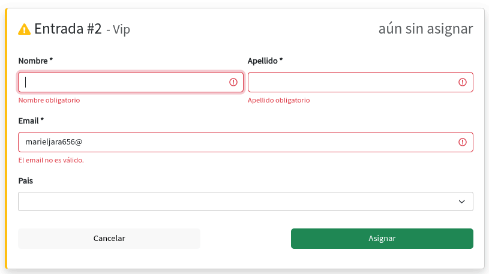

# Informe de Casos de Prueba Funcionales - Reservaciones (Frontend Público)

## Índice
- [1. Introducción](#1-introducción)
- [2. Propósito](#2-propósito)
- [3. Alcance](#3-alcance)
- [4. Referencias](#4-referencias)
- [5. Entorno de pruebas](#5-entorno-de-pruebas)
- [6. Resultados de Pruebas Funcionales](#6-resultados-de-pruebas-funcionales)
- [7. Limitaciones](#7-limitaciones)
- [8. Estrategia y métodos de prueba aplicados](#8-estrategia-y-métodos-de-prueba-aplicados)
- [9. Conclusión](#9-conclusión)

## 1. Introducción

El presente informe documenta la estrategia, ejecución y resultados de las pruebas funcionales realizadas sobre el módulo de reservaciones del frontend público de alf.io. El flujo de reservación abarca desde la selección de eventos, elección de cantidad de tickets, llenado de formularios de asistente, de expiración, hasta la confirmación y descarga de entradas.

## 2. Propósito

Este documento sirve como referencia para:

- Describir el enfoque de pruebas adoptado y los niveles de cobertura alcanzados.
- Detallar la configuración del entorno de pruebas.
- Proporcionar evidencia sobre el comportamiento del sistema en escenarios controlados.
- Facilitar la reproducibilidad de las pruebas por parte del equipo de desarrollo y QA.

## 3. Alcance

Las pruebas abarcan los siguiente componentes y funcionalidades del módulo de reservaciones:

- **Selección de tickets:** Validación de cantidad mediante dropdown (rango 0-5 y 0-10 según categoría).
- **Formulario de asistente:** Validación de campos obligatorios (nombre, apellido, email, país opcional).
- **Tiempo de expiración:** Comportamiento del contador de 24 minutos (azul >5min, amarillo 1-5min, rojo <1min).
- **Aceptación de términos:** Checkbox obligatorios para continuar al pago.
- **Reserva completada:** Descarga de PDF y envío de email de confirmación.

## 4. Referencias

- **ISO/IEC/IEEE 29119:** estándar internacional para pruebas de software.
- **Diseño de casos de prueba:** [[Diseño-de-Casos-de-Prueba-Funcionales-Frontend-Public-Reservaciones]]
- **Repositorio oficial:** [https://github.com/alfio-event/alf.io](https://github.com/alfio-event/alf.io)

## 5. Entorno de pruebas

### 5.1 Configuración del entorno

Las pruebas se ejecutan de manera manual sobre el frontend público de alf.io desplegado en un entorno de pruebas. El flujo de reserva es el siguiente:

```
Selección de evento → Elegir cantidad tickets → Llenar formulario asistente → Aceptar términos → Confirmar pago → Reserva completada
```

## 6. Resultados de Pruebas Funcionales

### Selección de Entradas (Tickets)

**CPF-RES-01-001**
<table>
  <thead>
    <tr>
      <th>ID</th>
      <th>Descripción</th>
      <th>Tipo</th>
      <th>Estado</th>
      <th>Defectos</th>
    </tr>
  </thead>
  <tbody>
    <tr>
      <td>CPF-RES-01-001</td>
      <td>Verificar que no se permita avanzar con 0 entradas seleccionadas.</td>
      <td>Manual</td>
      <td>Exitoso</td>
      <td>No se encontraron defectos</td>
    </tr>
    <tr>
      <th colspan="2">Resultado esperado</th>
      <th colspan="3">Resultado obtenido</th>
    </tr>
    <tr>
      <td colspan="2">Mensaje de error "seleccione al menos una entrada"</td>
      <td colspan="3">El sistema muestra el mensaje de error y no permite avanzar.</td>
    </tr>
    <tr>
      <th colspan="5">Evidencia</th>
    </tr>
    <tr>
      <td colspan="5">
        <br>
        Se muestra el mensaje de error al intentar continuar con 0 entradas.
      </td>
    </tr>
  </tbody>
</table>

**CPF-RES-01-002**
<table>
  <thead>
    <tr>
      <th>ID</th>
      <th>Descripción</th>
      <th>Tipo</th>
      <th>Estado</th>
      <th>Defectos</th>
    </tr>
  </thead>
  <tbody>
    <tr>
      <td>CPF-RES-01-002</td>
      <td>Verificar selección de entradas con dropdown (rango 0-5).</td>
      <td>Manual</td>
      <td>Exitoso</td>
      <td>No se encontraron defectos</td>
    </tr>
    <tr>
      <th colspan="2">Resultado esperado</th>
      <th colspan="3">Resultado obtenido</th>
    </tr>
    <tr>
      <td colspan="2">Selección permite valores de 0 a 5 únicamente</td>
      <td colspan="3">El dropdown muestra valores predefinidos 0-5, no acepta valores negativos o superiores.</td>
    </tr>
    <tr>
      <th colspan="5">Evidencia</th>
    </tr>
    <tr>
      <td colspan="5">
        <br>
        Dropdown con rango 0-5 para primera categoría de entradas.
      </td>
    </tr>
  </tbody>
</table>

**CPF-RES-01-003**
<table>
  <thead>
    <tr>
      <th>ID</th>
      <th>Descripción</th>
      <th>Tipo</th>
      <th>Estado</th>
      <th>Defectos</th>
    </tr>
  </thead>
  <tbody>
    <tr>
      <td>CPF-RES-01-003</td>
      <td>Verificar selección de entradas con dropdown (rango 0-10).</td>
      <td>Manual</td>
      <td>Exitoso</td>
      <td>No se encontraron defectos</td>
    </tr>
    <tr>
      <th colspan="2">Resultado esperado</th>
      <th colspan="3">Resultado obtenido</th>
    </tr>
    <tr>
      <td colspan="2">Selección permite valores de 0 a 10 únicamente</td>
      <td colspan="3">El dropdown muestra valores predefinidos 0-10, no acepta valores negativos o superiores.</td>
    </tr>
    <tr>
      <th colspan="5">Evidencia</th>
    </tr>
    <tr>
      <td colspan="5">
        <br>
        Dropdown con rango 0-10 para segunda categoría de entradas.
      </td>
    </tr>
  </tbody>
</table>

---

### Formulario de Asistente - Validación de Campos Obligatorios

**CPF-RES-02-001**
<table>
  <thead>
    <tr>
      <th>ID</th>
      <th>Descripción</th>
      <th>Tipo</th>
      <th>Estado</th>
      <th>Defectos</th>
    </tr>
  </thead>
  <tbody>
    <tr>
      <td>CPF-RES-02-001</td>
      <td>Verificar que los campos obligatorios muestren error al estar vacíos.</td>
      <td>Manual</td>
      <td>Exitoso</td>
      <td>No se encontraron defectos</td>
    </tr>
    <tr>
      <th colspan="2">Resultado esperado</th>
      <th colspan="3">Resultado obtenido</th>
    </tr>
    <tr>
      <td colspan="2">Mensajes de error: "Nombre obligatorio", "Apellido obligatorio", "Email obligatorio"</td>
      <td colspan="3">El sistema muestra los mensajes de error y no permite continuar.</td>
    </tr>
    <tr>
      <th colspan="5">Evidencia</th>
    </tr>
    <tr>
      <td colspan="5">
        <br>
        Se muestran errores al presionar continuar con campos vacíos.
      </td>
    </tr>
  </tbody>
</table>

**CPF-RES-02-002**
<table>
  <thead>
    <tr>
      <th>ID</th>
      <th>Descripción</th>
      <th>Tipo</th>
      <th>Estado</th>
      <th>Defectos</th>
    </tr>
  </thead>
  <tbody>
    <tr>
      <td>CPF-RES-02-002</td>
      <td>Verificar llenado correcto de datos de asistente.</td>
      <td>Manual</td>
      <td>Exitoso</td>
      <td>No se encontraron defectos</td>
    </tr>
    <tr>
      <th colspan="2">Resultado esperado</th>
      <th colspan="3">Resultado obtenido</th>
    </tr>
    <tr>
      <td colspan="2">Datos guardados correctamente al completar todos los campos</td>
      <td colspan="3">El sistema permite continuar cuando los campos obligatorios están llenos.</td>
    </tr>
    <tr>
      <th colspan="5">Evidencia</th>
    </tr>
    <tr>
      <td colspan="5">
        <br>
        Formulario completado con datos válidos.
      </td>
    </tr>
  </tbody>
</table>

**CPF-RES-02-003**
<table>
  <thead>
    <tr>
      <th>ID</th>
      <th>Descripción</th>
      <th>Tipo</th>
      <th>Estado</th>
      <th>Defectos</th>
    </tr>
  </thead>
  <tbody>
    <tr>
      <td>CPF-RES-02-003</td>
      <td>Verificar validación de formato de email.</td>
      <td>Manual</td>
      <td>Exitoso</td>
      <td>No se encontraron defectos</td>
    </tr>
    <tr>
      <th colspan="2">Resultado esperado</th>
      <th colspan="3">Resultado obtenido</th>
    </tr>
    <tr>
      <td colspan="2">El email debe contener @, texto mínimo y un punto después del @</td>
      <td colspan="3">El sistema valida correctamente el formato del correo electrónico.</td>
    </tr>
    <tr>
      <th colspan="5">Evidencia</th>
    </tr>
    <tr>
      <td colspan="5">
        <br>
        Validación de email permite formatos válidos.
      </td>
    </tr>
  </tbody>
</table>

**CPF-RES-02-004**
<table>
  <thead>
    <tr>
      <th>ID</th>
      <th>Descripción</th>
      <th>Tipo</th>
      <th>Estado</th>
      <th>Defectos</th>
    </tr>
  </thead>
  <tbody>
    <tr>
      <td>CPF-RES-02-004</td>
      <td>Verificar que se puedan usar diferentes nombres para asistente y comprador.</td>
      <td>Manual</td>
      <td>Exitoso</td>
      <td>No se encontraron defectos</td>
    </tr>
    <tr>
      <th colspan="2">Resultado esperado</th>
      <th colspan="3">Resultado obtenido</th>
    </tr>
    <tr>
      <td colspan="2">El sistema permite nombres diferentes para comprador y asistente</td>
      <td colspan="3">El sistema acepta que los datos del comprador sean distintos a los del asistente.</td>
    </tr>
    <tr>
      <th colspan="5">Evidencia</th>
    </tr>
    <tr>
      <td colspan="5">
        <br>
        Se permite registrar diferentes nombres para comprador y asistente.
      </td>
    </tr>
  </tbody>
</table>

**CPF-RES-02-005**
<table>
  <thead>
    <tr>
      <th>ID</th>
      <th>Descripción</th>
      <th>Tipo</th>
      <th>Estado</th>
      <th>Defectos</th>
    </tr>
  </thead>
  <tbody>
    <tr>
      <td>CPF-RES-02-005</td>
      <td>Verificar campos obligatorios para múltiples entradas.</td>
      <td>Manual</td>
      <td>Exitoso</td>
      <td>No se encontraron defectos</td>
    </tr>
    <tr>
      <th colspan="2">Resultado esperado</th>
      <th colspan="3">Resultado obtenido</th>
    </tr>
    <tr>
      <td colspan="2">Todos los campos de asistentes adicionales son obligatorios</td>
      <td colspan="3">El sistema solicita los datos de todos los asistentes cuando se compran múltiples entradas.</td>
    </tr>
    <tr>
      <th colspan="5">Evidencia</th>
    </tr>
    <tr>
      <td colspan="5">
        <br>
        Campos obligatorios para cada asistente adicional.
      </td>
    </tr>
  </tbody>
</table>

**CPF-RES-02-006**
<table>
  <thead>
    <tr>
      <th>ID</th>
      <th>Descripción</th>
      <th>Tipo</th>
      <th>Estado</th>
      <th>Defectos</th>
    </tr>
  </thead>
  <tbody>
    <tr>
      <td>CPF-RES-02-006</td>
      <td>Verificar opción de ocultar campos de asistentes adicionales.</td>
      <td>Manual</td>
      <td>Exitoso</td>
      <td>No se encontraron defectos</td>
    </tr>
    <tr>
      <th colspan="2">Resultado esperado</th>
      <th colspan="3">Resultado obtenido</th>
    </tr>
    <tr>
      <td colspan="2">Checkbox permite ocultar los campos de asistentes y continuar</td>
      <td colspan="3">Al marcar el checkbox, se ocultan los campos de asistentes y se permite continuar.</td>
    </tr>
    <tr>
      <th colspan="5">Evidencia</th>
    </tr>
    <tr>
      <td colspan="5">
        <br>
        Checkbox para ocultar campos de asistentes adicionales.
      </td>
    </tr>
  </tbody>
</table>

**CPF-RES-02-007**
<table>
  <thead>
    <tr>
      <th>ID</th>
      <th>Descripción</th>
      <th>Tipo</th>
      <th>Estado</th>
      <th>Defectos</th>
    </tr>
  </thead>
  <tbody>
    <tr>
      <td>CPF-RES-02-007</td>
      <td>Verificar límite de 255 caracteres en campos de texto.</td>
      <td>Manual</td>
      <td>Exitoso</td>
      <td>No se encontraron defectos</td>
    </tr>
    <tr>
      <th colspan="2">Resultado esperado</th>
      <th colspan="3">Resultado obtenido</th>
    </tr>
    <tr>
      <td colspan="2">El sistema rechaza campos con más de 255 caracteres</td>
      <td colspan="3">Se muestra error de validación al ingresar 255 caracteres.</td>
    </tr>
    <tr>
      <th colspan="5">Evidencia</th>
    </tr>
    <tr>
      <td colspan="5">
        <br>
        Error de validación al usar 255 caracteres.
      </td>
    </tr>
  </tbody>
</table>

**CPF-RES-02-008**
<table>
  <thead>
    <tr>
      <th>ID</th>
      <th>Descripción</th>
      <th>Tipo</th>
      <th>Estado</th>
      <th>Defectos</th>
    </tr>
  </thead>
  <tbody>
    <tr>
      <td>CPF-RES-02-008</td>
      <td>Verificar que 100 caracteres sean aceptados.</td>
      <td>Manual</td>
      <td>Exitoso</td>
      <td>No se encontraron defectos</td>
    </tr>
    <tr>
      <th colspan="2">Resultado esperado</th>
      <th colspan="3">Resultado obtenido</th>
    </tr>
    <tr>
      <td colspan="2">El sistema acepta hasta 255 caracteres</td>
      <td colspan="3">Los 100 caracteres son aceptados y guardados correctamente.</td>
    </tr>
    <tr>
      <th colspan="5">Evidencia</th>
    </tr>
    <tr>
      <td colspan="5">
        <br>
        100 caracteres aceptados y visibles en la confirmación.
      </td>
    </tr>
  </tbody>
</table>

---

### Tiempo de Expiración de Reserva (Countdown)

**CPF-RES-03-001**
<table>
  <thead>
    <tr>
      <th>ID</th>
      <th>Descripción</th>
      <th>Tipo</th>
      <th>Estado</th>
      <th>Defectos</th>
    </tr>
  </thead>
  <tbody>
    <tr>
      <td>CPF-RES-03-001</td>
      <td>Verificar color azul del contador con tiempo > 5 minutos.</td>
      <td>Manual</td>
      <td>Exitoso</td>
      <td>No se encontraron defectos</td>
    </tr>
    <tr>
      <th colspan="2">Resultado esperado</th>
      <th colspan="3">Resultado obtenido</th>
    </tr>
    <tr>
      <td colspan="2">Contador muestra estilo azul con tiempo inicial de 24 minutos</td>
      <td colspan="3">El contador muestra color azul cuando el tiempo restante es mayor a 5 minutos.</td>
    </tr>
    <tr>
      <th colspan="5">Evidencia</th>
    </tr>
    <tr>
      <td colspan="5">
        <br>
        Contador azul con tiempo inicial de 24 minutos.
      </td>
    </tr>
  </tbody>
</table>

**CPF-RES-03-002**
<table>
  <thead>
    <tr>
      <th>ID</th>
      <th>Descripción</th>
      <th>Tipo</th>
      <th>Estado</th>
      <th>Defectos</th>
    </tr>
  </thead>
  <tbody>
    <tr>
      <td>CPF-RES-03-002</td>
      <td>Verificar color azul del contador a los 15 minutos.</td>
      <td>Manual</td>
      <td>Exitoso</td>
      <td>No se encontraron defectos</td>
    </tr>
    <tr>
      <th colspan="2">Resultado esperado</th>
      <th colspan="3">Resultado obtenido</th>
    </tr>
    <tr>
      <td colspan="2">Contador mantiene estilo azul a los 15 minutos</td>
      <td colspan="3">El contador continúa mostrando color azul.</td>
    </tr>
    <tr>
      <th colspan="5">Evidencia</th>
    </tr>
    <tr>
      <td colspan="5">
        <br>
        Contador azul a los 15 minutos restantes.
      </td>
    </tr>
  </tbody>
</table>

**CPF-RES-03-003**
<table>
  <thead>
    <tr>
      <th>ID</th>
      <th>Descripción</th>
      <th>Tipo</th>
      <th>Estado</th>
      <th>Defectos</th>
    </tr>
  </thead>
  <tbody>
    <tr>
      <td>CPF-RES-03-003</td>
      <td>Verificar color azul del contador cerca de los 10 minutos.</td>
      <td>Manual</td>
      <td>Exitoso</td>
      <td>No se encontraron defectos</td>
    </tr>
    <tr>
      <th colspan="2">Resultado esperado</th>
      <th colspan="3">Resultado obtenido</th>
    </tr>
    <tr>
      <td colspan="2">Contador mantiene estilo azul cerca de los 10 minutos</td>
      <td colspan="3">El contador continúa mostrando color azul.</td>
    </tr>
    <tr>
      <th colspan="5">Evidencia</th>
    </tr>
    <tr>
      <td colspan="5">
        <br>
        Contador azul a los 10 minutos con 52 segundos restantes.
      </td>
    </tr>
  </tbody>
</table>

**CPF-RES-03-004**
<table>
  <thead>
    <tr>
      <th>ID</th>
      <th>Descripción</th>
      <th>Tipo</th>
      <th>Estado</th>
      <th>Defectos</th>
    </tr>
  </thead>
  <tbody>
    <tr>
      <td>CPF-RES-03-004</td>
      <td>Verificar cambio a color amarillo cuando el tiempo es ≤ 5 minutos.</td>
      <td>Manual</td>
      <td>Exitoso</td>
      <td>No se encontraron defectos</td>
    </tr>
    <tr>
      <th colspan="2">Resultado esperado</th>
      <th colspan="3">Resultado obtenido</th>
    </tr>
    <tr>
      <td colspan="2">Contador cambia a color amarillo</td>
      <td colspan="3">El contador cambia al estilo de alerta amarilla.</td>
    </tr>
    <tr>
      <th colspan="5">Evidencia</th>
    </tr>
    <tr>
      <td colspan="5">
        <br>
        Contador cambia a amarillo cuando quedan menos de 5 minutos.
      </td>
    </tr>
  </tbody>
</table>

**CPF-RES-03-005**
<table>
  <thead>
    <tr>
      <th>ID</th>
      <th>Descripción</th>
      <th>Tipo</th>
      <th>Estado</th>
      <th>Defectos</th>
    </tr>
  </thead>
  <tbody>
    <tr>
      <td>CPF-RES-03-005</td>
      <td>Verificar cambio a color rojo cuando el tiempo es ≤ 1 minuto.</td>
      <td>Manual</td>
      <td>Exitoso</td>
      <td>No se encontraron defectos</td>
    </tr>
    <tr>
      <th colspan="2">Resultado esperado</th>
      <th colspan="3">Resultado obtenido</th>
    </tr>
    <tr>
      <td colspan="2">Contador cambia a color rojo</td>
      <td colspan="3">El contador cambia al estilo de alerta roja.</td>
    </tr>
    <tr>
      <th colspan="5">Evidencia</th>
    </tr>
    <tr>
      <td colspan="5">
        <br>
        Contador cambia a rojo cuando queda menos de 1 minuto.
      </td>
    </tr>
  </tbody>
</table>

**CPF-RES-03-006**
<table>
  <thead>
    <tr>
      <th>ID</th>
      <th>Descripción</th>
      <th>Tipo</th>
      <th>Estado</th>
      <th>Defectos</th>
    </tr>
  </thead>
  <tbody>
    <tr>
      <td>CPF-RES-03-006</td>
      <td>Verificar modal de expiración cuando el tiempo llega a 0.</td>
      <td>Manual</td>
      <td>Exitoso</td>
      <td>No se encontraron defectos</td>
    </tr>
    <tr>
      <th colspan="2">Resultado esperado</th>
      <th colspan="3">Resultado obtenido</th>
    </tr>
    <tr>
      <td colspan="2">Modal indica "La sesión ha expirado" con opciones para volver al inicio</td>
      <td colspan="3">El sistema muestra el modal de expiración de sesión.</td>
    </tr>
    <tr>
      <th colspan="5">Evidencia</th>
    </tr>
    <tr>
      <td colspan="5">
        <br>
        Modal de sesión expirada con opción de volver al inicio.
      </td>
    </tr>
  </tbody>
</table>

---

### Aceptación de Términos y Condiciones

**CPF-RES-04-001**
<table>
  <thead>
    <tr>
      <th>ID</th>
      <th>Descripción</th>
      <th>Tipo</th>
      <th>Estado</th>
      <th>Defectos</th>
    </tr>
  </thead>
  <tbody>
    <tr>
      <td>CPF-RES-04-001</td>
      <td>Verificar que el botón de pago esté deshabilitado sin aceptar términos.</td>
      <td>Manual</td>
      <td>Exitoso</td>
      <td>No se encontraron defectos</td>
    </tr>
    <tr>
      <th colspan="2">Resultado esperado</th>
      <th colspan="3">Resultado obtenido</th>
    </tr>
    <tr>
      <td colspan="2">Botón "Paga ahora" permanece deshabilitado</td>
      <td colspan="3">El sistema no permite continuar sin aceptar los términos y condiciones.</td>
    </tr>
    <tr>
      <th colspan="5">Evidencia</th>
    </tr>
    <tr>
      <td colspan="5">
        <br>
        Botón de pago deshabilitado sin aceptación de términos.
      </td>
    </tr>
  </tbody>
</table>

**CPF-RES-04-002**
<table>
  <thead>
    <tr>
      <th>ID</th>
      <th>Descripción</th>
      <th>Tipo</th>
      <th>Estado</th>
      <th>Defectos</th>
    </tr>
  </thead>
  <tbody>
    <tr>
      <td>CPF-RES-04-002</td>
      <td>Verificar que al marcar checkbox se habilite el botón de pago.</td>
      <td>Manual</td>
      <td>Exitoso</td>
      <td>No se encontraron defectos</td>
    </tr>
    <tr>
      <th colspan="2">Resultado esperado</th>
      <th colspan="3">Resultado obtenido</th>
    </tr>
    <tr>
      <td colspan="2">Botón "Paga ahora" se habilita</td>
      <td colspan="3">Al hacer click en el checkbox, el botón se activa.</td>
    </tr>
    <tr>
      <th colspan="5">Evidencia</th>
    </tr>
    <tr>
      <td colspan="5">
        <br>
        Botón de pago habilitado tras aceptar términos.
      </td>
    </tr>
  </tbody>
</table>

**CPF-RES-04-003**
<table>
  <thead>
    <tr>
      <th>ID</th>
      <th>Descripción</th>
      <th>Tipo</th>
      <th>Estado</th>
      <th>Defectos</th>
    </tr>
  </thead>
  <tbody>
    <tr>
      <td>CPF-RES-04-003</td>
      <td>Verificar error al no aceptar términos en evento gratuito.</td>
      <td>Manual</td>
      <td>Exitoso</td>
      <td>No se encontraron defectos</td>
    </tr>
    <tr>
      <th colspan="2">Resultado esperado</th>
      <th colspan="3">Resultado obtenido</th>
    </tr>
    <tr>
      <td colspan="2">Mensaje de error indicando que se deben aceptar los términos</td>
      <td colspan="3">El sistema muestra mensaje de error aunque sea un evento gratuito.</td>
    </tr>
    <tr>
      <th colspan="5">Evidencia</th>
    </tr>
    <tr>
      <td colspan="5">
        <br>
        Error al intentar continuar sin aceptar términos en evento gratuito.
      </td>
    </tr>
  </tbody>
</table>

---

### Reserva Completada - Confirmación y Descarga

**CPF-RES-05-001**
<table>
  <thead>
    <tr>
      <th>ID</th>
      <th>Descripción</th>
      <th>Tipo</th>
      <th>Estado</th>
      <th>Defectos</th>
    </tr>
  </thead>
  <tbody>
    <tr>
      <td>CPF-RES-05-001</td>
      <td>Verificar barra de carga durante procesamiento.</td>
      <td>Manual</td>
      <td>Exitoso</td>
      <td>No se encontraron defectos</td>
    </tr>
    <tr>
      <th colspan="2">Resultado esperado</th>
      <th colspan="3">Resultado obtenido</th>
    </tr>
    <tr>
      <td colspan="2">Mostrar barra de progreso mientras se procesa la reserva</td>
      <td colspan="3">Se muestra una barra de carga durante el procesamiento (rápida para pocas entradas).</td>
    </tr>
    <tr>
      <th colspan="5">Evidencia</th>
    </tr>
    <tr>
      <td colspan="5">
        <br>
        Barra de carga visible durante el procesamiento.
      </td>
    </tr>
  </tbody>
</table>

**CPF-RES-05-002**
<table>
  <thead>
    <tr>
      <th>ID</th>
      <th>Descripción</th>
      <th>Tipo</th>
      <th>Estado</th>
      <th>Defectos</th>
    </tr>
  </thead>
  <tbody>
    <tr>
      <td>CPF-RES-05-002</td>
      <td>Verificar página de confirmación de reserva completada.</td>
      <td>Manual</td>
      <td>Exitoso</td>
      <td>No se encontraron defectos</td>
    </tr>
    <tr>
      <th colspan="2">Resultado esperado</th>
      <th colspan="3">Resultado obtenido</th>
    </tr>
    <tr>
      <td colspan="2">Mostrar mensaje de éxito y datos de la reserva</td>
      <td colspan="3">La página muestra "La riserva è stata completata" con los datos del comprador.</td>
    </tr>
    <tr>
      <th colspan="5">Evidencia</th>
    </tr>
    <tr>
      <td colspan="5">
        <br>
        Confirmación de reserva completada exitosamente.
      </td>
    </tr>
  </tbody>
</table>

**CPF-RES-05-003**
<table>
  <thead>
    <tr>
      <th>ID</th>
      <th>Descripción</th>
      <th>Tipo</th>
      <th>Estado</th>
      <th>Defectos</th>
    </tr>
  </thead>
  <tbody>
    <tr>
      <td>CPF-RES-05-003</td>
      <td>Verificar que se muestren errores si los datos del asistente están vacíos.</td>
      <td>Manual</td>
      <td>Exitoso</td>
      <td>No se encontraron defectos</td>
    </tr>
    <tr>
      <th colspan="2">Resultado esperado</th>
      <th colspan="3">Resultado obtenido</th>
    </tr>
    <tr>
      <td colspan="2">Mensajes de error indicando campos obligatorios faltantes</td>
      <td colspan="3">El sistema solicita completar los datos de los asistentes.</td>
    </tr>
    <tr>
      <th colspan="5">Evidencia</th>
    </tr>
    <tr>
      <td colspan="5">
        <br>
        Errores de validación para datos de asistente faltantes.
      </td>
    </tr>
  </tbody>
</table>

**CPF-RES-05-004**
<table>
  <thead>
    <tr>
      <th>ID</th>
      <th>Descripción</th>
      <th>Tipo</th>
      <th>Estado</th>
      <th>Defectos</th>
    </tr>
  </thead>
  <tbody>
    <tr>
      <td>CPF-RES-05-004</td>
      <td>Verificar descarga de PDF de entradas.</td>
      <td>Manual</td>
      <td>Exitoso</td>
      <td>No se encontraron defectos</td>
    </tr>
    <tr>
      <th colspan="2">Resultado esperado</th>
      <th colspan="3">Resultado obtenido</th>
    </tr>
    <tr>
      <td colspan="2">Archivo PDF generado y descargado</td>
      <td colspan="3">El sistema genera y permite descargar el PDF con los códigos QR.</td>
    </tr>
    <tr>
      <th colspan="5">Evidencia</th>
    </tr>
    <tr>
      <td colspan="5">
        <br>
        Botón para descargar PDF de entradas.
      </td>
    </tr>
  </tbody>
</table>

**CPF-RES-05-005**
<table>
  <thead>
    <tr>
      <th>ID</th>
      <th>Descripción</th>
      <th>Tipo</th>
      <th>Estado</th>
      <th>Defectos</th>
    </tr>
  </thead>
  <tbody>
    <tr>
      <td>CPF-RES-05-005</td>
      <td>Verificar contenido del PDF generado.</td>
      <td>Manual</td>
      <td>Exitoso</td>
      <td>No se encontraron defectos</td>
    </tr>
    <tr>
      <th colspan="2">Resultado esperado</th>
      <th colspan="3">Resultado obtenido</th>
    </tr>
    <tr>
      <td colspan="2">PDF contiene códigos QR y datos de las entradas</td>
      <td colspan="3">El PDF generado incluye la información completa de las entradas.</td>
    </tr>
    <tr>
      <th colspan="5">Evidencia</th>
    </tr>
    <tr>
      <td colspan="5">
        <br>
        Contenido del PDF con códigos QR y datos de entrada.
      </td>
    </tr>
  </tbody>
</table>

**CPF-RES-05-006**
<table>
  <thead>
    <tr>
      <th>ID</th>
      <th>Descripción</th>
      <th>Tipo</th>
      <th>Estado</th>
      <th>Defectos</th>
    </tr>
  </thead>
  <tbody>
    <tr>
      <td>CPF-RES-05-006</td>
      <td>Verificar envío de email de confirmación.</td>
      <td>Manual</td>
      <td>Exitoso</td>
      <td>No se encontraron defectos</td>
    </tr>
    <tr>
      <th colspan="2">Resultado esperado</th>
      <th colspan="3">Resultado obtenido</th>
    </tr>
    <tr>
      <td colspan="2">Mensaje de confirmación de email enviado</td>
      <td colspan="3">El sistema muestra mensaje de "Email enviado" tras reenviar.</td>
    </tr>
    <tr>
      <th colspan="5">Evidencia</th>
    </tr>
    <tr>
      <td colspan="5">
        <br>
        Mensaje de confirmación de email enviado.
      </td>
    </tr>
  </tbody>
</table>

**CPF-RES-05-007**
<table>
  <thead>
    <tr>
      <th>ID</th>
      <th>Descripción</th>
      <th>Tipo</th>
      <th>Estado</th>
      <th>Defectos</th>
    </tr>
  </thead>
  <tbody>
    <tr>
      <td>CPF-RES-05-007</td>
      <td>Verificar visualización de entradas en el email.</td>
      <td>Manual</td>
      <td>Exitoso</td>
      <td>No se encontraron defectos</td>
    </tr>
    <tr>
      <th colspan="2">Resultado esperado</th>
      <th colspan="3">Resultado obtenido</th>
    </tr>
    <tr>
      <td colspan="2">El email contiene las entradas con códigos QR</td>
      <td colspan="3">El email recibido muestra las entradas registradas.</td>
    </tr>
    <tr>
      <th colspan="5">Evidencia</th>
    </tr>
    <tr>
      <td colspan="5">
        <br>
        Entradas visibles en el email de confirmación.
      </td>
    </tr>
  </tbody>
</table>

---

### Panel de Administración - Gestión de Reservas

**CPF-RES-06-001**
<table>
  <thead>
    <tr>
      <th>ID</th>
      <th>Descripción</th>
      <th>Tipo</th>
      <th>Estado</th>
      <th>Defectos</th>
    </tr>
  </thead>
  <tbody>
    <tr>
      <td>CPF-RES-06-001</td>
      <td>Verificar visualización de reserva en el panel de administración.</td>
      <td>Manual</td>
      <td>Exitoso</td>
      <td>No se encontraron defectos</td>
    </tr>
    <tr>
      <th colspan="2">Resultado esperado</th>
      <th colspan="3">Resultado obtenido</th>
    </tr>
    <tr>
      <td colspan="2">La reserva aparece en el panel de administración del evento</td>
      <td colspan="3">La reserva completada se muestra correctamente en el manager.</td>
    </tr>
    <tr>
      <th colspan="5">Evidencia</th>
    </tr>
    <tr>
      <td colspan="5">
        <br>
        Reserva visible en el panel de administración.
      </td>
    </tr>
  </tbody>
</table>

**CPF-RES-06-002**
<table>
  <thead>
    <tr>
      <th>ID</th>
      <th>Descripción</th>
      <th>Tipo</th>
      <th>Estado</th>
      <th>Defectos</th>
    </tr>
  </thead>
  <tbody>
    <tr>
      <td>CPF-RES-06-002</td>
      <td>Verificar opción de imprimir recibo desde el manager.</td>
      <td>Manual</td>
      <td>Exitoso</td>
      <td>No se encontraron defectos</td>
    </tr>
    <tr>
      <th colspan="2">Resultado esperado</th>
      <th colspan="3">Resultado obtenido</th>
    </tr>
    <tr>
      <td colspan="2">Opción de imprimir boleta disponible en el manager</td>
      <td colspan="3">Se puede acceder a la impresión del recibo desde el panel.</td>
    </tr>
    <tr>
      <th colspan="5">Evidencia</th>
    </tr>
    <tr>
      <td colspan="5">
        <br>
        Opción de imprimir boleta visible en el manager.
      </td>
    </tr>
  </tbody>
</table>

## 7. Limitaciones

- Las pruebas se ejecutan de manera manual, no automatizada.
- No se incluyen pruebas de carga ni de rendimiento bajo estrés.
- Las pruebas no cubren integraciones con pasarelas de pago reales.

## 8. Estrategia y métodos de prueba aplicados

### 8.1 Técnicas de diseño de pruebas

- **Partición por equivalencia:** Los datos de entrada se agrupan en clases válidas e inválidas. Ejemplo: cantidad de tickets (0, 1-5, >5) para verificar el comportamiento del dropdown.
- **Análisis de valores límite:** Se prueban valores en los extremos de los rangos permitidos, como el límite de 255 caracteres en campos de texto y el comportamiento del contador de tiempo en los umbrales de 5 minutos y 1 minuto.
- **Pruebas de casos de uso:** Se recorre paso a paso el flujo completo del sistema: selección de evento → elección de tickets → llenado de formularios → aceptación de términos → confirmación → descarga de PDF.
- **Tablas de decisión:** Se aplican para validar las reglas de visibilidad del botón de pago según la aceptación de términos y condiciones.

## 9. Conclusión

El módulo de reservaciones del frontend público de alf.io ha sido validado mediante 29 casos de prueba funcionales que abarcan todo el flujo de reserva, desde la selección de tickets hasta la descarga de entradas y el envío de correos de confirmación.

Los resultados muestran que el sistema maneja correctamente:
- La selección de cantidad de entradas mediante dropdowns con rangos definidos.
- La validación de campos obligatorios en formularios de asistente.
- Los límites de caracteres en campos de texto (255 caracteres).
- El comportamiento del contador de tiempo con cambios de color según el tiempo restante.
- La obligatoriedad de aceptar términos y condiciones para continuar.
- La generación de PDFs con códigos QR y el envío de correos de confirmación.

El pipeline de CI del proyecto verifica cada cambio contra las pruebas unitarias, asegurando compatibilidad y calidad continua en el código del frontend.