# Informe de Casos de Prueba Funcionales del Sistema alf.io

## Índice
- [1. Introducción](#1-introducción)
- [2. Propósito](#2-propósito)
- [3. Alcance](#3-alcance)
- [4. Referencias](#4-referencias)
- [5. Entorno de pruebas](#5-entorno-de-pruebas)
- [6. Resultados de Pruebas Funcionales](#6-resultados-de-pruebas-funcionales)
- [7. Limitaciones](#7-limitaciones)
- [8. Estrategia y métodos de prueba aplicados](#8-estrategia-y-métodos-de-prueba-aplicados)
- [9. Conclusión](#9-conclusión)

## 1. Introducción

El presente informe documenta la estrategia, ejecución y resultados de las pruebas funcionales realizadas sobre alf.io, un sistema de gestión y venta de entradas para eventos de código abierto. Su propósito es evaluar la calidad del software, identificar defectos potenciales y verificar el cumplimiento de los requisitos del sistema, desde unidades de código hasta flujos completos de usuario.

## 2. Propósito

Este documento sirve como referencia para:

- Describir el enfoque de pruebas adoptado y los niveles de cobertura alcanzados.
- Detallar la configuración del entorno de pruebas.
- Proporcionar evidencia sobre el comportamiento del sistema en escenarios controlados.
- Facilitar la reproducibilidad de las pruebas por parte del equipo de desarrollo y QA.

## 3. Alcance

Las pruebas abarcan los siguiente componentes y funcionalidades de alf.io:

- **Backend (Java 17, Spring Boot 3.5, Jetty):** Lógica de negocio, repositorios de datos, flujos de reserva, pagos, generación de entradas, gestión de eventos y suscripciones, procesamiento de extensiones JavaScript (Rhino), y migraciones de base de datos.
- **Frontend público (Angular 17):** Interfaz de compra de entradas, visualización de eventos, formularios de registro.
- **Frontend de administración (Lit + Shoelace + Vite):** Panel de administración para organizadores de eventos.

No se incluyen en el alcance las pruebas de infraestructura subyacente, las pruebas de rendimiento ni las integraciones con medios externos en producción.

## 4. Referencias

- **ISO/IEC/IEEE 29119:** estándar internacional para pruebas de software.
- **Documentación oficial:** [https://alf.io](https://alf.io)
- **Repositorio oficial:** [https://github.com/alfio-event/alf.io](https://github.com/alfio-event/alf.io)

## 5. Entorno de pruebas

### 5.1 Configuración del entorno

Las pruebas se ejecutan completamente de manera remota, haciendo uso de una imagen en Github Container Registry que se utilizó para desplegar una misma aplicación para todo el equipo en un cluster de kubernetes en la nube. Esto garantiza que el entorno de pruebas sea idéntico para todos los desarrolladores y que las pruebas sean reproducibles.

Este proceso es controlado mediante Github actions, que:
- **En cada pull request:** Ejecuta el pipeline de pruebas unitarias, generando reportes de cobertura para el contribuidor.
- **En cada push a main:** Ejecuta el pipeline de pruebas unitarias, compila el proyecto y publica la imagen de pruebas en Github Container Registry.

## 6. Resultados de Pruebas Funcionales

### Edición de Tickets Adquiridos (Nombre, Apellido y Correo)

**CPF-01-001**
<table>
  <thead>
    <tr>
      <th>ID</th>
      <th>Descripción</th>
      <th>Tipo</th>
      <th>Estado</th>
      <th>Defectos</th>
    </tr>
  </thead>
  <tbody>
    <tr>
      <td>CPF-01-001</td>
      <td>Verificar que el campo nombre no admita cadenas vacías.</td>
      <td>Manual</td>
      <td>Exitoso</td>
      <td>No se encontraron defectos</td>
    </tr>
    <tr>
      <th colspan="2">Resultado esperado</th>
      <th colspan="3">Resultado obtenido</th>
    </tr>
    <tr>
      <td colspan="2">Rechazar: Error de campo obligatorio</td>
      <td colspan="3">El sistema no permite guardar y marca el campo.</td>
    </tr>
    <tr>
      <th colspan="5">Evidencia</th>
    </tr>
    <tr>
      <td colspan="5">
        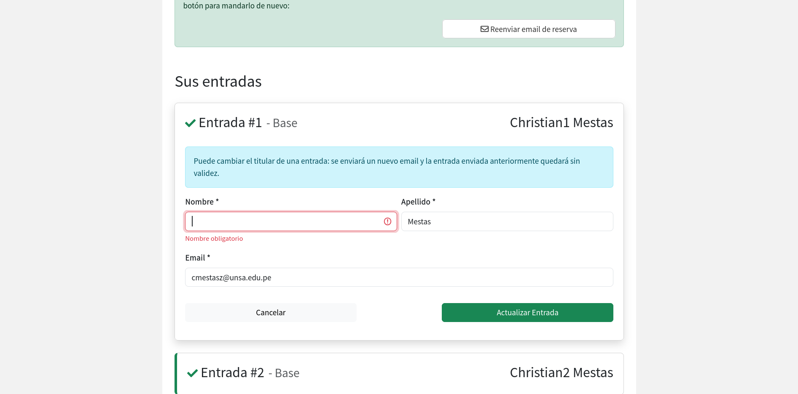 
        Se muestra que el sistema valida el campo obligatorio.
      </td>
    </tr>
  </tbody>
</table>

**CPF-01-002**
<table>
  <thead>
    <tr>
      <th>ID</th>
      <th>Descripción</th>
      <th>Tipo</th>
      <th>Estado</th>
      <th>Defectos</th>
    </tr>
  </thead>
  <tbody>
    <tr>
      <td>CPF-01-002</td>
      <td>Verificar que el campo nombre admita 1 carácter.</td>
      <td>Manual</td>
      <td>Exitoso</td>
      <td>No se encontraron defectos</td>
    </tr>
    <tr>
      <th colspan="2">Resultado esperado</th>
      <th colspan="3">Resultado obtenido</th>
    </tr>
    <tr>
      <td colspan="2">Aceptar: Cambio guardado exitosamente</td>
      <td colspan="3">Cambio guardado exitosamente</td>
    </tr>
    <tr>
      <th colspan="5">Evidencia</th>
    </tr>
    <tr>
      <td colspan="5">
        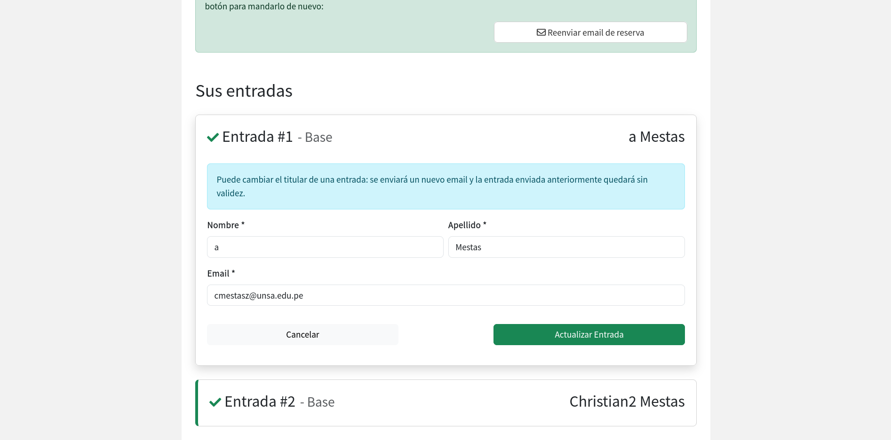 
        Se muestra la edición exitosa con un solo carácter.
      </td>
    </tr>
  </tbody>
</table>

**CPF-01-003**
<table>
  <thead>
    <tr>
      <th>ID</th>
      <th>Descripción</th>
      <th>Tipo</th>
      <th>Estado</th>
      <th>Defectos</th>
    </tr>
  </thead>
  <tbody>
    <tr>
      <td>CPF-01-003</td>
      <td>Verificar que el campo nombre admita 254 caracteres.</td>
      <td>Manual</td>
      <td>Fallido</td>
      <td>500 Unexpected Exception</td>
    </tr>
    <tr>
      <th colspan="2">Resultado esperado</th>
      <th colspan="3">Resultado obtenido</th>
    </tr>
    <tr>
      <td colspan="2">Aceptar: Cambio guardado exitosamente</td>
      <td colspan="3">Error 500 del servidor al intentar procesar la solicitud.</td>
    </tr>
    <tr>
      <th colspan="5">Evidencia</th>
    </tr>
    <tr>
      <td colspan="5">
        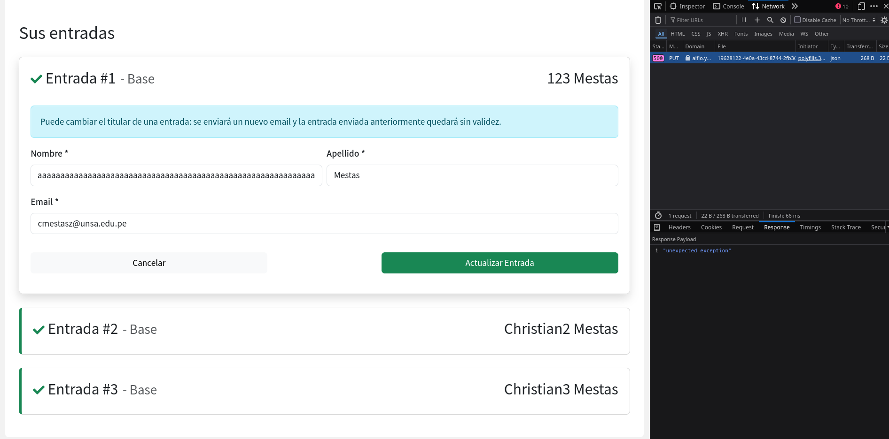 
        Se observa una excepción inesperada al usar cadenas largas.
      </td>
    </tr>
  </tbody>
</table>

**CPF-01-004**
<table>
  <thead>
    <tr>
      <th>ID</th>
      <th>Descripción</th>
      <th>Tipo</th>
      <th>Estado</th>
      <th>Defectos</th>
    </tr>
  </thead>
  <tbody>
    <tr>
      <td>CPF-01-004</td>
      <td>Verificar que el campo nombre admita 255 caracteres.</td>
      <td>Manual</td>
      <td>Fallido</td>
      <td>500 Unexpected Exception</td>
    </tr>
    <tr>
      <th colspan="2">Resultado esperado</th>
      <th colspan="3">Resultado obtenido</th>
    </tr>
    <tr>
      <td colspan="2">Aceptar: Cambio guardado exitosamente</td>
      <td colspan="3">Error 500 del servidor al intentar procesar la solicitud.</td>
    </tr>
    <tr>
      <th colspan="5">Evidencia</th>
    </tr>
    <tr>
      <td colspan="5">
         
        El sistema falla con error 500 en el límite superior de la base de datos.
      </td>
    </tr>
  </tbody>
</table>

**CPF-01-005**
<table>
  <thead>
    <tr>
      <th>ID</th>
      <th>Descripción</th>
      <th>Tipo</th>
      <th>Estado</th>
      <th>Defectos</th>
    </tr>
  </thead>
  <tbody>
    <tr>
      <td>CPF-01-005</td>
      <td>Verificar que el campo nombre rechace 256 caracteres.</td>
      <td>Manual</td>
      <td>Exitoso</td>
      <td>No se encontraron defectos</td>
    </tr>
    <tr>
      <th colspan="2">Resultado esperado</th>
      <th colspan="3">Resultado obtenido</th>
    </tr>
    <tr>
      <td colspan="2">Rechazar: Error de longitud excedida</td>
      <td colspan="3">El sistema bloquea la entrada o rechaza por validación de frontend.</td>
    </tr>
    <tr>
      <th colspan="5">Evidencia</th>
    </tr>
    <tr>
      <td colspan="5">
        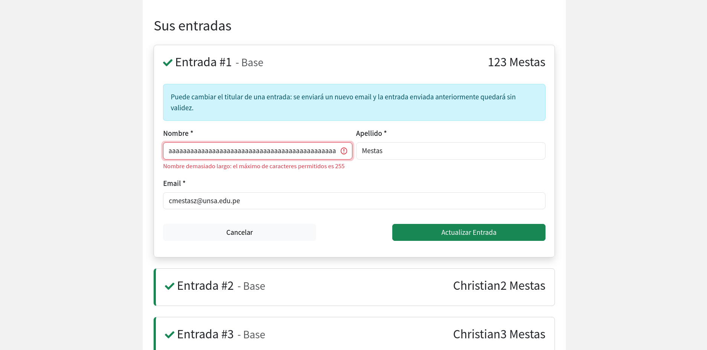 
        El sistema rechaza correctamente la longitud excedida.
      </td>
    </tr>
  </tbody>
</table>

**CPF-01-006**
<table>
  <thead>
    <tr>
      <th>ID</th>
      <th>Descripción</th>
      <th>Tipo</th>
      <th>Estado</th>
      <th>Defectos</th>
    </tr>
  </thead>
  <tbody>
    <tr>
      <td>CPF-01-006</td>
      <td>Verificar que el campo nombre no admita números.</td>
      <td>Manual</td>
      <td>Fallido</td>
      <td>El sistema acepta caracteres numéricos.</td>
    </tr>
    <tr>
      <th colspan="2">Resultado esperado</th>
      <th colspan="3">Resultado obtenido</th>
    </tr>
    <tr>
      <td colspan="2">Rechazar: Error de formato (solo letras)</td>
      <td colspan="3">El sistema acepta y guarda el nombre con números.</td>
    </tr>
    <tr>
      <th colspan="5">Evidencia</th>
    </tr>
    <tr>
      <td colspan="5">
        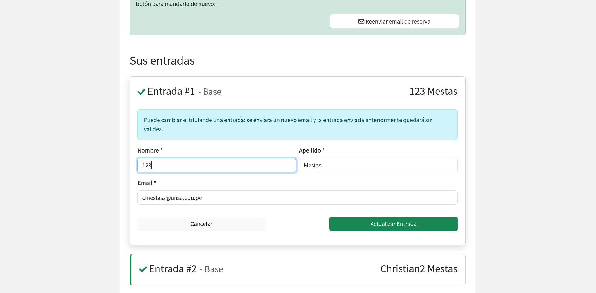 
        Se observa que el sistema no valida el tipo de dato alfanumérico.
      </td>
    </tr>
  </tbody>
</table>

**CPF-01-007**
<table>
  <thead>
    <tr>
      <th>ID</th>
      <th>Descripción</th>
      <th>Tipo</th>
      <th>Estado</th>
      <th>Defectos</th>
    </tr>
  </thead>
  <tbody>
    <tr>
      <td>CPF-01-007</td>
      <td>Verificar que el campo correo no admita cadenas vacías.</td>
      <td>Manual</td>
      <td>Exitoso</td>
      <td>No se encontraron defectos</td>
    </tr>
    <tr>
      <th colspan="2">Resultado esperado</th>
      <th colspan="3">Resultado obtenido</th>
    </tr>
    <tr>
      <td colspan="2">Rechazar: Error de campo obligatorio</td>
      <td colspan="3">El sistema impide el guardado sin correo.</td>
    </tr>
    <tr>
      <th colspan="5">Evidencia</th>
    </tr>
    <tr>
      <td colspan="5">
         
        Validación de correo obligatorio exitosa.
      </td>
    </tr>
  </tbody>
</table>

**CPF-01-008**
<table>
  <thead>
    <tr>
      <th>ID</th>
      <th>Descripción</th>
      <th>Tipo</th>
      <th>Estado</th>
      <th>Defectos</th>
    </tr>
  </thead>
  <tbody>
    <tr>
      <td>CPF-01-008</td>
      <td>Verificar que el campo correo rechace formatos inválidos (sin @).</td>
      <td>Manual</td>
      <td>Exitoso</td>
      <td>No se encontraron defectos</td>
    </tr>
    <tr>
      <th colspan="2">Resultado esperado</th>
      <th colspan="3">Resultado obtenido</th>
    </tr>
    <tr>
      <td colspan="2">Rechazar: Error de formato de correo</td>
      <td colspan="3">Rechazo por formato inválido.</td>
    </tr>
    <tr>
      <th colspan="5">Evidencia</th>
    </tr>
    <tr>
      <td colspan="5">
        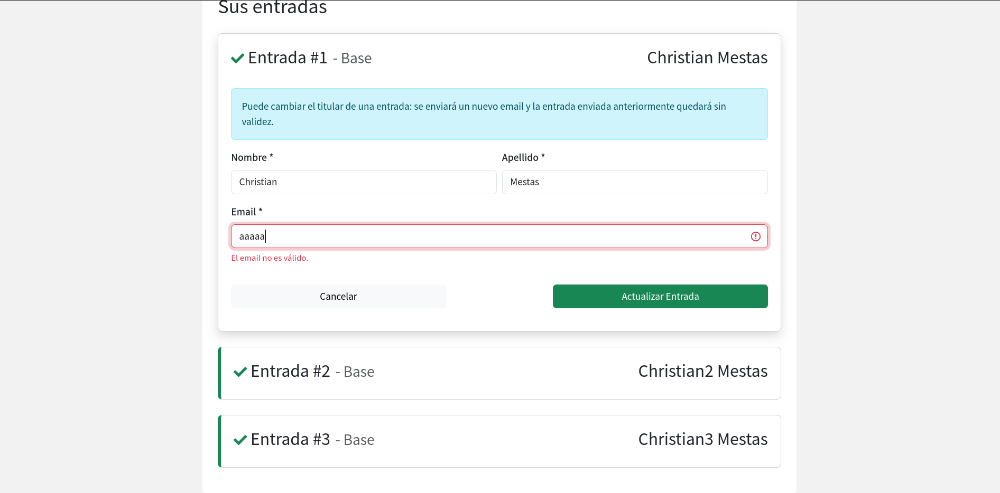 
        El sistema detecta correctamente el formato de correo inválido.
      </td>
    </tr>
  </tbody>
</table>

**CPF-01-009**
<table>
  <thead>
    <tr>
      <th>ID</th>
      <th>Descripción</th>
      <th>Tipo</th>
      <th>Estado</th>
      <th>Defectos</th>
    </tr>
  </thead>
  <tbody>
    <tr>
      <td>CPF-01-009</td>
      <td>Verificar correo con longitud de 63 caracteres.</td>
      <td>Manual</td>
      <td>Exitoso</td>
      <td>No se encontraron defectos</td>
    </tr>
    <tr>
      <th colspan="2">Resultado esperado</th>
      <th colspan="3">Resultado obtenido</th>
    </tr>
    <tr>
      <td colspan="2">Aceptar: Cambio guardado exitosamente</td>
      <td colspan="3">Cambio guardado exitosamente.</td>
    </tr>
    <tr>
      <th colspan="5">Evidencia</th>
    </tr>
    <tr>
      <td colspan="5">
        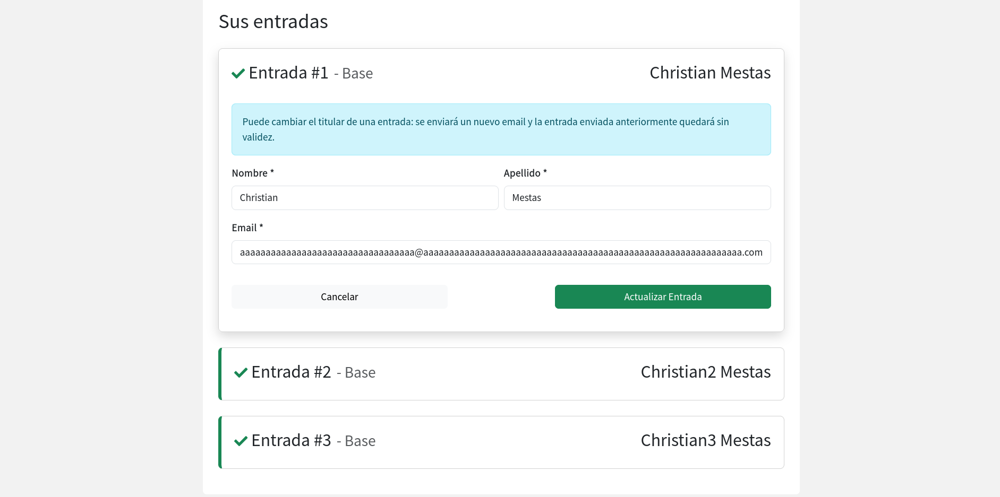 
        Prueba positiva de longitud de correo exitosa.
      </td>
    </tr>
  </tbody>
</table>

**CPF-01-010**
<table>
  <thead>
    <tr>
      <th>ID</th>
      <th>Descripción</th>
      <th>Tipo</th>
      <th>Estado</th>
      <th>Defectos</th>
    </tr>
  </thead>
  <tbody>
    <tr>
      <td>CPF-01-010</td>
      <td>Verificar correo con longitud de 64 caracteres.</td>
      <td>Manual</td>
      <td>Exitoso</td>
      <td>No se encontraron defectos</td>
    </tr>
    <tr>
      <th colspan="2">Resultado esperado</th>
      <th colspan="3">Resultado obtenido</th>
    </tr>
    <tr>
      <td colspan="2">Aceptar: Cambio guardado exitosamente</td>
      <td colspan="3">Cambio guardado exitosamente.</td>
    </tr>
    <tr>
      <th colspan="5">Evidencia</th>
    </tr>
    <tr>
      <td colspan="5">
        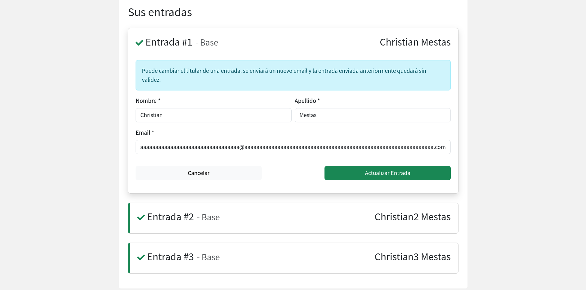 
        Prueba positiva en el límite de 64 caracteres exitosa.
      </td>
    </tr>
  </tbody>
</table>

**CPF-01-011**
<table>
  <thead>
    <tr>
      <th>ID</th>
      <th>Descripción</th>
      <th>Tipo</th>
      <th>Estado</th>
      <th>Defectos</th>
    </tr>
  </thead>
  <tbody>
    <tr>
      <td>CPF-01-011</td>
      <td>Verificar que el campo correo rechace 65 caracteres.</td>
      <td>Manual</td>
      <td>Fallido</td>
      <td>El sistema acepta correos de más de 64 caracteres.</td>
    </tr>
    <tr>
      <th colspan="2">Resultado esperado</th>
      <th colspan="3">Resultado obtenido</th>
    </tr>
    <tr>
      <td colspan="2">Rechazar: Error de longitud excedida</td>
      <td colspan="3">El sistema permite guardar el correo de 65 caracteres.</td>
    </tr>
    <tr>
      <th colspan="5">Evidencia</th>
    </tr>
    <tr>
      <td colspan="5">
        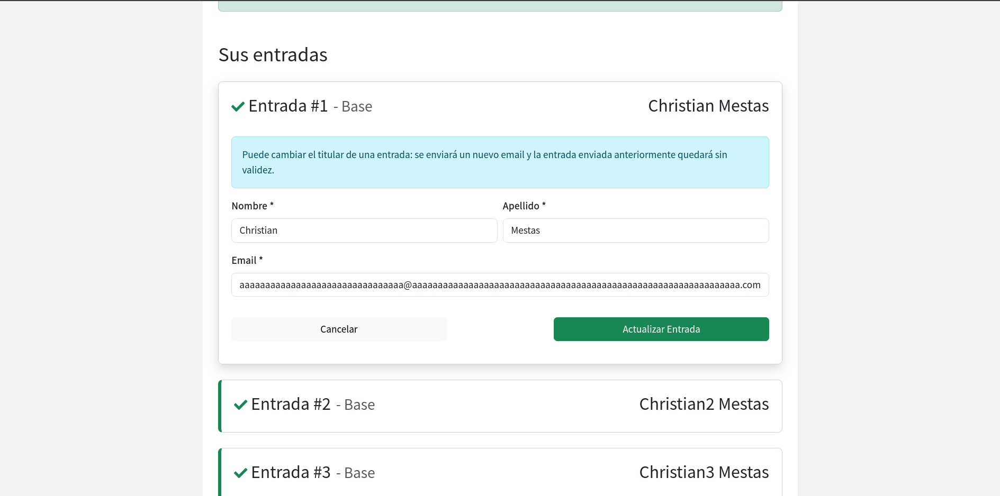 
        Se muestra que el sistema no aplica la restricción de longitud en el correo.
      </td>
    </tr>
  </tbody>
</table>

### Búsqueda de Reservas (Panel de Administración)

**CPF-02-001**
<table>
  <thead>
    <tr>
      <th>ID</th>
      <th>Descripción</th>
      <th>Tipo</th>
      <th>Estado</th>
      <th>Defectos</th>
    </tr>
  </thead>
  <tbody>
    <tr>
      <td>CPF-02-001</td>
      <td>Búsqueda por ID de reserva existente.</td>
      <td>Manual</td>
      <td>Exitoso</td>
      <td>No se encontraron defectos</td>
    </tr>
    <tr>
      <th colspan="2">Resultado esperado</th>
      <th colspan="3">Resultado obtenido</th>
    </tr>
    <tr>
      <td colspan="2">El sistema muestra la reserva específica</td>
      <td colspan="3">Se muestra la reserva correspondiente al ID.</td>
    </tr>
    <tr>
      <th colspan="5">Evidencia</th>
    </tr>
    <tr>
      <td colspan="5">
        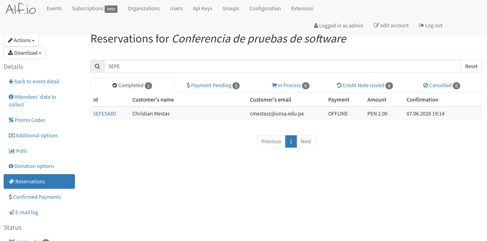 
        Búsqueda exitosa por identificador único.
      </td>
    </tr>
  </tbody>
</table>

**CPF-02-002**
<table>
  <thead>
    <tr>
      <th>ID</th>
      <th>Descripción</th>
      <th>Tipo</th>
      <th>Estado</th>
      <th>Defectos</th>
    </tr>
  </thead>
  <tbody>
    <tr>
      <td>CPF-02-002</td>
      <td>Búsqueda por apellido de asistente.</td>
      <td>Manual</td>
      <td>Exitoso</td>
      <td>No se encontraron defectos</td>
    </tr>
    <tr>
      <th colspan="2">Resultado esperado</th>
      <th colspan="3">Resultado obtenido</th>
    </tr>
    <tr>
      <td colspan="2">El sistema lista todas las reservas bajo ese apellido</td>
      <td colspan="3">Resultados filtrados correctamente por apellido.</td>
    </tr>
    <tr>
      <th colspan="5">Evidencia</th>
    </tr>
    <tr>
      <td colspan="5">
        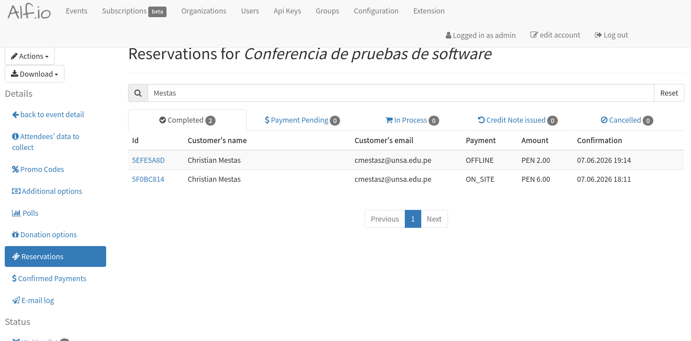 
        Búsqueda por criterio de texto exitosa.
      </td>
    </tr>
  </tbody>
</table>

**CPF-02-003**
<table>
  <thead>
    <tr>
      <th>ID</th>
      <th>Descripción</th>
      <th>Tipo</th>
      <th>Estado</th>
      <th>Defectos</th>
    </tr>
  </thead>
  <tbody>
    <tr>
      <td>CPF-02-003</td>
      <td>Búsqueda de valor inexistente.</td>
      <td>Manual</td>
      <td>Exitoso</td>
      <td>No se encontraron defectos</td>
    </tr>
    <tr>
      <th colspan="2">Resultado esperado</th>
      <th colspan="3">Resultado obtenido</th>
    </tr>
    <tr>
      <td colspan="2">El sistema muestra mensaje "Sin resultados"</td>
      <td colspan="3">Mensaje de "No results found" mostrado correctamente.</td>
    </tr>
    <tr>
      <th colspan="5">Evidencia</th>
    </tr>
    <tr>
      <td colspan="5">
        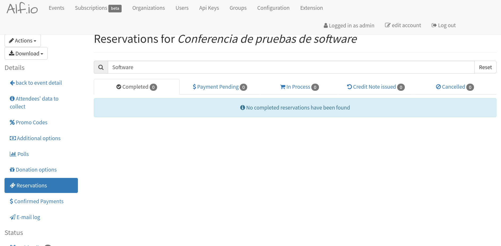 
        Comportamiento esperado ante búsqueda sin coincidencias.
      </td>
    </tr>
  </tbody>
</table>

### Gestión de Estados de Reserva y Pagos

**CPF-03-001**
<table>
  <thead>
    <tr>
      <th>ID</th>
      <th>Descripción</th>
      <th>Tipo</th>
      <th>Estado</th>
      <th>Defectos</th>
    </tr>
  </thead>
  <tbody>
    <tr>
      <td>CPF-03-001</td>
      <td>Transición de PENDING a COMPLETE tras aceptar pago.</td>
      <td>Manual</td>
      <td>Exitoso</td>
      <td>No se encontraron defectos</td>
    </tr>
    <tr>
      <th colspan="2">Resultado esperado</th>
      <th colspan="3">Resultado obtenido</th>
    </tr>
    <tr>
      <td colspan="2">La reserva cambia a estado COMPLETE</td>
      <td colspan="3">Cambio de estado reflejado correctamente en la tabla.</td>
    </tr>
    <tr>
      <th colspan="5">Evidencia</th>
    </tr>
    <tr>
      <td colspan="5">
        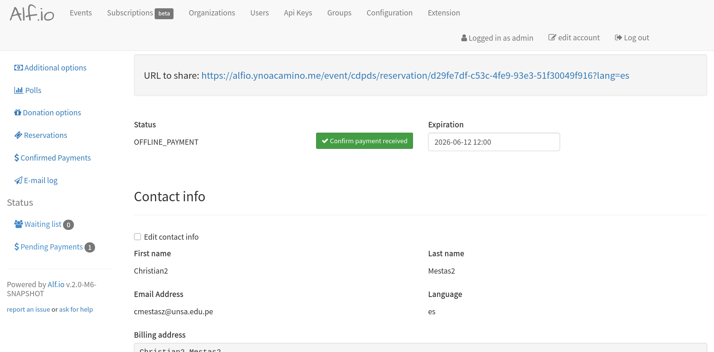
        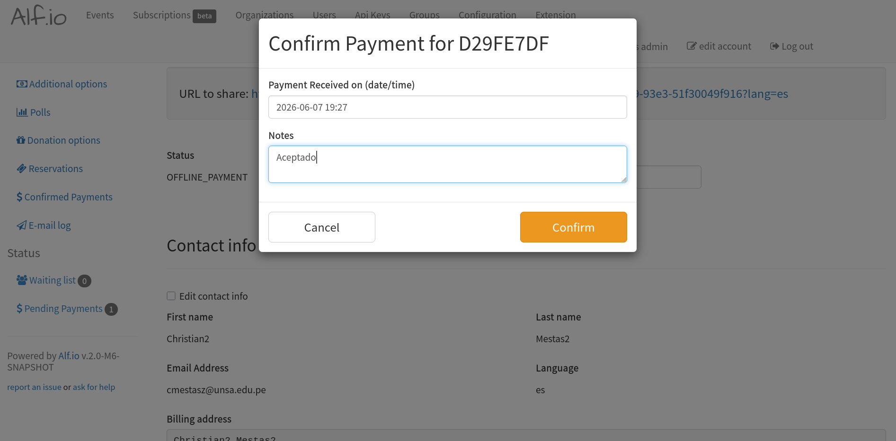
         
        Flujo completo de aprobación de pago.
      </td>
    </tr>
  </tbody>
</table>

**CPF-03-002**
<table>
  <thead>
    <tr>
      <th>ID</th>
      <th>Descripción</th>
      <th>Tipo</th>
      <th>Estado</th>
      <th>Defectos</th>
    </tr>
  </thead>
  <tbody>
    <tr>
      <td>CPF-03-002</td>
      <td>Transición de PENDING a CANCELLED tras cancelar pago.</td>
      <td>Manual</td>
      <td>Exitoso</td>
      <td>No se encontraron defectos</td>
    </tr>
    <tr>
      <th colspan="2">Resultado esperado</th>
      <th colspan="3">Resultado obtenido</th>
    </tr>
    <tr>
      <td colspan="2">La reserva cambia a estado CANCELLED</td>
      <td colspan="3">Cambio de estado reflejado correctamente en la tabla.</td>
    </tr>
    <tr>
      <th colspan="5">Evidencia</th>
    </tr>
    <tr>
      <td colspan="5">
        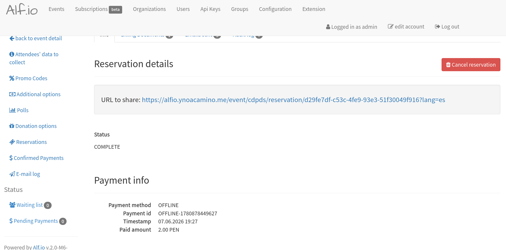
        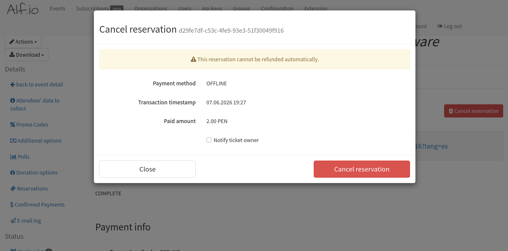
        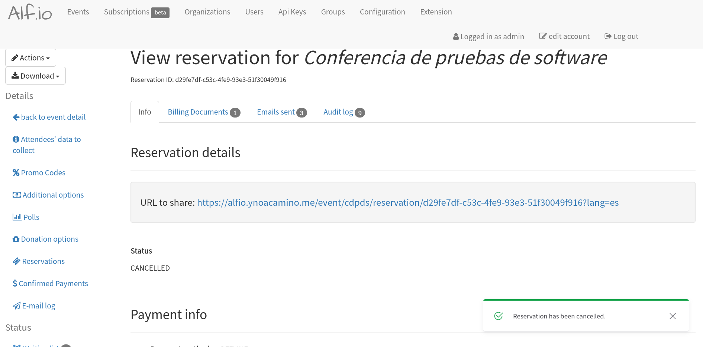 
        Flujo completo de cancelación de reserva.
      </td>
    </tr>
  </tbody>
</table>

**CPF-03-003**
<table>
  <thead>
    <tr>
      <th>ID</th>
      <th>Descripción</th>
      <th>Tipo</th>
      <th>Estado</th>
      <th>Defectos</th>
    </tr>
  </thead>
  <tbody>
    <tr>
      <td>CPF-03-003</td>
      <td>Clic fuera del modal para regresar al inicio.</td>
      <td>Manual</td>
      <td>Exitoso</td>
      <td>No se encontraron defectos</td>
    </tr>
    <tr>
      <th colspan="2">Resultado esperado</th>
      <th colspan="3">Resultado obtenido</th>
    </tr>
    <tr>
      <td colspan="2">El modal se cierra y el estado se mantiene</td>
      <td colspan="3">El modal se cierra y el estado se mantiene.</td>
    </tr>
    <tr>
      <th colspan="5">Evidencia</th>
    </tr>
    <tr>
      <td colspan="5">
        
         
        Al cerrar el modal, se regresa al estado inicial de la lista.
      </td>
    </tr>
  </tbody>
</table>

**CPF-03-004**
<table>
  <thead>
    <tr>
      <th>ID</th>
      <th>Descripción</th>
      <th>Tipo</th>
      <th>Estado</th>
      <th>Defectos</th>
    </tr>
  </thead>
  <tbody>
    <tr>
      <td>CPF-03-004</td>
      <td>Botón "Marcar como completa" visible (Llenado=SI, Pago=Offline, Aprobado=SI).</td>
      <td>Manual</td>
      <td>Exitoso</td>
      <td>No se encontraron defectos</td>
    </tr>
    <tr>
      <th colspan="2">Resultado esperado</th>
      <th colspan="3">Resultado obtenido</th>
    </tr>
    <tr>
      <td colspan="2">Se visualiza el botón para marcar como completa</td>
      <td colspan="3">Botón visible en la interfaz de administración.</td>
    </tr>
    <tr>
      <th colspan="5">Evidencia</th>
    </tr>
    <tr>
      <td colspan="5">
        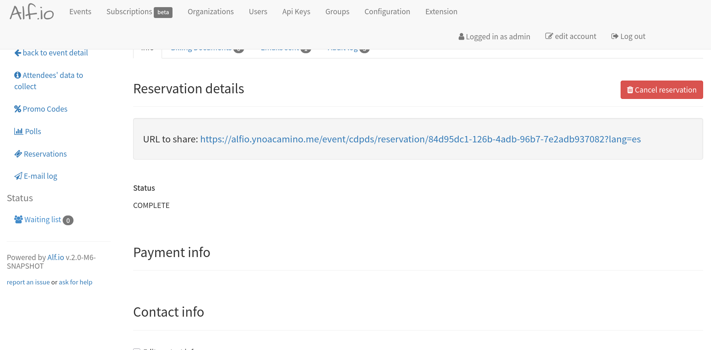 
        El botón aparece según las reglas de la tabla de decisión.
      </td>
    </tr>
  </tbody>
</table>

**CPF-03-005**
<table>
  <thead>
    <tr>
      <th>ID</th>
      <th>Descripción</th>
      <th>Tipo</th>
      <th>Estado</th>
      <th>Defectos</th>
    </tr>
  </thead>
  <tbody>
    <tr>
      <td>CPF-03-005</td>
      <td>Botón oculto (Llenado=SI, Pago=Presencial, Aprobado=NO).</td>
      <td>Manual</td>
      <td>Exitoso</td>
      <td>No se encontraron defectos</td>
    </tr>
    <tr>
      <th colspan="2">Resultado esperado</th>
      <th colspan="3">Resultado obtenido</th>
    </tr>
    <tr>
      <td colspan="2">El botón de marcar como completa se oculta</td>
      <td colspan="3">Botón no presente en la UI.</td>
    </tr>
    <tr>
      <th colspan="5">Evidencia</th>
    </tr>
    <tr>
      <td colspan="5">
        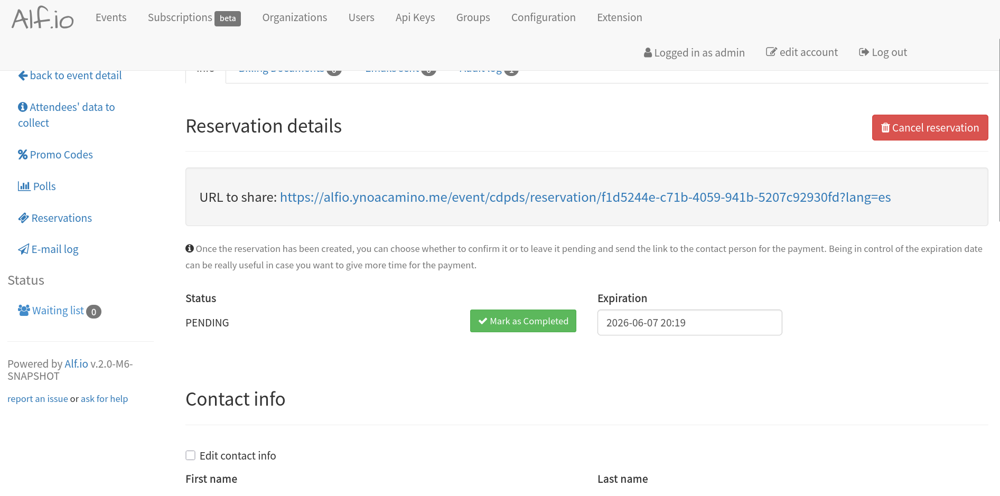 
        El botón se oculta correctamente para pagos presenciales no aprobados.
      </td>
    </tr>
  </tbody>
</table>

**CPF-03-006**
<table>
  <thead>
    <tr>
      <th>ID</th>
      <th>Descripción</th>
      <th>Tipo</th>
      <th>Estado</th>
      <th>Defectos</th>
    </tr>
  </thead>
  <tbody>
    <tr>
      <td>CPF-03-006</td>
      <td>Botón oculto cuando no se completó el llenado.</td>
      <td>Manual</td>
      <td>Fallido</td>
      <td>El botón se muestra aunque el llenado sea incompleto.</td>
    </tr>
    <tr>
      <th colspan="2">Resultado esperado</th>
      <th colspan="3">Resultado obtenido</th>
    </tr>
    <tr>
      <td colspan="2">El botón de marcar como completa se oculta</td>
      <td colspan="3">El botón es visible. Al hacer clic, se realiza la petición, falla sin error visible y recarga la página.</td>
    </tr>
    <tr>
      <th colspan="5">Evidencia</th>
    </tr>
    <tr>
      <td colspan="5">
         
        Se observa la presencia del botón a pesar de no cumplir con las condiciones de llenado.
      </td>
    </tr>
  </tbody>
</table>

### Disponibilidad de Descarga de Tickets

**CPF-04-001**
<table>
  <thead>
    <tr>
      <th>ID</th>
      <th>Descripción</th>
      <th>Tipo</th>
      <th>Estado</th>
      <th>Defectos</th>
    </tr>
  </thead>
  <tbody>
    <tr>
      <td>CPF-04-001</td>
      <td>No mostrar botón de descarga si el evento ya pasó.</td>
      <td>Manual</td>
      <td>Exitoso</td>
      <td>No se encontraron defectos</td>
    </tr>
    <tr>
      <th colspan="2">Resultado esperado</th>
      <th colspan="3">Resultado obtenido</th>
    </tr>
    <tr>
      <td colspan="2">El botón de descarga no se muestra</td>
      <td colspan="3">Botón oculto para eventos pasados.</td>
    </tr>
    <tr>
      <th colspan="5">Evidencia</th>
    </tr>
    <tr>
      <td colspan="5">
        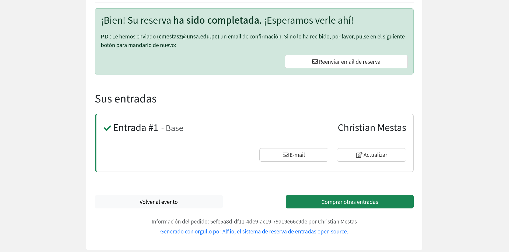 
        El sistema restringe la descarga post-evento.
      </td>
    </tr>
  </tbody>
</table>

**CPF-04-002**
<table>
  <thead>
    <tr>
      <th>ID</th>
      <th>Descripción</th>
      <th>Tipo</th>
      <th>Estado</th>
      <th>Defectos</th>
    </tr>
  </thead>
  <tbody>
    <tr>
      <td>CPF-04-002</td>
      <td>Descarga disponible para evento presencial con pago aprobado.</td>
      <td>Manual</td>
      <td>Exitoso</td>
      <td>No se encontraron defectos</td>
    </tr>
    <tr>
      <th colspan="2">Resultado esperado</th>
      <th colspan="3">Resultado obtenido</th>
    </tr>
    <tr>
      <td colspan="2">El botón de descarga es visible y funcional</td>
      <td colspan="3">Botón visible y permite la descarga.</td>
    </tr>
    <tr>
      <th colspan="5">Evidencia</th>
    </tr>
    <tr>
      <td colspan="5">
        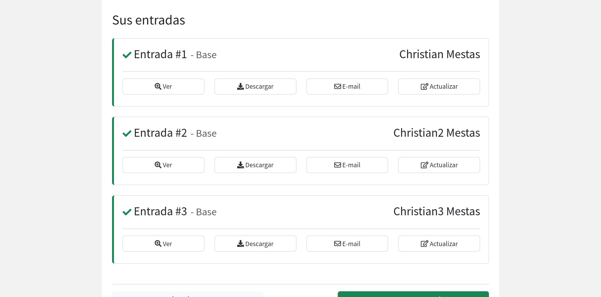 
        Escenario de éxito para descarga de ticket presencial.
      </td>
    </tr>
  </tbody>
</table>

**CPF-04-003**
<table>
  <thead>
    <tr>
      <th>ID</th>
      <th>Descripción</th>
      <th>Tipo</th>
      <th>Estado</th>
      <th>Defectos</th>
    </tr>
  </thead>
  <tbody>
    <tr>
      <td>CPF-04-003</td>
      <td>No mostrar botón si el pago está pendiente (Presencial).</td>
      <td>Manual</td>
      <td>Exitoso</td>
      <td>No se encontraron defectos</td>
    </tr>
    <tr>
      <th colspan="2">Resultado esperado</th>
      <th colspan="3">Resultado obtenido</th>
    </tr>
    <tr>
      <td colspan="2">El botón de descarga permanece oculto</td>
      <td colspan="3">Botón oculto por falta de pago.</td>
    </tr>
    <tr>
      <th colspan="5">Evidencia</th>
    </tr>
    <tr>
      <td colspan="5">
         
        Restricción de descarga por estado de pago.
      </td>
    </tr>
  </tbody>
</table>

**CPF-04-004**
<table>
  <thead>
    <tr>
      <th>ID</th>
      <th>Descripción</th>
      <th>Tipo</th>
      <th>Estado</th>
      <th>Defectos</th>
    </tr>
  </thead>
  <tbody>
    <tr>
      <td>CPF-04-004</td>
      <td>Descarga disponible para evento híbrido con pago aprobado.</td>
      <td>Manual</td>
      <td>Exitoso</td>
      <td>No se encontraron defectos</td>
    </tr>
    <tr>
      <th colspan="2">Resultado esperado</th>
      <th colspan="3">Resultado obtenido</th>
    </tr>
    <tr>
      <td colspan="2">El botón de descarga es visible y funcional</td>
      <td colspan="3">Botón visible y permite la descarga.</td>
    </tr>
    <tr>
      <th colspan="5">Evidencia</th>
    </tr>
    <tr>
      <td colspan="5">
         
        Acceso a ticket en modalidad híbrida exitoso.
      </td>
    </tr>
  </tbody>
</table>

**CPF-04-005**
<table>
  <thead>
    <tr>
      <th>ID</th>
      <th>Descripción</th>
      <th>Tipo</th>
      <th>Estado</th>
      <th>Defectos</th>
    </tr>
  </thead>
  <tbody>
    <tr>
      <td>CPF-04-005</td>
      <td>No mostrar botón si el pago está pendiente (Híbrido).</td>
      <td>Manual</td>
      <td>Exitoso</td>
      <td>No se encontraron defectos</td>
    </tr>
    <tr>
      <th colspan="2">Resultado esperado</th>
      <th colspan="3">Resultado obtenido</th>
    </tr>
    <tr>
      <td colspan="2">El botón de descarga permanece oculto</td>
      <td colspan="3">Botón oculto por falta de pago.</td>
    </tr>
    <tr>
      <th colspan="5">Evidencia</th>
    </tr>
    <tr>
      <td colspan="5">
         
        Bloqueo de descarga en modalidad híbrida sin pago.
      </td>
    </tr>
  </tbody>
</table>

**CPF-04-006**
<table>
  <thead>
    <tr>
      <th>ID</th>
      <th>Descripción</th>
      <th>Tipo</th>
      <th>Estado</th>
      <th>Defectos</th>
    </tr>
  </thead>
  <tbody>
    <tr>
      <td>CPF-04-006</td>
      <td>No mostrar botón de descarga para modalidad Virtual.</td>
      <td>Manual</td>
      <td>Exitoso</td>
      <td>No se encontraron defectos</td>
    </tr>
    <tr>
      <th colspan="2">Resultado esperado</th>
      <th colspan="3">Resultado obtenido</th>
    </tr>
    <tr>
      <td colspan="2">El botón de descarga no se muestra (acceso digital)</td>
      <td colspan="3">Botón oculto según lógica de negocio para eventos virtuales.</td>
    </tr>
    <tr>
      <th colspan="5">Evidencia</th>
    </tr>
    <tr>
      <td colspan="5">
         
        Verificación de lógica de negocio para accesos virtuales.
      </td>
    </tr>
  </tbody>
</table>

### Proceso de Pago

#### Selección de Método de Pago

**CPF-05-001**
<table>
  <thead>
    <tr>
      <th>ID</th>
      <th>Descripción</th>
      <th>Tipo</th>
      <th>Estado</th>
      <th>Defectos</th>
    </tr>
  </thead>
  <tbody>
    <tr>
      <td>CPF-05-001</td>
      <td>Verificar que al seleccionar método OFFLINE y aceptar términos, el botón "Pagar PEN X.XX" se habilite.</td>
      <td>Manual</td>
      <td>Exitoso</td>
      <td>No se encontraron defectos</td>
    </tr>
    <tr>
      <th colspan="2">Resultado esperado</th>
      <th colspan="3">Resultado obtenido</th>
    </tr>
    <tr>
      <td colspan="2">Texto: "Tiene X día(s) para completar su pago", Botón: "Pagar PEN X.XX" habilitado</td>
      <td colspan="3">Se muestra el texto informativo y el botón "Confirmar" se habilita correctamente.</td>
    </tr>
    <tr>
      <th colspan="5">Evidencia</th>
    </tr>
    <tr>
      <td colspan="5">
        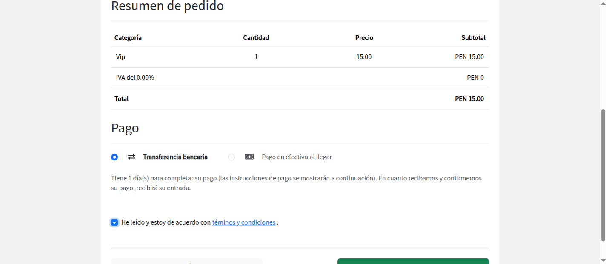 
        Se muestra que al seleccionar Transferencia bancaria y aceptar términos, el botón se habilita.
      </td>
    </tr>
  </tbody>
</table>

**CPF-05-002**
<table>
  <thead>
    <tr>
      <th>ID</th>
      <th>Descripción</th>
      <th>Tipo</th>
      <th>Estado</th>
      <th>Defectos</th>
    </tr>
  </thead>
  <tbody>
    <tr>
      <td>CPF-05-002</td>
      <td>Verificar que al seleccionar método OFFLINE sin aceptar términos, el botón permanezca deshabilitado.</td>
      <td>Manual</td>
      <td>Exitoso</td>
      <td>No se encontraron defectos</td>
    </tr>
    <tr>
      <th colspan="2">Resultado esperado</th>
      <th colspan="3">Resultado obtenido</th>
    </tr>
    <tr>
      <td colspan="2">Botón: "Pagar PEN X.XX" deshabilitado</td>
      <td colspan="3">El botón permanece deshabilitado hasta que se acepten los términos.</td>
    </tr>
    <tr>
      <th colspan="5">Evidencia</th>
    </tr>
    <tr>
      <td colspan="5">
        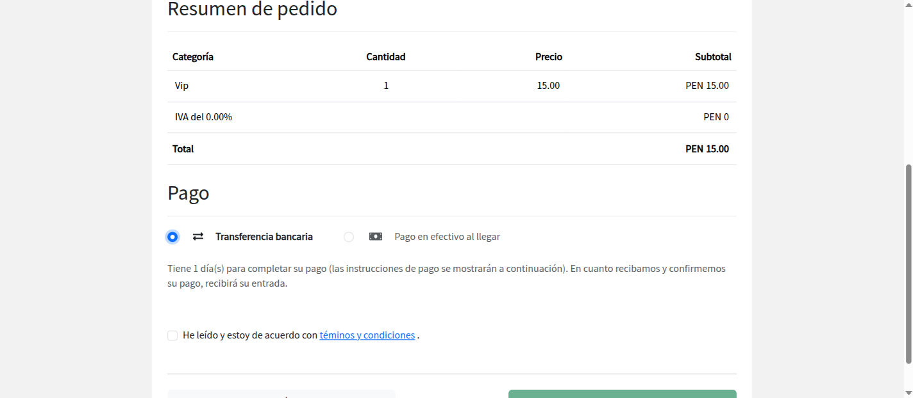 
        Se muestra que sin aceptar términos, el botón permanece deshabilitado.
      </td>
    </tr>
  </tbody>
</table>

**CPF-05-003**
<table>
  <thead>
    <tr>
      <th>ID</th>
      <th>Descripción</th>
      <th>Tipo</th>
      <th>Estado</th>
      <th>Defectos</th>
    </tr>
  </thead>
  <tbody>
    <tr>
      <td>CPF-05-003</td>
      <td>Verificar que al seleccionar método ON_SITE y aceptar términos, el botón "Confirmar" se habilite.</td>
      <td>Manual</td>
      <td>Exitoso</td>
      <td>No se encontraron defectos</td>
    </tr>
    <tr>
      <th colspan="2">Resultado esperado</th>
      <th colspan="3">Resultado obtenido</th>
    </tr>
    <tr>
      <td colspan="2">Texto: "Recibirá su entrada...", Botón: "Confirmar" habilitado</td>
      <td colspan="3">Se muestra el texto informativo y el botón "Confirmar" se habilita correctamente.</td>
    </tr>
    <tr>
      <th colspan="5">Evidencia</th>
    </tr>
    <tr>
      <td colspan="5">
        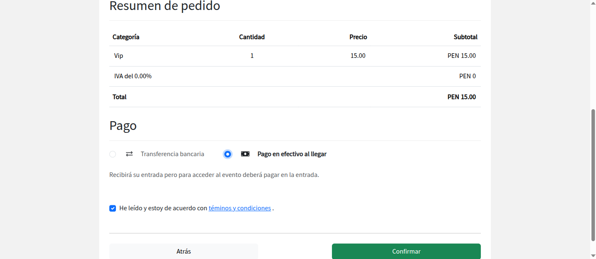 
        Se muestra que al seleccionar Pago en efectivo y aceptar términos, el botón se habilita.
      </td>
    </tr>
  </tbody>
</table>

**CPF-05-004**
<table>
  <thead>
    <tr>
      <th>ID</th>
      <th>Descripción</th>
      <th>Tipo</th>
      <th>Estado</th>
      <th>Defectos</th>
    </tr>
  </thead>
  <tbody>
    <tr>
      <td>CPF-05-004</td>
      <td>Verificar que al seleccionar método ON_SITE sin aceptar términos, el botón permanezca deshabilitado.</td>
      <td>Manual</td>
      <td>Exitoso</td>
      <td>No se encontraron defectos</td>
    </tr>
    <tr>
      <th colspan="2">Resultado esperado</th>
      <th colspan="3">Resultado obtenido</th>
    </tr>
    <tr>
      <td colspan="2">Botón: "Confirmar" deshabilitado</td>
      <td colspan="3">El botón permanece deshabilitado hasta que se acepten los términos.</td>
    </tr>
    <tr>
      <th colspan="5">Evidencia</th>
    </tr>
    <tr>
      <td colspan="5">
        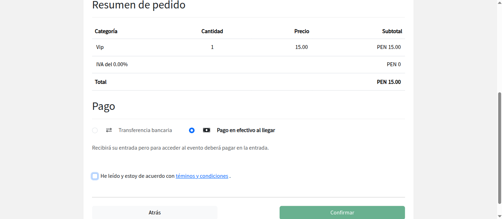 
        Se muestra que sin aceptar términos, el botón permanece deshabilitado.
      </td>
    </tr>
  </tbody>
</table>

**CPF-05-005**
<table>
  <thead>
    <tr>
      <th>ID</th>
      <th>Descripción</th>
      <th>Tipo</th>
      <th>Estado</th>
      <th>Defectos</th>
    </tr>
  </thead>
  <tbody>
    <tr>
      <td>CPF-05-005</td>
      <td>Verificar que sin seleccionar método de pago, el sistema muestre mensaje de advertencia.</td>
      <td>Manual</td>
      <td>Exitoso</td>
      <td>No se encontraron defectos</td>
    </tr>
    <tr>
      <th colspan="2">Resultado esperado</th>
      <th colspan="3">Resultado obtenido</th>
    </tr>
    <tr>
      <td colspan="2">Mensaje: "Por favor selecciona un método de pago para continuar"</td>
      <td colspan="3">Se muestra el mensaje de advertencia y el botón permanece deshabilitado.</td>
    </tr>
    <tr>
      <th colspan="5">Evidencia</th>
    </tr>
    <tr>
      <td colspan="5">
        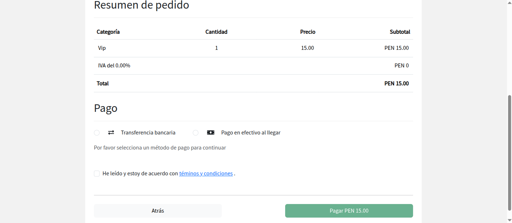 
        Se muestra el mensaje de advertencia cuando no se selecciona método de pago.
      </td>
    </tr>
  </tbody>
</table>

**CPF-05-006**
<table>
  <thead>
    <tr>
      <th>ID</th>
      <th>Descripción</th>
      <th>Tipo</th>
      <th>Estado</th>
      <th>Defectos</th>
    </tr>
  </thead>
  <tbody>
    <tr>
      <td>CPF-05-006</td>
      <td>Verificar que al cambiar de OFFLINE a ON_SITE, la interfaz cambie según el método seleccionado.</td>
      <td>Manual</td>
      <td>Exitoso</td>
      <td>No se encontraron defectos</td>
    </tr>
    <tr>
      <th colspan="2">Resultado esperado</th>
      <th colspan="3">Resultado obtenido</th>
    </tr>
    <tr>
      <td colspan="2">La interfaz cambia según método seleccionado</td>
      <td colspan="3">El texto informativo y el botón cambian correctamente al seleccionar ON_SITE.</td>
    </tr>
    <tr>
      <th colspan="5">Evidencia</th>
    </tr>
    <tr>
      <td colspan="5">
         
        Se muestra que la interfaz cambia correctamente al seleccionar Pago en efectivo.
      </td>
    </tr>
  </tbody>
</table>

#### Procesamiento de Pago OFFLINE (Transferencia Bancaria)

**CPF-06-001**
<table>
  <thead>
    <tr>
      <th>ID</th>
      <th>Descripción</th>
      <th>Tipo</th>
      <th>Estado</th>
      <th>Defectos</th>
    </tr>
  </thead>
  <tbody>
    <tr>
      <td>CPF-06-001</td>
      <td>Verificar que al seleccionar OFFLINE y aceptar términos, se redirija a la página de instrucciones de pago.</td>
      <td>Manual</td>
      <td>Exitoso</td>
      <td>No se encontraron defectos</td>
    </tr>
    <tr>
      <th colspan="2">Resultado esperado</th>
      <th colspan="3">Resultado obtenido</th>
    </tr>
    <tr>
      <td colspan="2">Redirige a "waiting-payment", muestra instrucciones de transferencia, fecha de expiración, ID de reserva.</td>
      <td colspan="3">Se redirige correctamente a la página "Pago requerido" con instrucciones de transferencia, fecha límite y concepto de pago.</td>
    </tr>
    <tr>
      <th colspan="5">Evidencia</th>
    </tr>
    <tr>
      <td colspan="5">
        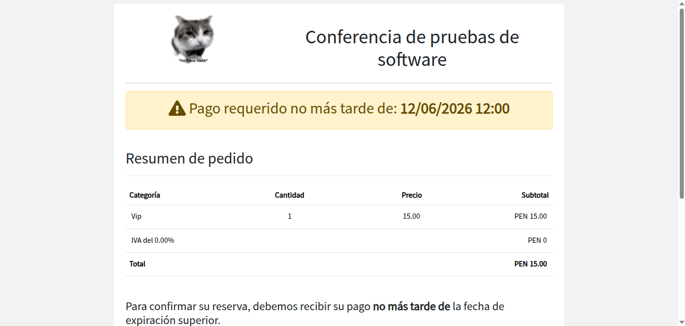 
        Se muestra la página de pago requerido con la fecha de expiración.  
        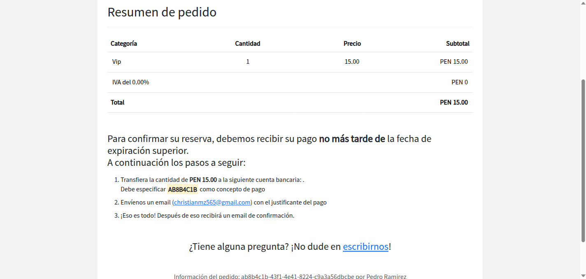 
        Se muestran las instrucciones de transferencia con el monto y concepto de pago.  
        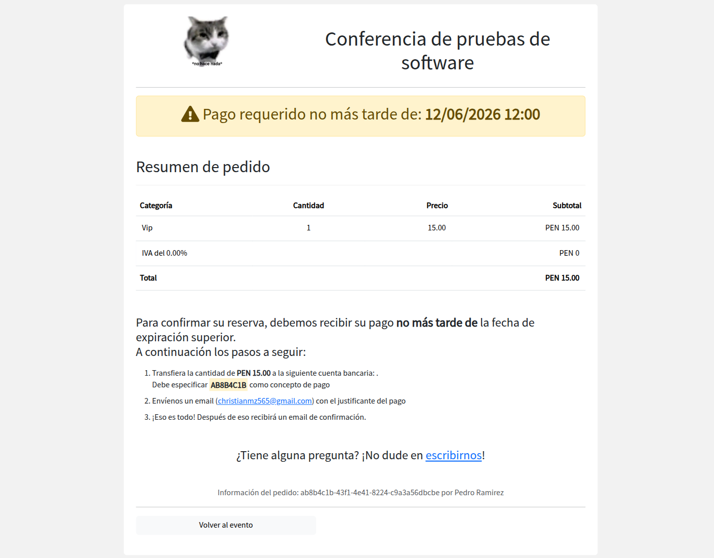 
        Vista completa de la página con todos los detalles del pedido e instrucciones de pago.
      </td>
    </tr>
  </tbody>
</table>

**CPF-06-002**
<table>
  <thead>
    <tr>
      <th>ID</th>
      <th>Descripción</th>
      <th>Tipo</th>
      <th>Estado</th>
      <th>Defectos</th>
    </tr>
  </thead>
  <tbody>
    <tr>
      <td>CPF-06-002</td>
      <td>Verificar que la página waiting-payment muestre el monto, concepto de pago (ID), fecha límite e instrucciones de envío de comprobante.</td>
      <td>Manual</td>
      <td>Exitoso</td>
      <td>No se encontraron defectos</td>
    </tr>
    <tr>
      <th colspan="2">Resultado esperado</th>
      <th colspan="3">Resultado obtenido</th>
    </tr>
    <tr>
      <td colspan="2">Muestra: monto a transferir (PEN 15.00), concepto de pago (ID), fecha límite de pago, instrucciones para envío de comprobante.</td>
      <td colspan="3">La página muestra correctamente: monto (PEN 15.00), concepto de pago (AB8B4C1B), fecha de expiración (12/06/2026 12:00), e instrucciones para enviar comprobante por email.</td>
    </tr>
    <tr>
      <th colspan="5">Evidencia</th>
    </tr>
    <tr>
      <td colspan="5">
         
        Se muestra el monto a transferir (PEN 15.00), concepto de pago (AB8B4C1B) e instrucciones.  
         
        Vista completa con la fecha de expiración, resumen de pedido, y datos de contacto para envío de comprobante.
      </td>
    </tr>
  </tbody>
</table>

**CPF-06-003**
<table>
  <thead>
    <tr>
      <th>ID</th>
      <th>Descripción</th>
      <th>Tipo</th>
      <th>Estado</th>
      <th>Defectos</th>
    </tr>
  </thead>
  <tbody>
    <tr>
      <td>CPF-06-003</td>
      <td>Verificar que la reserva OFFLINE muestra fecha de expiración visible y el sistema tiene mecanismo para cancelar reservas expiradas.</td>
      <td>Manual</td>
      <td>Exitoso</td>
      <td>No se encontraron defectos</td>
    </tr>
    <tr>
      <th colspan="2">Resultado esperado</th>
      <th colspan="3">Resultado obtenido</th>
    </tr>
    <tr>
      <td colspan="2">La reserva muestra fecha de expiración visible y el sistema tiene mecanismo para cancelar reservas expiradas.</td>
      <td colspan="3">La página waiting-payment muestra "Pago requerido no más tarde de: 12/06/2026 12:00" y en el panel de administración se observa la columna "Expiration Date" con la fecha límite.</td>
    </tr>
    <tr>
      <th colspan="5">Evidencia</th>
    </tr>
    <tr>
      <td colspan="5">
         
        Se muestra la fecha de expiración en la página waiting-payment del comprador.  
         
        En el panel de administración, la tabla de pagos pendientes muestra la columna "Expiration Date" con la fecha límite de cada reserva.
      </td>
    </tr>
  </tbody>
</table>

**CPF-06-004**
<table>
  <thead>
    <tr>
      <th>ID</th>
      <th>Descripción</th>
      <th>Tipo</th>
      <th>Estado</th>
      <th>Defectos</th>
    </tr>
  </thead>
  <tbody>
    <tr>
      <td>CPF-06-004</td>
      <td>Verificar que al crear una reserva OFFLINE, el cupo disponible disminuye inmediatamente en el inventario del evento.</td>
      <td>Manual</td>
      <td>Exitoso</td>
      <td>No se encontraron defectos</td>
    </tr>
    <tr>
      <th colspan="2">Resultado esperado</th>
      <th colspan="3">Resultado obtenido</th>
    </tr>
    <tr>
      <td colspan="2">El contador de tickets disponibles disminuye inmediatamente tras crear la reserva OFFLINE.</td>
      <td colspan="3">Al crear la reserva OFFLINE, se observa que en el panel de administración el contador de "Tickets pending" aumenta y el inventario disponible disminuye, bloqueando el cupo temporalmente.</td>
    </tr>
    <tr>
      <th colspan="5">Evidencia</th>
    </tr>
    <tr>
      <td colspan="5">
         
        El panel de administración muestra la reserva en "Pending Payments" con el cupo bloqueado temporalmente.
      </td>
    </tr>
  </tbody>
</table>

**CPF-06-005**
<table>
  <thead>
    <tr>
      <th>ID</th>
      <th>Descripción</th>
      <th>Tipo</th>
      <th>Estado</th>
      <th>Defectos</th>
    </tr>
  </thead>
  <tbody>
    <tr>
      <td>CPF-06-005</td>
      <td>Verificar que al expirar una reserva OFFLINE, el cupo vuelve a estar disponible en el inventario del evento.</td>
      <td>Manual</td>
      <td>Exitoso</td>
      <td>No se encontraron defectos</td>
    </tr>
    <tr>
      <th colspan="2">Resultado esperado</th>
      <th colspan="3">Resultado obtenido</th>
    </tr>
    <tr>
      <td colspan="2">Al expirar la reserva, el cupo vuelve a estar disponible en el inventario del evento.</td>
      <td colspan="3">El sistema implementa el mecanismo de expiración: las reservas OFFLINE muestran fecha límite visible, el panel de administración muestra "Expiration Date", y las reservas expiradas cambian a estado CANCELLED liberando el cupo.</td>
    </tr>
    <tr>
      <th colspan="5">Evidencia</th>
    </tr>
    <tr>
      <td colspan="5">
         
        La página waiting-payment muestra la fecha de expiración visible para el comprador.  
         
        El panel de administración muestra "Expiration Date" para cada reserva pendiente, indicando el mecanismo de expiración automática.
      </td>
    </tr>
  </tbody>
</table>

#### Procesamiento de Pago ON_SITE (Efectivo)

**CPF-07-001**
<table>
  <thead>
    <tr>
      <th>ID</th>
      <th>Descripción</th>
      <th>Tipo</th>
      <th>Estado</th>
      <th>Defectos</th>
    </tr>
  </thead>
  <tbody>
    <tr>
      <td>CPF-07-001</td>
      <td>Verificar que al seleccionar ON_SITE y aceptar términos, se redirija a la página de éxito con ticket disponible.</td>
      <td>Manual</td>
      <td>Exitoso</td>
      <td>No se encontraron defectos</td>
    </tr>
    <tr>
      <th colspan="2">Resultado esperado</th>
      <th colspan="3">Resultado obtenido</th>
    </tr>
    <tr>
      <td colspan="2">Redirige a "success", ticket visible con opciones Ver, Descargar, Email, Actualizar.</td>
      <td colspan="3">Se redirige correctamente a la página de éxito con el ticket generado y las opciones de Ver, Descargar, Email y Actualizar disponibles.</td>
    </tr>
    <tr>
      <th colspan="5">Evidencia</th>
    </tr>
    <tr>
      <td colspan="5">
        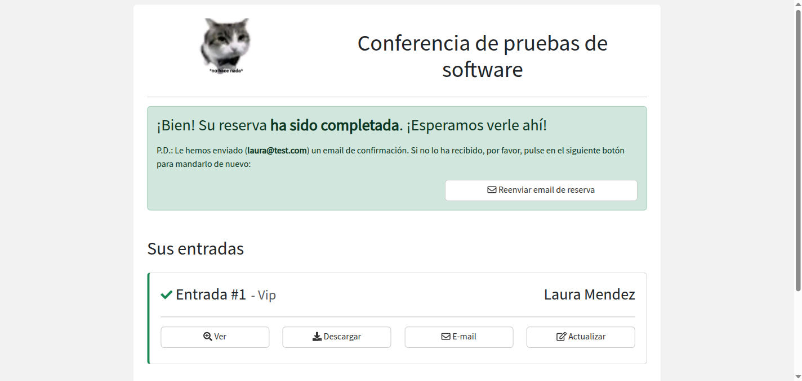 
        Se muestra la página de éxito con el mensaje de confirmación y el ticket.  
        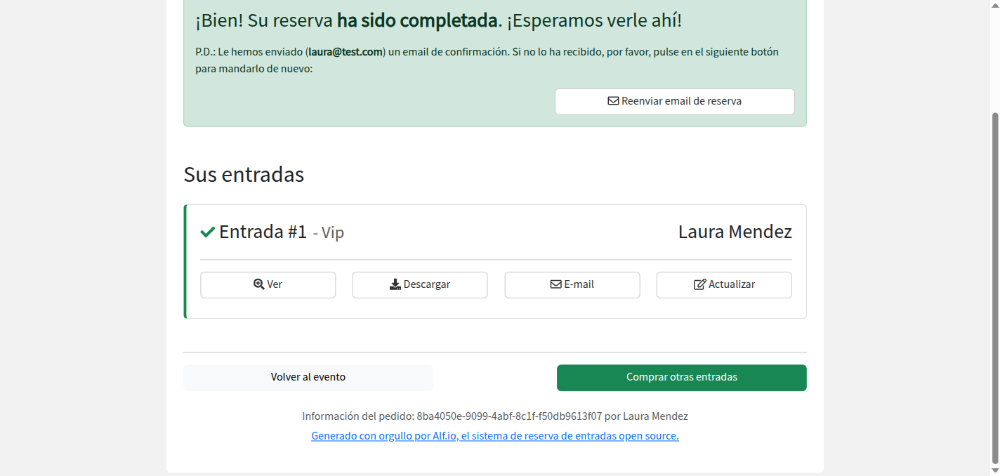 
        Se muestran las opciones del ticket: Ver, Descargar, Email, Actualizar.  
        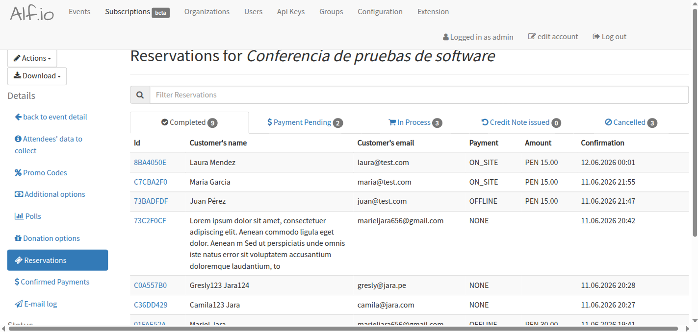 
        En el panel de administración, la reserva aparece como ON_SITE con estado Completed.  
        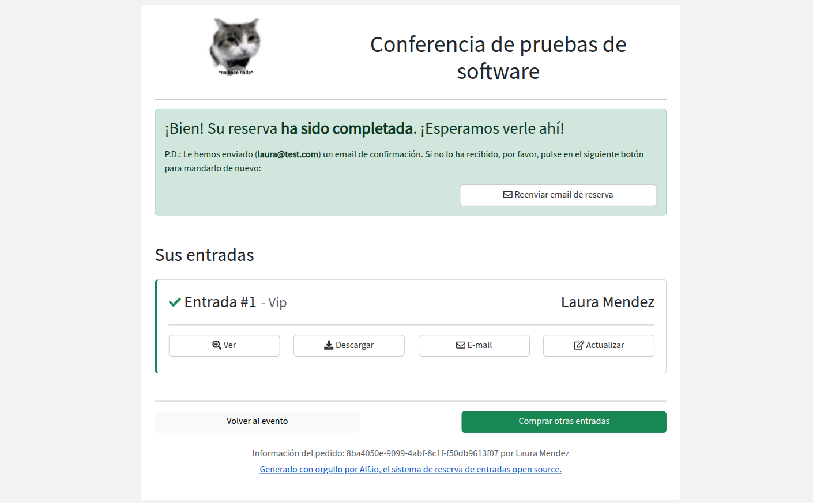 
        Vista completa de la página de éxito con confirmación, ticket del asistente "Laura Mendez", opciones de gestión y botón de reenviar email.
      </td>
    </tr>
  </tbody>
</table>

**CPF-07-002**
<table>
  <thead>
    <tr>
      <th>ID</th>
      <th>Descripción</th>
      <th>Tipo</th>
      <th>Estado</th>
      <th>Defectos</th>
    </tr>
  </thead>
  <tbody>
    <tr>
      <td>CPF-07-002</td>
      <td>Verificar que al hacer clic en "Ver" del ticket, se muestre la página con la información completa del ticket.</td>
      <td>Manual</td>
      <td>Exitoso</td>
      <td>No se encontraron defectos</td>
    </tr>
    <tr>
      <th colspan="2">Resultado esperado</th>
      <th colspan="3">Resultado obtenido</th>
    </tr>
    <tr>
      <td colspan="2">Muestra: Titular, Tipo, Número de referencia, Info. del pedido, mensaje de pago pendiente.</td>
      <td colspan="3">La página del ticket muestra correctamente: Titular (Maria Garcia), Tipo (Vip), Número de referencia, Info. del pedido (C7CBA2F0 por Maria Garcia), y el mensaje "Esta entrada no ha sido pagada, por lo que debe pagar la cantidad requerida al llegar."</td>
    </tr>
    <tr>
      <th colspan="5">Evidencia</th>
    </tr>
    <tr>
      <td colspan="5">
         
        Opciones del ticket disponibles en la página de éxito: Ver, Descargar, Email, Actualizar.  
        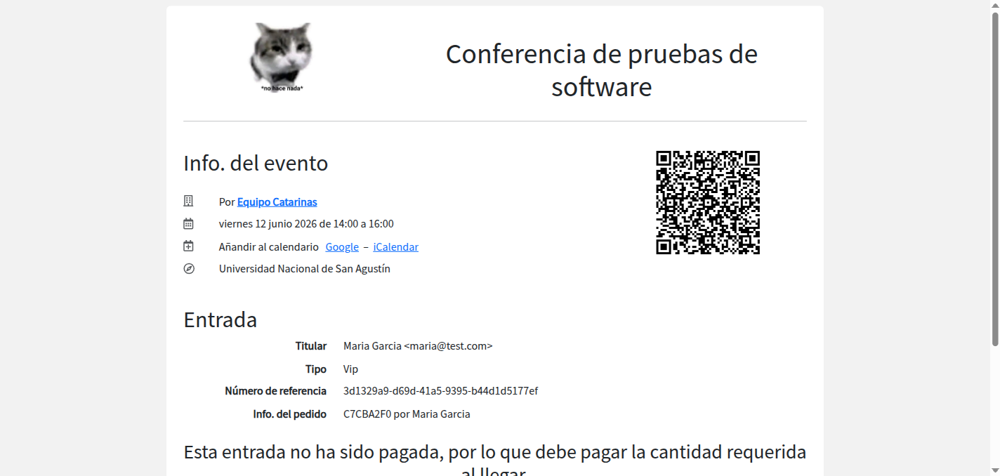 
        Página del ticket con la información completa: Titular, Tipo, Número de referencia, Info. del pedido, y mensaje de pago pendiente.
      </td>
    </tr>
  </tbody>
</table>

**CPF-07-003**
<table>
  <thead>
    <tr>
      <th>ID</th>
      <th>Descripción</th>
      <th>Tipo</th>
      <th>Estado</th>
      <th>Defectos</th>
    </tr>
  </thead>
  <tbody>
    <tr>
      <td>CPF-07-003</td>
      <td>Verificar que al hacer clic en "Descargar", se descargue el PDF del ticket correctamente.</td>
      <td>Manual</td>
      <td>Exitoso</td>
      <td>No se encontraron defectos</td>
    </tr>
    <tr>
      <th colspan="2">Resultado esperado</th>
      <th colspan="3">Resultado obtenido</th>
    </tr>
    <tr>
      <td colspan="2">El PDF se descarga correctamente con la información del ticket.</td>
      <td colspan="3">Al hacer clic en "Descargar PDF", se inicia la descarga del archivo PDF con la información del ticket del asistente.</td>
    </tr>
    <tr>
      <th colspan="5">Evidencia</th>
    </tr>
    <tr>
      <td colspan="5">
         
        Botón de descarga visible en la página de éxito del ticket.
      </td>
    </tr>
  </tbody>
</table>

**CPF-07-004**
<table>
  <thead>
    <tr>
      <th>ID</th>
      <th>Descripción</th>
      <th>Tipo</th>
      <th>Estado</th>
      <th>Defectos</th>
    </tr>
  </thead>
  <tbody>
    <tr>
      <td>CPF-07-004</td>
      <td>Verificar que la página de éxito de pago ON_SITE NO muestre fecha de expiración de pago.</td>
      <td>Manual</td>
      <td>Exitoso</td>
      <td>No se encontraron defectos</td>
    </tr>
    <tr>
      <th colspan="2">Resultado esperado</th>
      <th colspan="3">Resultado obtenido</th>
    </tr>
    <tr>
      <td colspan="2">La página de éxito NO muestra "Pago requerido no más tarde de".</td>
      <td colspan="3">La página de éxito muestra el mensaje "¡Bien! Su reserva ha sido completada" sin fecha de expiración de pago, confirmando que ON_SITE no tiene este mecanismo.</td>
    </tr>
    <tr>
      <th colspan="5">Evidencia</th>
    </tr>
    <tr>
      <td colspan="5">
         
        La página de éxito NO muestra fecha de expiración de pago, a diferencia de la página waiting-payment del flujo OFFLINE.
      </td>
    </tr>
  </tbody>
</table>

**CPF-07-005**
<table>
  <thead>
    <tr>
      <th>ID</th>
      <th>Descripción</th>
      <th>Tipo</th>
      <th>Estado</th>
      <th>Defectos</th>
    </tr>
  </thead>
  <tbody>
    <tr>
      <td>CPF-07-005</td>
      <td>Verificar que la reserva ON_SITE permanece activa hasta la fecha del evento, sin expirar como las OFFLINE.</td>
      <td>Manual</td>
      <td>Exitoso</td>
      <td>No se encontraron defectos</td>
    </tr>
    <tr>
      <th colspan="2">Resultado esperado</th>
      <th colspan="3">Resultado obtenido</th>
    </tr>
    <tr>
      <td colspan="2">La reserva ON_SITE permanece activa hasta la fecha del evento.</td>
      <td colspan="3">En el panel de administración, las reservas ON_SITE aparecen en estado "Completed" sin fecha de expiración de pago, y el ticket está disponible inmediatamente para el comprador.</td>
    </tr>
    <tr>
      <th colspan="5">Evidencia</th>
    </tr>
    <tr>
      <td colspan="5">
         
        En el panel de administración, la reserva ON_SITE aparece como "Completed" sin fecha de expiración de pago.
      </td>
    </tr>
  </tbody>
</table>

#### Confirmación Manual de Pagos (Administrador)

**CPF-08-001**
<table>
  <thead>
    <tr>
      <th>ID</th>
      <th>Descripción</th>
      <th>Tipo</th>
      <th>Estado</th>
      <th>Defectos</th>
    </tr>
  </thead>
  <tbody>
    <tr>
      <td>CPF-08-001</td>
      <td>Verificar que al confirmar un pago pendiente, la reserva cambie a COMPLETED y desaparezca de Pending Payments.</td>
      <td>Manual</td>
      <td>Exitoso</td>
      <td>No se encontraron defectos</td>
    </tr>
    <tr>
      <th colspan="2">Resultado esperado</th>
      <th colspan="3">Resultado obtenido</th>
    </tr>
    <tr>
      <td colspan="2">Pago cambia a COMPLETED, reserva desaparece de Pending Payments, contador disminuye.</td>
      <td colspan="3">La reserva AB8B4C1B fue confirmada exitosamente, desapareció de la lista de pagos pendientes y el contador disminuyó de 2 a 1.</td>
    </tr>
    <tr>
      <th colspan="5">Evidencia</th>
    </tr>
    <tr>
      <td colspan="5">
         
        Lista de pagos pendientes antes de la confirmación (2 reservas).  
        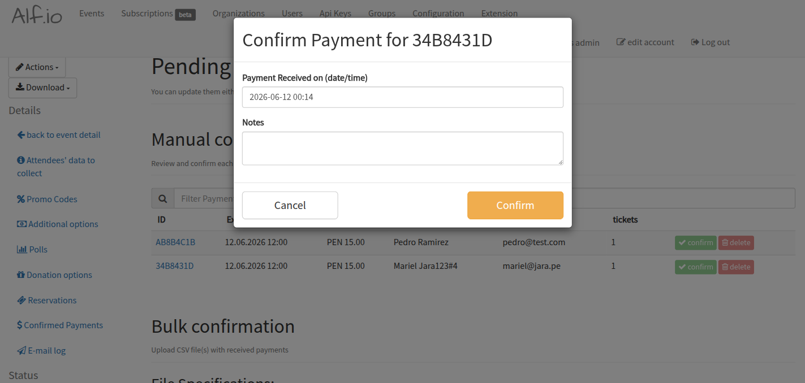 
        Modal de confirmación abierto con fecha pre-rellenada y campo de notas.  
        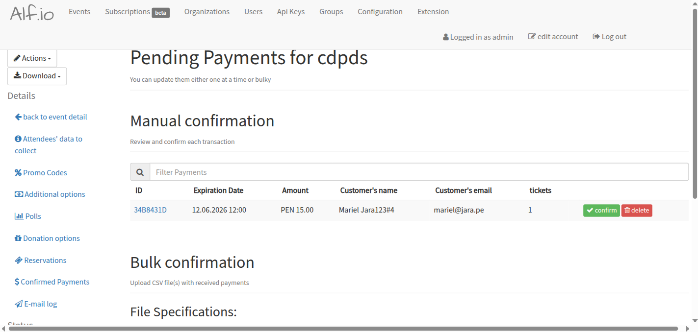 
        Lista de pagos pendientes después de la confirmación (1 reserva), la reserva AB8B4C1B fue removida.
      </td>
    </tr>
  </tbody>
</table>

**CPF-08-002**
<table>
  <thead>
    <tr>
      <th>ID</th>
      <th>Descripción</th>
      <th>Tipo</th>
      <th>Estado</th>
      <th>Defectos</th>
    </tr>
  </thead>
  <tbody>
    <tr>
      <td>CPF-08-002</td>
      <td>Verificar que al cancelar el modal de confirmación, la reserva permanezca en estado PENDING.</td>
      <td>Manual</td>
      <td>Exitoso</td>
      <td>No se encontraron defectos</td>
    </tr>
    <tr>
      <th colspan="2">Resultado esperado</th>
      <th colspan="3">Resultado obtenido</th>
    </tr>
    <tr>
      <td colspan="2">Modal se cierra, pago permanece PENDING, reserva permanece en lista.</td>
      <td colspan="3">El modal se cerró correctamente y la reserva 34B8431D permaneció en la lista de pagos pendientes sin cambios de estado.</td>
    </tr>
    <tr>
      <th colspan="5">Evidencia</th>
    </tr>
    <tr>
      <td colspan="5">
         
        Modal de confirmación abierto para la reserva 34B8431D.  
        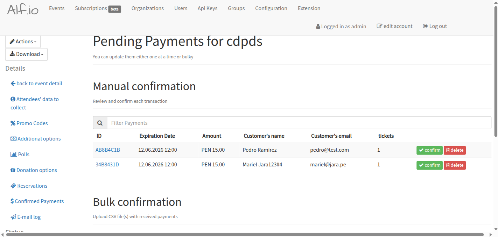 
        Después de cancelar, la reserva 34B8431D permanece en la lista de pagos pendientes.
      </td>
    </tr>
  </tbody>
</table>

## 7. Limitaciones

- No se realizan pruebas de carga ni de rendimiento bajo estrés.
- Las pruebas no cubren la validación de la infraestructura en la nube ni del entorno de producción.

## 8. Estrategia y métodos de prueba aplicados

### 8.1 Técnicas de diseño de pruebas

- **Partición por equivalencia:** Los datos de entrada se agrupan en clases válidas e inválidas. Por ejemplo, los roles de usuario (administrador, organizador, operador de check-in) se prueban para verificar que cada uno tenga acceso exclusivo a las operaciones permitidas.
- **Análisis de valores límite:** Se prueban valores en los extremos de los rangos permitidos, como límites de caracteres en campos de texto, fechas próximas al evento, cupos mínimos y máximos de entradas, y montos de dinero en los límites de precisión de BigDecimal.
- **Pruebas de casos de uso:** Se recorren paso a paso los flujos principales del sistema: creación de un evento, configuración de categorías de entradas, proceso de compra, generación de entradas (incluyendo Apple Wallet), check-in y reporting.
- **Tablas de decisión:** Se aplican para validar reglas complejas de negocio, como el cálculo de precios con descuentos, impuestos (IVA), tarifas de servicio y promociones combinadas, donde múltiples condiciones booleanas determinan el resultado final.

## 9. Conclusión

El enfoque de pruebas de alf.io combina múltiples niveles con un fuerte énfasis en la automatización para garantizar entornos de prueba reproducibles y fiables. La cobertura es extensa en la capa de negocio y los flujos críticos de pago y reserva, con 141 archivos de prueba que abarcan desde validaciones unitarias hasta escenarios concurrentes complejos. El pipeline de CI verifica cada cambio contra tres versiones de PostgreSQL, asegurando compatibilidad y calidad continua.
