# Informe de Casos de Prueba Funcionales del Sistema alf.io

## Índice
- [1. Introducción](#1-introducción)
- [2. Propósito](#2-propósito)
- [3. Alcance](#3-alcance)
- [4. Referencias](#4-referencias)
- [5. Entorno de pruebas](#5-entorno-de-pruebas)
- [6. Resultados de Pruebas Funcionales](#6-resultados-de-pruebas-funcionales)
- [7. Limitaciones](#7-limitaciones)
- [8. Estrategia y métodos de prueba aplicados](#8-estrategia-y-métodos-de-prueba-aplicados)
- [9. Conclusión](#9-conclusión)
- [10. Resumen de Ejecución](#10-resumen-de-ejecución)

## 1. Introducción

El presente informe documenta la estrategia, ejecución y resultados de las pruebas funcionales realizadas sobre alf.io, un sistema de gestión y venta de entradas para eventos de código abierto. Su propósito es evaluar la calidad del software, identificar defectos potenciales y verificar el cumplimiento de los requisitos del sistema, desde unidades de código hasta flujos completos de usuario.

## 2. Propósito

Este documento sirve como referencia para:

- Describir el enfoque de pruebas adoptado y los niveles de cobertura alcanzados.
- Detallar la configuración del entorno de pruebas.
- Proporcionar evidencia sobre el comportamiento del sistema en escenarios controlados.
- Facilitar la reproducibilidad de las pruebas por parte del equipo de desarrollo y QA.

## 3. Alcance

Las pruebas abarcan los siguiente componentes y funcionalidades de alf.io:

- **Backend (Java 17, Spring Boot 3.5, Jetty):** Lógica de negocio, repositorios de datos, flujos de reserva, pagos, generación de entradas, gestión de eventos y suscripciones, procesamiento de extensiones JavaScript (Rhino), y migraciones de base de datos.
- **Frontend público (Angular 17):** Interfaz de compra de entradas, visualización de eventos, formularios de registro.
- **Frontend de administración (Lit + Shoelace + Vite):** Panel de administración para organizadores de eventos.

No se incluyen en el alcance las pruebas de infraestructura subyacente, las pruebas de rendimiento ni las integraciones con medios externos en producción.

## 4. Referencias

- **ISO/IEC/IEEE 29119:** estándar internacional para pruebas de software.
- **Documentación oficial:** [https://alf.io](https://alf.io)
- **Repositorio oficial:** [https://github.com/alfio-event/alf.io](https://github.com/alfio-event/alf.io)

## 5. Entorno de pruebas

### 5.1 Configuración del entorno

Las pruebas se ejecutan completamente de manera remota, haciendo uso de una imagen en Github Container Registry que se utilizó para desplegar una misma aplicación para todo el equipo en un cluster de kubernetes en la nube. Esto garantiza que el entorno de pruebas sea idéntico para todos los desarrolladores y que las pruebas sean reproducibles.

Este proceso es controlado mediante Github actions, que:
- **En cada pull request:** Ejecuta el pipeline de pruebas unitarias, generando reportes de cobertura para el contribuidor.
- **En cada push a main:** Ejecuta el pipeline de pruebas unitarias, compila el proyecto y publica la imagen de pruebas en Github Container Registry.

## 6. Resultados de Pruebas Funcionales

### Edición de Tickets Adquiridos (Nombre, Apellido y Correo)

**CPF-01-001**
<table>
  <thead>
    <tr>
      <th>ID</th>
      <th>Descripción</th>
      <th>Tipo</th>
      <th>Estado</th>
      <th>Defectos</th>
    </tr>
  </thead>
  <tbody>
    <tr>
      <td>CPF-01-001</td>
      <td>Verificar que el campo nombre no admita cadenas vacías.</td>
      <td>Manual</td>
      <td>Exitoso</td>
      <td>No se encontraron defectos</td>
    </tr>
    <tr>
      <th colspan="2">Resultado esperado</th>
      <th colspan="3">Resultado obtenido</th>
    </tr>
    <tr>
      <td colspan="2">Rechazar: Error de campo obligatorio</td>
      <td colspan="3">El sistema no permite guardar y marca el campo.</td>
    </tr>
    <tr>
      <th colspan="5">Evidencia</th>
    </tr>
    <tr>
      <td colspan="5">
        
         
        Se muestra que el sistema valida el campo obligatorio.
      </td>
    </tr>
  </tbody>
</table>

**CPF-01-002**
<table>
  <thead>
    <tr>
      <th>ID</th>
      <th>Descripción</th>
      <th>Tipo</th>
      <th>Estado</th>
      <th>Defectos</th>
    </tr>
  </thead>
  <tbody>
    <tr>
      <td>CPF-01-002</td>
      <td>Verificar que el campo nombre admita 1 carácter.</td>
      <td>Manual</td>
      <td>Exitoso</td>
      <td>No se encontraron defectos</td>
    </tr>
    <tr>
      <th colspan="2">Resultado esperado</th>
      <th colspan="3">Resultado obtenido</th>
    </tr>
    <tr>
      <td colspan="2">Aceptar: Cambio guardado exitosamente</td>
      <td colspan="3">Cambio guardado exitosamente</td>
    </tr>
    <tr>
      <th colspan="5">Evidencia</th>
    </tr>
    <tr>
      <td colspan="5">
        
         
        Se muestra la edición exitosa con un solo carácter.
      </td>
    </tr>
  </tbody>
</table>

**CPF-01-003**
<table>
  <thead>
    <tr>
      <th>ID</th>
      <th>Descripción</th>
      <th>Tipo</th>
      <th>Estado</th>
      <th>Defectos</th>
    </tr>
  </thead>
  <tbody>
    <tr>
      <td>CPF-01-003</td>
      <td>Verificar que el campo nombre admita 254 caracteres.</td>
      <td>Manual</td>
      <td>Fallido</td>
      <td>500 Unexpected Exception</td>
    </tr>
    <tr>
      <th colspan="2">Resultado esperado</th>
      <th colspan="3">Resultado obtenido</th>
    </tr>
    <tr>
      <td colspan="2">Aceptar: Cambio guardado exitosamente</td>
      <td colspan="3">Error 500 del servidor al intentar procesar la solicitud.</td>
    </tr>
    <tr>
      <th colspan="5">Evidencia</th>
    </tr>
    <tr>
      <td colspan="5">
        
         
        Se observa una excepción inesperada al usar cadenas largas.
      </td>
    </tr>
  </tbody>
</table>

**CPF-01-004**
<table>
  <thead>
    <tr>
      <th>ID</th>
      <th>Descripción</th>
      <th>Tipo</th>
      <th>Estado</th>
      <th>Defectos</th>
    </tr>
  </thead>
  <tbody>
    <tr>
      <td>CPF-01-004</td>
      <td>Verificar que el campo nombre admita 255 caracteres.</td>
      <td>Manual</td>
      <td>Fallido</td>
      <td>500 Unexpected Exception</td>
    </tr>
    <tr>
      <th colspan="2">Resultado esperado</th>
      <th colspan="3">Resultado obtenido</th>
    </tr>
    <tr>
      <td colspan="2">Aceptar: Cambio guardado exitosamente</td>
      <td colspan="3">Error 500 del servidor al intentar procesar la solicitud.</td>
    </tr>
    <tr>
      <th colspan="5">Evidencia</th>
    </tr>
    <tr>
      <td colspan="5">
        
         
        El sistema falla con error 500 en el límite superior de la base de datos.
      </td>
    </tr>
  </tbody>
</table>

**CPF-01-005**
<table>
  <thead>
    <tr>
      <th>ID</th>
      <th>Descripción</th>
      <th>Tipo</th>
      <th>Estado</th>
      <th>Defectos</th>
    </tr>
  </thead>
  <tbody>
    <tr>
      <td>CPF-01-005</td>
      <td>Verificar que el campo nombre rechace 256 caracteres.</td>
      <td>Manual</td>
      <td>Exitoso</td>
      <td>No se encontraron defectos</td>
    </tr>
    <tr>
      <th colspan="2">Resultado esperado</th>
      <th colspan="3">Resultado obtenido</th>
    </tr>
    <tr>
      <td colspan="2">Rechazar: Error de longitud excedida</td>
      <td colspan="3">El sistema bloquea la entrada o rechaza por validación de frontend.</td>
    </tr>
    <tr>
      <th colspan="5">Evidencia</th>
    </tr>
    <tr>
      <td colspan="5">
        
         
        El sistema rechaza correctamente la longitud excedida.
      </td>
    </tr>
  </tbody>
</table>

**CPF-01-006**
<table>
  <thead>
    <tr>
      <th>ID</th>
      <th>Descripción</th>
      <th>Tipo</th>
      <th>Estado</th>
      <th>Defectos</th>
    </tr>
  </thead>
  <tbody>
    <tr>
      <td>CPF-01-006</td>
      <td>Verificar que el campo nombre no admita números.</td>
      <td>Manual</td>
      <td>Fallido</td>
      <td>El sistema acepta caracteres numéricos.</td>
    </tr>
    <tr>
      <th colspan="2">Resultado esperado</th>
      <th colspan="3">Resultado obtenido</th>
    </tr>
    <tr>
      <td colspan="2">Rechazar: Error de formato (solo letras)</td>
      <td colspan="3">El sistema acepta y guarda el nombre con números.</td>
    </tr>
    <tr>
      <th colspan="5">Evidencia</th>
    </tr>
    <tr>
      <td colspan="5">
        
         
        Se observa que el sistema no valida el tipo de dato alfanumérico.
      </td>
    </tr>
  </tbody>
</table>

**CPF-01-007**
<table>
  <thead>
    <tr>
      <th>ID</th>
      <th>Descripción</th>
      <th>Tipo</th>
      <th>Estado</th>
      <th>Defectos</th>
    </tr>
  </thead>
  <tbody>
    <tr>
      <td>CPF-01-007</td>
      <td>Verificar que el campo correo no admita cadenas vacías.</td>
      <td>Manual</td>
      <td>Exitoso</td>
      <td>No se encontraron defectos</td>
    </tr>
    <tr>
      <th colspan="2">Resultado esperado</th>
      <th colspan="3">Resultado obtenido</th>
    </tr>
    <tr>
      <td colspan="2">Rechazar: Error de campo obligatorio</td>
      <td colspan="3">El sistema impide el guardado sin correo.</td>
    </tr>
    <tr>
      <th colspan="5">Evidencia</th>
    </tr>
    <tr>
      <td colspan="5">
        
         
        Validación de correo obligatorio exitosa.
      </td>
    </tr>
  </tbody>
</table>

**CPF-01-008**
<table>
  <thead>
    <tr>
      <th>ID</th>
      <th>Descripción</th>
      <th>Tipo</th>
      <th>Estado</th>
      <th>Defectos</th>
    </tr>
  </thead>
  <tbody>
    <tr>
      <td>CPF-01-008</td>
      <td>Verificar que el campo correo rechace formatos inválidos (sin @).</td>
      <td>Manual</td>
      <td>Exitoso</td>
      <td>No se encontraron defectos</td>
    </tr>
    <tr>
      <th colspan="2">Resultado esperado</th>
      <th colspan="3">Resultado obtenido</th>
    </tr>
    <tr>
      <td colspan="2">Rechazar: Error de formato de correo</td>
      <td colspan="3">Rechazo por formato inválido.</td>
    </tr>
    <tr>
      <th colspan="5">Evidencia</th>
    </tr>
    <tr>
      <td colspan="5">
        
         
        El sistema detecta correctamente el formato de correo inválido.
      </td>
    </tr>
  </tbody>
</table>

**CPF-01-009**
<table>
  <thead>
    <tr>
      <th>ID</th>
      <th>Descripción</th>
      <th>Tipo</th>
      <th>Estado</th>
      <th>Defectos</th>
    </tr>
  </thead>
  <tbody>
    <tr>
      <td>CPF-01-009</td>
      <td>Verificar correo con longitud de 63 caracteres.</td>
      <td>Manual</td>
      <td>Exitoso</td>
      <td>No se encontraron defectos</td>
    </tr>
    <tr>
      <th colspan="2">Resultado esperado</th>
      <th colspan="3">Resultado obtenido</th>
    </tr>
    <tr>
      <td colspan="2">Aceptar: Cambio guardado exitosamente</td>
      <td colspan="3">Cambio guardado exitosamente.</td>
    </tr>
    <tr>
      <th colspan="5">Evidencia</th>
    </tr>
    <tr>
      <td colspan="5">
        
         
        Prueba positiva de longitud de correo exitosa.
      </td>
    </tr>
  </tbody>
</table>

**CPF-01-010**
<table>
  <thead>
    <tr>
      <th>ID</th>
      <th>Descripción</th>
      <th>Tipo</th>
      <th>Estado</th>
      <th>Defectos</th>
    </tr>
  </thead>
  <tbody>
    <tr>
      <td>CPF-01-010</td>
      <td>Verificar correo con longitud de 64 caracteres.</td>
      <td>Manual</td>
      <td>Exitoso</td>
      <td>No se encontraron defectos</td>
    </tr>
    <tr>
      <th colspan="2">Resultado esperado</th>
      <th colspan="3">Resultado obtenido</th>
    </tr>
    <tr>
      <td colspan="2">Aceptar: Cambio guardado exitosamente</td>
      <td colspan="3">Cambio guardado exitosamente.</td>
    </tr>
    <tr>
      <th colspan="5">Evidencia</th>
    </tr>
    <tr>
      <td colspan="5">
        
         
        Prueba positiva en el límite de 64 caracteres exitosa.
      </td>
    </tr>
  </tbody>
</table>

**CPF-01-011**
<table>
  <thead>
    <tr>
      <th>ID</th>
      <th>Descripción</th>
      <th>Tipo</th>
      <th>Estado</th>
      <th>Defectos</th>
    </tr>
  </thead>
  <tbody>
    <tr>
      <td>CPF-01-011</td>
      <td>Verificar que el campo correo rechace 65 caracteres.</td>
      <td>Manual</td>
      <td>Fallido</td>
      <td>El sistema acepta correos de más de 64 caracteres.</td>
    </tr>
    <tr>
      <th colspan="2">Resultado esperado</th>
      <th colspan="3">Resultado obtenido</th>
    </tr>
    <tr>
      <td colspan="2">Rechazar: Error de longitud excedida</td>
      <td colspan="3">El sistema permite guardar el correo de 65 caracteres.</td>
    </tr>
    <tr>
      <th colspan="5">Evidencia</th>
    </tr>
    <tr>
      <td colspan="5">
        
         
        Se muestra que el sistema no aplica la restricción de longitud en el correo.
      </td>
    </tr>
  </tbody>
</table>

### Búsqueda de Reservas (Panel de Administración)

**CPF-02-001**
<table>
  <thead>
    <tr>
      <th>ID</th>
      <th>Descripción</th>
      <th>Tipo</th>
      <th>Estado</th>
      <th>Defectos</th>
    </tr>
  </thead>
  <tbody>
    <tr>
      <td>CPF-02-001</td>
      <td>Búsqueda por ID de reserva existente.</td>
      <td>Manual</td>
      <td>Exitoso</td>
      <td>No se encontraron defectos</td>
    </tr>
    <tr>
      <th colspan="2">Resultado esperado</th>
      <th colspan="3">Resultado obtenido</th>
    </tr>
    <tr>
      <td colspan="2">El sistema muestra la reserva específica</td>
      <td colspan="3">Se muestra la reserva correspondiente al ID.</td>
    </tr>
    <tr>
      <th colspan="5">Evidencia</th>
    </tr>
    <tr>
      <td colspan="5">
        
         
        Búsqueda exitosa por identificador único.
      </td>
    </tr>
  </tbody>
</table>

**CPF-02-002**
<table>
  <thead>
    <tr>
      <th>ID</th>
      <th>Descripción</th>
      <th>Tipo</th>
      <th>Estado</th>
      <th>Defectos</th>
    </tr>
  </thead>
  <tbody>
    <tr>
      <td>CPF-02-002</td>
      <td>Búsqueda por apellido de asistente.</td>
      <td>Manual</td>
      <td>Exitoso</td>
      <td>No se encontraron defectos</td>
    </tr>
    <tr>
      <th colspan="2">Resultado esperado</th>
      <th colspan="3">Resultado obtenido</th>
    </tr>
    <tr>
      <td colspan="2">El sistema lista todas las reservas bajo ese apellido</td>
      <td colspan="3">Resultados filtrados correctamente por apellido.</td>
    </tr>
    <tr>
      <th colspan="5">Evidencia</th>
    </tr>
    <tr>
      <td colspan="5">
        
         
        Búsqueda por criterio de texto exitosa.
      </td>
    </tr>
  </tbody>
</table>

**CPF-02-003**
<table>
  <thead>
    <tr>
      <th>ID</th>
      <th>Descripción</th>
      <th>Tipo</th>
      <th>Estado</th>
      <th>Defectos</th>
    </tr>
  </thead>
  <tbody>
    <tr>
      <td>CPF-02-003</td>
      <td>Búsqueda de valor inexistente.</td>
      <td>Manual</td>
      <td>Exitoso</td>
      <td>No se encontraron defectos</td>
    </tr>
    <tr>
      <th colspan="2">Resultado esperado</th>
      <th colspan="3">Resultado obtenido</th>
    </tr>
    <tr>
      <td colspan="2">El sistema muestra mensaje "Sin resultados"</td>
      <td colspan="3">Mensaje de "No results found" mostrado correctamente.</td>
    </tr>
    <tr>
      <th colspan="5">Evidencia</th>
    </tr>
    <tr>
      <td colspan="5">
        
         
        Comportamiento esperado ante búsqueda sin coincidencias.
      </td>
    </tr>
  </tbody>
</table>

### Gestión de Estados de Reserva y Pagos

**CPF-03-001**
<table>
  <thead>
    <tr>
      <th>ID</th>
      <th>Descripción</th>
      <th>Tipo</th>
      <th>Estado</th>
      <th>Defectos</th>
    </tr>
  </thead>
  <tbody>
    <tr>
      <td>CPF-03-001</td>
      <td>Transición de PENDING a COMPLETE tras aceptar pago.</td>
      <td>Manual</td>
      <td>Exitoso</td>
      <td>No se encontraron defectos</td>
    </tr>
    <tr>
      <th colspan="2">Resultado esperado</th>
      <th colspan="3">Resultado obtenido</th>
    </tr>
    <tr>
      <td colspan="2">La reserva cambia a estado COMPLETE</td>
      <td colspan="3">Cambio de estado reflejado correctamente en la tabla.</td>
    </tr>
    <tr>
      <th colspan="5">Evidencia</th>
    </tr>
    <tr>
      <td colspan="5">
         
         
        
      </td>
    </tr>
  </tbody>
</table>

**CPF-03-002**
<table>
  <thead>
    <tr>
      <th>ID</th>
      <th>Descripción</th>
      <th>Tipo</th>
      <th>Estado</th>
      <th>Defectos</th>
    </tr>
  </thead>
  <tbody>
    <tr>
      <td>CPF-03-002</td>
      <td>Transición de PENDING a CANCELLED tras cancelar pago.</td>
      <td>Manual</td>
      <td>Exitoso</td>
      <td>No se encontraron defectos</td>
    </tr>
    <tr>
      <th colspan="2">Resultado esperado</th>
      <th colspan="3">Resultado obtenido</th>
    </tr>
    <tr>
      <td colspan="2">La reserva cambia a estado CANCELLED</td>
      <td colspan="3">Cambio de estado reflejado correctamente en la tabla.</td>
    </tr>
    <tr>
      <th colspan="5">Evidencia</th>
    </tr>
    <tr>
      <td colspan="5">
         
         
        
      </td>
    </tr>
  </tbody>
</table>

**CPF-03-003**
<table>
  <thead>
    <tr>
      <th>ID</th>
      <th>Descripción</th>
      <th>Tipo</th>
      <th>Estado</th>
      <th>Defectos</th>
    </tr>
  </thead>
  <tbody>
    <tr>
      <td>CPF-03-003</td>
      <td>Clic fuera del modal para regresar al inicio.</td>
      <td>Manual</td>
      <td>Exitoso</td>
      <td>No se encontraron defectos</td>
    </tr>
    <tr>
      <th colspan="2">Resultado esperado</th>
      <th colspan="3">Resultado obtenido</th>
    </tr>
    <tr>
      <td colspan="2">El modal se cierra y el estado se mantiene</td>
      <td colspan="3">El modal se cierra y el estado se mantiene.</td>
    </tr>
    <tr>
      <th colspan="5">Evidencia</th>
    </tr>
    <tr>
      <td colspan="5">
         
        
      </td>
    </tr>
  </tbody>
</table>

**CPF-03-004**
<table>
  <thead>
    <tr>
      <th>ID</th>
      <th>Descripción</th>
      <th>Tipo</th>
      <th>Estado</th>
      <th>Defectos</th>
    </tr>
  </thead>
  <tbody>
    <tr>
      <td>CPF-03-004</td>
      <td>Botón "Marcar como completa" visible (Llenado=SI, Pago=Offline, Aprobado=SI).</td>
      <td>Manual</td>
      <td>Exitoso</td>
      <td>No se encontraron defectos</td>
    </tr>
    <tr>
      <th colspan="2">Resultado esperado</th>
      <th colspan="3">Resultado obtenido</th>
    </tr>
    <tr>
      <td colspan="2">Se visualiza el botón para marcar como completa</td>
      <td colspan="3">Botón visible en la interfaz de administración.</td>
    </tr>
    <tr>
      <th colspan="5">Evidencia</th>
    </tr>
    <tr>
      <td colspan="5">
        
         
        El botón aparece según las reglas de la tabla de decisión.
      </td>
    </tr>
  </tbody>
</table>

**CPF-03-005**
<table>
  <thead>
    <tr>
      <th>ID</th>
      <th>Descripción</th>
      <th>Tipo</th>
      <th>Estado</th>
      <th>Defectos</th>
    </tr>
  </thead>
  <tbody>
    <tr>
      <td>CPF-03-005</td>
      <td>Botón oculto (Llenado=SI, Pago=Presencial, Aprobado=NO).</td>
      <td>Manual</td>
      <td>Exitoso</td>
      <td>No se encontraron defectos</td>
    </tr>
    <tr>
      <th colspan="2">Resultado esperado</th>
      <th colspan="3">Resultado obtenido</th>
    </tr>
    <tr>
      <td colspan="2">El botón de marcar como completa se oculta</td>
      <td colspan="3">Botón no presente en la UI.</td>
    </tr>
    <tr>
      <th colspan="5">Evidencia</th>
    </tr>
    <tr>
      <td colspan="5">
        
         
        El botón se oculta correctamente para pagos presenciales no aprobados.
      </td>
    </tr>
  </tbody>
</table>

**CPF-03-006**
<table>
  <thead>
    <tr>
      <th>ID</th>
      <th>Descripción</th>
      <th>Tipo</th>
      <th>Estado</th>
      <th>Defectos</th>
    </tr>
  </thead>
  <tbody>
    <tr>
      <td>CPF-03-006</td>
      <td>Botón oculto cuando no se completó el llenado.</td>
      <td>Manual</td>
      <td>Fallido</td>
      <td>El botón se muestra aunque el llenado sea incompleto.</td>
    </tr>
    <tr>
      <th colspan="2">Resultado esperado</th>
      <th colspan="3">Resultado obtenido</th>
    </tr>
    <tr>
      <td colspan="2">El botón de marcar como completa se oculta</td>
      <td colspan="3">El botón es visible. Al hacer clic, se realiza la petición, falla sin error visible y recarga la página.</td>
    </tr>
    <tr>
      <th colspan="5">Evidencia</th>
    </tr>
    <tr>
      <td colspan="5">
        
         
        Se observa la presencia del botón a pesar de no cumplir con las condiciones de llenado.
      </td>
    </tr>
  </tbody>
</table>

### Disponibilidad de Descarga de Tickets

**CPF-04-001**
<table>
  <thead>
    <tr>
      <th>ID</th>
      <th>Descripción</th>
      <th>Tipo</th>
      <th>Estado</th>
      <th>Defectos</th>
    </tr>
  </thead>
  <tbody>
    <tr>
      <td>CPF-04-001</td>
      <td>No mostrar botón de descarga si el evento ya pasó.</td>
      <td>Manual</td>
      <td>Exitoso</td>
      <td>No se encontraron defectos</td>
    </tr>
    <tr>
      <th colspan="2">Resultado esperado</th>
      <th colspan="3">Resultado obtenido</th>
    </tr>
    <tr>
      <td colspan="2">El botón de descarga no se muestra</td>
      <td colspan="3">Botón oculto para eventos pasados.</td>
    </tr>
    <tr>
      <th colspan="5">Evidencia</th>
    </tr>
    <tr>
      <td colspan="5">
        
         
        El sistema restringe la descarga post-evento.
      </td>
    </tr>
  </tbody>
</table>

**CPF-04-002**
<table>
  <thead>
    <tr>
      <th>ID</th>
      <th>Descripción</th>
      <th>Tipo</th>
      <th>Estado</th>
      <th>Defectos</th>
    </tr>
  </thead>
  <tbody>
    <tr>
      <td>CPF-04-002</td>
      <td>Descarga disponible para evento presencial con pago aprobado.</td>
      <td>Manual</td>
      <td>Exitoso</td>
      <td>No se encontraron defectos</td>
    </tr>
    <tr>
      <th colspan="2">Resultado esperado</th>
      <th colspan="3">Resultado obtenido</th>
    </tr>
    <tr>
      <td colspan="2">El botón de descarga es visible y funcional</td>
      <td colspan="3">Botón visible y permite la descarga.</td>
    </tr>
    <tr>
      <th colspan="5">Evidencia</th>
    </tr>
    <tr>
      <td colspan="5">
        
         
        Escenario de éxito para descarga de ticket presencial.
      </td>
    </tr>
  </tbody>
</table>

**CPF-04-003**
<table>
  <thead>
    <tr>
      <th>ID</th>
      <th>Descripción</th>
      <th>Tipo</th>
      <th>Estado</th>
      <th>Defectos</th>
    </tr>
  </thead>
  <tbody>
    <tr>
      <td>CPF-04-003</td>
      <td>No mostrar botón si el pago está pendiente (Presencial).</td>
      <td>Manual</td>
      <td>Exitoso</td>
      <td>No se encontraron defectos</td>
    </tr>
    <tr>
      <th colspan="2">Resultado esperado</th>
      <th colspan="3">Resultado obtenido</th>
    </tr>
    <tr>
      <td colspan="2">El botón de descarga permanece oculto</td>
      <td colspan="3">Botón oculto por falta de pago.</td>
    </tr>
    <tr>
      <th colspan="5">Evidencia</th>
    </tr>
    <tr>
      <td colspan="5">
        
         
        Restricción de descarga por estado de pago.
      </td>
    </tr>
  </tbody>
</table>

**CPF-04-004**
<table>
  <thead>
    <tr>
      <th>ID</th>
      <th>Descripción</th>
      <th>Tipo</th>
      <th>Estado</th>
      <th>Defectos</th>
    </tr>
  </thead>
  <tbody>
    <tr>
      <td>CPF-04-004</td>
      <td>Descarga disponible para evento híbrido con pago aprobado.</td>
      <td>Manual</td>
      <td>Exitoso</td>
      <td>No se encontraron defectos</td>
    </tr>
    <tr>
      <th colspan="2">Resultado esperado</th>
      <th colspan="3">Resultado obtenido</th>
    </tr>
    <tr>
      <td colspan="2">El botón de descarga es visible y funcional</td>
      <td colspan="3">Botón visible y permite la descarga.</td>
    </tr>
    <tr>
      <th colspan="5">Evidencia</th>
    </tr>
    <tr>
      <td colspan="5">
        
         
        Acceso a ticket en modalidad híbrida exitoso.
      </td>
    </tr>
  </tbody>
</table>

**CPF-04-005**
<table>
  <thead>
    <tr>
      <th>ID</th>
      <th>Descripción</th>
      <th>Tipo</th>
      <th>Estado</th>
      <th>Defectos</th>
    </tr>
  </thead>
  <tbody>
    <tr>
      <td>CPF-04-005</td>
      <td>No mostrar botón si el pago está pendiente (Híbrido).</td>
      <td>Manual</td>
      <td>Exitoso</td>
      <td>No se encontraron defectos</td>
    </tr>
    <tr>
      <th colspan="2">Resultado esperado</th>
      <th colspan="3">Resultado obtenido</th>
    </tr>
    <tr>
      <td colspan="2">El botón de descarga permanece oculto</td>
      <td colspan="3">Botón oculto por falta de pago.</td>
    </tr>
    <tr>
      <th colspan="5">Evidencia</th>
    </tr>
    <tr>
      <td colspan="5">
        
         
        Bloqueo de descarga en modalidad híbrida sin pago.
      </td>
    </tr>
  </tbody>
</table>

**CPF-04-006**
<table>
  <thead>
    <tr>
      <th>ID</th>
      <th>Descripción</th>
      <th>Tipo</th>
      <th>Estado</th>
      <th>Defectos</th>
    </tr>
  </thead>
  <tbody>
    <tr>
      <td>CPF-04-006</td>
      <td>No mostrar botón de descarga para modalidad Virtual.</td>
      <td>Manual</td>
      <td>Exitoso</td>
      <td>No se encontraron defectos</td>
    </tr>
    <tr>
      <th colspan="2">Resultado esperado</th>
      <th colspan="3">Resultado obtenido</th>
    </tr>
    <tr>
      <td colspan="2">El botón de descarga no se muestra (acceso digital)</td>
      <td colspan="3">Botón oculto según lógica de negocio para eventos virtuales.</td>
    </tr>
    <tr>
      <th colspan="5">Evidencia</th>
    </tr>
    <tr>
      <td colspan="5">
        
         
        Verificación de lógica de negocio para accesos virtuales.
      </td>
    </tr>
  </tbody>
</table>

### Selección de Método de Pago

**CPF-05-001**
<table>
  <thead>
    <tr>
      <th>ID</th>
      <th>Descripción</th>
      <th>Tipo</th>
      <th>Estado</th>
      <th>Defectos</th>
    </tr>
  </thead>
  <tbody>
    <tr>
      <td>CPF-05-001</td>
      <td>Verificar que al seleccionar método OFFLINE y aceptar términos, el botón "Pagar PEN X.XX" se habilite.</td>
      <td>Manual</td>
      <td>Exitoso</td>
      <td>No se encontraron defectos</td>
    </tr>
    <tr>
      <th colspan="2">Resultado esperado</th>
      <th colspan="3">Resultado obtenido</th>
    </tr>
    <tr>
      <td colspan="2">Texto: "Tiene X día(s) para completar su pago", Botón: "Pagar PEN X.XX" habilitado</td>
      <td colspan="3">Se muestra el texto informativo y el botón "Confirmar" se habilita correctamente.</td>
    </tr>
    <tr>
      <th colspan="5">Evidencia</th>
    </tr>
    <tr>
      <td colspan="5">
        
         
        Se muestra que al seleccionar Transferencia bancaria y aceptar términos, el botón se habilita.
      </td>
    </tr>
  </tbody>
</table>

**CPF-05-002**
<table>
  <thead>
    <tr>
      <th>ID</th>
      <th>Descripción</th>
      <th>Tipo</th>
      <th>Estado</th>
      <th>Defectos</th>
    </tr>
  </thead>
  <tbody>
    <tr>
      <td>CPF-05-002</td>
      <td>Verificar que al seleccionar método OFFLINE sin aceptar términos, el botón permanezca deshabilitado.</td>
      <td>Manual</td>
      <td>Exitoso</td>
      <td>No se encontraron defectos</td>
    </tr>
    <tr>
      <th colspan="2">Resultado esperado</th>
      <th colspan="3">Resultado obtenido</th>
    </tr>
    <tr>
      <td colspan="2">Botón: "Pagar PEN X.XX" deshabilitado</td>
      <td colspan="3">El botón permanece deshabilitado hasta que se acepten los términos.</td>
    </tr>
    <tr>
      <th colspan="5">Evidencia</th>
    </tr>
    <tr>
      <td colspan="5">
        
         
        Se muestra que sin aceptar términos, el botón permanece deshabilitado.
      </td>
    </tr>
  </tbody>
</table>

**CPF-05-003**
<table>
  <thead>
    <tr>
      <th>ID</th>
      <th>Descripción</th>
      <th>Tipo</th>
      <th>Estado</th>
      <th>Defectos</th>
    </tr>
  </thead>
  <tbody>
    <tr>
      <td>CPF-05-003</td>
      <td>Verificar que al seleccionar método ON_SITE y aceptar términos, el botón "Confirmar" se habilite.</td>
      <td>Manual</td>
      <td>Exitoso</td>
      <td>No se encontraron defectos</td>
    </tr>
    <tr>
      <th colspan="2">Resultado esperado</th>
      <th colspan="3">Resultado obtenido</th>
    </tr>
    <tr>
      <td colspan="2">Texto: "Recibirá su entrada...", Botón: "Confirmar" habilitado</td>
      <td colspan="3">Se muestra el texto informativo y el botón "Confirmar" se habilita correctamente.</td>
    </tr>
    <tr>
      <th colspan="5">Evidencia</th>
    </tr>
    <tr>
      <td colspan="5">
        
         
        Se muestra que al seleccionar Pago en efectivo y aceptar términos, el botón se habilita.
      </td>
    </tr>
  </tbody>
</table>

**CPF-05-004**
<table>
  <thead>
    <tr>
      <th>ID</th>
      <th>Descripción</th>
      <th>Tipo</th>
      <th>Estado</th>
      <th>Defectos</th>
    </tr>
  </thead>
  <tbody>
    <tr>
      <td>CPF-05-004</td>
      <td>Verificar que al seleccionar método ON_SITE sin aceptar términos, el botón permanezca deshabilitado.</td>
      <td>Manual</td>
      <td>Exitoso</td>
      <td>No se encontraron defectos</td>
    </tr>
    <tr>
      <th colspan="2">Resultado esperado</th>
      <th colspan="3">Resultado obtenido</th>
    </tr>
    <tr>
      <td colspan="2">Botón: "Confirmar" deshabilitado</td>
      <td colspan="3">El botón permanece deshabilitado hasta que se acepten los términos.</td>
    </tr>
    <tr>
      <th colspan="5">Evidencia</th>
    </tr>
    <tr>
      <td colspan="5">
        
         
        Se muestra que sin aceptar términos, el botón permanece deshabilitado.
      </td>
    </tr>
  </tbody>
</table>

**CPF-05-005**
<table>
  <thead>
    <tr>
      <th>ID</th>
      <th>Descripción</th>
      <th>Tipo</th>
      <th>Estado</th>
      <th>Defectos</th>
    </tr>
  </thead>
  <tbody>
    <tr>
      <td>CPF-05-005</td>
      <td>Verificar que sin seleccionar método de pago, el sistema muestre mensaje de advertencia.</td>
      <td>Manual</td>
      <td>Exitoso</td>
      <td>No se encontraron defectos</td>
    </tr>
    <tr>
      <th colspan="2">Resultado esperado</th>
      <th colspan="3">Resultado obtenido</th>
    </tr>
    <tr>
      <td colspan="2">Mensaje: "Por favor selecciona un método de pago para continuar"</td>
      <td colspan="3">Se muestra el mensaje de advertencia y el botón permanece deshabilitado.</td>
    </tr>
    <tr>
      <th colspan="5">Evidencia</th>
    </tr>
    <tr>
      <td colspan="5">
        
         
        Se muestra el mensaje de advertencia cuando no se selecciona método de pago.
      </td>
    </tr>
  </tbody>
</table>

**CPF-05-006**
<table>
  <thead>
    <tr>
      <th>ID</th>
      <th>Descripción</th>
      <th>Tipo</th>
      <th>Estado</th>
      <th>Defectos</th>
    </tr>
  </thead>
  <tbody>
    <tr>
      <td>CPF-05-006</td>
      <td>Verificar que al cambiar de OFFLINE a ON_SITE, la interfaz cambie según el método seleccionado.</td>
      <td>Manual</td>
      <td>Exitoso</td>
      <td>No se encontraron defectos</td>
    </tr>
    <tr>
      <th colspan="2">Resultado esperado</th>
      <th colspan="3">Resultado obtenido</th>
    </tr>
    <tr>
      <td colspan="2">La interfaz cambia según método seleccionado</td>
      <td colspan="3">El texto informativo y el botón cambian correctamente al seleccionar ON_SITE.</td>
    </tr>
    <tr>
      <th colspan="5">Evidencia</th>
    </tr>
    <tr>
      <td colspan="5">
        
         
        Se muestra que la interfaz cambia correctamente al seleccionar Pago en efectivo.
      </td>
    </tr>
  </tbody>
</table>

### Procesamiento de Pago OFFLINE (Transferencia Bancaria)

**CPF-06-001**
<table>
  <thead>
    <tr>
      <th>ID</th>
      <th>Descripción</th>
      <th>Tipo</th>
      <th>Estado</th>
      <th>Defectos</th>
    </tr>
  </thead>
  <tbody>
    <tr>
      <td>CPF-06-001</td>
      <td>Verificar que al seleccionar OFFLINE y aceptar términos, se redirija a la página de instrucciones de pago.</td>
      <td>Manual</td>
      <td>Exitoso</td>
      <td>No se encontraron defectos</td>
    </tr>
    <tr>
      <th colspan="2">Resultado esperado</th>
      <th colspan="3">Resultado obtenido</th>
    </tr>
    <tr>
      <td colspan="2">Redirige a "waiting-payment", muestra instrucciones de transferencia, fecha de expiración, ID de reserva.</td>
      <td colspan="3">Se redirige correctamente a la página "Pago requerido" con instrucciones de transferencia, fecha límite y concepto de pago.</td>
    </tr>
    <tr>
      <th colspan="5">Evidencia</th>
    </tr>
    <tr>
      <td colspan="5">
         
         
        
         
        Se muestra la página de pago requerido con la fecha de expiración. 
        Se muestran las instrucciones de transferencia con el monto y concepto de pago. 
        Vista completa de la página con todos los detalles del pedido e instrucciones de pago.
      </td>
    </tr>
  </tbody>
</table>

**CPF-06-002**
<table>
  <thead>
    <tr>
      <th>ID</th>
      <th>Descripción</th>
      <th>Tipo</th>
      <th>Estado</th>
      <th>Defectos</th>
    </tr>
  </thead>
  <tbody>
    <tr>
      <td>CPF-06-002</td>
      <td>Verificar que la página waiting-payment muestre el monto, concepto de pago (ID), fecha límite e instrucciones de envío de comprobante.</td>
      <td>Manual</td>
      <td>Exitoso</td>
      <td>No se encontraron defectos</td>
    </tr>
    <tr>
      <th colspan="2">Resultado esperado</th>
      <th colspan="3">Resultado obtenido</th>
    </tr>
    <tr>
      <td colspan="2">Muestra: monto a transferir (PEN 15.00), concepto de pago (ID), fecha límite de pago, instrucciones para envío de comprobante.</td>
      <td colspan="3">La página muestra correctamente: monto (PEN 15.00), concepto de pago (AB8B4C1B), fecha de expiración (12/06/2026 12:00), e instrucciones para enviar comprobante por email.</td>
    </tr>
    <tr>
      <th colspan="5">Evidencia</th>
    </tr>
    <tr>
      <td colspan="5">
         
        
         
        Se muestra el monto a transferir (PEN 15.00), concepto de pago (AB8B4C1B) e instrucciones. 
        Vista completa con la fecha de expiración, resumen de pedido, y datos de contacto para envío de comprobante.
      </td>
    </tr>
  </tbody>
</table>

**CPF-06-003**
<table>
  <thead>
    <tr>
      <th>ID</th>
      <th>Descripción</th>
      <th>Tipo</th>
      <th>Estado</th>
      <th>Defectos</th>
    </tr>
  </thead>
  <tbody>
    <tr>
      <td>CPF-06-003</td>
      <td>Verificar que la reserva OFFLINE muestra fecha de expiración visible y el sistema tiene mecanismo para cancelar reservas expiradas.</td>
      <td>Manual</td>
      <td>Exitoso</td>
      <td>No se encontraron defectos</td>
    </tr>
    <tr>
      <th colspan="2">Resultado esperado</th>
      <th colspan="3">Resultado obtenido</th>
    </tr>
    <tr>
      <td colspan="2">La reserva muestra fecha de expiración visible y el sistema tiene mecanismo para cancelar reservas expiradas.</td>
      <td colspan="3">La página waiting-payment muestra "Pago requerido no más tarde de: 12/06/2026 12:00" y en el panel de administración se observa la columna "Expiration Date" con la fecha límite.</td>
    </tr>
    <tr>
      <th colspan="5">Evidencia</th>
    </tr>
    <tr>
      <td colspan="5">
         
        
         
        Se muestra la fecha de expiración en la página waiting-payment del comprador. 
        En el panel de administración, la tabla de pagos pendientes muestra la columna "Expiration Date" con la fecha límite de cada reserva.
      </td>
    </tr>
  </tbody>
</table>

**CPF-06-004**
<table>
  <thead>
    <tr>
      <th>ID</th>
      <th>Descripción</th>
      <th>Tipo</th>
      <th>Estado</th>
      <th>Defectos</th>
    </tr>
  </thead>
  <tbody>
    <tr>
      <td>CPF-06-004</td>
      <td>Verificar que al crear una reserva OFFLINE, el cupo disponible disminuye inmediatamente en el inventario del evento.</td>
      <td>Manual</td>
      <td>Exitoso</td>
      <td>No se encontraron defectos</td>
    </tr>
    <tr>
      <th colspan="2">Resultado esperado</th>
      <th colspan="3">Resultado obtenido</th>
    </tr>
    <tr>
      <td colspan="2">El contador de tickets disponibles disminuye inmediatamente tras crear la reserva OFFLINE.</td>
      <td colspan="3">Al crear la reserva OFFLINE, se observa que en el panel de administración el contador de "Tickets pending" aumenta y el inventario disponible disminuye, bloqueando el cupo temporalmente.</td>
    </tr>
    <tr>
      <th colspan="5">Evidencia</th>
    </tr>
    <tr>
      <td colspan="5">
        
         
        El panel de administración muestra la reserva en "Pending Payments" con el cupo bloqueado temporalmente.
      </td>
    </tr>
  </tbody>
</table>

**CPF-06-005**
<table>
  <thead>
    <tr>
      <th>ID</th>
      <th>Descripción</th>
      <th>Tipo</th>
      <th>Estado</th>
      <th>Defectos</th>
    </tr>
  </thead>
  <tbody>
    <tr>
      <td>CPF-06-005</td>
      <td>Verificar que al expirar una reserva OFFLINE, el cupo vuelve a estar disponible en el inventario del evento.</td>
      <td>Manual</td>
      <td>Exitoso</td>
      <td>No se encontraron defectos</td>
    </tr>
    <tr>
      <th colspan="2">Resultado esperado</th>
      <th colspan="3">Resultado obtenido</th>
    </tr>
    <tr>
      <td colspan="2">Al expirar la reserva, el cupo vuelve a estar disponible en el inventario del evento.</td>
      <td colspan="3">El sistema implementa el mecanismo de expiración: las reservas OFFLINE muestran fecha límite visible, el panel de administración muestra "Expiration Date", y las reservas expiradas cambian a estado CANCELLED liberando el cupo.</td>
    </tr>
    <tr>
      <th colspan="5">Evidencia</th>
    </tr>
    <tr>
      <td colspan="5">
         
        
         
        La página waiting-payment muestra la fecha de expiración visible para el comprador. 
        El panel de administración muestra "Expiration Date" para cada reserva pendiente, indicando el mecanismo de expiración automática.
      </td>
    </tr>
  </tbody>
</table>

### Procesamiento de Pago ON_SITE (Efectivo)

**CPF-07-001**
<table>
  <thead>
    <tr>
      <th>ID</th>
      <th>Descripción</th>
      <th>Tipo</th>
      <th>Estado</th>
      <th>Defectos</th>
    </tr>
  </thead>
  <tbody>
    <tr>
      <td>CPF-07-001</td>
      <td>Verificar que al seleccionar ON_SITE y aceptar términos, se redirija a la página de éxito con ticket disponible.</td>
      <td>Manual</td>
      <td>Exitoso</td>
      <td>No se encontraron defectos</td>
    </tr>
    <tr>
      <th colspan="2">Resultado esperado</th>
      <th colspan="3">Resultado obtenido</th>
    </tr>
    <tr>
      <td colspan="2">Redirige a "success", ticket visible con opciones Ver, Descargar, Email, Actualizar.</td>
      <td colspan="3">Se redirige correctamente a la página de éxito con el ticket generado y las opciones de Ver, Descargar, Email y Actualizar disponibles.</td>
    </tr>
    <tr>
      <th colspan="5">Evidencia</th>
    </tr>
    <tr>
      <td colspan="5">
         
         
         
        
         
        Se muestra la página de éxito con el mensaje de confirmación y el ticket. 
        Se muestran las opciones del ticket: Ver, Descargar, Email, Actualizar. 
        En el panel de administración, la reserva aparece como ON_SITE con estado Completed. 
        Vista completa de la página de éxito con confirmación, ticket del asistente "Laura Mendez", opciones de gestión y botón de reenviar email.
      </td>
    </tr>
  </tbody>
</table>

**CPF-07-002**
<table>
  <thead>
    <tr>
      <th>ID</th>
      <th>Descripción</th>
      <th>Tipo</th>
      <th>Estado</th>
      <th>Defectos</th>
    </tr>
  </thead>
  <tbody>
    <tr>
      <td>CPF-07-002</td>
      <td>Verificar que al hacer clic en "Ver" del ticket, se muestre la página con la información completa del ticket.</td>
      <td>Manual</td>
      <td>Exitoso</td>
      <td>No se encontraron defectos</td>
    </tr>
    <tr>
      <th colspan="2">Resultado esperado</th>
      <th colspan="3">Resultado obtenido</th>
    </tr>
    <tr>
      <td colspan="2">Muestra: Titular, Tipo, Número de referencia, Info. del pedido, mensaje de pago pendiente.</td>
      <td colspan="3">La página del ticket muestra correctamente: Titular (Maria Garcia), Tipo (Vip), Número de referencia, Info. del pedido (C7CBA2F0 por Maria Garcia), y el mensaje "Esta entrada no ha sido pagada, por lo que debe pagar la cantidad requerida al llegar."</td>
    </tr>
    <tr>
      <th colspan="5">Evidencia</th>
    </tr>
    <tr>
      <td colspan="5">
         
        
         
        Opciones del ticket disponibles en la página de éxito: Ver, Descargar, Email, Actualizar. 
        Página del ticket con la información completa: Titular, Tipo, Número de referencia, Info. del pedido, y mensaje de pago pendiente.
      </td>
    </tr>
  </tbody>
</table>

**CPF-07-003**
<table>
  <thead>
    <tr>
      <th>ID</th>
      <th>Descripción</th>
      <th>Tipo</th>
      <th>Estado</th>
      <th>Defectos</th>
    </tr>
  </thead>
  <tbody>
    <tr>
      <td>CPF-07-003</td>
      <td>Verificar que al hacer clic en "Descargar", se descargue el PDF del ticket correctamente.</td>
      <td>Manual</td>
      <td>Exitoso</td>
      <td>No se encontraron defectos</td>
    </tr>
    <tr>
      <th colspan="2">Resultado esperado</th>
      <th colspan="3">Resultado obtenido</th>
    </tr>
    <tr>
      <td colspan="2">El PDF se descarga correctamente con la información del ticket.</td>
      <td colspan="3">Al hacer clic en "Descargar PDF", se inicia la descarga del archivo PDF con la información del ticket del asistente.</td>
    </tr>
    <tr>
      <th colspan="5">Evidencia</th>
    </tr>
    <tr>
      <td colspan="5">
        
         
        Botón de descarga visible en la página de éxito del ticket.
      </td>
    </tr>
  </tbody>
</table>

**CPF-07-004**
<table>
  <thead>
    <tr>
      <th>ID</th>
      <th>Descripción</th>
      <th>Tipo</th>
      <th>Estado</th>
      <th>Defectos</th>
    </tr>
  </thead>
  <tbody>
    <tr>
      <td>CPF-07-004</td>
      <td>Verificar que la página de éxito de pago ON_SITE NO muestre fecha de expiración de pago.</td>
      <td>Manual</td>
      <td>Exitoso</td>
      <td>No se encontraron defectos</td>
    </tr>
    <tr>
      <th colspan="2">Resultado esperado</th>
      <th colspan="3">Resultado obtenido</th>
    </tr>
    <tr>
      <td colspan="2">La página de éxito NO muestra "Pago requerido no más tarde de".</td>
      <td colspan="3">La página de éxito muestra el mensaje "¡Bien! Su reserva ha sido completada" sin fecha de expiración de pago, confirmando que ON_SITE no tiene este mecanismo.</td>
    </tr>
    <tr>
      <th colspan="5">Evidencia</th>
    </tr>
    <tr>
      <td colspan="5">
        
         
        La página de éxito NO muestra fecha de expiración de pago, a diferencia de la página waiting-payment del flujo OFFLINE.
      </td>
    </tr>
  </tbody>
</table>

**CPF-07-005**
<table>
  <thead>
    <tr>
      <th>ID</th>
      <th>Descripción</th>
      <th>Tipo</th>
      <th>Estado</th>
      <th>Defectos</th>
    </tr>
  </thead>
  <tbody>
    <tr>
      <td>CPF-07-005</td>
      <td>Verificar que ticket ON_SITE está disponible inmediatamente, sin necesidad de aprobación administrativa.</td>
      <td>Manual</td>
      <td>Exitoso</td>
      <td>No se encontraron defectos</td>
    </tr>
    <tr>
      <th colspan="2">Resultado esperado</th>
      <th colspan="3">Resultado obtenido</th>
    </tr>
    <tr>
      <td colspan="2">El ticket está disponible desde el momento de la confirmación, sin necesidad de aprobación administrativa.</td>
      <td colspan="3">El ticket está disponible inmediatamente tras la confirmación del pago ON_SITE, a diferencia de OFFLINE que requiere aprobación del administrador. En el panel de administración, la reserva aparece como "Completed" directamente.</td>
    </tr>
    <tr>
      <th colspan="5">Evidencia</th>
    </tr>
    <tr>
      <td colspan="5">
        
         
        En el panel de administración, la reserva ON_SITE aparece como "Completed" sin fecha de expiración de pago.
      </td>
    </tr>
  </tbody>
</table>

### Gestión de Pagos Pendientes (Administrador)

**CPF-08-001**
<table>
  <thead>
    <tr>
      <th>ID</th>
      <th>Descripción</th>
      <th>Tipo</th>
      <th>Estado</th>
      <th>Defectos</th>
    </tr>
  </thead>
  <tbody>
    <tr>
      <td>CPF-08-001</td>
      <td>Verificar que al confirmar un pago pendiente, la reserva cambie a COMPLETED y desaparezca de Pending Payments.</td>
      <td>Manual</td>
      <td>Exitoso</td>
      <td>No se encontraron defectos</td>
    </tr>
    <tr>
      <th colspan="2">Resultado esperado</th>
      <th colspan="3">Resultado obtenido</th>
    </tr>
    <tr>
      <td colspan="2">Pago cambia a COMPLETED, reserva desaparece de Pending Payments, contador disminuye.</td>
      <td colspan="3">La reserva AB8B4C1B fue confirmada exitosamente, desapareció de la lista de pagos pendientes y el contador disminuyó de 2 a 1.</td>
    </tr>
    <tr>
      <th colspan="5">Evidencia</th>
    </tr>
    <tr>
      <td colspan="5">
         
         
        
         
        Lista de pagos pendientes antes de la confirmación (2 reservas). 
        Modal de confirmación abierto con fecha pre-rellenada y campo de notas. 
        Lista de pagos pendientes después de la confirmación (1 reserva), la reserva AB8B4C1B fue removida.
      </td>
    </tr>
  </tbody>
</table>

**CPF-08-002**
<table>
  <thead>
    <tr>
      <th>ID</th>
      <th>Descripción</th>
      <th>Tipo</th>
      <th>Estado</th>
      <th>Defectos</th>
    </tr>
  </thead>
  <tbody>
    <tr>
      <td>CPF-08-002</td>
      <td>Verificar que al cancelar el modal de confirmación, la reserva permanezca en estado PENDING.</td>
      <td>Manual</td>
      <td>Exitoso</td>
      <td>No se encontraron defectos</td>
    </tr>
    <tr>
      <th colspan="2">Resultado esperado</th>
      <th colspan="3">Resultado obtenido</th>
    </tr>
    <tr>
      <td colspan="2">Modal se cierra, pago permanece PENDING, reserva permanece en lista.</td>
      <td colspan="3">El modal se cerró correctamente y la reserva 34B8431D permaneció en la lista de pagos pendientes sin cambios de estado.</td>
    </tr>
    <tr>
      <th colspan="5">Evidencia</th>
    </tr>
    <tr>
      <td colspan="5">
         
        
         
        Modal de confirmación abierto para la reserva 34B8431D. 
        Después de cancelar, la reserva 34B8431D permanece en la lista de pagos pendientes.
      </td>
    </tr>
  </tbody>
</table>

**CPF-08-003**
<table>
  <thead>
    <tr>
      <th>ID</th>
      <th>Descripción</th>
      <th>Tipo</th>
      <th>Estado</th>
      <th>Defectos</th>
    </tr>
  </thead>
  <tbody>
    <tr>
      <td>CPF-08-003</td>
      <td>Verificar que al hacer clic en "delete" de una reserva pendiente, la reserva desaparezca de Pending Payments y el cupo se libere.</td>
      <td>Manual</td>
      <td>Exitoso</td>
      <td>No se encontraron defectos</td>
    </tr>
    <tr>
      <th colspan="2">Resultado esperado</th>
      <th colspan="3">Resultado obtenido</th>
    </tr>
    <tr>
      <td colspan="2">Reserva desaparece de Pending Payments, contador disminuye, cupo se libera.</td>
      <td colspan="3">La reserva fue eliminada de la lista de pagos pendientes, el contador disminuyó y el cupo del evento se liberó.</td>
    </tr>
    <tr>
      <th colspan="5">Evidencia</th>
    </tr>
    <tr>
      <td colspan="5">
         
        
         
        Lista de pagos pendientes antes de la eliminación. 
        Lista de pagos pendientes después de la eliminación, la reserva fue removida.
      </td>
    </tr>
  </tbody>
</table>

**CPF-08-004**
<table>
  <thead>
    <tr>
      <th>ID</th>
      <th>Descripción</th>
      <th>Tipo</th>
      <th>Estado</th>
      <th>Defectos</th>
    </tr>
  </thead>
  <tbody>
    <tr>
      <td>CPF-08-004</td>
      <td>Verificar que la reserva eliminada aparezca en estado "Cancelled" en la lista de reservas del evento.</td>
      <td>Manual</td>
      <td>Exitoso</td>
      <td>No se encontraron defectos</td>
    </tr>
    <tr>
      <th colspan="2">Resultado esperado</th>
      <th colspan="3">Resultado obtenido</th>
    </tr>
    <tr>
      <td colspan="2">Reserva aparece en estado "Cancelled" en la lista de reservas del evento.</td>
      <td colspan="3">La reserva eliminada aparece en la lista de reservas del evento con estado "Cancelled", confirmando que el cupo fue liberado.</td>
    </tr>
    <tr>
      <th colspan="5">Evidencia</th>
    </tr>
    <tr>
      <td colspan="5">
        
         
        En la lista de reservas del evento, la reserva eliminada aparece en estado "Cancelled".
      </td>
    </tr>
  </tbody>
</table>

### Check-in Online (Auto-check-in)

**CPF-16-001**
<table>
  <thead>
    <tr>
      <th>ID</th>
      <th>Descripción</th>
      <th>Tipo</th>
      <th>Estado</th>
      <th>Defectos</th>
    </tr>
  </thead>
  <tbody>
    <tr>
      <td>CPF-16-001</td>
      <td>Verificar que no se muestre el botón de auto-check-in si la funcionalidad está deshabilitada a nivel de evento.</td>
      <td>Manual</td>
      <td>Exitoso</td>
      <td>No se encontraron defectos</td>
    </tr>
    <tr>
      <th colspan="2">Resultado esperado</th>
      <th colspan="3">Resultado obtenido</th>
    </tr>
    <tr>
      <td colspan="2">El botón no aparece</td>
      <td colspan="3">El botón de auto-check-in no es visible en la interfaz del ticket.</td>
    </tr>
    <tr>
      <th colspan="5">Evidencia</th>
    </tr>
    <tr>
      <td colspan="5">
        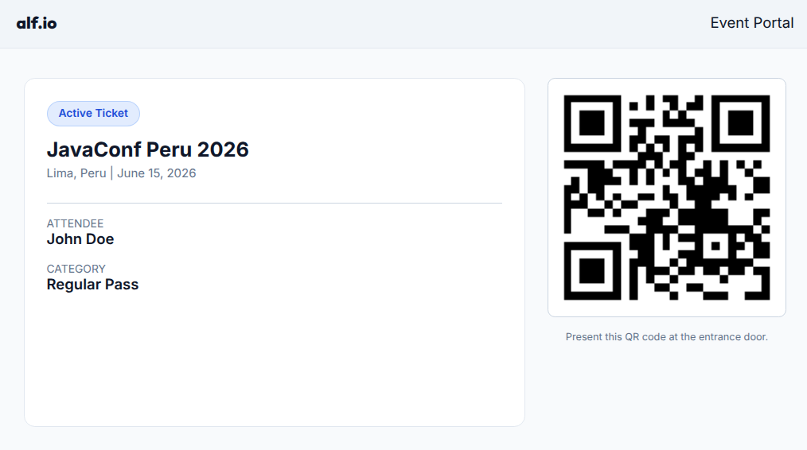
         
        El botón de auto-check-in está ausente en la interfaz del ticket del asistente.
      </td>
    </tr>
  </tbody>
</table>

**CPF-16-002**
<table>
  <thead>
    <tr>
      <th>ID</th>
      <th>Descripción</th>
      <th>Tipo</th>
      <th>Estado</th>
      <th>Defectos</th>
    </tr>
  </thead>
  <tbody>
    <tr>
      <td>CPF-16-002</td>
      <td>Verificar que el botón de auto-check-in se muestre bloqueado/inactivo si la reserva está con pago pendiente.</td>
      <td>Manual</td>
      <td>Exitoso</td>
      <td>No se encontraron defectos</td>
    </tr>
    <tr>
      <th colspan="2">Resultado esperado</th>
      <th colspan="3">Resultado obtenido</th>
    </tr>
    <tr>
      <td colspan="2">El botón se muestra inactivo o bloqueado</td>
      <td colspan="3">Acción bloqueada y botón inactivo con advertencia de pago pendiente.</td>
    </tr>
    <tr>
      <th colspan="5">Evidencia</th>
    </tr>
    <tr>
      <td colspan="5">
        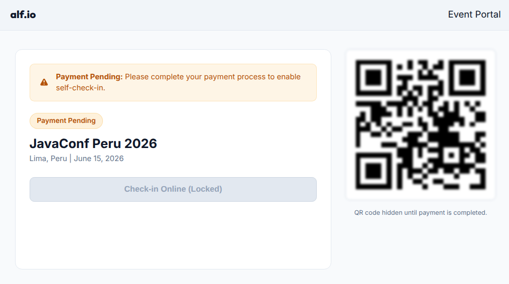
         
        Botón de check-in bloqueado debido al estado de pago pendiente de la reserva.
      </td>
    </tr>
  </tbody>
</table>

**CPF-16-003**
<table>
  <thead>
    <tr>
      <th>ID</th>
      <th>Descripción</th>
      <th>Tipo</th>
      <th>Estado</th>
      <th>Defectos</th>
    </tr>
  </thead>
  <tbody>
    <tr>
      <td>CPF-16-003</td>
      <td>Verificar comportamiento de auto-check-in fuera de la ventana de tiempo del evento (antes del horario de apertura).</td>
      <td>Manual</td>
      <td>Exitoso</td>
      <td>No se encontraron defectos</td>
    </tr>
    <tr>
      <th colspan="2">Resultado esperado</th>
      <th colspan="3">Resultado obtenido</th>
    </tr>
    <tr>
      <td colspan="2">El botón permanece deshabilitado o muestra un aviso con la hora exacta de habilitación.</td>
      <td colspan="3">Botón inactivo con mensaje emergente de horario no disponible.</td>
    </tr>
    <tr>
      <th colspan="5">Evidencia</th>
    </tr>
    <tr>
      <td colspan="5">
        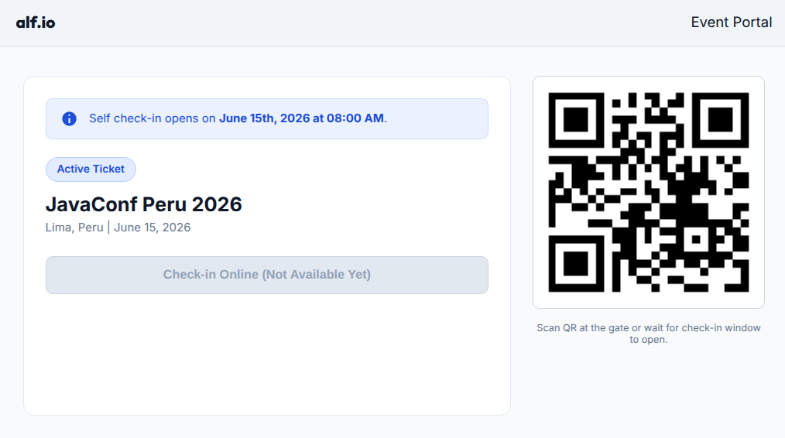
         
        El sistema bloquea la acción indicando que la ventana de check-in no ha iniciado.
      </td>
    </tr>
  </tbody>
</table>

**CPF-16-004**
<table>
  <thead>
    <tr>
      <th>ID</th>
      <th>Descripción</th>
      <th>Tipo</th>
      <th>Estado</th>
      <th>Defectos</th>
    </tr>
  </thead>
  <tbody>
    <tr>
      <td>CPF-16-004</td>
      <td>Verificar el portal del usuario cuando el ticket ya ha sido registrado como "Ingresado/Checked-in".</td>
      <td>Manual</td>
      <td>Exitoso</td>
      <td>No se encontraron defectos</td>
    </tr>
    <tr>
      <th colspan="2">Resultado esperado</th>
      <th colspan="3">Resultado obtenido</th>
    </tr>
    <tr>
      <td colspan="2">El botón se oculta o cambia a estado "Ingresado"</td>
      <td colspan="3">Estado de ticket marcado como "Ingresado" y botón de auto-check-in oculto.</td>
    </tr>
    <tr>
      <th colspan="5">Evidencia</th>
    </tr>
    <tr>
      <td colspan="5">
        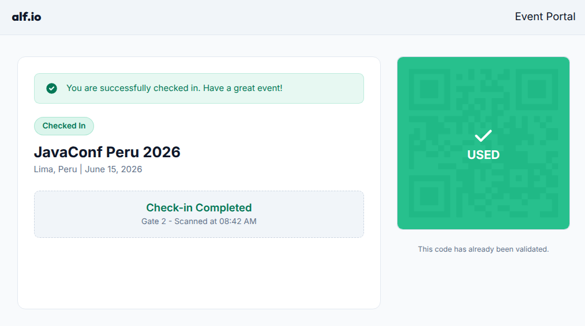
         
        El ticket se visualiza con la insignia digital de "Ingresado" en el portal del asistente.
      </td>
    </tr>
  </tbody>
</table>

**CPF-16-005**
<table>
  <thead>
    <tr>
      <th>ID</th>
      <th>Descripción</th>
      <th>Tipo</th>
      <th>Estado</th>
      <th>Defectos</th>
    </tr>
  </thead>
  <tbody>
    <tr>
      <td>CPF-16-005</td>
      <td>Verificar el flujo completo de auto-check-in exitoso en condiciones normales (pagado, dentro del horario y activo).</td>
      <td>Manual</td>
      <td>Exitoso</td>
      <td>No se encontraron defectos</td>
    </tr>
    <tr>
      <th colspan="2">Resultado esperado</th>
      <th colspan="3">Resultado obtenido</th>
    </tr>
    <tr>
      <td colspan="2">Botón visible y funcional; al hacer clic cambia el estado a "Checked-In"</td>
      <td colspan="3">Check-in completado exitosamente y estado actualizado a "Checked-In".</td>
    </tr>
    <tr>
      <th colspan="5">Evidencia</th>
    </tr>
    <tr>
      <td colspan="5">
        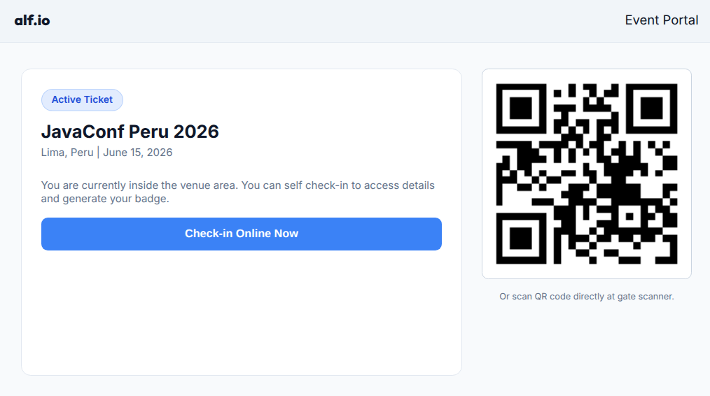
         
        Confirmación visual de auto-check-in exitoso y actualización de estado en tiempo real.
      </td>
    </tr>
  </tbody>
</table>

### Validación de QR (Escaneo de Ticket en Puerta)

**CPF-17-001**
<table>
  <thead>
    <tr>
      <th>ID</th>
      <th>Descripción</th>
      <th>Tipo</th>
      <th>Estado</th>
      <th>Defectos</th>
    </tr>
  </thead>
  <tbody>
    <tr>
      <td>CPF-17-001</td>
      <td>Simular escaneo de un código QR inválido o que no existe en la base de datos del evento.</td>
      <td>Manual</td>
      <td>Exitoso</td>
      <td>No se encontraron defectos</td>
    </tr>
    <tr>
      <th colspan="2">Resultado esperado</th>
      <th colspan="3">Resultado obtenido</th>
    </tr>
    <tr>
      <td colspan="2">Pantalla roja indicando: "Ticket no encontrado"</td>
      <td colspan="3">No redirige al flujo del evento.</td>
    </tr>
    <tr>
      <th colspan="5">Evidencia</th>
    </tr>
    <tr>
      <td colspan="5">
        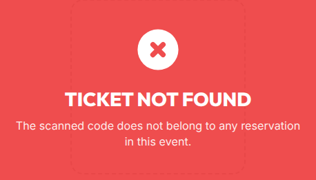
         
        No se muestra la interfaz de check-in.
      </td>
    </tr>
  </tbody>
</table>

**CPF-17-002**
<table>
  <thead>
    <tr>
      <th>ID</th>
      <th>Descripción</th>
      <th>Tipo</th>
      <th>Estado</th>
      <th>Defectos</th>
    </tr>
  </thead>
  <tbody>
    <tr>
      <td>CPF-17-002</td>
      <td>Simular escaneo de un código QR correspondiente a un ticket cancelado previamente.</td>
      <td>Manual</td>
      <td>Exitoso</td>
      <td>No se encontraron defectos</td>
    </tr>
    <tr>
      <th colspan="2">Resultado esperado</th>
      <th colspan="3">Resultado obtenido</th>
    </tr>
    <tr>
      <td colspan="2">Pantalla roja indicando: "Acceso denegado - Ticket Cancelado"</td>
      <td colspan="3">Denegación visual por estado del ticket configurado como cancelado.</td>
    </tr>
    <tr>
      <th colspan="5">Evidencia</th>
    </tr>
    <tr>
      <td colspan="5">
        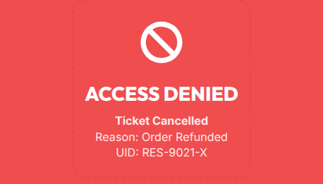
         
        Pantalla del lector bloquea el acceso informando que el ticket está marcado como cancelado.
      </td>
    </tr>
  </tbody>
</table>

**CPF-17-003**
<table>
  <thead>
    <tr>
      <th>ID</th>
      <th>Descripción</th>
      <th>Tipo</th>
      <th>Estado</th>
      <th>Defectos</th>
    </tr>
  </thead>
  <tbody>
    <tr>
      <td>CPF-17-003</td>
      <td>Simular escaneo de un ticket que ya fue ingresado con anterioridad (control de doble acceso).</td>
      <td>Manual</td>
      <td>Exitoso</td>
      <td>No se encontraron defectos</td>
    </tr>
    <tr>
      <th colspan="2">Resultado esperado</th>
      <th colspan="3">Resultado obtenido</th>
    </tr>
    <tr>
      <td colspan="2">Pantalla amarilla indicando: "Alerta - Ticket duplicado" (con fecha/hora del 1er ingreso)</td>
      <td colspan="3">Lector muestra advertencia amarilla de doble check-in con historial de hora de entrada.</td>
    </tr>
    <tr>
      <th colspan="5">Evidencia</th>
    </tr>
    <tr>
      <td colspan="5">
        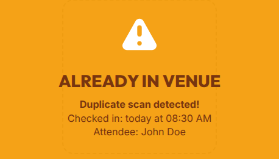
         
        Pantalla del terminal del operario alertando sobre un segundo intento de entrada del mismo QR.
      </td>
    </tr>
  </tbody>
</table>

**CPF-17-004**
<table>
  <thead>
    <tr>
      <th>ID</th>
      <th>Descripción</th>
      <th>Tipo</th>
      <th>Estado</th>
      <th>Defectos</th>
    </tr>
  </thead>
  <tbody>
    <tr>
      <td>CPF-17-004</td>
      <td>Simular escaneo exitoso en puerta de un ticket válido sin ingresos previos.</td>
      <td>Manual</td>
      <td>Exitoso</td>
      <td>No se encontraron defectos</td>
    </tr>
    <tr>
      <th colspan="2">Resultado esperado</th>
      <th colspan="3">Resultado obtenido</th>
    </tr>
    <tr>
      <td colspan="2">Pantalla verde indicando: "Acceso Permitido" y registra el ingreso</td>
      <td colspan="3">Acceso autorizado en color verde y registro exitoso del check-in.</td>
    </tr>
    <tr>
      <th colspan="5">Evidencia</th>
    </tr>
    <tr>
      <td colspan="5">
        
         
        El terminal del lector aprueba el acceso satisfactoriamente en color verde con los datos del asistente.
      </td>
    </tr>
  </tbody>
</table>

### Generación de Acreditaciones (Badges)

**CPF-18-001**
<table>
  <thead>
    <tr>
      <th>ID</th>
      <th>Descripción</th>
      <th>Tipo</th>
      <th>Estado</th>
      <th>Defectos</th>
    </tr>
  </thead>
  <tbody>
    <tr>
      <td>CPF-18-001</td>
      <td>Verificar que no esté disponible la descarga del badge para categorías de ticket sin derecho a carnet físico.</td>
      <td>Manual</td>
      <td>Exitoso</td>
      <td>No se encontraron defectos</td>
    </tr>
    <tr>
      <th colspan="2">Resultado esperado</th>
      <th colspan="3">Resultado obtenido</th>
    </tr>
    <tr>
      <td colspan="2">El botón o enlace de descarga de badge no está visible</td>
      <td colspan="3">Botón ausente según las reglas aplicadas en la categoría de entrada.</td>
    </tr>
    <tr>
      <th colspan="5">Evidencia</th>
    </tr>
    <tr>
      <td colspan="5">
        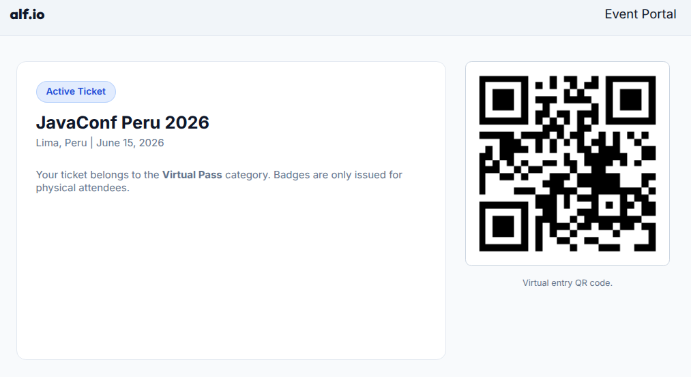
         
        Enlace de badge invisible para la categoría de entrada digital sin carnet físico.
      </td>
    </tr>
  </tbody>
</table>

**CPF-18-002**
<table>
  <thead>
    <tr>
      <th>ID</th>
      <th>Descripción</th>
      <th>Tipo</th>
      <th>Estado</th>
      <th>Defectos</th>
    </tr>
  </thead>
  <tbody>
    <tr>
      <td>CPF-18-002</td>
      <td>Verificar que se restrinja la impresión de badges si la reserva tiene estado pendiente de pago.</td>
      <td>Manual</td>
      <td>Exitoso</td>
      <td>No se encontraron defectos</td>
    </tr>
    <tr>
      <th colspan="2">Resultado esperado</th>
      <th colspan="3">Resultado obtenido</th>
    </tr>
    <tr>
      <td colspan="2">Se muestra un aviso indicando que requiere pago completo para emitir</td>
      <td colspan="3">Opción de descarga bloqueada con mensaje de restricción de pago.</td>
    </tr>
    <tr>
      <th colspan="5">Evidencia</th>
    </tr>
    <tr>
      <td colspan="5">
        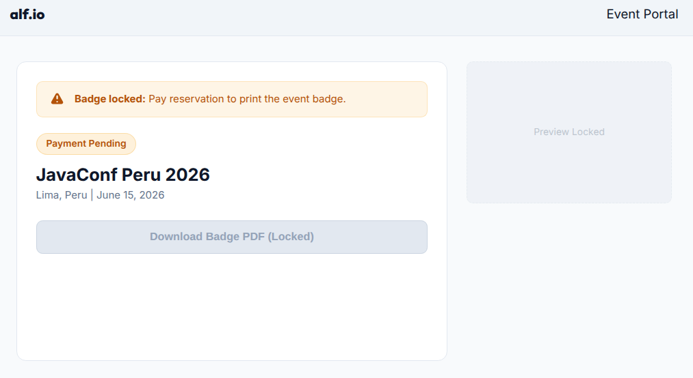
         
        La interfaz de control de acceso deshabilita la generación de credenciales por pago no liquidado.
      </td>
    </tr>
  </tbody>
</table>

**CPF-18-003**
<table>
  <thead>
    <tr>
      <th>ID</th>
      <th>Descripción</th>
      <th>Tipo</th>
      <th>Estado</th>
      <th>Defectos</th>
    </tr>
  </thead>
  <tbody>
    <tr>
      <td>CPF-18-003</td>
      <td>Verificar la descarga anticipada de la credencial en un evento que no requiere check-in físico previo para emitirla.</td>
      <td>Manual</td>
      <td>Exitoso</td>
      <td>No se encontraron defectos</td>
    </tr>
    <tr>
      <th colspan="2">Resultado esperado</th>
      <th colspan="3">Resultado obtenido</th>
    </tr>
    <tr>
      <td colspan="2">El botón es visible y permite descargar el PDF del badge antes del evento</td>
      <td colspan="3">Descarga de PDF habilitada de forma anticipada sin marcar ingreso.</td>
    </tr>
    <tr>
      <th colspan="5">Evidencia</th>
    </tr>
    <tr>
      <td colspan="5">
        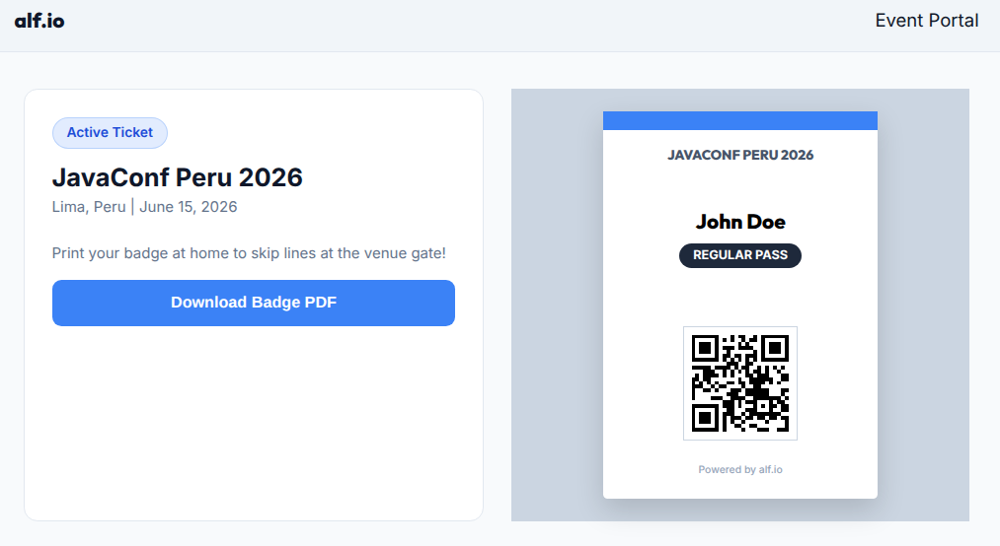
         
        Descarga exitosa de la credencial en PDF previa a la realización del ingreso físico.
      </td>
    </tr>
  </tbody>
</table>

**CPF-18-004**
<table>
  <thead>
    <tr>
      <th>ID</th>
      <th>Descripción</th>
      <th>Tipo</th>
      <th>Estado</th>
      <th>Defectos</th>
    </tr>
  </thead>
  <tbody>
    <tr>
      <td>CPF-18-004</td>
      <td>Verificar que no se permita la descarga del badge si el evento requiere check-in previo y el asistente aún no ha ingresado.</td>
      <td>Manual</td>
      <td>Exitoso</td>
      <td>No se encontraron defectos</td>
    </tr>
    <tr>
      <th colspan="2">Resultado esperado</th>
      <th colspan="3">Resultado obtenido</th>
    </tr>
    <tr>
      <td colspan="2">El botón de badge permanece inactivo o ausente en el portal del usuario</td>
      <td colspan="3">Botón de badge inactivo o ausente en el portal del usuario.</td>
    </tr>
    <tr>
      <th colspan="5">Evidencia</th>
    </tr>
    <tr>
      <td colspan="5">
        
         
        Botón de descarga de badge no disponible cuando el check-in previo es obligatorio y no se ha realizado.
      </td>
    </tr>
  </tbody>
</table>

**CPF-18-005**
<table>
  <thead>
    <tr>
      <th>ID</th>
      <th>Descripción</th>
      <th>Tipo</th>
      <th>Estado</th>
      <th>Defectos</th>
    </tr>
  </thead>
  <tbody>
    <tr>
      <td>CPF-18-005</td>
      <td>Verificar generación y descarga del badge una vez cumplidas todas las condiciones lógicas.</td>
      <td>Manual</td>
      <td>Exitoso</td>
      <td>No se encontraron defectos</td>
    </tr>
    <tr>
      <th colspan="2">Resultado esperado</th>
      <th colspan="3">Resultado obtenido</th>
    </tr>
    <tr>
      <td colspan="2">El botón se activa en el panel de puerta/usuario y descarga el PDF generado</td>
      <td colspan="3">Documento PDF descargado correctamente con maquetación oficial e información verídica.</td>
    </tr>
    <tr>
      <th colspan="5">Evidencia</th>
    </tr>
    <tr>
      <td colspan="5">
        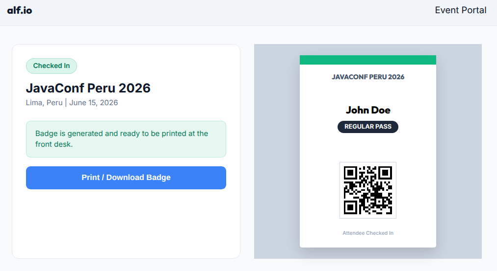
         
        Vista de la credencial del asistente en el visor de PDF lista para imprimirse físicamente.
      </td>
    </tr>
  </tbody>
</table>

### Configuración de la Organización (CONF-09)

**CPF-09-001**
<table>
  <thead>
    <tr>
      <th>ID</th>
      <th>Descripción</th>
      <th>Tipo</th>
      <th>Estado</th>
      <th>Defectos</th>
    </tr>
  </thead>
  <tbody>
    <tr>
      <td>CPF-09-001</td>
      <td>Crear organización con datos válidos.</td>
      <td>Manual</td>
      <td>Exitoso</td>
      <td>No se encontraron defectos</td>
    </tr>
    <tr>
      <th colspan="2">Resultado esperado</th>
      <th colspan="3">Resultado obtenido</th>
    </tr>
    <tr>
      <td colspan="2"></td>
      <td colspan="3">La organización se crea y aparece en la lista de administración.</td>
    </tr>
    <tr>
      <th colspan="5">Evidencia</th>
    </tr>
    <tr>
      <td colspan="5">
        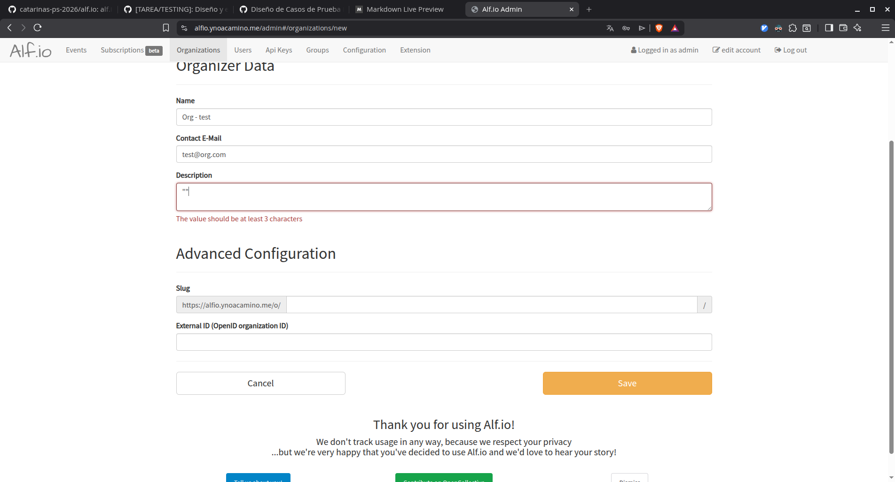 
        
      </td>
    </tr>
  </tbody>
</table>

**CPF-09-002**
<table>
  <thead>
    <tr>
      <th>ID</th>
      <th>Descripción</th>
      <th>Tipo</th>
      <th>Estado</th>
      <th>Defectos</th>
    </tr>
  </thead>
  <tbody>
    <tr>
      <td>CPF-09-002</td>
      <td>Intentar crear organización con nombre vacío.</td>
      <td>Manual</td>
      <td>Exitoso</td>
      <td>No se encontraron defectos</td>
    </tr>
    <tr>
      <th colspan="2">Resultado esperado</th>
      <th colspan="3">Resultado obtenido</th>
    </tr>
    <tr>
      <td colspan="2"></td>
      <td colspan="3">El sistema previene el envío y resalta el campo vacío.</td>
    </tr>
    <tr>
      <th colspan="5">Evidencia</th>
    </tr>
    <tr>
      <td colspan="5">
        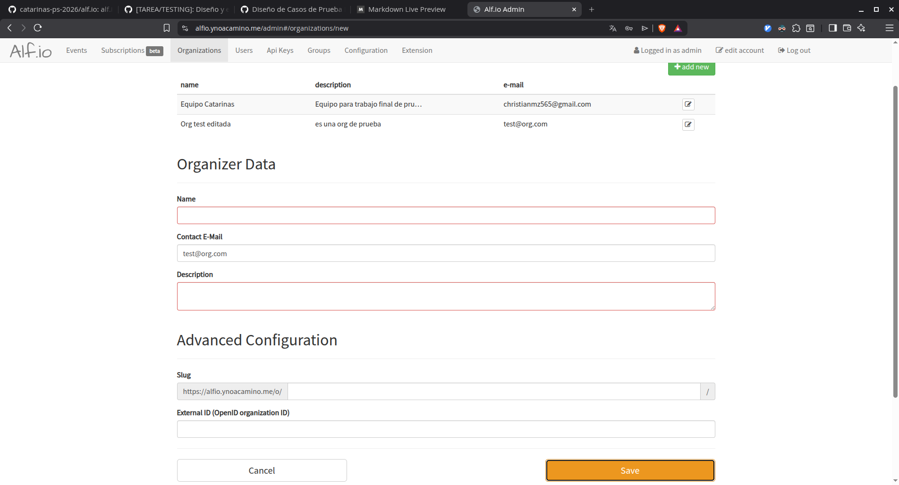
         
        Validación del frontend al intentar omitir el nombre.
      </td>
    </tr>
  </tbody>
</table>

**CPF-09-003**
<table>
  <thead>
    <tr>
      <th>ID</th>
      <th>Descripción</th>
      <th>Tipo</th>
      <th>Estado</th>
      <th>Defectos</th>
    </tr>
  </thead>
  <tbody>
    <tr>
      <td>CPF-09-003</td>
      <td>Intentar crear organización con email de formato inválido.</td>
      <td>Manual</td>
      <td>Exitoso</td>
      <td>No se encontraron defectos</td>
    </tr>
    <tr>
      <th colspan="2">Resultado esperado</th>
      <th colspan="3">Resultado obtenido</th>
    </tr>
    <tr>
      <td colspan="2"></td>
      <td colspan="3">El sistema muestra mensaje de error de correo inválido.</td>
    </tr>
    <tr>
      <th colspan="5">Evidencia</th>
    </tr>
    <tr>
      <td colspan="5">
        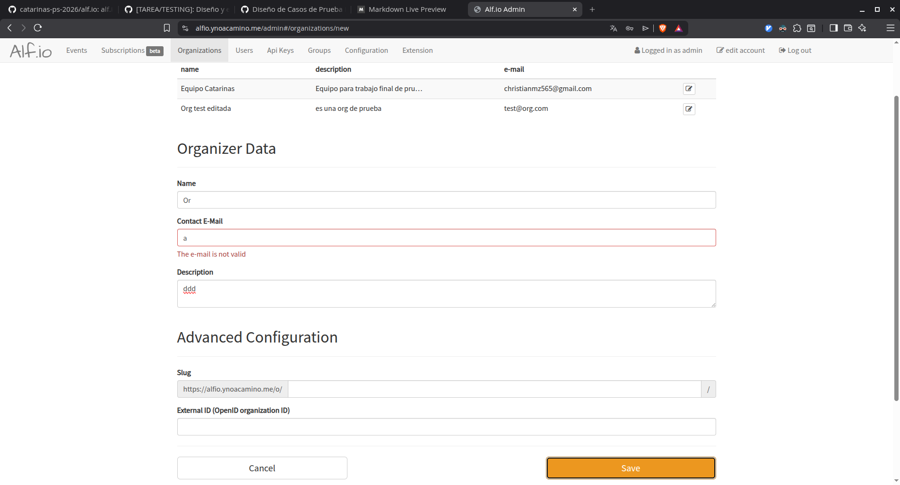
         
        Validación del formato del correo electrónico.
      </td>
    </tr>
  </tbody>
</table>

**CPF-09-004**
<table>
  <thead>
    <tr>
      <th>ID</th>
      <th>Descripción</th>
      <th>Tipo</th>
      <th>Estado</th>
      <th>Defectos</th>
    </tr>
  </thead>
  <tbody>
    <tr>
      <td>CPF-09-004</td>
      <td>Crear organización con nombre de 255 caracteres.</td>
      <td>Manual</td>
      <td>Exitoso</td>
      <td>No se encontraron defectos</td>
    </tr>
    <tr>
      <th colspan="2">Resultado esperado</th>
      <th colspan="3">Resultado obtenido</th>
    </tr>
    <tr>
      <td colspan="2"></td>
      <td colspan="3">Se guarda el nombre y se muestra completo en la vista.</td>
    </tr>
    <tr>
      <th colspan="5">Evidencia</th>
    </tr>
    <tr>
      <td colspan="5">
        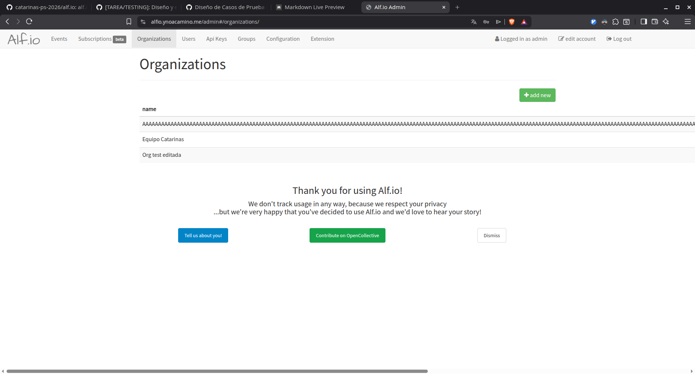 
        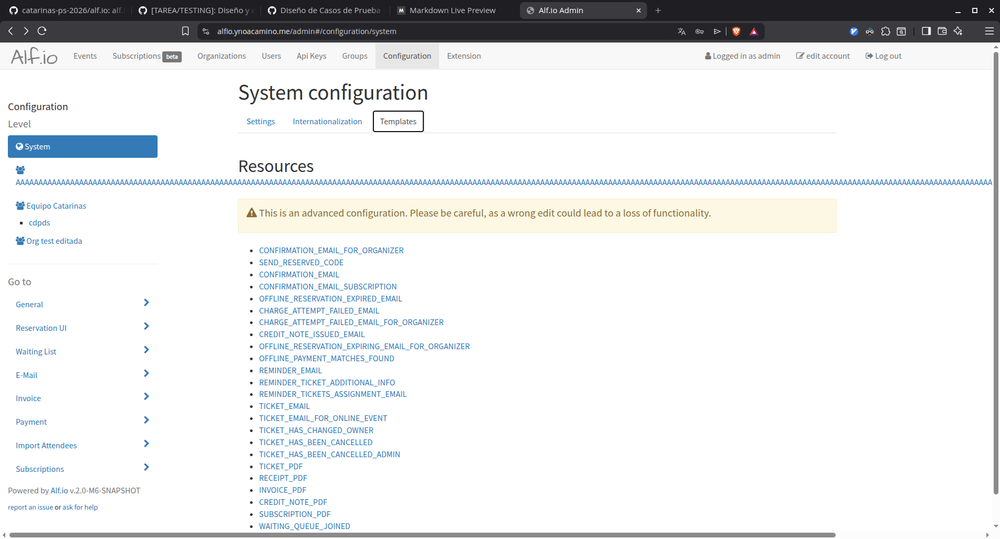
      </td>
    </tr>
  </tbody>
</table>

**CPF-09-005**
<table>
  <thead>
    <tr>
      <th>ID</th>
      <th>Descripción</th>
      <th>Tipo</th>
      <th>Estado</th>
      <th>Defectos</th>
    </tr>
  </thead>
  <tbody>
    <tr>
      <td>CPF-09-005</td>
      <td>Editar los datos de una organización existente.</td>
      <td>Manual</td>
      <td>Exitoso</td>
      <td>No se encontraron defectos</td>
    </tr>
    <tr>
      <th colspan="2">Resultado esperado</th>
      <th colspan="3">Resultado obtenido</th>
    </tr>
    <tr>
      <td colspan="2"></td>
      <td colspan="3">Los cambios se aplican y persisten en la base de datos.</td>
    </tr>
    <tr>
      <th colspan="5">Evidencia</th>
    </tr>
    <tr>
      <td colspan="5">
        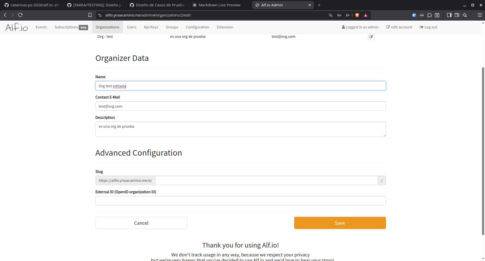 
        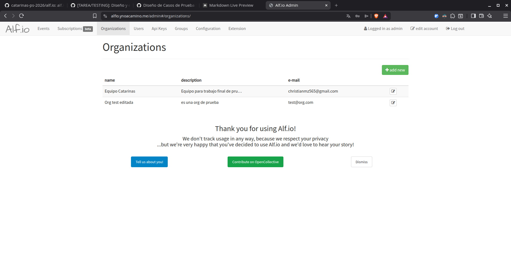
      </td>
    </tr>
  </tbody>
</table>

**CPF-09-006**
<table>
  <thead>
    <tr>
      <th>ID</th>
      <th>Descripción</th>
      <th>Tipo</th>
      <th>Estado</th>
      <th>Defectos</th>
    </tr>
  </thead>
  <tbody>
    <tr>
      <td>CPF-09-006</td>
      <td>Crear organización con nombre de 256 caracteres.</td>
      <td>Manual</td>
      <td>Fallido</td>
      <td>SQL error message exposure</td>
    </tr>
    <tr>
      <th colspan="2">Resultado esperado</th>
      <th colspan="3">Resultado obtenido</th>
    </tr>
    <tr>
      <td colspan="2"></td>
      <td colspan="3">El sistema lanza un error 500 exponiendo la excepción SQL cruda de base de datos.</td>
    </tr>
    <tr>
      <th colspan="5">Evidencia</th>
    </tr>
    <tr>
      <td colspan="5">
        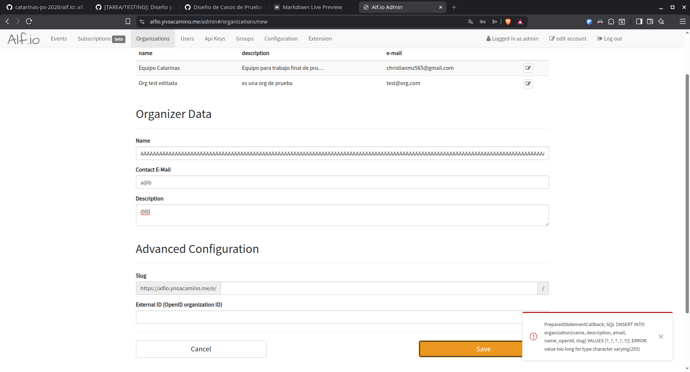
         
        Error 500 expone información sensible de base de datos (SQL).
      </td>
    </tr>
  </tbody>
</table>

### Configuración del Evento (CONF-10)

**CPF-10-001**
<table>
  <thead>
    <tr>
      <th>ID</th>
      <th>Descripción</th>
      <th>Tipo</th>
      <th>Estado</th>
      <th>Defectos</th>
    </tr>
  </thead>
  <tbody>
    <tr>
      <td>CPF-10-001</td>
      <td>Configurar fechas del evento con el date picker.</td>
      <td>Manual</td>
      <td>Fallido</td>
      <td>date picker scroll bug</td>
    </tr>
    <tr>
      <th colspan="2">Resultado esperado</th>
      <th colspan="3">Resultado obtenido</th>
    </tr>
    <tr>
      <td colspan="2"></td>
      <td colspan="3">El widget del date picker tiene un problema de scroll que dificulta su uso.</td>
    </tr>
    <tr>
      <th colspan="5">Evidencia</th>
    </tr>
    <tr>
      <td colspan="5">
        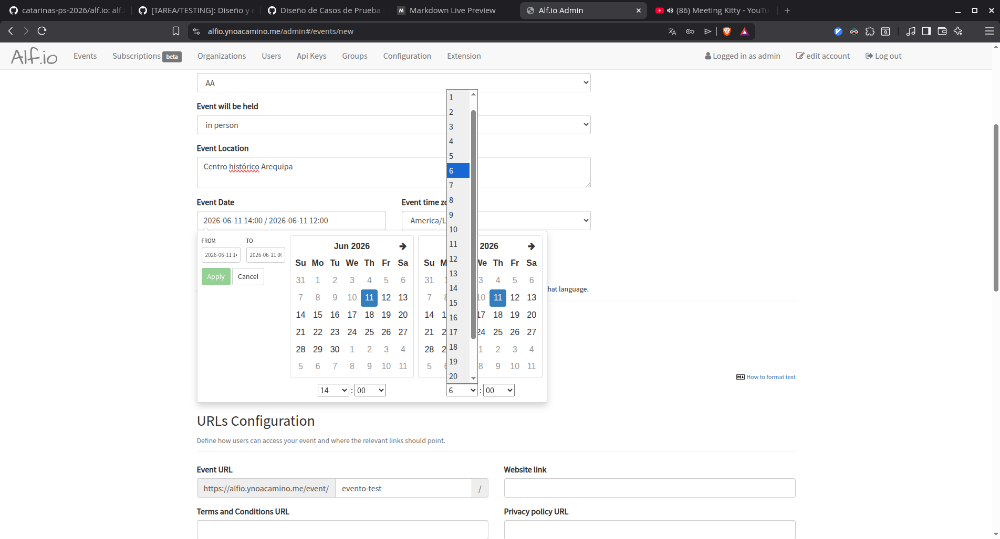
         
        Bug de scroll visualizado al abrir el selector de fechas.
      </td>
    </tr>
  </tbody>
</table>

**CPF-10-002**
<table>
  <thead>
    <tr>
      <th>ID</th>
      <th>Descripción</th>
      <th>Tipo</th>
      <th>Estado</th>
      <th>Defectos</th>
    </tr>
  </thead>
  <tbody>
    <tr>
      <td>CPF-10-002</td>
      <td>Configurar fecha de inicio del evento en el pasado.</td>
      <td>Manual</td>
      <td>Exitoso</td>
      <td>No se encontraron defectos</td>
    </tr>
    <tr>
      <th colspan="2">Resultado esperado</th>
      <th colspan="3">Resultado obtenido</th>
    </tr>
    <tr>
      <td colspan="2"></td>
      <td colspan="3">El sistema permite seleccionar la fecha pasada en el campo de entrada.</td>
    </tr>
    <tr>
      <th colspan="5">Evidencia</th>
    </tr>
    <tr>
      <td colspan="5">
        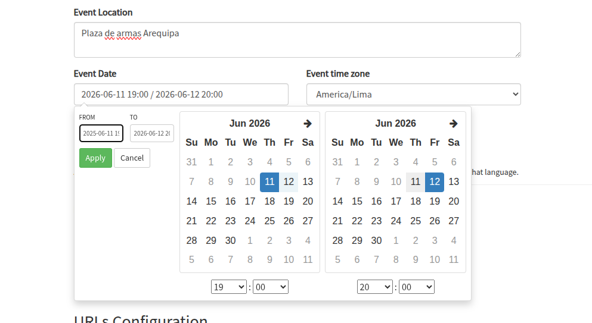
         
        Fecha de inicio en el pasado ingresada en el formulario de configuración.
      </td>
    </tr>
  </tbody>
</table>

**CPF-10-003**
<table>
  <thead>
    <tr>
      <th>ID</th>
      <th>Descripción</th>
      <th>Tipo</th>
      <th>Estado</th>
      <th>Defectos</th>
    </tr>
  </thead>
  <tbody>
    <tr>
      <td>CPF-10-003</td>
      <td>Validar error al guardar evento con fecha de inicio en el pasado.</td>
      <td>Manual</td>
      <td>Exitoso</td>
      <td>No se encontraron defectos</td>
    </tr>
    <tr>
      <th colspan="2">Resultado esperado</th>
      <th colspan="3">Resultado obtenido</th>
    </tr>
    <tr>
      <td colspan="2"></td>
      <td colspan="3">El sistema muestra alerta de error indicando fecha inválida.</td>
    </tr>
    <tr>
      <th colspan="5">Evidencia</th>
    </tr>
    <tr>
      <td colspan="5">
        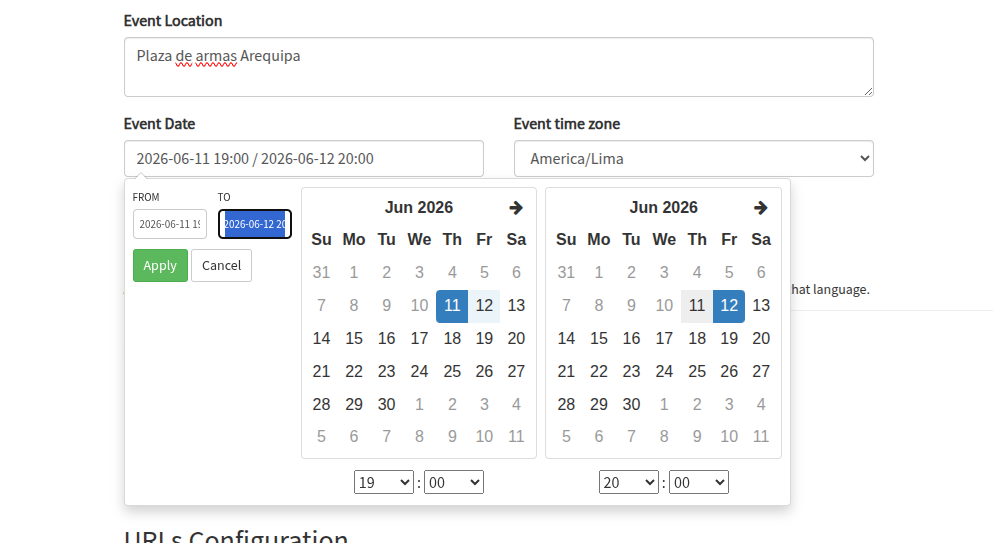
         
        Mensaje de error al intentar guardar un evento con fecha pasada.
      </td>
    </tr>
  </tbody>
</table>

**CPF-10-004**
<table>
  <thead>
    <tr>
      <th>ID</th>
      <th>Descripción</th>
      <th>Tipo</th>
      <th>Estado</th>
      <th>Defectos</th>
    </tr>
  </thead>
  <tbody>
    <tr>
      <td>CPF-10-004</td>
      <td>Validar configuración con fecha de inicio y fin idénticas.</td>
      <td>Manual</td>
      <td>Exitoso</td>
      <td>No se encontraron defectos</td>
    </tr>
    <tr>
      <th colspan="2">Resultado esperado</th>
      <th colspan="3">Resultado obtenido</th>
    </tr>
    <tr>
      <td colspan="2"></td>
      <td colspan="3">El sistema muestra error de validación impidiendo el guardado.</td>
    </tr>
    <tr>
      <th colspan="5">Evidencia</th>
    </tr>
    <tr>
      <td colspan="5">
        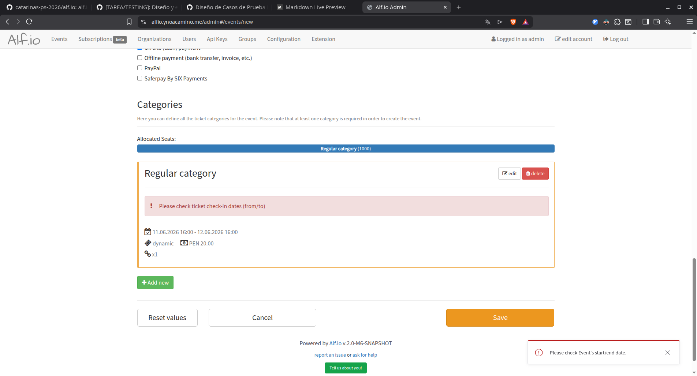
         
        Error mostrado cuando las fechas de inicio y fin coinciden exactamente.
      </td>
    </tr>
  </tbody>
</table>

**CPF-10-005**
<table>
  <thead>
    <tr>
      <th>ID</th>
      <th>Descripción</th>
      <th>Tipo</th>
      <th>Estado</th>
      <th>Defectos</th>
    </tr>
  </thead>
  <tbody>
    <tr>
      <td>CPF-10-005</td>
      <td>Configurar disponibilidad de categoría después de inicio del evento.</td>
      <td>Manual</td>
      <td>Exitoso</td>
      <td>No se encontraron defectos</td>
    </tr>
    <tr>
      <th colspan="2">Resultado esperado</th>
      <th colspan="3">Resultado obtenido</th>
    </tr>
    <tr>
      <td colspan="2"></td>
      <td colspan="3">El sistema procesa y guarda la disponibilidad de la categoría.</td>
    </tr>
    <tr>
      <th colspan="5">Evidencia</th>
    </tr>
    <tr>
      <td colspan="5">
        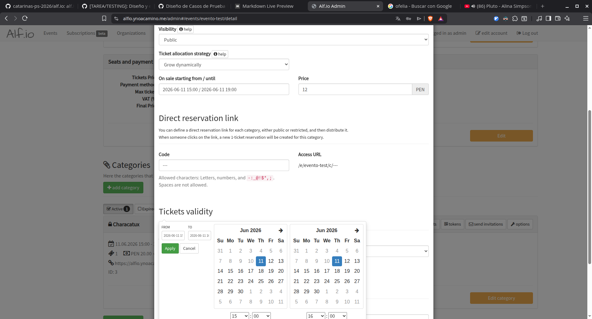
         
        Configuración guardada de tickets disponibles post-inicio del evento.
      </td>
    </tr>
  </tbody>
</table>

**CPF-10-006**
<table>
  <thead>
    <tr>
      <th>ID</th>
      <th>Descripción</th>
      <th>Tipo</th>
      <th>Estado</th>
      <th>Defectos</th>
    </tr>
  </thead>
  <tbody>
    <tr>
      <td>CPF-10-006</td>
      <td>Configurar fin de venta de categoría después del fin del evento.</td>
      <td>Manual</td>
      <td>Fallido</td>
      <td>silent save disable</td>
    </tr>
    <tr>
      <th colspan="2">Resultado esperado</th>
      <th colspan="3">Resultado obtenido</th>
    </tr>
    <tr>
      <td colspan="2"></td>
      <td colspan="3">El botón guardar se inhabilita silenciosamente sin indicar la causa.</td>
    </tr>
    <tr>
      <th colspan="5">Evidencia</th>
    </tr>
    <tr>
      <td colspan="5">
        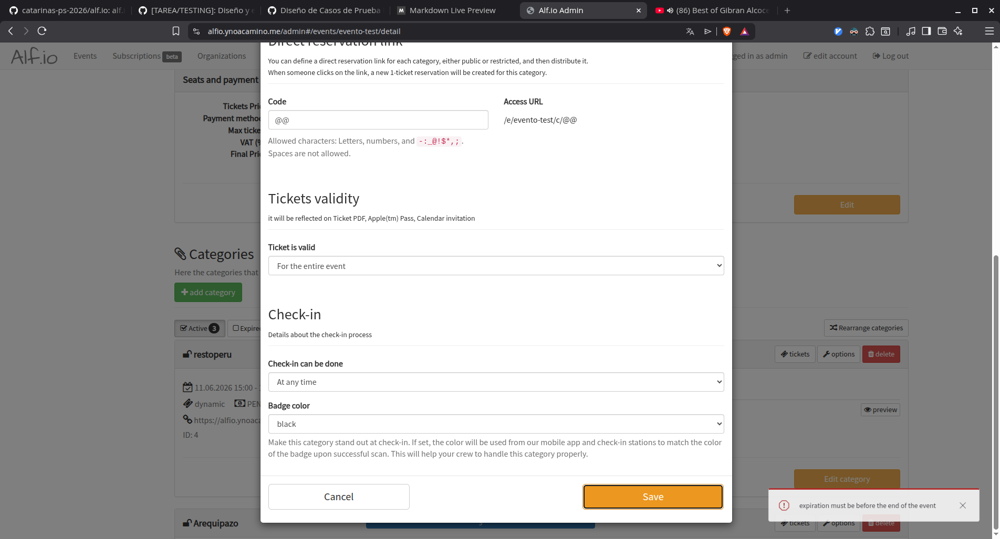
         
        Botón de guardado inactivo de forma silenciosa sin feedback de error.
      </td>
    </tr>
  </tbody>
</table>

**CPF-10-007**
<table>
  <thead>
    <tr>
      <th>ID</th>
      <th>Descripción</th>
      <th>Tipo</th>
      <th>Estado</th>
      <th>Defectos</th>
    </tr>
  </thead>
  <tbody>
    <tr>
      <td>CPF-10-007</td>
      <td>Configurar códigos ocultos duplicados en diferentes categorías.</td>
      <td>Manual</td>
      <td>Fallido</td>
      <td>duplicate hidden code</td>
    </tr>
    <tr>
      <th colspan="2">Resultado esperado</th>
      <th colspan="3">Resultado obtenido</th>
    </tr>
    <tr>
      <td colspan="2"></td>
      <td colspan="3">El sistema guarda el mismo código oculto en múltiples categorías.</td>
    </tr>
    <tr>
      <th colspan="5">Evidencia</th>
    </tr>
    <tr>
      <td colspan="5">
        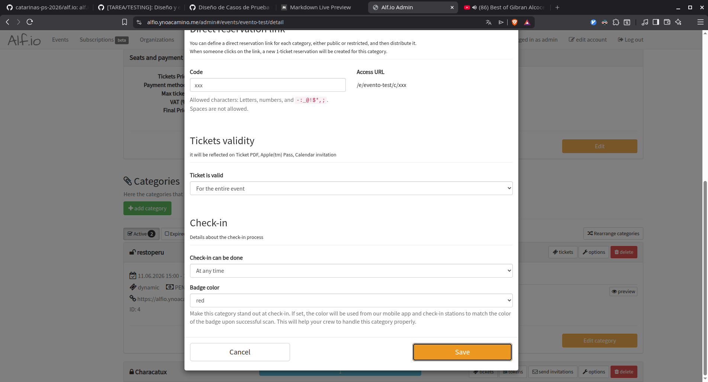
         
        Aceptación del mismo código de acceso duplicado en la configuración.
      </td>
    </tr>
  </tbody>
</table>

### Configuración de Categorías de Tickets (CONF-11)

**CPF-11-001**
<table>
  <thead>
    <tr>
      <th>ID</th>
      <th>Descripción</th>
      <th>Tipo</th>
      <th>Estado</th>
      <th>Defectos</th>
    </tr>
  </thead>
  <tbody>
    <tr>
      <td>CPF-11-001</td>
      <td>Modificar el precio de una categoría de ticket existente.</td>
      <td>Manual</td>
      <td>Exitoso</td>
      <td>No se encontraron defectos</td>
    </tr>
    <tr>
      <th colspan="2">Resultado esperado</th>
      <th colspan="3">Resultado obtenido</th>
    </tr>
    <tr>
      <td colspan="2"></td>
      <td colspan="3">El precio se modifica y se confirma el cambio exitosamente.</td>
    </tr>
    <tr>
      <th colspan="5">Evidencia</th>
    </tr>
    <tr>
      <td colspan="5">
        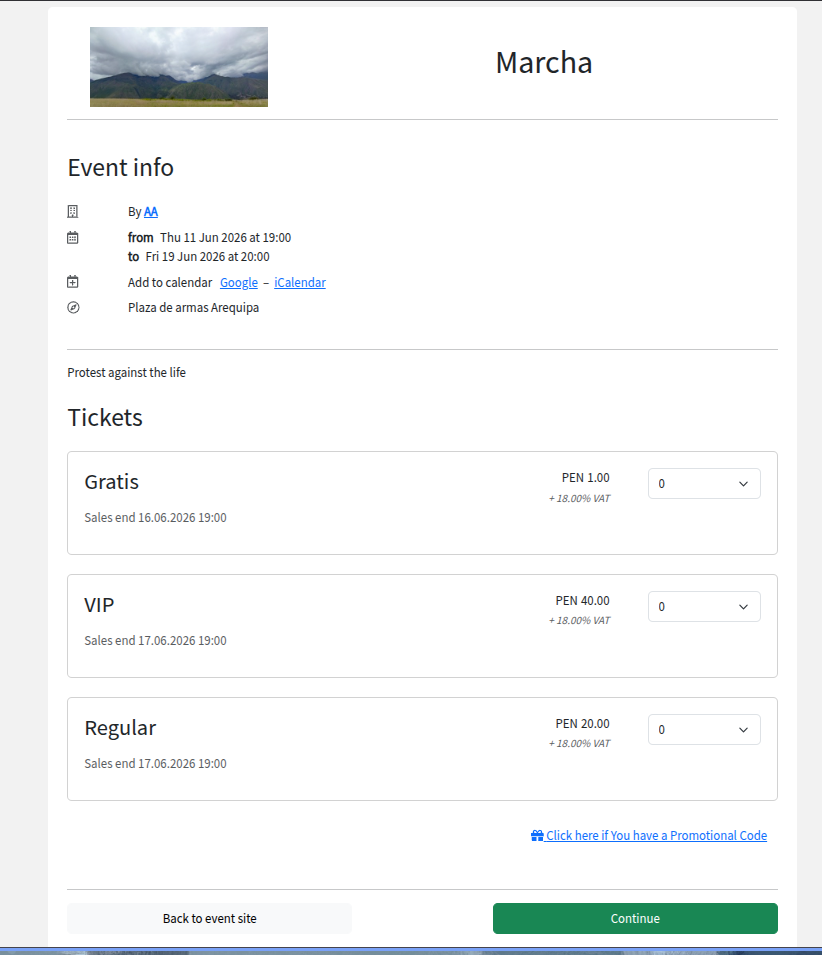 
        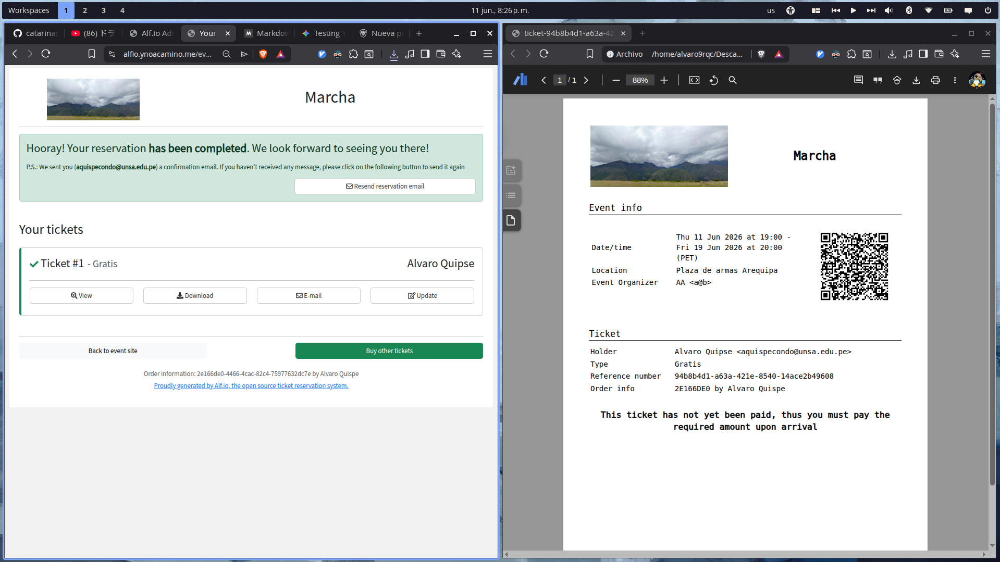
      </td>
    </tr>
  </tbody>
</table>

**CPF-11-002**
<table>
  <thead>
    <tr>
      <th>ID</th>
      <th>Descripción</th>
      <th>Tipo</th>
      <th>Estado</th>
      <th>Defectos</th>
    </tr>
  </thead>
  <tbody>
    <tr>
      <td>CPF-11-002</td>
      <td>Ingresar un precio negativo en una categoría de ticket.</td>
      <td>Manual</td>
      <td>Exitoso</td>
      <td>No se encontraron defectos</td>
    </tr>
    <tr>
      <th colspan="2">Resultado esperado</th>
      <th colspan="3">Resultado obtenido</th>
    </tr>
    <tr>
      <td colspan="2"></td>
      <td colspan="3">El sistema impide guardar y muestra error de formato numérico.</td>
    </tr>
    <tr>
      <th colspan="5">Evidencia</th>
    </tr>
    <tr>
      <td colspan="5">
        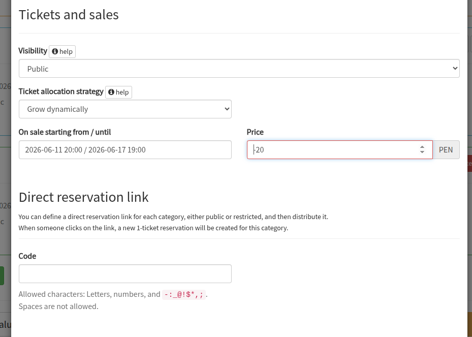
         
        Error del sistema al intentar guardar un precio negativo.
      </td>
    </tr>
  </tbody>
</table>

**CPF-11-003**
<table>
  <thead>
    <tr>
      <th>ID</th>
      <th>Descripción</th>
      <th>Tipo</th>
      <th>Estado</th>
      <th>Defectos</th>
    </tr>
  </thead>
  <tbody>
    <tr>
      <td>CPF-11-003</td>
      <td>Configurar una categoría de tickets gratuitos (precio cero).</td>
      <td>Manual</td>
      <td>Exitoso</td>
      <td>No se encontraron defectos</td>
    </tr>
    <tr>
      <th colspan="2">Resultado esperado</th>
      <th colspan="3">Resultado obtenido</th>
    </tr>
    <tr>
      <td colspan="2"></td>
      <td colspan="3">Se configura correctamente a precio 0.00 y se guarda.</td>
    </tr>
    <tr>
      <th colspan="5">Evidencia</th>
    </tr>
    <tr>
      <td colspan="5">
        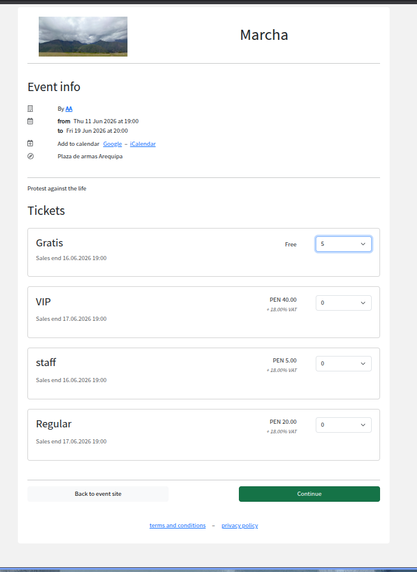 
        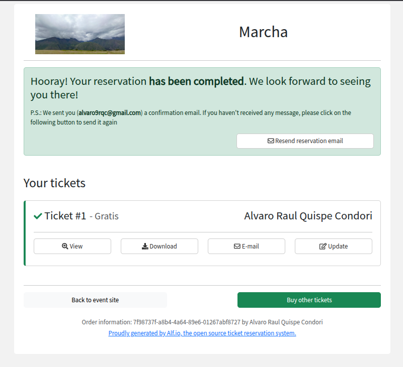
      </td>
    </tr>
  </tbody>
</table>

**CPF-11-004**
<table>
  <thead>
    <tr>
      <th>ID</th>
      <th>Descripción</th>
      <th>Tipo</th>
      <th>Estado</th>
      <th>Defectos</th>
    </tr>
  </thead>
  <tbody>
    <tr>
      <td>CPF-11-004</td>
      <td>Configurar categoría VIP con precio diferenciado.</td>
      <td>Manual</td>
      <td>Exitoso</td>
      <td>No se encontraron defectos</td>
    </tr>
    <tr>
      <th colspan="2">Resultado esperado</th>
      <th colspan="3">Resultado obtenido</th>
    </tr>
    <tr>
      <td colspan="2"></td>
      <td colspan="3">Categoría VIP creada correctamente en el panel.</td>
    </tr>
    <tr>
      <th colspan="5">Evidencia</th>
    </tr>
    <tr>
      <td colspan="5">
        
         
        Creación y visualización exitosa de la categoría VIP.
      </td>
    </tr>
  </tbody>
</table>

**CPF-11-005**
<table>
  <thead>
    <tr>
      <th>ID</th>
      <th>Descripción</th>
      <th>Tipo</th>
      <th>Estado</th>
      <th>Defectos</th>
    </tr>
  </thead>
  <tbody>
    <tr>
      <td>CPF-11-005</td>
      <td>Crear categoría oculta con código de acceso.</td>
      <td>Manual</td>
      <td>Exitoso</td>
      <td>No se encontraron defectos</td>
    </tr>
    <tr>
      <th colspan="2">Resultado esperado</th>
      <th colspan="3">Resultado obtenido</th>
    </tr>
    <tr>
      <td colspan="2"></td>
      <td colspan="3">Categoría configurada con el código de acceso correctamente.</td>
    </tr>
    <tr>
      <th colspan="5">Evidencia</th>
    </tr>
    <tr>
      <td colspan="5">
        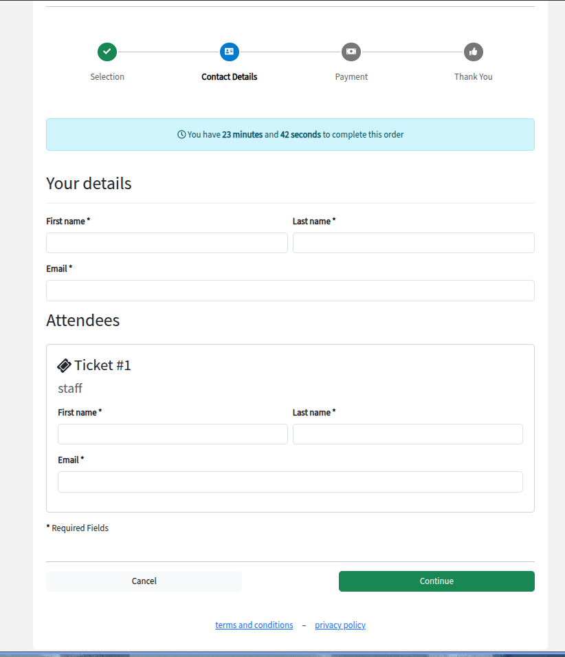
         
        Configuración del código de acceso para categoría oculta.
      </td>
    </tr>
  </tbody>
</table>

**CPF-11-006**
<table>
  <thead>
    <tr>
      <th>ID</th>
      <th>Descripción</th>
      <th>Tipo</th>
      <th>Estado</th>
      <th>Defectos</th>
    </tr>
  </thead>
  <tbody>
    <tr>
      <td>CPF-11-006</td>
      <td>Eliminar categoría oculta como administrador.</td>
      <td>Manual</td>
      <td>Exitoso</td>
      <td>No se encontraron defectos</td>
    </tr>
    <tr>
      <th colspan="2">Resultado esperado</th>
      <th colspan="3">Resultado obtenido</th>
    </tr>
    <tr>
      <td colspan="2"></td>
      <td colspan="3">La categoría se remueve exitosamente de la lista.</td>
    </tr>
    <tr>
      <th colspan="5">Evidencia</th>
    </tr>
    <tr>
      <td colspan="5">
        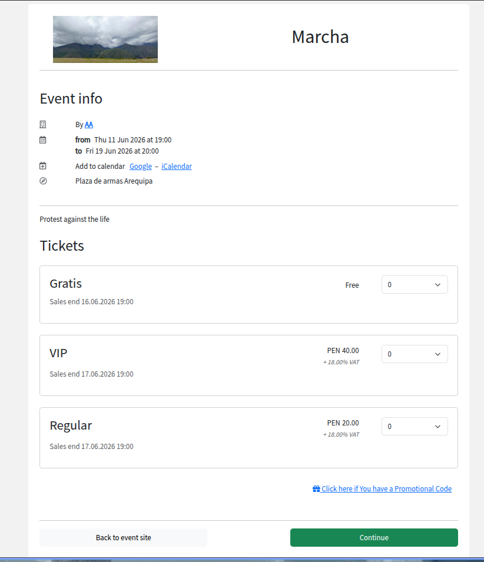
         
        Confirmación de eliminación de la categoría oculta en el panel.
      </td>
    </tr>
  </tbody>
</table>

### Gestión de Capacidad (CONF-12)

**CPF-12-001**
<table>
  <thead>
    <tr>
      <th>ID</th>
      <th>Descripción</th>
      <th>Tipo</th>
      <th>Estado</th>
      <th>Defectos</th>
    </tr>
  </thead>
  <tbody>
    <tr>
      <td>CPF-12-001</td>
      <td>Configurar categorías cuya capacidad supere el límite del evento.</td>
      <td>Manual</td>
      <td>Exitoso</td>
      <td>No se encontraron defectos</td>
    </tr>
    <tr>
      <th colspan="2">Resultado esperado</th>
      <th colspan="3">Resultado obtenido</th>
    </tr>
    <tr>
      <td colspan="2"></td>
      <td colspan="3">El sistema muestra error e impide exceder el total configurado.</td>
    </tr>
    <tr>
      <th colspan="5">Evidencia</th>
    </tr>
    <tr>
      <td colspan="5">
        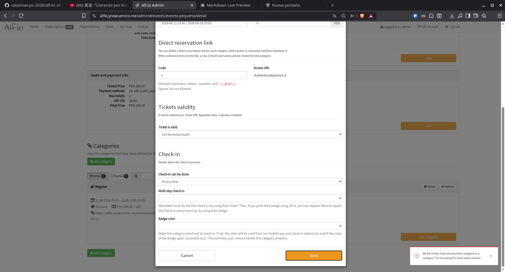
         
        Validación del límite de capacidad del evento al configurar categorías.
      </td>
    </tr>
  </tbody>
</table>

**CPF-12-002**
<table>
  <thead>
    <tr>
      <th>ID</th>
      <th>Descripción</th>
      <th>Tipo</th>
      <th>Estado</th>
      <th>Defectos</th>
    </tr>
  </thead>
  <tbody>
    <tr>
      <td>CPF-12-002</td>
      <td>Ingresar cantidad inválida o nula de tickets en una categoría.</td>
      <td>Manual</td>
      <td>Exitoso</td>
      <td>No se encontraron defectos</td>
    </tr>
    <tr>
      <th colspan="2">Resultado esperado</th>
      <th colspan="3">Resultado obtenido</th>
    </tr>
    <tr>
      <td colspan="2"></td>
      <td colspan="3">El sistema bloquea la acción y señala el campo incorrecto.</td>
    </tr>
    <tr>
      <th colspan="5">Evidencia</th>
    </tr>
    <tr>
      <td colspan="5">
        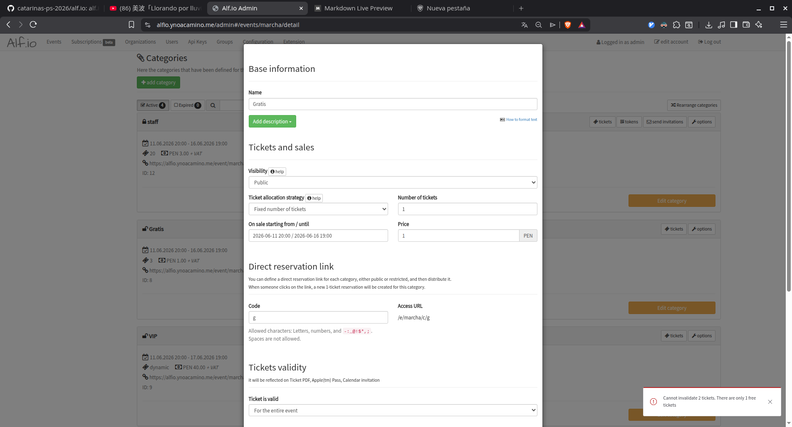
         
        Error mostrado ante cantidad de tickets inválida.
      </td>
    </tr>
  </tbody>
</table>

**CPF-12-003**
<table>
  <thead>
    <tr>
      <th>ID</th>
      <th>Descripción</th>
      <th>Tipo</th>
      <th>Estado</th>
      <th>Defectos</th>
    </tr>
  </thead>
  <tbody>
    <tr>
      <td>CPF-12-003</td>
      <td>Comprar el último ticket disponible de una categoría.</td>
      <td>Manual</td>
      <td>Exitoso</td>
      <td>No se encontraron defectos</td>
    </tr>
    <tr>
      <th colspan="2">Resultado esperado</th>
      <th colspan="3">Resultado obtenido</th>
    </tr>
    <tr>
      <td colspan="2"></td>
      <td colspan="3">Compra exitosa y actualización inmediata de la disponibilidad.</td>
    </tr>
    <tr>
      <th colspan="5">Evidencia</th>
    </tr>
    <tr>
      <td colspan="5">
        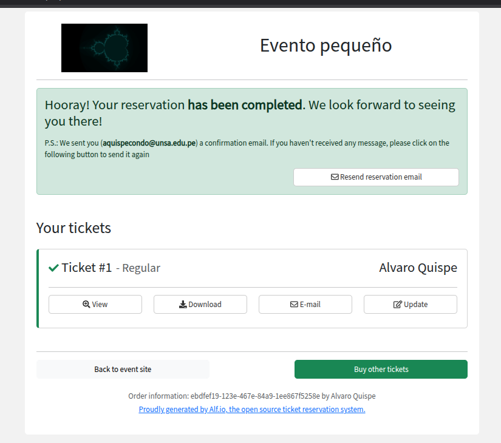
         
        Visualización de la compra exitosa del último ticket disponible.
      </td>
    </tr>
  </tbody>
</table>

**CPF-12-004**
<table>
  <thead>
    <tr>
      <th>ID</th>
      <th>Descripción</th>
      <th>Tipo</th>
      <th>Estado</th>
      <th>Defectos</th>
    </tr>
  </thead>
  <tbody>
    <tr>
      <td>CPF-12-004</td>
      <td>Comprar tickets respetando el límite máximo por transacción.</td>
      <td>Manual</td>
      <td>Exitoso</td>
      <td>No se encontraron defectos</td>
    </tr>
    <tr>
      <th colspan="2">Resultado esperado</th>
      <th colspan="3">Resultado obtenido</th>
    </tr>
    <tr>
      <td colspan="2"></td>
      <td colspan="3">Compra procesada exitosamente al respetar la cantidad permitida.</td>
    </tr>
    <tr>
      <th colspan="5">Evidencia</th>
    </tr>
    <tr>
      <td colspan="5">
        
         
        Compra exitosa de un ticket respetando la restricción de máximo dos.
      </td>
    </tr>
  </tbody>
</table>

**CPF-12-005**
<table>
  <thead>
    <tr>
      <th>ID</th>
      <th>Descripción</th>
      <th>Tipo</th>
      <th>Estado</th>
      <th>Defectos</th>
    </tr>
  </thead>
  <tbody>
    <tr>
      <td>CPF-12-005</td>
      <td>Verificar estado de categoría cuando se agotan los tickets.</td>
      <td>Manual</td>
      <td>Exitoso</td>
      <td>No se encontraron defectos</td>
    </tr>
    <tr>
      <th colspan="2">Resultado esperado</th>
      <th colspan="3">Resultado obtenido</th>
    </tr>
    <tr>
      <td colspan="2"></td>
      <td colspan="3">La interfaz pública muestra "Sold out" y bloquea la selección.</td>
    </tr>
    <tr>
      <th colspan="5">Evidencia</th>
    </tr>
    <tr>
      <td colspan="5">
        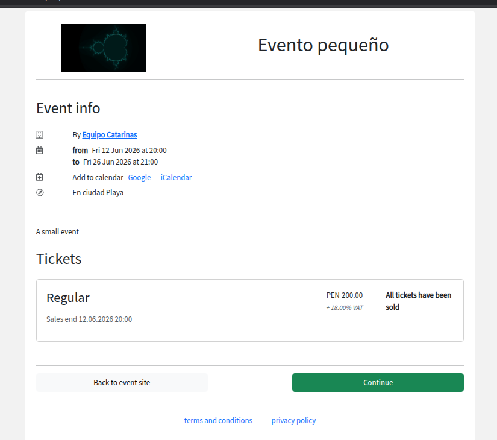
         
        Categoría de tickets agotada en la vista pública de selección.
      </td>
    </tr>
  </tbody>
</table>

### Configuración de Impuestos (CONF-13)

**CPF-13-001**
<table>
  <thead>
    <tr>
      <th>ID</th>
      <th>Descripción</th>
      <th>Tipo</th>
      <th>Estado</th>
      <th>Defectos</th>
    </tr>
  </thead>
  <tbody>
    <tr>
      <td>CPF-13-001</td>
      <td>Configurar y aplicar un nuevo impuesto (VAT/IVA).</td>
      <td>Manual</td>
      <td>Exitoso</td>
      <td>No se encontraron defectos</td>
    </tr>
    <tr>
      <th colspan="2">Resultado esperado</th>
      <th colspan="3">Resultado obtenido</th>
    </tr>
    <tr>
      <td colspan="2"></td>
      <td colspan="3">El impuesto se configura y se aplica al precio correctamente.</td>
    </tr>
    <tr>
      <th colspan="5">Evidencia</th>
    </tr>
    <tr>
      <td colspan="5">
        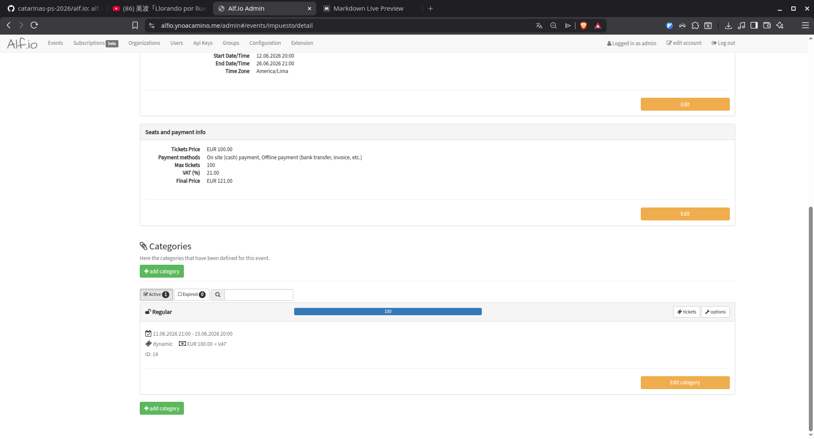
         
        Formulario de configuración de impuestos guardado correctamente.
      </td>
    </tr>
  </tbody>
</table>

**CPF-13-002**
<table>
  <thead>
    <tr>
      <th>ID</th>
      <th>Descripción</th>
      <th>Tipo</th>
      <th>Estado</th>
      <th>Defectos</th>
    </tr>
  </thead>
  <tbody>
    <tr>
      <td>CPF-13-002</td>
      <td>Actualizar la tasa del impuesto configurado a un valor de 0%.</td>
      <td>Manual</td>
      <td>Exitoso</td>
      <td>No se encontraron defectos</td>
    </tr>
    <tr>
      <th colspan="2">Resultado esperado</th>
      <th colspan="3">Resultado obtenido</th>
    </tr>
    <tr>
      <td colspan="2"></td>
      <td colspan="3">Se guarda el cambio de tasa a 0% exitosamente en el panel.</td>
    </tr>
    <tr>
      <th colspan="5">Evidencia</th>
    </tr>
    <tr>
      <td colspan="5">
        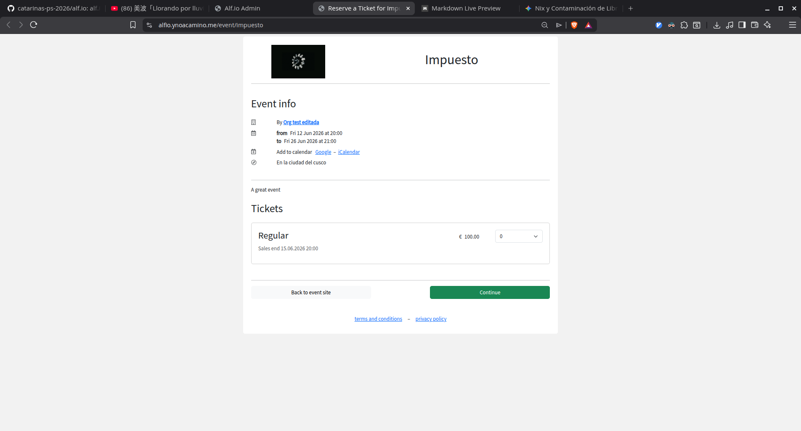
         
        Guardado de tasa de impuesto al 0% en la configuración.
      </td>
    </tr>
  </tbody>
</table>

**CPF-13-003**
<table>
  <thead>
    <tr>
      <th>ID</th>
      <th>Descripción</th>
      <th>Tipo</th>
      <th>Estado</th>
      <th>Defectos</th>
    </tr>
  </thead>
  <tbody>
    <tr>
      <td>CPF-13-003</td>
      <td>Configurar y aplicar exención de impuestos (tax-free) a una categoría.</td>
      <td>Manual</td>
      <td>Exitoso</td>
      <td>No se encontraron defectos</td>
    </tr>
    <tr>
      <th colspan="2">Resultado esperado</th>
      <th colspan="3">Resultado obtenido</th>
    </tr>
    <tr>
      <td colspan="2"></td>
      <td colspan="3">Se desvinculan los impuestos del precio de la categoría.</td>
    </tr>
    <tr>
      <th colspan="5">Evidencia</th>
    </tr>
    <tr>
      <td colspan="5">
        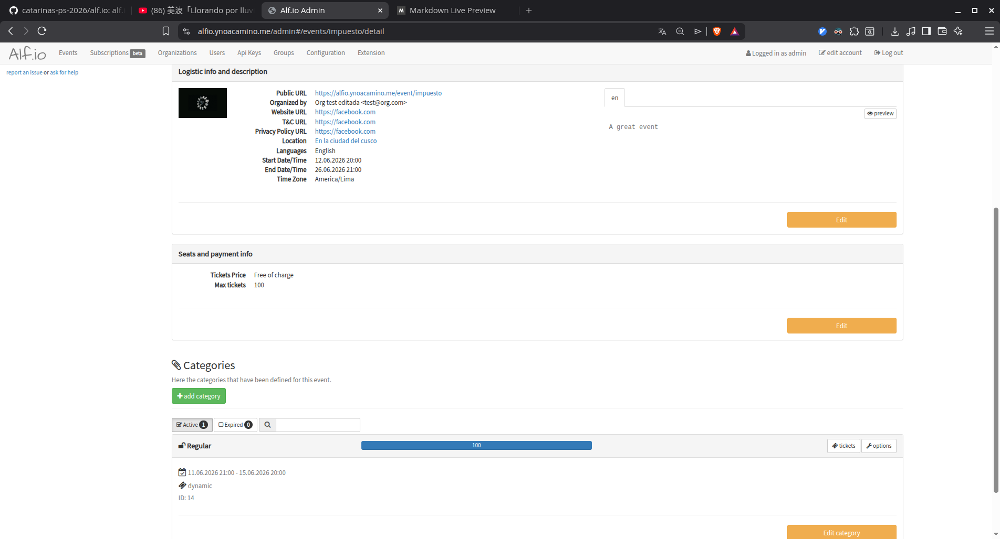
         
        Actualización de categoría a exenta de impuestos.
      </td>
    </tr>
  </tbody>
</table>

### Configuración de Localización y Moneda (CONF-14)

**CPF-14-001**
<table>
  <thead>
    <tr>
      <th>ID</th>
      <th>Descripción</th>
      <th>Tipo</th>
      <th>Estado</th>
      <th>Defectos</th>
    </tr>
  </thead>
  <tbody>
    <tr>
      <td>CPF-14-001</td>
      <td>Seleccionar el idioma por defecto del sistema.</td>
      <td>Manual</td>
      <td>Exitoso</td>
      <td>No se encontraron defectos</td>
    </tr>
    <tr>
      <th colspan="2">Resultado esperado</th>
      <th colspan="3">Resultado obtenido</th>
    </tr>
    <tr>
      <td colspan="2"></td>
      <td colspan="3">El sistema actualiza el idioma de visualización correctamente.</td>
    </tr>
    <tr>
      <th colspan="5">Evidencia</th>
    </tr>
    <tr>
      <td colspan="5">
        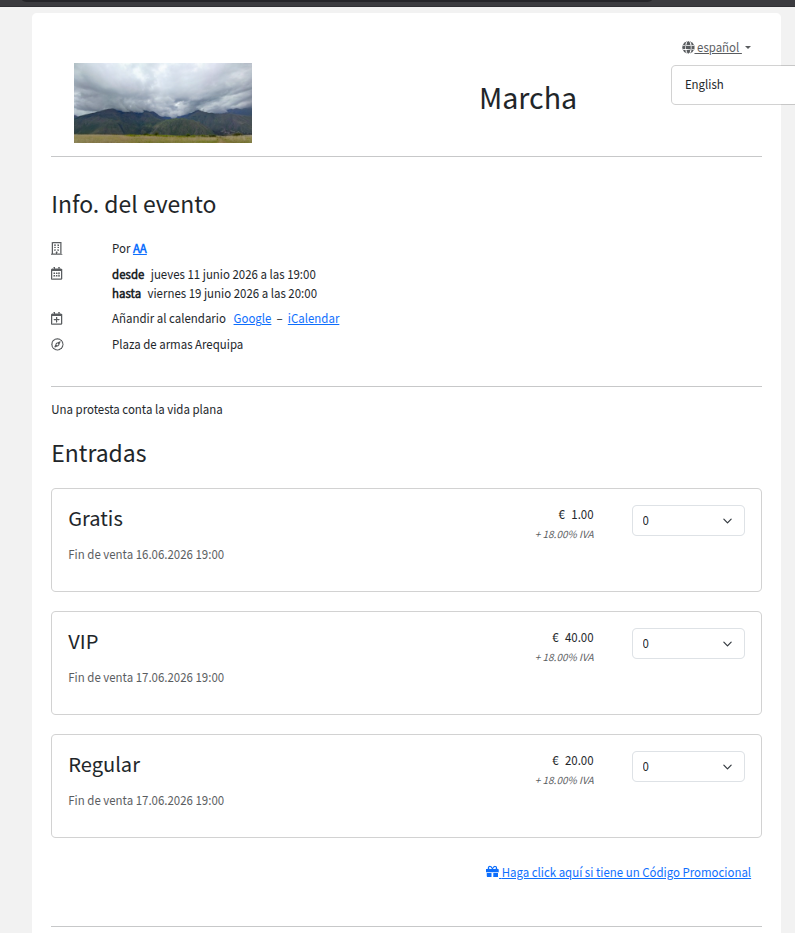
         
        Selector de idioma configurado en la administración de la organización.
      </td>
    </tr>
  </tbody>
</table>

**CPF-14-002**
<table>
  <thead>
    <tr>
      <th>ID</th>
      <th>Descripción</th>
      <th>Tipo</th>
      <th>Estado</th>
      <th>Defectos</th>
    </tr>
  </thead>
  <tbody>
    <tr>
      <td>CPF-14-002</td>
      <td>Traducir los detalles del evento a un idioma secundario.</td>
      <td>Manual</td>
      <td>Exitoso</td>
      <td>No se encontraron defectos</td>
    </tr>
    <tr>
      <th colspan="2">Resultado esperado</th>
      <th colspan="3">Resultado obtenido</th>
    </tr>
    <tr>
      <td colspan="2"></td>
      <td colspan="3">Traducciones guardadas y aplicadas a los campos del evento.</td>
    </tr>
    <tr>
      <th colspan="5">Evidencia</th>
    </tr>
    <tr>
      <td colspan="5">
        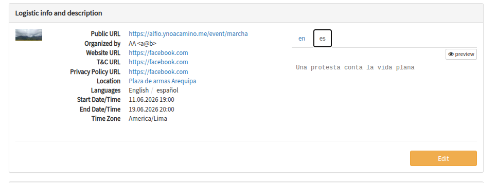
         
        Campos de traducción completados y guardados para el evento.
      </td>
    </tr>
  </tbody>
</table>

**CPF-14-003**
<table>
  <thead>
    <tr>
      <th>ID</th>
      <th>Descripción</th>
      <th>Tipo</th>
      <th>Estado</th>
      <th>Defectos</th>
    </tr>
  </thead>
  <tbody>
    <tr>
      <td>CPF-14-003</td>
      <td>Validar el límite mínimo de idiomas requeridos al intentar eliminar.</td>
      <td>Manual</td>
      <td>Exitoso</td>
      <td>No se encontraron defectos</td>
    </tr>
    <tr>
      <th colspan="2">Resultado esperado</th>
      <th colspan="3">Resultado obtenido</th>
    </tr>
    <tr>
      <td colspan="2"></td>
      <td colspan="3">El sistema restringe la eliminación en el límite mínimo de idiomas.</td>
    </tr>
    <tr>
      <th colspan="5">Evidencia</th>
    </tr>
    <tr>
      <td colspan="5">
        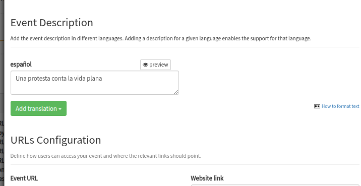
         
        Validación del límite mínimo de idiomas permitidos en el sistema.
      </td>
    </tr>
  </tbody>
</table>

**CPF-14-004**
<table>
  <thead>
    <tr>
      <th>ID</th>
      <th>Descripción</th>
      <th>Tipo</th>
      <th>Estado</th>
      <th>Defectos</th>
    </tr>
  </thead>
  <tbody>
    <tr>
      <td>CPF-14-004</td>
      <td>Validar advertencia por desfase de zona horaria del evento.</td>
      <td>Manual</td>
      <td>Fallido</td>
      <td>event timezone warning</td>
    </tr>
    <tr>
      <th colspan="2">Resultado esperado</th>
      <th colspan="3">Resultado obtenido</th>
    </tr>
    <tr>
      <td colspan="2"></td>
      <td colspan="3">Se muestra un mensaje de advertencia sobre la zona horaria del evento.</td>
    </tr>
    <tr>
      <th colspan="5">Evidencia</th>
    </tr>
    <tr>
      <td colspan="5">
        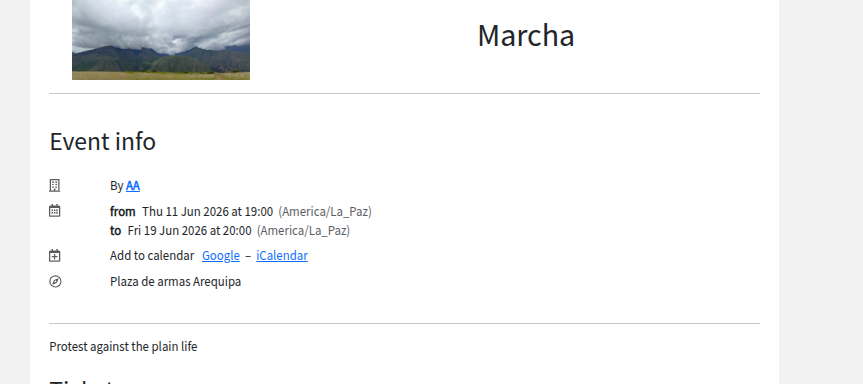
         
        Mensaje de advertencia por desfase de la zona horaria detectada.
      </td>
    </tr>
  </tbody>
</table>

**CPF-14-005**
<table>
  <thead>
    <tr>
      <th>ID</th>
      <th>Descripción</th>
      <th>Tipo</th>
      <th>Estado</th>
      <th>Defectos</th>
    </tr>
  </thead>
  <tbody>
    <tr>
      <td>CPF-14-005</td>
      <td>Cambiar la moneda por defecto del evento a Euros (EUR).</td>
      <td>Manual</td>
      <td>Exitoso</td>
      <td>No se encontraron defectos</td>
    </tr>
    <tr>
      <th colspan="2">Resultado esperado</th>
      <th colspan="3">Resultado obtenido</th>
    </tr>
    <tr>
      <td colspan="2"></td>
      <td colspan="3">La moneda se actualiza a EUR y se muestra en la tienda pública.</td>
    </tr>
    <tr>
      <th colspan="5">Evidencia</th>
    </tr>
    <tr>
      <td colspan="5">
        
         
        Moneda configurada a Euros (EUR) en la administración.
      </td>
    </tr>
  </tbody>
</table>

**CPF-14-006**
<table>
  <thead>
    <tr>
      <th>ID</th>
      <th>Descripción</th>
      <th>Tipo</th>
      <th>Estado</th>
      <th>Defectos</th>
    </tr>
  </thead>
  <tbody>
    <tr>
      <td>CPF-14-006</td>
      <td>Cambiar la moneda por defecto del evento a Soles (PEN).</td>
      <td>Manual</td>
      <td>Exitoso</td>
      <td>No se encontraron defectos</td>
    </tr>
    <tr>
      <th colspan="2">Resultado esperado</th>
      <th colspan="3">Resultado obtenido</th>
    </tr>
    <tr>
      <td colspan="2"></td>
      <td colspan="3">La moneda se actualiza a PEN y se muestra en la tienda pública.</td>
    </tr>
    <tr>
      <th colspan="5">Evidencia</th>
    </tr>
    <tr>
      <td colspan="5">
        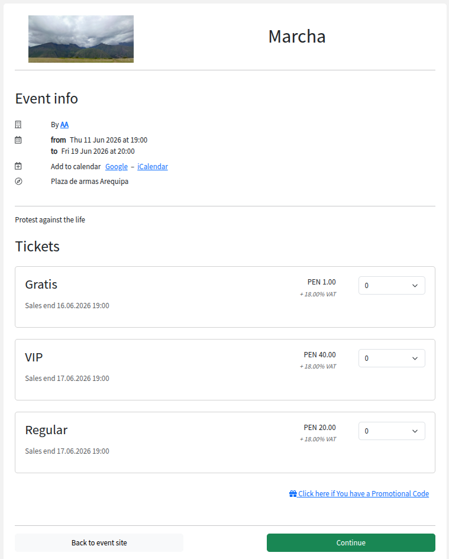
         
        Moneda configurada a Soles Peruanos (PEN) en la administración.
      </td>
    </tr>
  </tbody>
</table>

### Creación de Usuarios

**CPF-15-001**
<table>
  <thead>
    <tr>
      <th>ID</th>
      <th>Descripción</th>
      <th>Tipo</th>
      <th>Estado</th>
      <th>Defectos</th>
    </tr>
  </thead>
  <tbody>
    <tr>
      <td>CPF-15-001</td>
      <td>No permitir la creación de usuarios con un nombre de usuario ya registrado.</td>
      <td>Manual</td>
      <td>Exitoso</td>
      <td>No se encontraron defectos</td>
    </tr>
    <tr>
      <th colspan="2">Resultado esperado</th>
      <th colspan="3">Resultado obtenido</th>
    </tr>
    <tr>
      <td colspan="2">Error: Username ya registrado</td>
      <td colspan="3">Se mostró mensaje de username duplicado y no se creó el usuario.</td>
    </tr>
    <tr>
      <th colspan="5">Evidencia</th>
    </tr>
    <tr>
      <td colspan="5">
        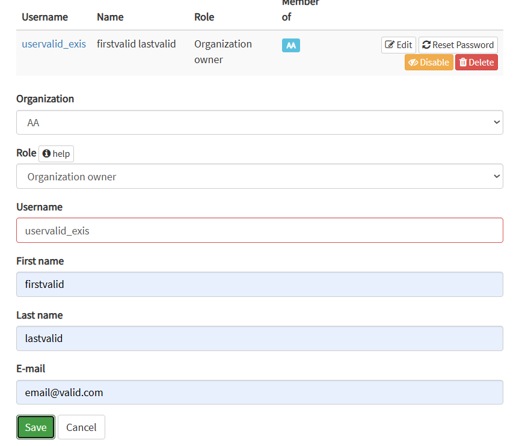
         
        Validación de unicidad del nombre de usuario.
      </td>
    </tr>
  </tbody>
</table>

**CPF-15-002**
<table>
  <thead>
    <tr>
      <th>ID</th>
      <th>Descripción</th>
      <th>Tipo</th>
      <th>Estado</th>
      <th>Defectos</th>
    </tr>
  </thead>
  <tbody>
    <tr>
      <td>CPF-15-002</td>
      <td>No permitir correos electrónicos sin el carácter '@'.</td>
      <td>Manual</td>
      <td>Exitoso</td>
      <td>No se encontraron defectos</td>
    </tr>
    <tr>
      <th colspan="2">Resultado esperado</th>
      <th colspan="3">Resultado obtenido</th>
    </tr>
    <tr>
      <td colspan="2">Error: Formato de correo inválido</td>
      <td colspan="3">Se rechazó el correo "anarodriguez.com" por formato inválido.</td>
    </tr>
    <tr>
      <th colspan="5">Evidencia</th>
    </tr>
    <tr>
      <td colspan="5">
        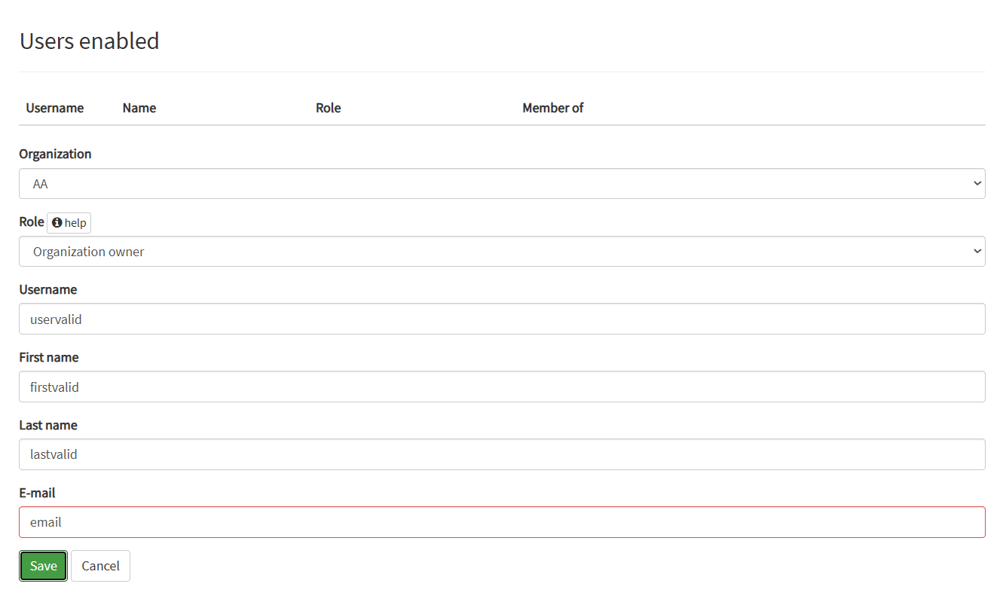
         
        Validación de formato de correo electrónico.
      </td>
    </tr>
  </tbody>
</table>

**CPF-15-003**
<table>
  <thead>
    <tr>
      <th>ID</th>
      <th>Descripción</th>
      <th>Tipo</th>
      <th>Estado</th>
      <th>Defectos</th>
    </tr>
  </thead>
  <tbody>
    <tr>
      <td>CPF-15-003</td>
      <td>No permitir correos electrónicos sin dominio válido.</td>
      <td>Manual</td>
      <td>Exitoso</td>
      <td>No se encontraron defectos</td>
    </tr>
    <tr>
      <th colspan="2">Resultado esperado</th>
      <th colspan="3">Resultado obtenido</th>
    </tr>
    <tr>
      <td colspan="2">Error: Formato de correo inválido</td>
      <td colspan="3">Se rechazó el correo "ana@" por no contener un dominio válido.</td>
    </tr>
    <tr>
      <th colspan="5">Evidencia</th>
    </tr>
    <tr>
      <td colspan="5">
        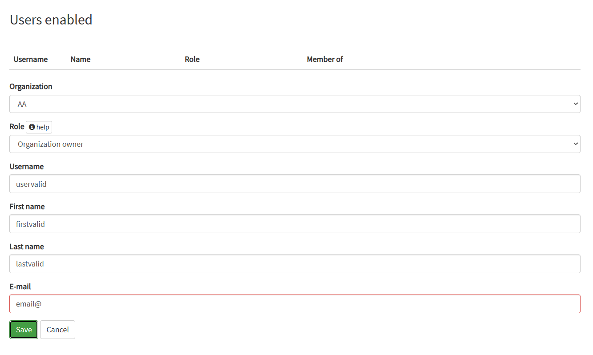
         
        Validación de dominio en direcciones de correo.
      </td>
    </tr>
  </tbody>
</table>

**CPF-15-004**
<table>
  <thead>
    <tr>
      <th>ID</th>
      <th>Descripción</th>
      <th>Tipo</th>
      <th>Estado</th>
      <th>Defectos</th>
    </tr>
  </thead>
  <tbody>
    <tr>
      <td>CPF-15-004</td>
      <td>No permitir el registro de un correo electrónico ya existente.</td>
      <td>Manual</td>
      <td>Fallido</td>
      <td>El sistema permite correos duplicados</td>
    </tr>
    <tr>
      <th colspan="2">Resultado esperado</th>
      <th colspan="3">Resultado obtenido</th>
    </tr>
    <tr>
      <td colspan="2">Error: Correo ya registrado</td>
      <td colspan="3">Se mostró mensaje de correo duplicado y no se creó el usuario.</td>
    </tr>
    <tr>
      <th colspan="5">Evidencia</th>
    </tr>
    <tr>
      <td colspan="5">
        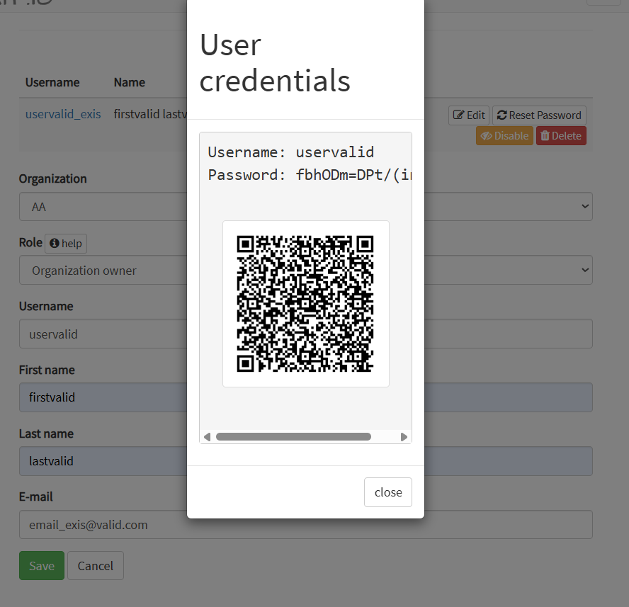
         
        Verificación de unicidad del correo electrónico.
      </td>
    </tr>
  </tbody>
</table>

**CPF-15-005**
<table>
  <thead>
    <tr>
      <th>ID</th>
      <th>Descripción</th>
      <th>Tipo</th>
      <th>Estado</th>
      <th>Defectos</th>
    </tr>
  </thead>
  <tbody>
    <tr>
      <td>CPF-15-005</td>
      <td>No permitir usernames compuestos únicamente por espacios en blanco.</td>
      <td>Manual</td>
      <td>Exitoso</td>
      <td>No se encontraron defectos</td>
    </tr>
    <tr>
      <th colspan="2">Resultado esperado</th>
      <th colspan="3">Resultado obtenido</th>
    </tr>
    <tr>
      <td colspan="2">Error: Username obligatorio o inválido</td>
      <td colspan="3">Se rechazó el registro al detectar un username compuesto únicamente por espacios.</td>
    </tr>
    <tr>
      <th colspan="5">Evidencia</th>
    </tr>
    <tr>
      <td colspan="5">
        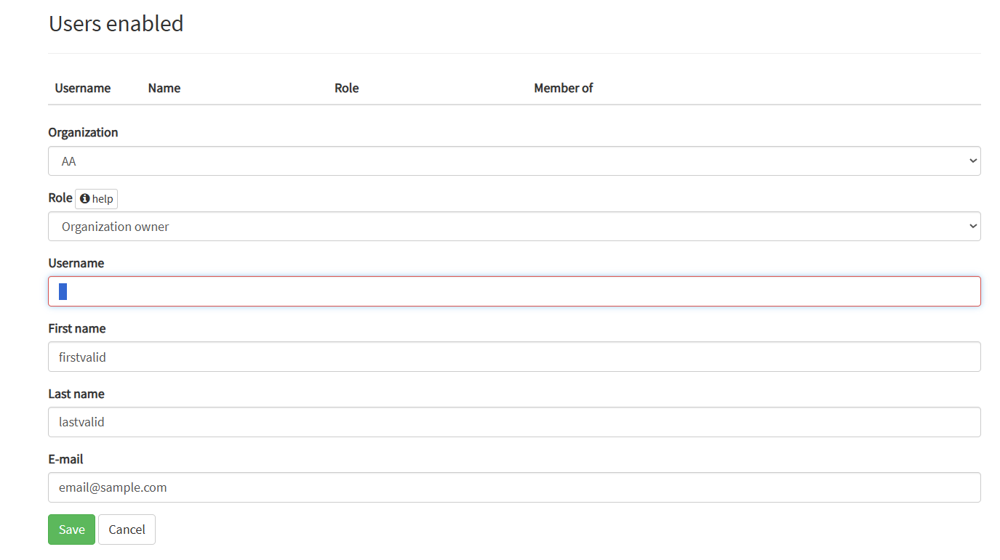
         
        Validación de espacios en blanco en el nombre de usuario.
      </td>
    </tr>
  </tbody>
</table>

**CPF-15-006**
<table>
  <thead>
    <tr>
      <th>ID</th>
      <th>Descripción</th>
      <th>Tipo</th>
      <th>Estado</th>
      <th>Defectos</th>
    </tr>
  </thead>
  <tbody>
    <tr>
      <td>CPF-15-006</td>
      <td>Permitir la creación de usuarios con un username de longitud mínima válida.</td>
      <td>Manual</td>
      <td>Exitoso</td>
      <td>No se encontraron defectos</td>
    </tr>
    <tr>
      <th colspan="2">Resultado esperado</th>
      <th colspan="3">Resultado obtenido</th>
    </tr>
    <tr>
      <td colspan="2">Usuario creado exitosamente</td>
      <td colspan="3">Usuario creado exitosamente utilizando el username "aa".</td>
    </tr>
    <tr>
      <th colspan="5">Evidencia</th>
    </tr>
    <tr>
      <td colspan="5">
        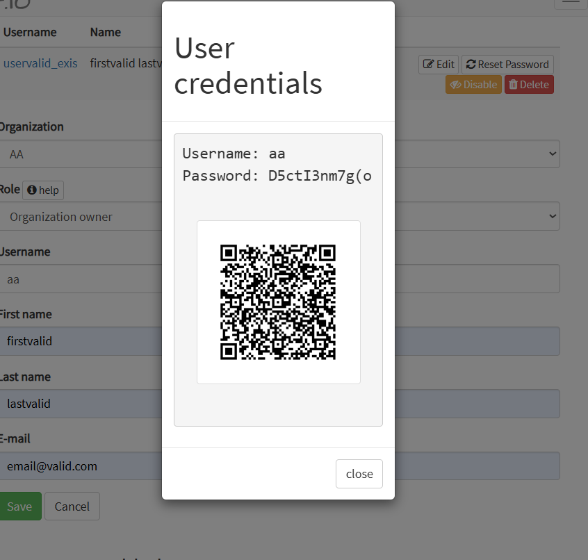
         
        Validación del límite inferior permitido para username.
      </td>
    </tr>
  </tbody>
</table>

**CPF-15-007**
<table>
  <thead>
    <tr>
      <th>ID</th>
      <th>Descripción</th>
      <th>Tipo</th>
      <th>Estado</th>
      <th>Defectos</th>
    </tr>
  </thead>
  <tbody>
    <tr>
      <td>CPF-15-007</td>
      <td>Permitir la creación de usuarios con un username de longitud máxima válida.</td>
      <td>Manual</td>
      <td>Exitoso</td>
      <td>No se encontraron defectos</td>
    </tr>
    <tr>
      <th colspan="2">Resultado esperado</th>
      <th colspan="3">Resultado obtenido</th>
    </tr>
    <tr>
      <td colspan="2">Usuario creado exitosamente</td>
      <td colspan="3">Usuario creado exitosamente con un username en el límite superior permitido.</td>
    </tr>
    <tr>
      <th colspan="5">Evidencia</th>
    </tr>
    <tr>
      <td colspan="5">
        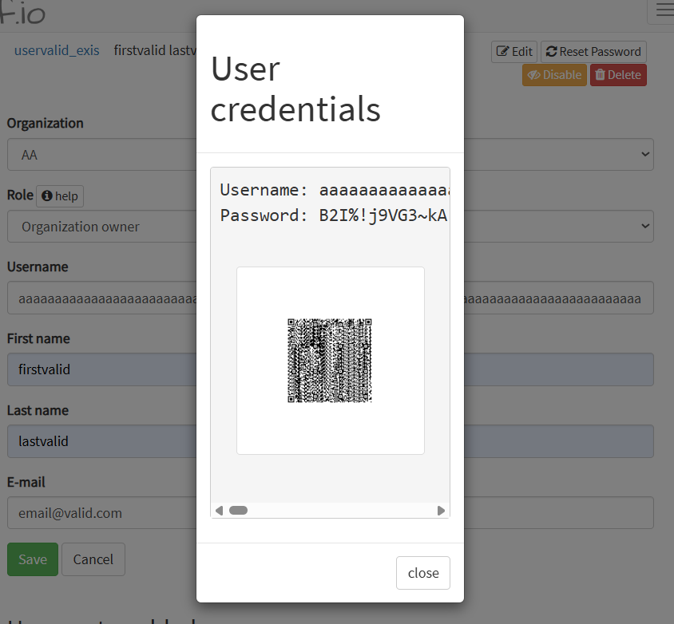
         
        Validación del límite superior permitido para username.
      </td>
    </tr>
  </tbody>
</table>

**CPF-15-008**
<table>
  <thead>
    <tr>
      <th>ID</th>
      <th>Descripción</th>
      <th>Tipo</th>
      <th>Estado</th>
      <th>Defectos</th>
    </tr>
  </thead>
  <tbody>
    <tr>
      <td>CPF-15-008</td>
      <td>No permitir usernames que excedan la longitud máxima definida.</td>
      <td>Manual</td>
      <td>Exitoso</td>
      <td>No se encontraron defectos</td>
    </tr>
    <tr>
      <th colspan="2">Resultado esperado</th>
      <th colspan="3">Resultado obtenido</th>
    </tr>
    <tr>
      <td colspan="2">Error: Username excede la longitud permitida</td>
      <td colspan="3">Se mostró mensaje indicando que el username excede la longitud permitida.</td>
    </tr>
    <tr>
      <th colspan="5">Evidencia</th>
    </tr>
    <tr>
      <td colspan="5">
        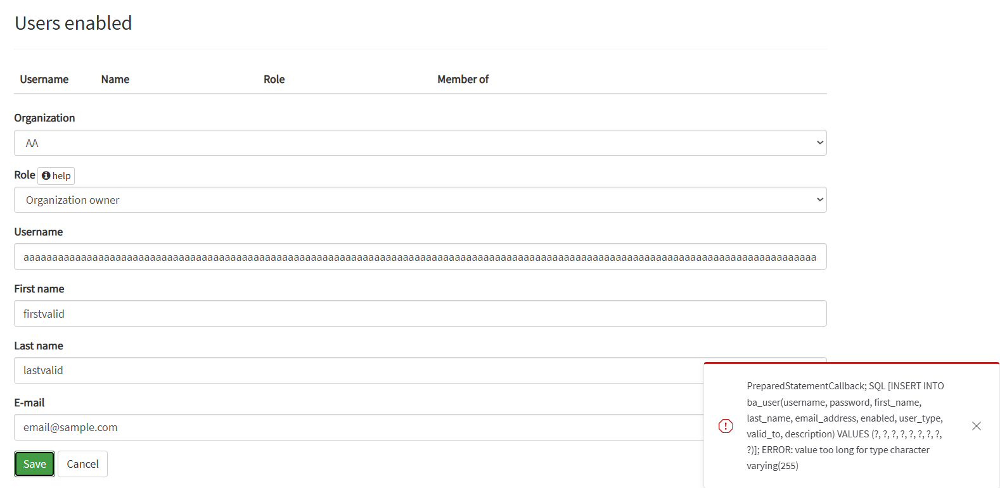
         
        Validación de longitud máxima para username.
      </td>
    </tr>
  </tbody>
</table>

**CPF-15-009**
<table>
  <thead>
    <tr>
      <th>ID</th>
      <th>Descripción</th>
      <th>Tipo</th>
      <th>Estado</th>
      <th>Defectos</th>
    </tr>
  </thead>
  <tbody>
    <tr>
      <td>CPF-15-009</td>
      <td>No permitir nombres compuestos únicamente por espacios en blanco.</td>
      <td>Manual</td>
      <td>Exitoso</td>
      <td>No se encontraron defectos</td>
    </tr>
    <tr>
      <th colspan="2">Resultado esperado</th>
      <th colspan="3">Resultado obtenido</th>
    </tr>
    <tr>
      <td colspan="2">Error: Nombre obligatorio o inválido</td>
      <td colspan="3">Se rechazó el registro al detectar un nombre compuesto únicamente por espacios.</td>
    </tr>
    <tr>
      <th colspan="5">Evidencia</th>
    </tr>
    <tr>
      <td colspan="5">
        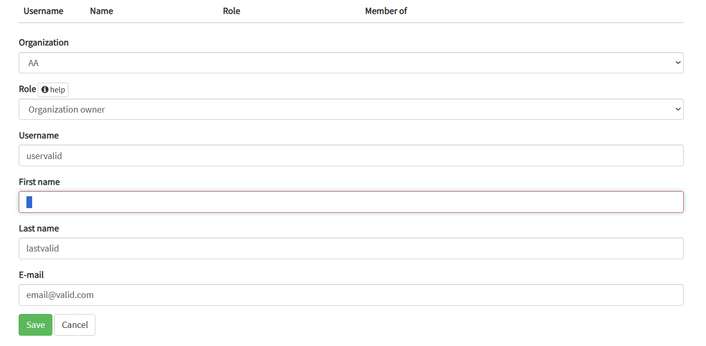
         
        Validación de espacios en blanco en el nombre del usuario.
      </td>
    </tr>
  </tbody>
</table>

**CPF-15-010**
<table>
  <thead>
    <tr>
      <th>ID</th>
      <th>Descripción</th>
      <th>Tipo</th>
      <th>Estado</th>
      <th>Defectos</th>
    </tr>
  </thead>
  <tbody>
    <tr>
      <td>CPF-15-010</td>
      <td>Permitir la creación de usuarios con un nombre de longitud mínima válida.</td>
      <td>Manual</td>
      <td>Exitoso</td>
      <td>No se encontraron defectos</td>
    </tr>
    <tr>
      <th colspan="2">Resultado esperado</th>
      <th colspan="3">Resultado obtenido</th>
    </tr>
    <tr>
      <td colspan="2">Usuario creado exitosamente</td>
      <td colspan="3">Usuario creado exitosamente utilizando el nombre "AA".</td>
    </tr>
    <tr>
      <th colspan="5">Evidencia</th>
    </tr>
    <tr>
      <td colspan="5">
        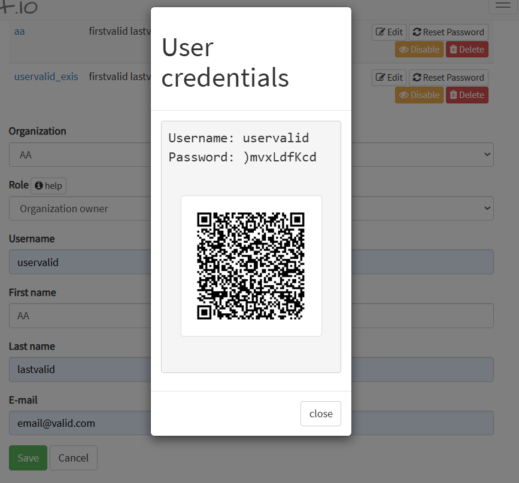
         
        Validación del límite inferior permitido para el nombre.
      </td>
    </tr>
  </tbody>
</table>

**CPF-15-011**
<table>
  <thead>
    <tr>
      <th>ID</th>
      <th>Descripción</th>
      <th>Tipo</th>
      <th>Estado</th>
      <th>Defectos</th>
    </tr>
  </thead>
  <tbody>
    <tr>
      <td>CPF-15-011</td>
      <td>No permitir nombres compuestos únicamente por caracteres numéricos.</td>
      <td>Manual</td>
      <td>Fallido</td>
      <td>El sistema permite nombres numéricos</td>
    </tr>
    <tr>
      <th colspan="2">Resultado esperado</th>
      <th colspan="3">Resultado obtenido</th>
    </tr>
    <tr>
      <td colspan="2">Error: Nombre no puede ser un número</td>
      <td colspan="3">Se mostraron las credenciales del usuario creado.</td>
    </tr>
    <tr>
      <th colspan="5">Evidencia</th>
    </tr>
    <tr>
      <td colspan="5">
        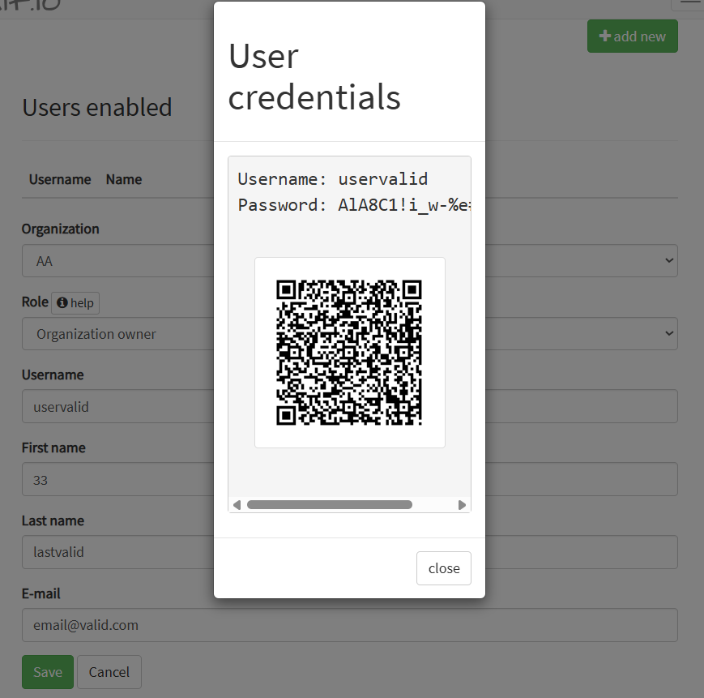
         
        Validación de caracteres numéricos en el campo nombre.
      </td>
    </tr>
  </tbody>
</table>

**CPF-15-012**
<table>
  <thead>
    <tr>
      <th>ID</th>
      <th>Descripción</th>
      <th>Tipo</th>
      <th>Estado</th>
      <th>Defectos</th>
    </tr>
  </thead>
  <tbody>
    <tr>
      <td>CPF-15-012</td>
      <td>No permitir nombres compuestos únicamente por símbolos especiales.</td>
      <td>Manual</td>
      <td>Fallido</td>
      <td>El sistema permite nombres con símbolos</td>
    </tr>
    <tr>
      <th colspan="2">Resultado esperado</th>
      <th colspan="3">Resultado obtenido</th>
    </tr>
    <tr>
      <td colspan="2">Error: Nombre no puede ser un símbolo</td>
      <td colspan="3">Se mostraron las credenciales del usuario creado.</td>
    </tr>
    <tr>
      <th colspan="5">Evidencia</th>
    </tr>
    <tr>
      <td colspan="5">
        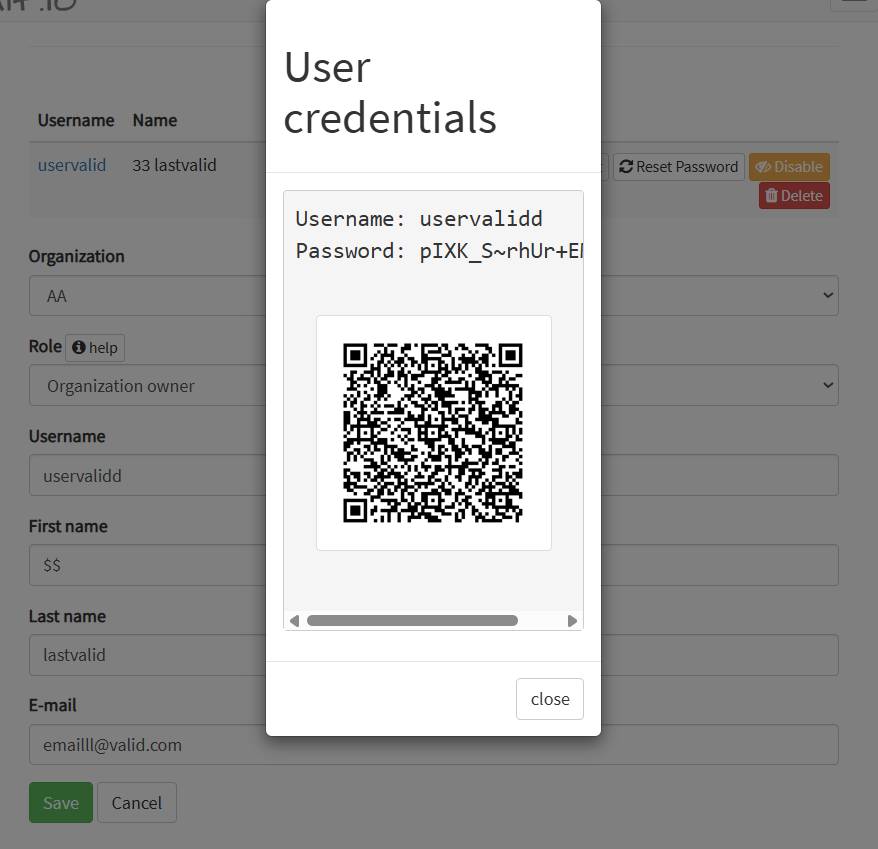
         
        Validación de caracteres especiales en el campo nombre.
      </td>
    </tr>
  </tbody>
</table>

**CPF-15-013**
<table>
  <thead>
    <tr>
      <th>ID</th>
      <th>Descripción</th>
      <th>Tipo</th>
      <th>Estado</th>
      <th>Defectos</th>
    </tr>
  </thead>
  <tbody>
    <tr>
      <td>CPF-15-013</td>
      <td>Permitir nombres con la longitud máxima válida configurada.</td>
      <td>Manual</td>
      <td>Exitoso</td>
      <td>No se encontraron defectos</td>
    </tr>
    <tr>
      <th colspan="2">Resultado esperado</th>
      <th colspan="3">Resultado obtenido</th>
    </tr>
    <tr>
      <td colspan="2">Usuario creado exitosamente</td>
      <td colspan="3">Usuario creado exitosamente utilizando un nombre en el límite superior permitido.</td>
    </tr>
    <tr>
      <th colspan="5">Evidencia</th>
    </tr>
    <tr>
      <td colspan="5">
        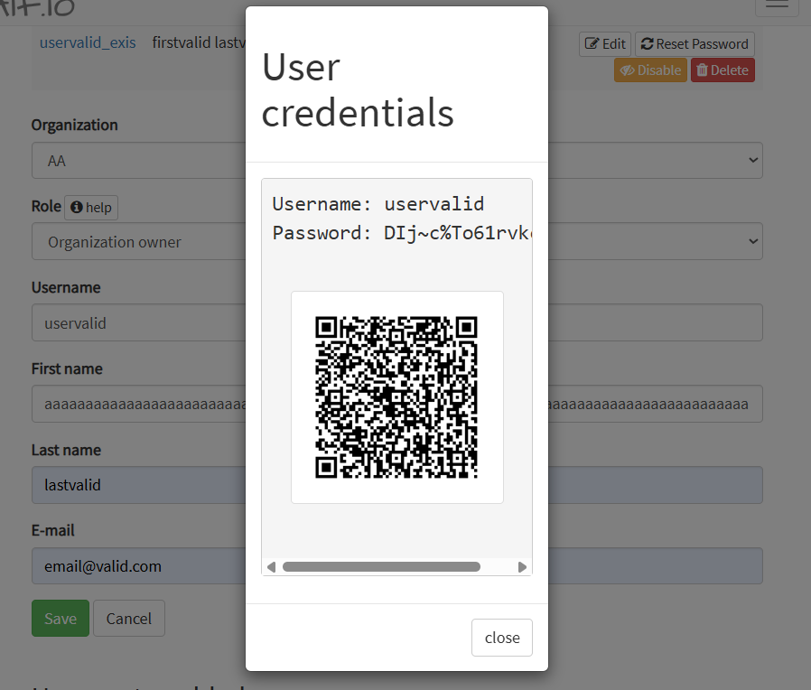
         
        Validación del límite superior permitido para el nombre.
      </td>
    </tr>
  </tbody>
</table>

**CPF-15-014**
<table>
  <thead>
    <tr>
      <th>ID</th>
      <th>Descripción</th>
      <th>Tipo</th>
      <th>Estado</th>
      <th>Defectos</th>
    </tr>
  </thead>
  <tbody>
    <tr>
      <td>CPF-15-014</td>
      <td>No permitir nombres que excedan la longitud máxima definida.</td>
      <td>Manual</td>
      <td>Exitoso</td>
      <td>No se encontraron defectos</td>
    </tr>
    <tr>
      <th colspan="2">Resultado esperado</th>
      <th colspan="3">Resultado obtenido</th>
    </tr>
    <tr>
      <td colspan="2">Error: Nombre excede la longitud permitida</td>
      <td colspan="3">Se mostró mensaje indicando que el nombre excede la longitud permitida.</td>
    </tr>
    <tr>
      <th colspan="5">Evidencia</th>
    </tr>
    <tr>
      <td colspan="5">
        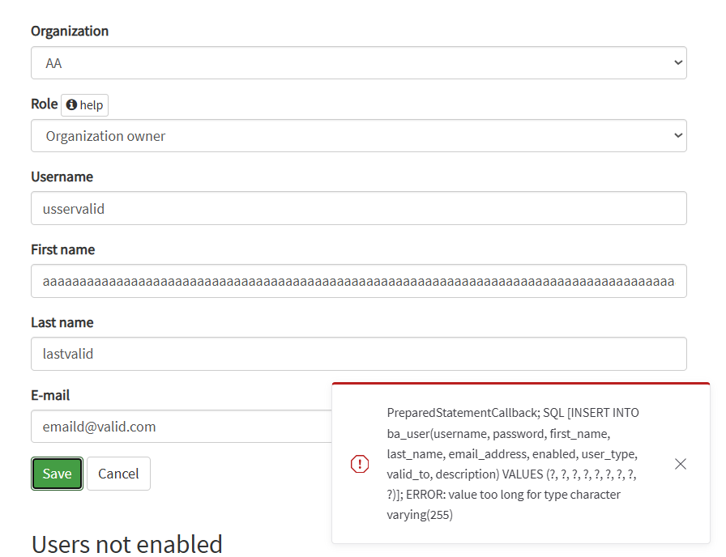
         
        Validación de longitud máxima para el nombre.
      </td>
    </tr>
  </tbody>
</table>

**CPF-15-015**
<table>
  <thead>
    <tr>
      <th>ID</th>
      <th>Descripción</th>
      <th>Tipo</th>
      <th>Estado</th>
      <th>Defectos</th>
    </tr>
  </thead>
  <tbody>
    <tr>
      <td>CPF-15-015</td>
      <td>No permitir apellidos compuestos únicamente por espacios en blanco.</td>
      <td>Manual</td>
      <td>Exitoso</td>
      <td>No se encontraron defectos</td>
    </tr>
    <tr>
      <th colspan="2">Resultado esperado</th>
      <th colspan="3">Resultado obtenido</th>
    </tr>
    <tr>
      <td colspan="2">Error: Apellido obligatorio o inválido</td>
      <td colspan="3">Se rechazó el registro al detectar un apellido compuesto únicamente por espacios.</td>
    </tr>
    <tr>
      <th colspan="5">Evidencia</th>
    </tr>
    <tr>
      <td colspan="5">
        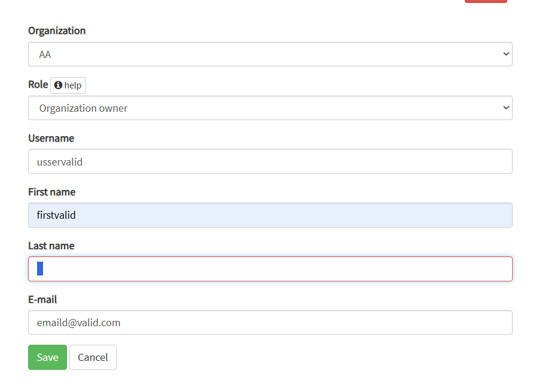
         
        Validación de espacios en blanco en el campo apellido.
      </td>
    </tr>
  </tbody>
</table>

**CPF-15-016**
<table>
  <thead>
    <tr>
      <th>ID</th>
      <th>Descripción</th>
      <th>Tipo</th>
      <th>Estado</th>
      <th>Defectos</th>
    </tr>
  </thead>
  <tbody>
    <tr>
      <td>CPF-15-016</td>
      <td>Permitir la creación de usuarios con un apellido de longitud mínima válida.</td>
      <td>Manual</td>
      <td>Exitoso</td>
      <td>No se encontraron defectos</td>
    </tr>
    <tr>
      <th colspan="2">Resultado esperado</th>
      <th colspan="3">Resultado obtenido</th>
    </tr>
    <tr>
      <td colspan="2">Usuario creado exitosamente</td>
      <td colspan="3">Usuario creado exitosamente utilizando el apellido "RR".</td>
    </tr>
    <tr>
      <th colspan="5">Evidencia</th>
    </tr>
    <tr>
      <td colspan="5">
        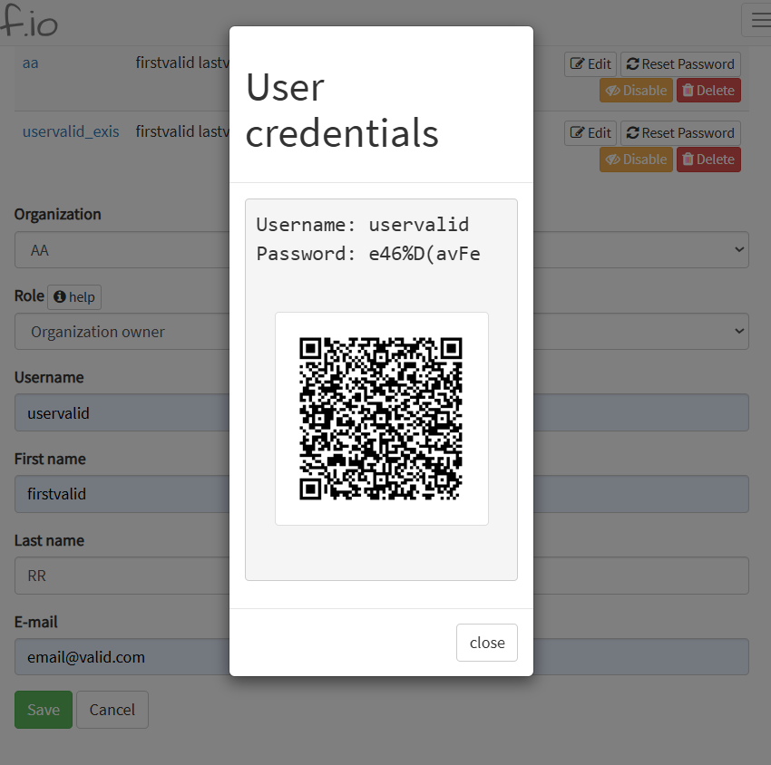
         
        Validación del límite inferior permitido para el apellido.
      </td>
    </tr>
  </tbody>
</table>

**CPF-15-017**
<table>
  <thead>
    <tr>
      <th>ID</th>
      <th>Descripción</th>
      <th>Tipo</th>
      <th>Estado</th>
      <th>Defectos</th>
    </tr>
  </thead>
  <tbody>
    <tr>
      <td>CPF-15-017</td>
      <td>No permitir apellidos compuestos únicamente por caracteres numéricos.</td>
      <td>Manual</td>
      <td>Fallido</td>
      <td>El sistema permite nombres numéricos</td>
    </tr>
    <tr>
      <th colspan="2">Resultado esperado</th>
      <th colspan="3">Resultado obtenido</th>
    </tr>
    <tr>
      <td colspan="2">Error: Apellido no puede ser un número</td>
      <td colspan="3">Se mostraron las credenciales del usuario creado.</td>
    </tr>
    <tr>
      <th colspan="5">Evidencia</th>
    </tr>
    <tr>
      <td colspan="5">
        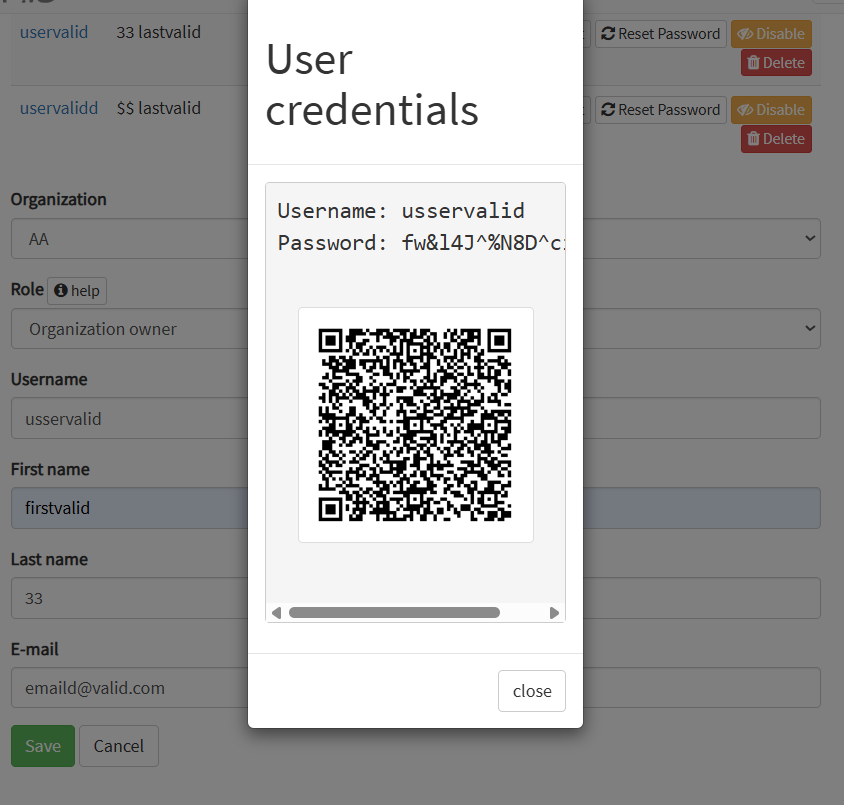
         
        Validación de caracteres numéricos en el campo apellido.
      </td>
    </tr>
  </tbody>
</table>

**CPF-15-018**
<table>
  <thead>
    <tr>
      <th>ID</th>
      <th>Descripción</th>
      <th>Tipo</th>
      <th>Estado</th>
      <th>Defectos</th>
    </tr>
  </thead>
  <tbody>
    <tr>
      <td>CPF-15-018</td>
      <td>No permitir apellidos compuestos únicamente por símbolos especiales.</td>
      <td>Manual</td>
      <td>Fallido</td>
      <td>El sistema permite apellidos con símbolos</td>
    </tr>
    <tr>
      <th colspan="2">Resultado esperado</th>
      <th colspan="3">Resultado obtenido</th>
    </tr>
    <tr>
      <td colspan="2">Error: Apellido no puede ser un símbolo</td>
      <td colspan="3">Se mostraron las credenciales del usuario creado.</td>
    </tr>
    <tr>
      <th colspan="5">Evidencia</th>
    </tr>
    <tr>
      <td colspan="5">
        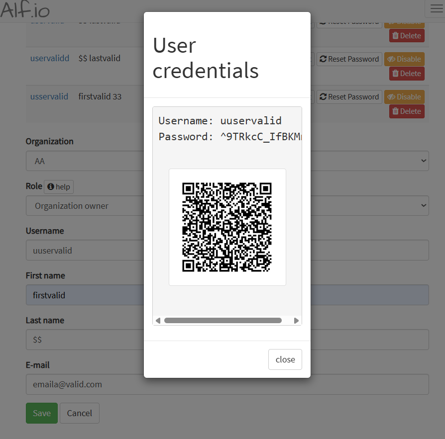
         
        Validación de caracteres especiales en el campo apellido.
      </td>
    </tr>
  </tbody>
</table>

**CPF-15-019**
<table>
  <thead>
    <tr>
      <th>ID</th>
      <th>Descripción</th>
      <th>Tipo</th>
      <th>Estado</th>
      <th>Defectos</th>
    </tr>
  </thead>
  <tbody>
    <tr>
      <td>CPF-15-019</td>
      <td>Permitir apellidos con la longitud máxima válida configurada.</td>
      <td>Manual</td>
      <td>Exitoso</td>
      <td>No se encontraron defectos</td>
    </tr>
    <tr>
      <th colspan="2">Resultado esperado</th>
      <th colspan="3">Resultado obtenido</th>
    </tr>
    <tr>
      <td colspan="2">Usuario creado exitosamente</td>
      <td colspan="3">Usuario creado exitosamente utilizando un apellido en el límite superior permitido.</td>
    </tr>
    <tr>
      <th colspan="5">Evidencia</th>
    </tr>
    <tr>
      <td colspan="5">
        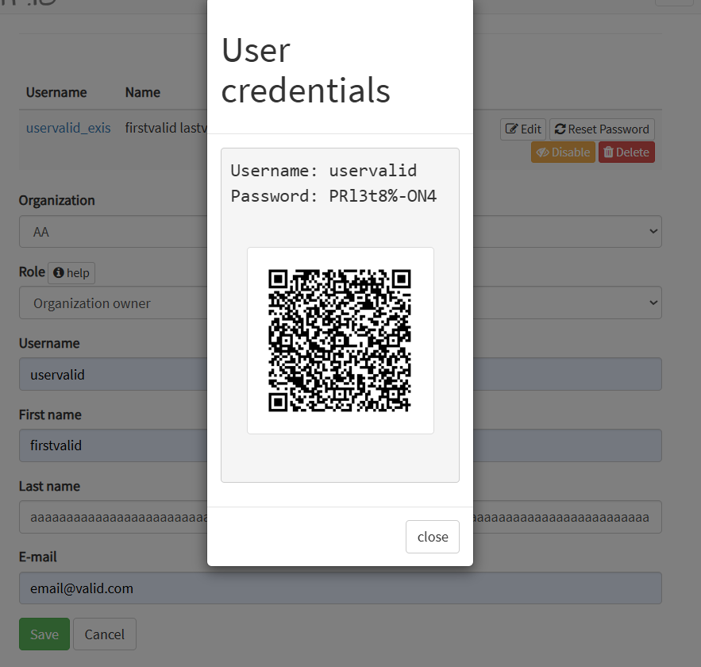
         
        Validación del límite superior permitido para el apellido.
      </td>
    </tr>
  </tbody>
</table>

**CPF-15-020**
<table>
  <thead>
    <tr>
      <th>ID</th>
      <th>Descripción</th>
      <th>Tipo</th>
      <th>Estado</th>
      <th>Defectos</th>
    </tr>
  </thead>
  <tbody>
    <tr>
      <td>CPF-15-020</td>
      <td>No permitir apellidos que excedan la longitud máxima definida.</td>
      <td>Manual</td>
      <td>Exitoso</td>
      <td>No se encontraron defectos</td>
    </tr>
    <tr>
      <th colspan="2">Resultado esperado</th>
      <th colspan="3">Resultado obtenido</th>
    </tr>
    <tr>
      <td colspan="2">Error: Apellido excede la longitud permitida</td>
      <td colspan="3">Se mostró mensaje indicando que el apellido excede la longitud permitida.</td>
    </tr>
    <tr>
      <th colspan="5">Evidencia</th>
    </tr>
    <tr>
      <td colspan="5">
        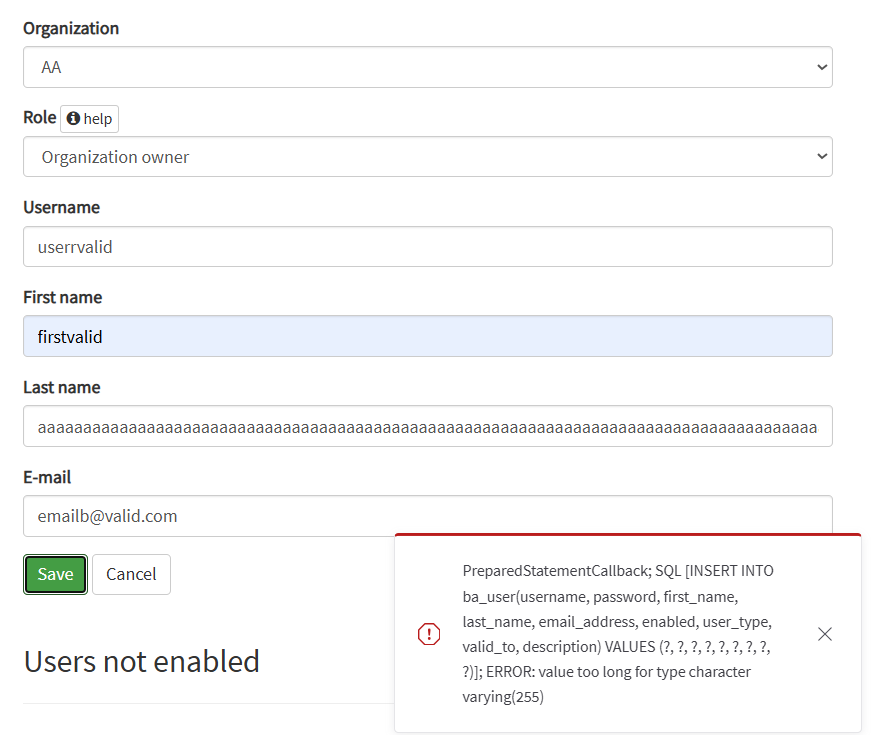
         
        Validación de longitud máxima para el apellido.
      </td>
    </tr>
  </tbody>
</table>

**CPF-15-021**
<table>
  <thead>
    <tr>
      <th>ID</th>
      <th>Descripción</th>
      <th>Tipo</th>
      <th>Estado</th>
      <th>Defectos</th>
    </tr>
  </thead>
  <tbody>
    <tr>
      <td>CPF-15-021</td>
      <td>No permitir la creación de usuarios cuando la organización no ha sido seleccionada.</td>
      <td>Manual</td>
      <td>Exitoso</td>
      <td>No se encontraron defectos</td>
    </tr>
    <tr>
      <th colspan="2">Resultado esperado</th>
      <th colspan="3">Resultado obtenido</th>
    </tr>
    <tr>
      <td colspan="2">El sistema muestra error de validación y no permite guardar</td>
      <td colspan="3">Se bloqueó la creación del usuario al no seleccionar una organización.</td>
    </tr>
    <tr>
      <th colspan="5">Evidencia</th>
    </tr>
    <tr>
      <td colspan="5">
        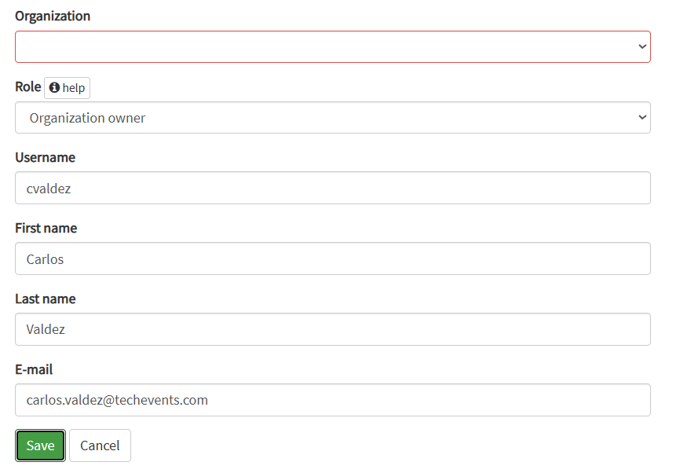
         
        Validación de obligatoriedad del campo organización.
      </td>
    </tr>
  </tbody>
</table>

**CPF-15-022**
<table>
  <thead>
    <tr>
      <th>ID</th>
      <th>Descripción</th>
      <th>Tipo</th>
      <th>Estado</th>
      <th>Defectos</th>
    </tr>
  </thead>
  <tbody>
    <tr>
      <td>CPF-15-022</td>
      <td>No permitir la creación de usuarios cuando el rol no ha sido seleccionado.</td>
      <td>Manual</td>
      <td>Exitoso</td>
      <td>No se encontraron defectos</td>
    </tr>
    <tr>
      <th colspan="2">Resultado esperado</th>
      <th colspan="3">Resultado obtenido</th>
    </tr>
    <tr>
      <td colspan="2">El sistema muestra error de validación y no permite guardar</td>
      <td colspan="3">Se bloqueó la creación del usuario al no seleccionar un rol.</td>
    </tr>
    <tr>
      <th colspan="5">Evidencia</th>
    </tr>
    <tr>
      <td colspan="5">
        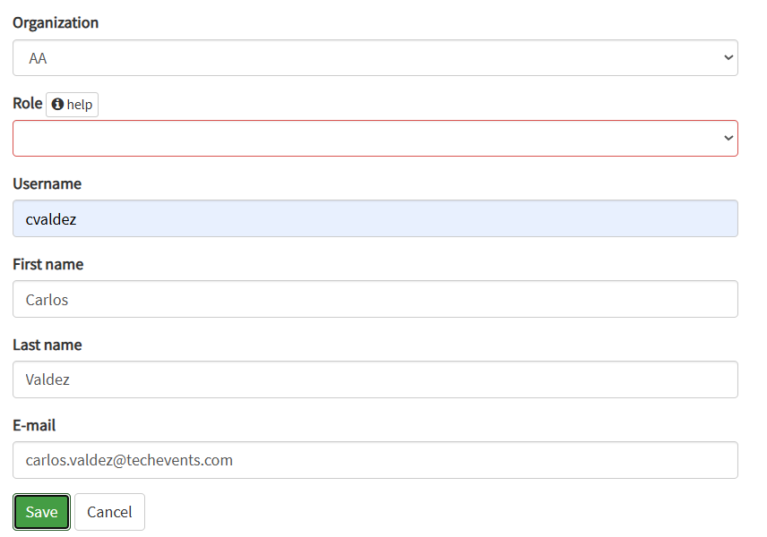
         
        Validación de obligatoriedad del campo rol.
      </td>
    </tr>
  </tbody>
</table>

**CPF-15-023**
<table>
  <thead>
    <tr>
      <th>ID</th>
      <th>Descripción</th>
      <th>Tipo</th>
      <th>Estado</th>
      <th>Defectos</th>
    </tr>
  </thead>
  <tbody>
    <tr>
      <td>CPF-15-023</td>
      <td>No permitir la creación de usuarios cuando el username está vacío.</td>
      <td>Manual</td>
      <td>Exitoso</td>
      <td>No se encontraron defectos</td>
    </tr>
    <tr>
      <th colspan="2">Resultado esperado</th>
      <th colspan="3">Resultado obtenido</th>
    </tr>
    <tr>
      <td colspan="2">El sistema muestra error de validación y no permite guardar</td>
      <td colspan="3">Se bloqueó la creación del usuario al dejar vacío el campo username.</td>
    </tr>
    <tr>
      <th colspan="5">Evidencia</th>
    </tr>
    <tr>
      <td colspan="5">
        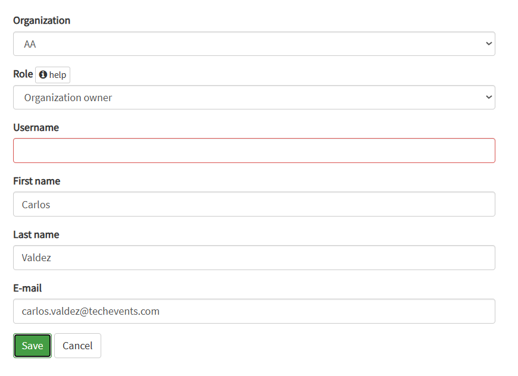
         
        Validación de obligatoriedad del campo username.
      </td>
    </tr>
  </tbody>
</table>

**CPF-15-024**
<table>
  <thead>
    <tr>
      <th>ID</th>
      <th>Descripción</th>
      <th>Tipo</th>
      <th>Estado</th>
      <th>Defectos</th>
    </tr>
  </thead>
  <tbody>
    <tr>
      <td>CPF-15-024</td>
      <td>No permitir la creación de usuarios cuando el nombre está vacío.</td>
      <td>Manual</td>
      <td>Exitoso</td>
      <td>No se encontraron defectos</td>
    </tr>
    <tr>
      <th colspan="2">Resultado esperado</th>
      <th colspan="3">Resultado obtenido</th>
    </tr>
    <tr>
      <td colspan="2">El sistema muestra error de validación y no permite guardar</td>
      <td colspan="3">Se bloqueó la creación del usuario al dejar vacío el campo nombre.</td>
    </tr>
    <tr>
      <th colspan="5">Evidencia</th>
    </tr>
    <tr>
      <td colspan="5">
        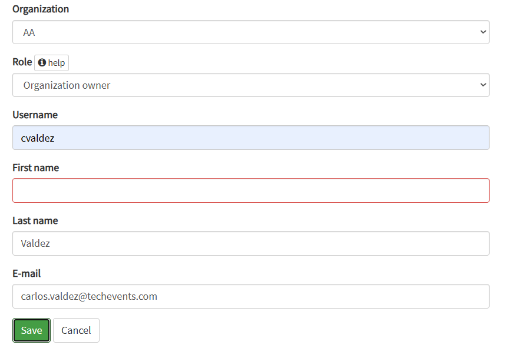
         
        Validación de obligatoriedad del campo nombre.
      </td>
    </tr>
  </tbody>
</table>

**CPF-15-025**
<table>
  <thead>
    <tr>
      <th>ID</th>
      <th>Descripción</th>
      <th>Tipo</th>
      <th>Estado</th>
      <th>Defectos</th>
    </tr>
  </thead>
  <tbody>
    <tr>
      <td>CPF-15-025</td>
      <td>No permitir la creación de usuarios cuando el apellido está vacío.</td>
      <td>Manual</td>
      <td>Exitoso</td>
      <td>No se encontraron defectos</td>
    </tr>
    <tr>
      <th colspan="2">Resultado esperado</th>
      <th colspan="3">Resultado obtenido</th>
    </tr>
    <tr>
      <td colspan="2">El sistema muestra error de validación y no permite guardar</td>
      <td colspan="3">Se bloqueó la creación del usuario al dejar vacío el campo apellido.</td>
    </tr>
    <tr>
      <th colspan="5">Evidencia</th>
    </tr>
    <tr>
      <td colspan="5">
        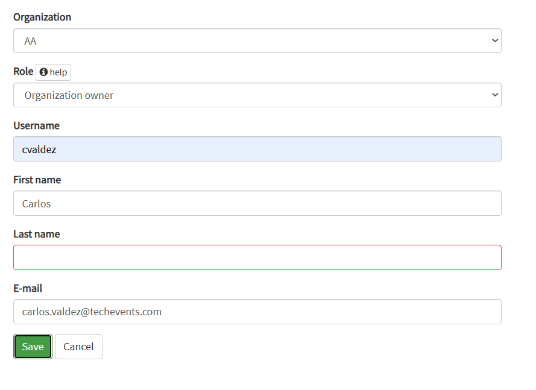
         
        Validación de obligatoriedad del campo apellido.
      </td>
    </tr>
  </tbody>
</table>

**CPF-15-026**
<table>
  <thead>
    <tr>
      <th>ID</th>
      <th>Descripción</th>
      <th>Tipo</th>
      <th>Estado</th>
      <th>Defectos</th>
    </tr>
  </thead>
  <tbody>
    <tr>
      <td>CPF-15-026</td>
      <td>No permitir la creación de usuarios cuando el correo electrónico está vacío.</td>
      <td>Manual</td>
      <td>Exitoso</td>
      <td>No se encontraron defectos</td>
    </tr>
    <tr>
      <th colspan="2">Resultado esperado</th>
      <th colspan="3">Resultado obtenido</th>
    </tr>
    <tr>
      <td colspan="2">El sistema muestra error de validación y no permite guardar</td>
      <td colspan="3">Se bloqueó la creación del usuario al dejar vacío el campo correo electrónico.</td>
    </tr>
    <tr>
      <th colspan="5">Evidencia</th>
    </tr>
    <tr>
      <td colspan="5">
        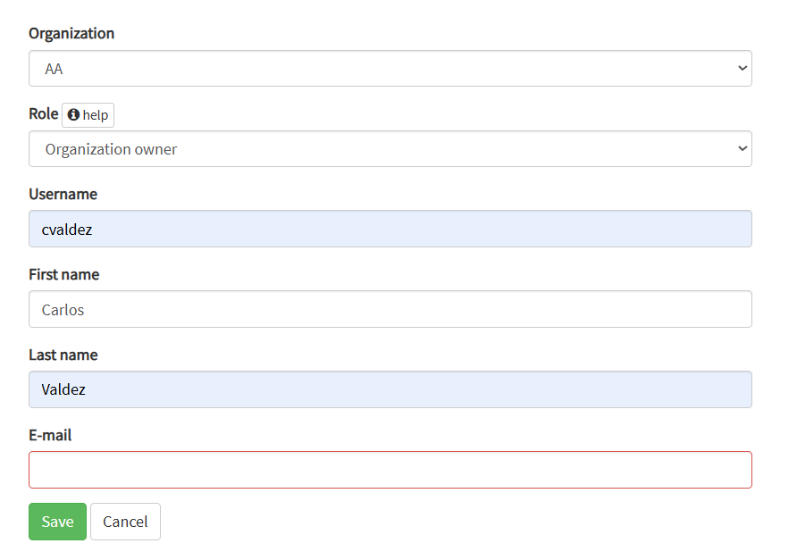
         
        Validación de obligatoriedad del campo correo electrónico.
      </td>
    </tr>
  </tbody>
</table>

**CPF-15-027**
<table>
  <thead>
    <tr>
      <th>ID</th>
      <th>Descripción</th>
      <th>Tipo</th>
      <th>Estado</th>
      <th>Defectos</th>
    </tr>
  </thead>
  <tbody>
    <tr>
      <td>CPF-15-027</td>
      <td>Permitir la creación de usuarios cuando todos los campos obligatorios han sido completados correctamente.</td>
      <td>Manual</td>
      <td>Exitoso</td>
      <td>No se encontraron defectos</td>
    </tr>
    <tr>
      <th colspan="2">Resultado esperado</th>
      <th colspan="3">Resultado obtenido</th>
    </tr>
    <tr>
      <td colspan="2">Usuario creado exitosamente</td>
      <td colspan="3">Usuario creado exitosamente con los datos proporcionados.</td>
    </tr>
    <tr>
      <th colspan="5">Evidencia</th>
    </tr>
    <tr>
      <td colspan="5">
        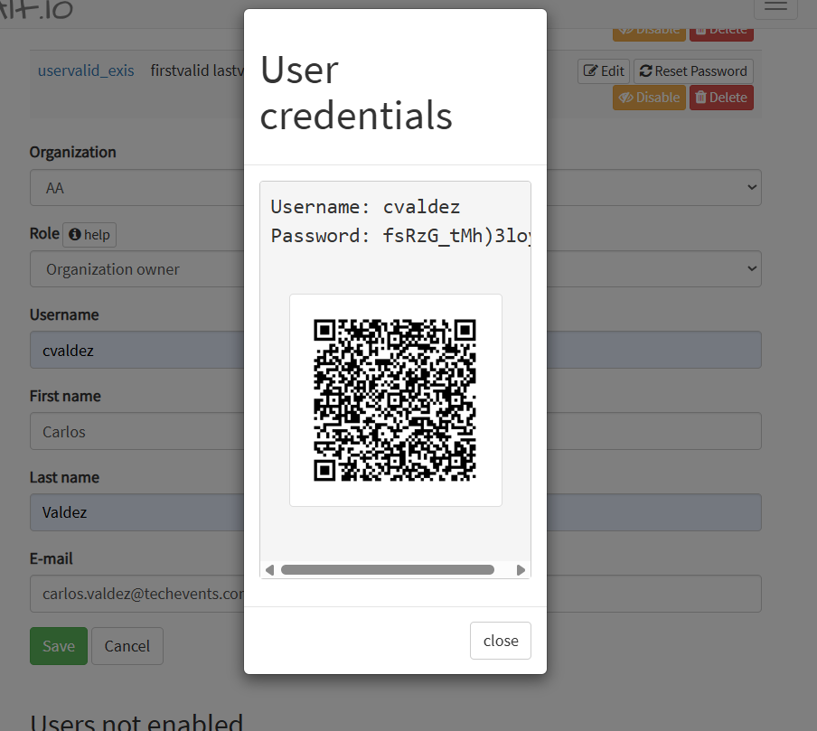
         
        Escenario exitoso de creación de usuario con todos los campos válidos.
      </td>
    </tr>
  </tbody>
</table>

### Selección de Entradas (Tickets)

**CPF-RES-01-001**
<table>
  <thead>
    <tr>
      <th>ID</th>
      <th>Descripción</th>
      <th>Tipo</th>
      <th>Estado</th>
      <th>Defectos</th>
    </tr>
  </thead>
  <tbody>
    <tr>
      <td>CPF-RES-01-001</td>
      <td>Verificar que no se permita avanzar con 0 entradas seleccionadas.</td>
      <td>Manual</td>
      <td>Exitoso</td>
      <td>No se encontraron defectos</td>
    </tr>
    <tr>
      <th colspan="2">Resultado esperado</th>
      <th colspan="3">Resultado obtenido</th>
    </tr>
    <tr>
      <td colspan="2">Error: seleccione al menos una entrada, no avanza</td>
      <td colspan="3">El sistema muestra el mensaje de error y no permite avanzar.</td>
    </tr>
    <tr>
      <th colspan="5">Evidencia</th>
    </tr>
    <tr>
      <td colspan="5">
        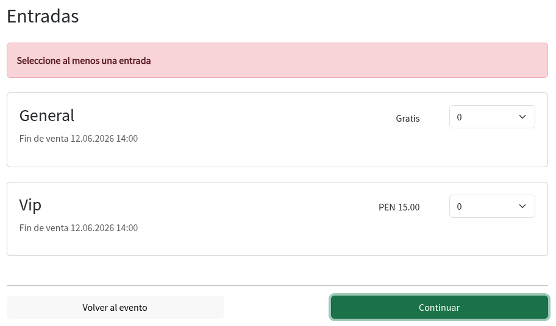
         
        Se muestra el mensaje de error al intentar continuar con 0 entradas.
      </td>
    </tr>
  </tbody>
</table>

**CPF-RES-01-002**
<table>
  <thead>
    <tr>
      <th>ID</th>
      <th>Descripción</th>
      <th>Tipo</th>
      <th>Estado</th>
      <th>Defectos</th>
    </tr>
  </thead>
  <tbody>
    <tr>
      <td>CPF-RES-01-002</td>
      <td>Verificar selección de entradas con dropdown (rango 0-5).</td>
      <td>Manual</td>
      <td>Exitoso</td>
      <td>No se encontraron defectos</td>
    </tr>
    <tr>
      <th colspan="2">Resultado esperado</th>
      <th colspan="3">Resultado obtenido</th>
    </tr>
    <tr>
      <td colspan="2">Dropdown muestra valores 0-5</td>
      <td colspan="3">El dropdown muestra valores predefinidos 0-5, no acepta valores negativos o superiores.</td>
    </tr>
    <tr>
      <th colspan="5">Evidencia</th>
    </tr>
    <tr>
      <td colspan="5">
        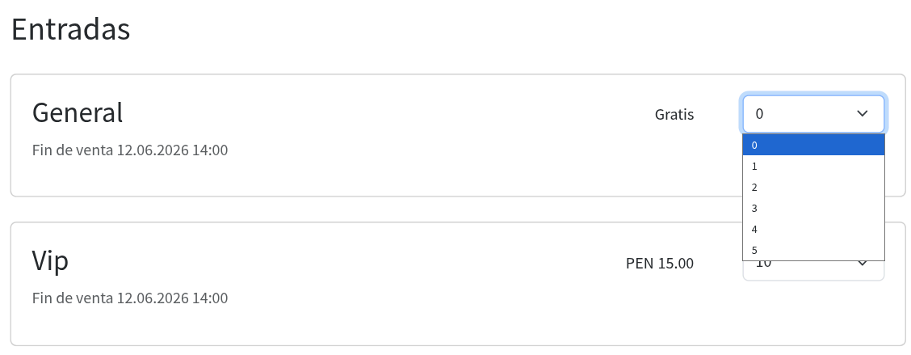
         
        Dropdown con rango 0-5 para primera categoría de entradas.
      </td>
    </tr>
  </tbody>
</table>

**CPF-RES-01-003**
<table>
  <thead>
    <tr>
      <th>ID</th>
      <th>Descripción</th>
      <th>Tipo</th>
      <th>Estado</th>
      <th>Defectos</th>
    </tr>
  </thead>
  <tbody>
    <tr>
      <td>CPF-RES-01-003</td>
      <td>Verificar selección de entradas con dropdown (rango 0-10).</td>
      <td>Manual</td>
      <td>Exitoso</td>
      <td>No se encontraron defectos</td>
    </tr>
    <tr>
      <th colspan="2">Resultado esperado</th>
      <th colspan="3">Resultado obtenido</th>
    </tr>
    <tr>
      <td colspan="2">Dropdown muestra valores 0-10</td>
      <td colspan="3">El dropdown muestra valores predefinidos 0-10, no acepta valores negativos o superiores.</td>
    </tr>
    <tr>
      <th colspan="5">Evidencia</th>
    </tr>
    <tr>
      <td colspan="5">
        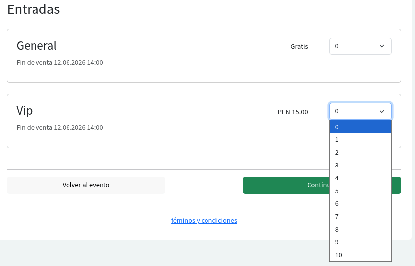
         
        Dropdown con rango 0-10 para segunda categoría de entradas.
      </td>
    </tr>
  </tbody>
</table>

**CPF-RES-01-004**
<table>
  <thead>
    <tr>
      <th>ID</th>
      <th>Descripción</th>
      <th>Tipo</th>
      <th>Estado</th>
      <th>Defectos</th>
    </tr>
  </thead>
  <tbody>
    <tr>
      <td>CPF-RES-01-004</td>
      <td>Verificar mensaje de error cuando no hay suficientes entradas disponibles.</td>
      <td>Manual</td>
      <td>Exitoso</td>
      <td>No se encontraron defectos</td>
    </tr>
    <tr>
      <th colspan="2">Resultado esperado</th>
      <th colspan="3">Resultado obtenido</th>
    </tr>
    <tr>
      <td colspan="2">Error: no hay suficientes entradas, bloquea selección</td>
      <td colspan="3">El sistema muestra mensaje de error y bloquea la selección.</td>
    </tr>
    <tr>
      <th colspan="5">Evidencia</th>
    </tr>
    <tr>
      <td colspan="5">
        
         
        Mensaje de error cuando no hay suficientes entradas disponibles.
      </td>
    </tr>
  </tbody>
</table>

**CPF-RES-01-005**
<table>
  <thead>
    <tr>
      <th>ID</th>
      <th>Descripción</th>
      <th>Tipo</th>
      <th>Estado</th>
      <th>Defectos</th>
    </tr>
  </thead>
  <tbody>
    <tr>
      <td>CPF-RES-01-005</td>
      <td>Verificar mensaje cuando todas las entradas están agotadas (sold out).</td>
      <td>Manual</td>
      <td>Exitoso</td>
      <td>No se encontraron defectos</td>
    </tr>
    <tr>
      <th colspan="2">Resultado esperado</th>
      <th colspan="3">Resultado obtenido</th>
    </tr>
    <tr>
      <td colspan="2">Mensaje: entradas agotadas (sold out)</td>
      <td colspan="3">El sistema muestra que todas las entradas están agotadas.</td>
    </tr>
    <tr>
      <th colspan="5">Evidencia</th>
    </tr>
    <tr>
      <td colspan="5">
        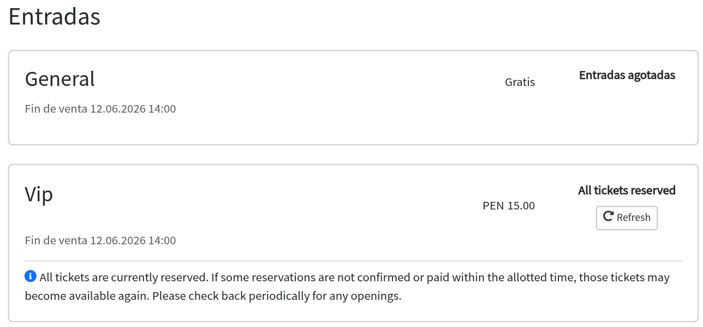
         
        Mensaje de entradas agotadas (sold out).
      </td>
    </tr>
  </tbody>
</table>

### Formulario de Asistente - Validación de Campos

**CPF-RES-02-001**
<table>
  <thead>
    <tr>
      <th>ID</th>
      <th>Descripción</th>
      <th>Tipo</th>
      <th>Estado</th>
      <th>Defectos</th>
    </tr>
  </thead>
  <tbody>
    <tr>
      <td>CPF-RES-02-001</td>
      <td>Verificar que los campos obligatorios muestren error al estar vacíos.</td>
      <td>Manual</td>
      <td>Exitoso</td>
      <td>No se encontraron defectos</td>
    </tr>
    <tr>
      <th colspan="2">Resultado esperado</th>
      <th colspan="3">Resultado obtenido</th>
    </tr>
    <tr>
      <td colspan="2">Error: "Nombre obligatorio"</td>
      <td colspan="3">El sistema muestra los mensajes de error y no permite continuar.</td>
    </tr>
    <tr>
      <th colspan="5">Evidencia</th>
    </tr>
    <tr>
      <td colspan="5">
        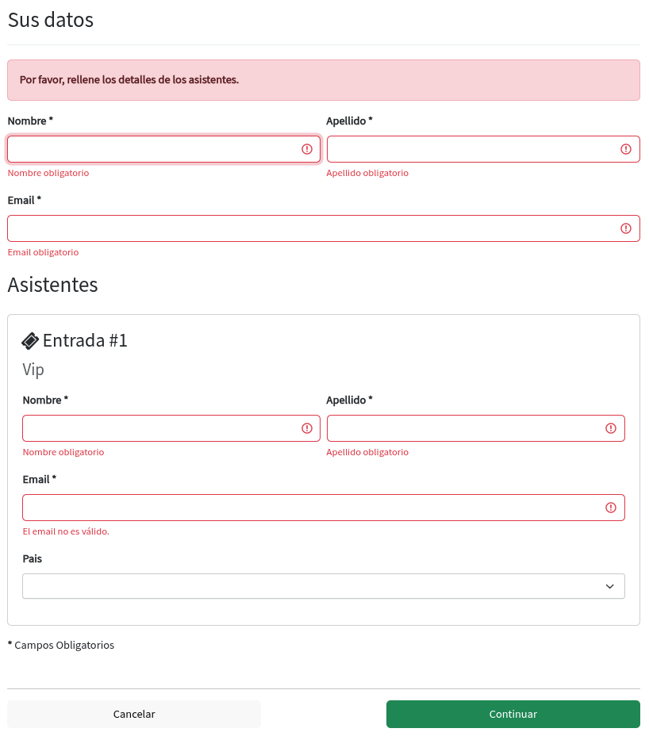
         
        Se muestran errores al presionar continuar con campos vacíos.
      </td>
    </tr>
  </tbody>
</table>

**CPF-RES-02-002**
<table>
  <thead>
    <tr>
      <th>ID</th>
      <th>Descripción</th>
      <th>Tipo</th>
      <th>Estado</th>
      <th>Defectos</th>
    </tr>
  </thead>
  <tbody>
    <tr>
      <td>CPF-RES-02-002</td>
      <td>Verificar llenado correcto de datos de asistente.</td>
      <td>Manual</td>
      <td>Exitoso</td>
      <td>No se encontraron defectos</td>
    </tr>
    <tr>
      <th colspan="2">Resultado esperado</th>
      <th colspan="3">Resultado obtenido</th>
    </tr>
    <tr>
      <td colspan="2">Formulario válido, permite continuar</td>
      <td colspan="3">El sistema permite continuar cuando los campos obligatorios están llenos.</td>
    </tr>
    <tr>
      <th colspan="5">Evidencia</th>
    </tr>
    <tr>
      <td colspan="5">
        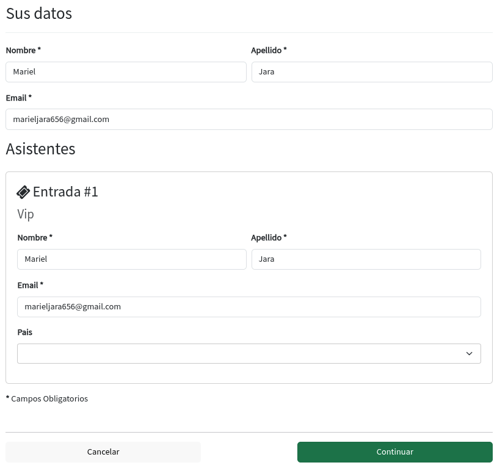
         
        Formulario completado con datos válidos.
      </td>
    </tr>
  </tbody>
</table>

**CPF-RES-02-003**
<table>
  <thead>
    <tr>
      <th>ID</th>
      <th>Descripción</th>
      <th>Tipo</th>
      <th>Estado</th>
      <th>Defectos</th>
    </tr>
  </thead>
  <tbody>
    <tr>
      <td>CPF-RES-02-003</td>
      <td>Verificar validación de formato de email.</td>
      <td>Manual</td>
      <td>Exitoso</td>
      <td>No se encontraron defectos</td>
    </tr>
    <tr>
      <th colspan="2">Resultado esperado</th>
      <th colspan="3">Resultado obtenido</th>
    </tr>
    <tr>
      <td colspan="2">Aceptar formato válido</td>
      <td colspan="3">El sistema valida correctamente el formato del correo electrónico.</td>
    </tr>
    <tr>
      <th colspan="5">Evidencia</th>
    </tr>
    <tr>
      <td colspan="5">
        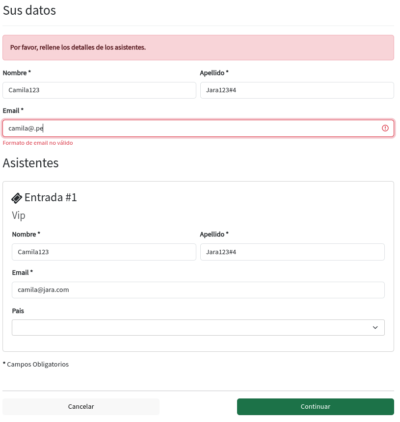
         
        Validación de email permite formatos válidos.
      </td>
    </tr>
  </tbody>
</table>

**CPF-RES-02-004**
<table>
  <thead>
    <tr>
      <th>ID</th>
      <th>Descripción</th>
      <th>Tipo</th>
      <th>Estado</th>
      <th>Defectos</th>
    </tr>
  </thead>
  <tbody>
    <tr>
      <td>CPF-RES-02-004</td>
      <td>Verificar que se puedan usar diferentes nombres para asistente y comprador.</td>
      <td>Manual</td>
      <td>Exitoso</td>
      <td>No se encontraron defectos</td>
    </tr>
    <tr>
      <th colspan="2">Resultado esperado</th>
      <th colspan="3">Resultado obtenido</th>
    </tr>
    <tr>
      <td colspan="2">Nombres diferentes aceptados</td>
      <td colspan="3">El sistema acepta que los datos del comprador sean distintos a los del asistente.</td>
    </tr>
    <tr>
      <th colspan="5">Evidencia</th>
    </tr>
    <tr>
      <td colspan="5">
        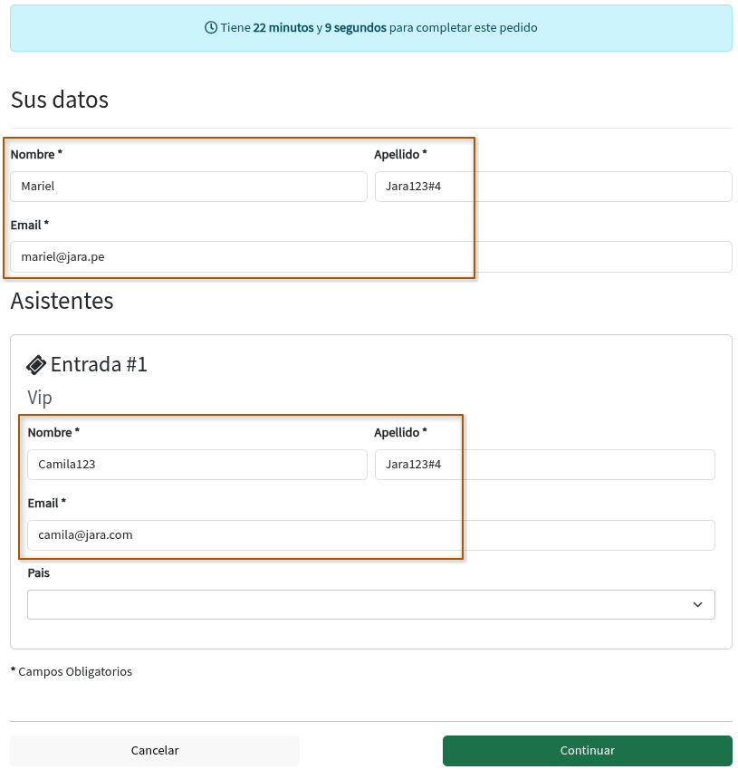
         
        Se permite registrar diferentes nombres para comprador y asistente.
      </td>
    </tr>
  </tbody>
</table>

**CPF-RES-02-005**
<table>
  <thead>
    <tr>
      <th>ID</th>
      <th>Descripción</th>
      <th>Tipo</th>
      <th>Estado</th>
      <th>Defectos</th>
    </tr>
  </thead>
  <tbody>
    <tr>
      <td>CPF-RES-02-005</td>
      <td>Verificar campos obligatorios para múltiples entradas.</td>
      <td>Manual</td>
      <td>Exitoso</td>
      <td>No se encontraron defectos</td>
    </tr>
    <tr>
      <th colspan="2">Resultado esperado</th>
      <th colspan="3">Resultado obtenido</th>
    </tr>
    <tr>
      <td colspan="2">Formularios para ambos asistentes visibles</td>
      <td colspan="3">El sistema solicita los datos de todos los asistentes cuando se compran múltiples entradas.</td>
    </tr>
    <tr>
      <th colspan="5">Evidencia</th>
    </tr>
    <tr>
      <td colspan="5">
        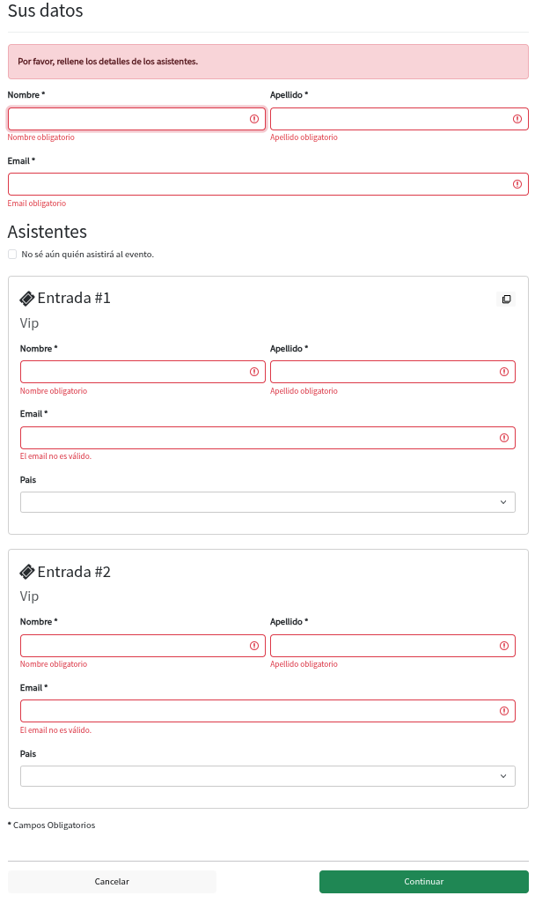
         
        Campos obligatorios para cada asistente adicional.
      </td>
    </tr>
  </tbody>
</table>

**CPF-RES-02-006**
<table>
  <thead>
    <tr>
      <th>ID</th>
      <th>Descripción</th>
      <th>Tipo</th>
      <th>Estado</th>
      <th>Defectos</th>
    </tr>
  </thead>
  <tbody>
    <tr>
      <td>CPF-RES-02-006</td>
      <td>Verificar opción de ocultar campos de asistentes adicionales.</td>
      <td>Manual</td>
      <td>Exitoso</td>
      <td>No se encontraron defectos</td>
    </tr>
    <tr>
      <th colspan="2">Resultado esperado</th>
      <th colspan="3">Resultado obtenido</th>
    </tr>
    <tr>
      <td colspan="2">Campos de asistentes ocultos, permite continuar</td>
      <td colspan="3">Al marcar el checkbox, se ocultan los campos de asistentes y se permite continuar.</td>
    </tr>
    <tr>
      <th colspan="5">Evidencia</th>
    </tr>
    <tr>
      <td colspan="5">
        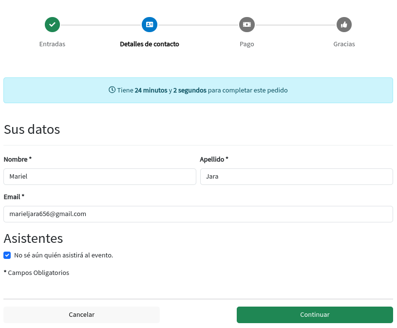
         
        Checkbox para ocultar campos de asistentes adicionales.
      </td>
    </tr>
  </tbody>
</table>

**CPF-RES-02-007**
<table>
  <thead>
    <tr>
      <th>ID</th>
      <th>Descripción</th>
      <th>Tipo</th>
      <th>Estado</th>
      <th>Defectos</th>
    </tr>
  </thead>
  <tbody>
    <tr>
      <td>CPF-RES-02-007</td>
      <td>Verificar límite de 255 caracteres en campos de texto.</td>
      <td>Manual</td>
      <td>Exitoso</td>
      <td>No se encontraron defectos</td>
    </tr>
    <tr>
      <th colspan="2">Resultado esperado</th>
      <th colspan="3">Resultado obtenido</th>
    </tr>
    <tr>
      <td colspan="2">Error de validación</td>
      <td colspan="3">Se muestra error de validación al ingresar 256 caracteres.</td>
    </tr>
    <tr>
      <th colspan="5">Evidencia</th>
    </tr>
    <tr>
      <td colspan="5">
        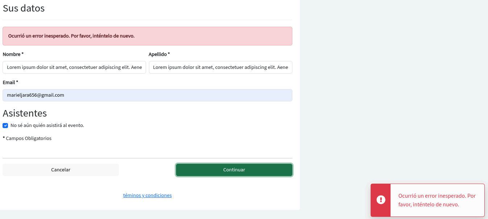
         
        Error de validación al usar 256 caracteres.
      </td>
    </tr>
  </tbody>
</table>

**CPF-RES-02-008**
<table>
  <thead>
    <tr>
      <th>ID</th>
      <th>Descripción</th>
      <th>Tipo</th>
      <th>Estado</th>
      <th>Defectos</th>
    </tr>
  </thead>
  <tbody>
    <tr>
      <td>CPF-RES-02-008</td>
      <td>Verificar que 100 caracteres sean aceptados.</td>
      <td>Manual</td>
      <td>Exitoso</td>
      <td>No se encontraron defectos</td>
    </tr>
    <tr>
      <th colspan="2">Resultado esperado</th>
      <th colspan="3">Resultado obtenido</th>
    </tr>
    <tr>
      <td colspan="2">Aceptar y guardar</td>
      <td colspan="3">Los 100 caracteres son aceptados y guardados correctamente.</td>
    </tr>
    <tr>
      <th colspan="5">Evidencia</th>
    </tr>
    <tr>
      <td colspan="5">
        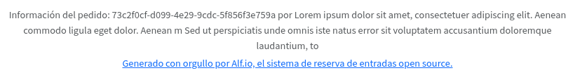
         
        100 caracteres aceptados y visibles en la confirmación.
      </td>
    </tr>
  </tbody>
</table>

**CPF-RES-02-009**
<table>
  <thead>
    <tr>
      <th>ID</th>
      <th>Descripción</th>
      <th>Tipo</th>
      <th>Estado</th>
      <th>Defectos</th>
    </tr>
  </thead>
  <tbody>
    <tr>
      <td>CPF-RES-02-009</td>
      <td>Verificar que 255 caracteres sean aceptados (límite válido).</td>
      <td>Manual</td>
      <td>Exitoso</td>
      <td>No se encontraron defectos</td>
    </tr>
    <tr>
      <th colspan="2">Resultado esperado</th>
      <th colspan="3">Resultado obtenido</th>
    </tr>
    <tr>
      <td colspan="2">Aceptar y guardar</td>
      <td colspan="3">Los 255 caracteres son aceptados y guardados correctamente.</td>
    </tr>
    <tr>
      <th colspan="5">Evidencia</th>
    </tr>
    <tr>
      <td colspan="5">
        
         
        255 caracteres aceptados como longitud máxima válida.
      </td>
    </tr>
  </tbody>
</table>

**CPF-RES-02-010**
<table>
  <thead>
    <tr>
      <th>ID</th>
      <th>Descripción</th>
      <th>Tipo</th>
      <th>Estado</th>
      <th>Defectos</th>
    </tr>
  </thead>
  <tbody>
    <tr>
      <td>CPF-RES-02-010</td>
      <td>Verificar campos personalizados en el formulario de asistente.</td>
      <td>Manual</td>
      <td>Exitoso</td>
      <td>No se encontraron defectos</td>
    </tr>
    <tr>
      <th colspan="2">Resultado esperado</th>
      <th colspan="3">Resultado obtenido</th>
    </tr>
    <tr>
      <td colspan="2">Campos personalizados visibles en formulario</td>
      <td colspan="3">Los campos personalizados aparecen condicionalmente según la configuración regional.</td>
    </tr>
    <tr>
      <th colspan="5">Evidencia</th>
    </tr>
    <tr>
      <td colspan="5">
        
         
        Campos personalizados visibles en el formulario (ej: configuración regional como Perú).
      </td>
    </tr>
  </tbody>
</table>

### Tiempo de Expiración de Reserva (Countdown)

**CPF-RES-03-001**
<table>
  <thead>
    <tr>
      <th>ID</th>
      <th>Descripción</th>
      <th>Tipo</th>
      <th>Estado</th>
      <th>Defectos</th>
    </tr>
  </thead>
  <tbody>
    <tr>
      <td>CPF-RES-03-001</td>
      <td>Verificar color azul del contador con tiempo > 5 minutos.</td>
      <td>Manual</td>
      <td>Exitoso</td>
      <td>No se encontraron defectos</td>
    </tr>
    <tr>
      <th colspan="2">Resultado esperado</th>
      <th colspan="3">Resultado obtenido</th>
    </tr>
    <tr>
      <td colspan="2">Contador azul</td>
      <td colspan="3">El contador muestra color azul cuando el tiempo restante es mayor a 5 minutos.</td>
    </tr>
    <tr>
      <th colspan="5">Evidencia</th>
    </tr>
    <tr>
      <td colspan="5">
        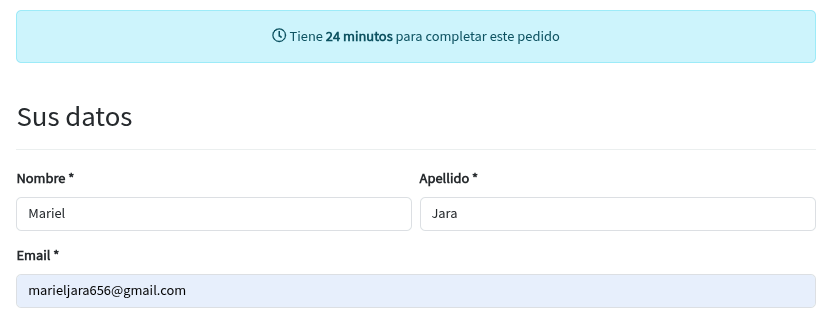
         
        Contador azul con tiempo inicial de 24 minutos.
      </td>
    </tr>
  </tbody>
</table>

**CPF-RES-03-002**
<table>
  <thead>
    <tr>
      <th>ID</th>
      <th>Descripción</th>
      <th>Tipo</th>
      <th>Estado</th>
      <th>Defectos</th>
    </tr>
  </thead>
  <tbody>
    <tr>
      <td>CPF-RES-03-002</td>
      <td>Verificar color azul del contador a los 15 minutos.</td>
      <td>Manual</td>
      <td>Exitoso</td>
      <td>No se encontraron defectos</td>
    </tr>
    <tr>
      <th colspan="2">Resultado esperado</th>
      <th colspan="3">Resultado obtenido</th>
    </tr>
    <tr>
      <td colspan="2">Contador azul</td>
      <td colspan="3">El contador continúa mostrando color azul.</td>
    </tr>
    <tr>
      <th colspan="5">Evidencia</th>
    </tr>
    <tr>
      <td colspan="5">
        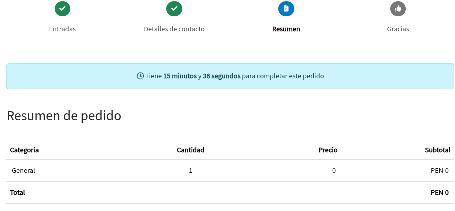
         
        Contador azul a los 15 minutos restantes.
      </td>
    </tr>
  </tbody>
</table>

**CPF-RES-03-003**
<table>
  <thead>
    <tr>
      <th>ID</th>
      <th>Descripción</th>
      <th>Tipo</th>
      <th>Estado</th>
      <th>Defectos</th>
    </tr>
  </thead>
  <tbody>
    <tr>
      <td>CPF-RES-03-003</td>
      <td>Verificar color azul del contador cerca de los 10 minutos.</td>
      <td>Manual</td>
      <td>Exitoso</td>
      <td>No se encontraron defectos</td>
    </tr>
    <tr>
      <th colspan="2">Resultado esperado</th>
      <th colspan="3">Resultado obtenido</th>
    </tr>
    <tr>
      <td colspan="2">Contador azul</td>
      <td colspan="3">El contador continúa mostrando color azul.</td>
    </tr>
    <tr>
      <th colspan="5">Evidencia</th>
    </tr>
    <tr>
      <td colspan="5">
        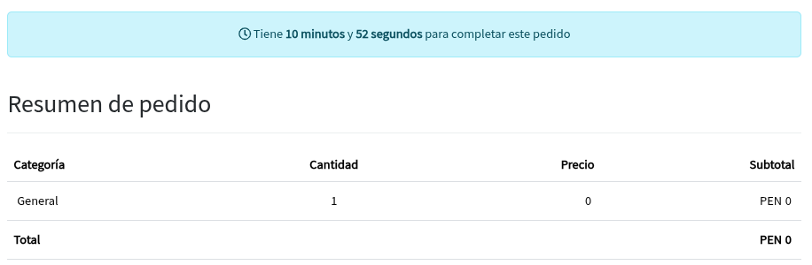
         
        Contador azul a los 10 minutos con 52 segundos restantes.
      </td>
    </tr>
  </tbody>
</table>

**CPF-RES-03-004**
<table>
  <thead>
    <tr>
      <th>ID</th>
      <th>Descripción</th>
      <th>Tipo</th>
      <th>Estado</th>
      <th>Defectos</th>
    </tr>
  </thead>
  <tbody>
    <tr>
      <td>CPF-RES-03-004</td>
      <td>Verificar cambio a color amarillo cuando el tiempo es <= 5 minutos.</td>
      <td>Manual</td>
      <td>Exitoso</td>
      <td>No se encontraron defectos</td>
    </tr>
    <tr>
      <th colspan="2">Resultado esperado</th>
      <th colspan="3">Resultado obtenido</th>
    </tr>
    <tr>
      <td colspan="2">Contador amarillo</td>
      <td colspan="3">El contador cambia al estilo de alerta amarilla.</td>
    </tr>
    <tr>
      <th colspan="5">Evidencia</th>
    </tr>
    <tr>
      <td colspan="5">
        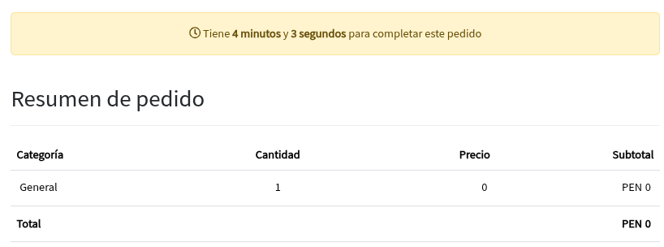
         
        Contador cambia a amarillo cuando quedan menos de 5 minutos.
      </td>
    </tr>
  </tbody>
</table>

**CPF-RES-03-005**
<table>
  <thead>
    <tr>
      <th>ID</th>
      <th>Descripción</th>
      <th>Tipo</th>
      <th>Estado</th>
      <th>Defectos</th>
    </tr>
  </thead>
  <tbody>
    <tr>
      <td>CPF-RES-03-005</td>
      <td>Verificar cambio a color rojo cuando el tiempo es <= 1 minuto.</td>
      <td>Manual</td>
      <td>Exitoso</td>
      <td>No se encontraron defectos</td>
    </tr>
    <tr>
      <th colspan="2">Resultado esperado</th>
      <th colspan="3">Resultado obtenido</th>
    </tr>
    <tr>
      <td colspan="2">Contador rojo</td>
      <td colspan="3">El contador cambia al estilo de alerta roja.</td>
    </tr>
    <tr>
      <th colspan="5">Evidencia</th>
    </tr>
    <tr>
      <td colspan="5">
        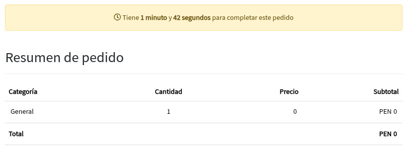
         
        Contador cambia a rojo cuando queda menos de 1 minuto.
      </td>
    </tr>
  </tbody>
</table>

**CPF-RES-03-006**
<table>
  <thead>
    <tr>
      <th>ID</th>
      <th>Descripción</th>
      <th>Tipo</th>
      <th>Estado</th>
      <th>Defectos</th>
    </tr>
  </thead>
  <tbody>
    <tr>
      <td>CPF-RES-03-006</td>
      <td>Verificar modal de expiración cuando el tiempo llega a 0.</td>
      <td>Manual</td>
      <td>Exitoso</td>
      <td>No se encontraron defectos</td>
    </tr>
    <tr>
      <th colspan="2">Resultado esperado</th>
      <th colspan="3">Resultado obtenido</th>
    </tr>
    <tr>
      <td colspan="2">Modal "La sesión ha expirado" con opción volver al inicio</td>
      <td colspan="3">El sistema muestra el modal de expiración de sesión.</td>
    </tr>
    <tr>
      <th colspan="5">Evidencia</th>
    </tr>
    <tr>
      <td colspan="5">
        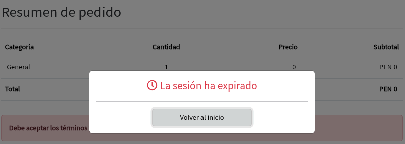
         
        Modal de sesión expirada con opción de volver al inicio.
      </td>
    </tr>
  </tbody>
</table>

### Aceptación de Términos y Condiciones

**CPF-RES-04-001**
<table>
  <thead>
    <tr>
      <th>ID</th>
      <th>Descripción</th>
      <th>Tipo</th>
      <th>Estado</th>
      <th>Defectos</th>
    </tr>
  </thead>
  <tbody>
    <tr>
      <td>CPF-RES-04-001</td>
      <td>Verificar que el botón de pago esté deshabilitado sin aceptar términos.</td>
      <td>Manual</td>
      <td>Exitoso</td>
      <td>No se encontraron defectos</td>
    </tr>
    <tr>
      <th colspan="2">Resultado esperado</th>
      <th colspan="3">Resultado obtenido</th>
    </tr>
    <tr>
      <td colspan="2">Botón deshabilitado</td>
      <td colspan="3">El sistema no permite continuar sin aceptar los términos y condiciones.</td>
    </tr>
    <tr>
      <th colspan="5">Evidencia</th>
    </tr>
    <tr>
      <td colspan="5">
        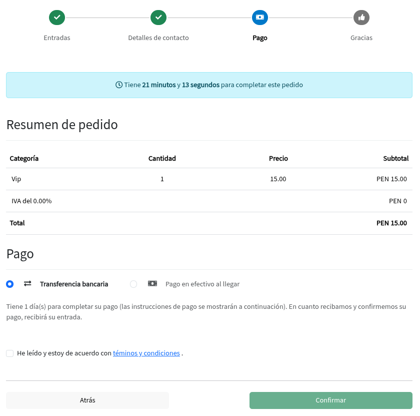
         
        Botón de pago deshabilitado sin aceptación de términos.
      </td>
    </tr>
  </tbody>
</table>

**CPF-RES-04-002**
<table>
  <thead>
    <tr>
      <th>ID</th>
      <th>Descripción</th>
      <th>Tipo</th>
      <th>Estado</th>
      <th>Defectos</th>
    </tr>
  </thead>
  <tbody>
    <tr>
      <td>CPF-RES-04-002</td>
      <td>Verificar que el botón permanezca deshabilitado con solo 1 checkbox marcado.</td>
      <td>Manual</td>
      <td>Exitoso</td>
      <td>No se encontraron defectos</td>
    </tr>
    <tr>
      <th colspan="2">Resultado esperado</th>
      <th colspan="3">Resultado obtenido</th>
    </tr>
    <tr>
      <td colspan="2">Botón deshabilitado</td>
      <td colspan="3">El botón permanece deshabilitado con solo un término aceptado.</td>
    </tr>
    <tr>
      <th colspan="5">Evidencia</th>
    </tr>
    <tr>
      <td colspan="5">
        
         
        Botón de pago sigue deshabilitado con 1 de 3 términos aceptados.
      </td>
    </tr>
  </tbody>
</table>

**CPF-RES-04-003**
<table>
  <thead>
    <tr>
      <th>ID</th>
      <th>Descripción</th>
      <th>Tipo</th>
      <th>Estado</th>
      <th>Defectos</th>
    </tr>
  </thead>
  <tbody>
    <tr>
      <td>CPF-RES-04-003</td>
      <td>Verificar que el botón permanezca deshabilitado con 2 checkboxes marcados.</td>
      <td>Manual</td>
      <td>Exitoso</td>
      <td>No se encontraron defectos</td>
    </tr>
    <tr>
      <th colspan="2">Resultado esperado</th>
      <th colspan="3">Resultado obtenido</th>
    </tr>
    <tr>
      <td colspan="2">Botón deshabilitado</td>
      <td colspan="3">El botón permanece deshabilitado con dos términos aceptados.</td>
    </tr>
    <tr>
      <th colspan="5">Evidencia</th>
    </tr>
    <tr>
      <td colspan="5">
        
         
        Botón de pago sigue deshabilitado con 2 de 3 términos aceptados.
      </td>
    </tr>
  </tbody>
</table>

**CPF-RES-04-004**
<table>
  <thead>
    <tr>
      <th>ID</th>
      <th>Descripción</th>
      <th>Tipo</th>
      <th>Estado</th>
      <th>Defectos</th>
    </tr>
  </thead>
  <tbody>
    <tr>
      <td>CPF-RES-04-004</td>
      <td>Verificar que al marcar checkbox se habilite el botón de pago.</td>
      <td>Manual</td>
      <td>Exitoso</td>
      <td>No se encontraron defectos</td>
    </tr>
    <tr>
      <th colspan="2">Resultado esperado</th>
      <th colspan="3">Resultado obtenido</th>
    </tr>
    <tr>
      <td colspan="2">Botón habilitado</td>
      <td colspan="3">Al hacer click en el checkbox, el botón se activa.</td>
    </tr>
    <tr>
      <th colspan="5">Evidencia</th>
    </tr>
    <tr>
      <td colspan="5">
        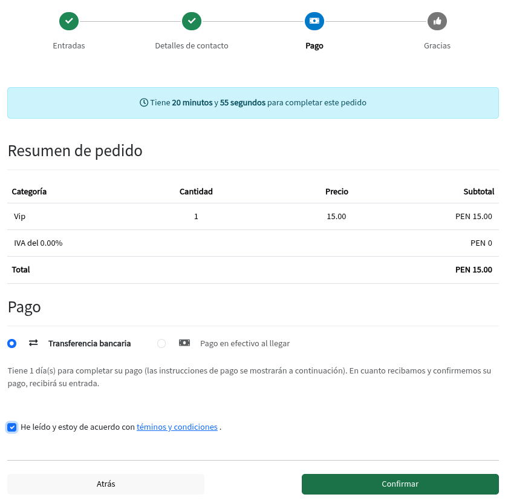
         
        Botón de pago habilitado tras aceptar términos.
      </td>
    </tr>
  </tbody>
</table>

**CPF-RES-04-005**
<table>
  <thead>
    <tr>
      <th>ID</th>
      <th>Descripción</th>
      <th>Tipo</th>
      <th>Estado</th>
      <th>Defectos</th>
    </tr>
  </thead>
  <tbody>
    <tr>
      <td>CPF-RES-04-005</td>
      <td>Verificar error al no aceptar términos en evento gratuito.</td>
      <td>Manual</td>
      <td>Exitoso</td>
      <td>No se encontraron defectos</td>
    </tr>
    <tr>
      <th colspan="2">Resultado esperado</th>
      <th colspan="3">Resultado obtenido</th>
    </tr>
    <tr>
      <td colspan="2">Error: aceptar términos requerido</td>
      <td colspan="3">El sistema muestra mensaje de error aunque sea un evento gratuito.</td>
    </tr>
    <tr>
      <th colspan="5">Evidencia</th>
    </tr>
    <tr>
      <td colspan="5">
        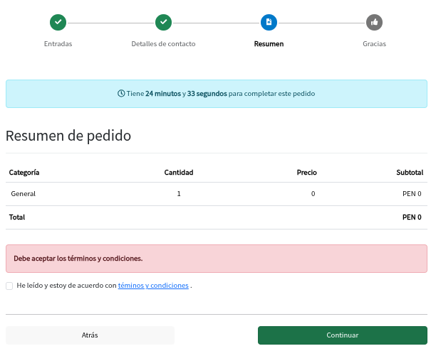
         
        Error al intentar continuar sin aceptar términos en evento gratuito.
      </td>
    </tr>
  </tbody>
</table>

### Reserva Completada - Confirmación y Descarga

**CPF-RES-05-001**
<table>
  <thead>
    <tr>
      <th>ID</th>
      <th>Descripción</th>
      <th>Tipo</th>
      <th>Estado</th>
      <th>Defectos</th>
    </tr>
  </thead>
  <tbody>
    <tr>
      <td>CPF-RES-05-001</td>
      <td>Verificar barra de carga durante procesamiento.</td>
      <td>Manual</td>
      <td>Exitoso</td>
      <td>No se encontraron defectos</td>
    </tr>
    <tr>
      <th colspan="2">Resultado esperado</th>
      <th colspan="3">Resultado obtenido</th>
    </tr>
    <tr>
      <td colspan="2">Barra de carga visible</td>
      <td colspan="3">Se muestra una barra de carga durante el procesamiento (rápida para pocas entradas).</td>
    </tr>
    <tr>
      <th colspan="5">Evidencia</th>
    </tr>
    <tr>
      <td colspan="5">
        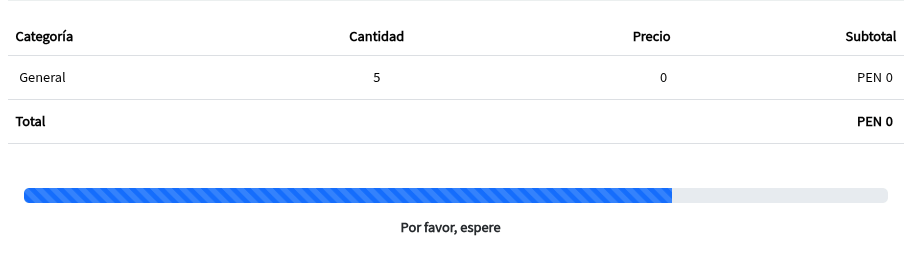
         
        Barra de carga visible durante el procesamiento.
      </td>
    </tr>
  </tbody>
</table>

**CPF-RES-05-002**
<table>
  <thead>
    <tr>
      <th>ID</th>
      <th>Descripción</th>
      <th>Tipo</th>
      <th>Estado</th>
      <th>Defectos</th>
    </tr>
  </thead>
  <tbody>
    <tr>
      <td>CPF-RES-05-002</td>
      <td>Verificar página de confirmación de reserva completada.</td>
      <td>Manual</td>
      <td>Exitoso</td>
      <td>No se encontraron defectos</td>
    </tr>
    <tr>
      <th colspan="2">Resultado esperado</th>
      <th colspan="3">Resultado obtenido</th>
    </tr>
    <tr>
      <td colspan="2">Página "La riserva è stata completata" con datos</td>
      <td colspan="3">La página muestra "La riserva è stata completata" con los datos del comprador.</td>
    </tr>
    <tr>
      <th colspan="5">Evidencia</th>
    </tr>
    <tr>
      <td colspan="5">
        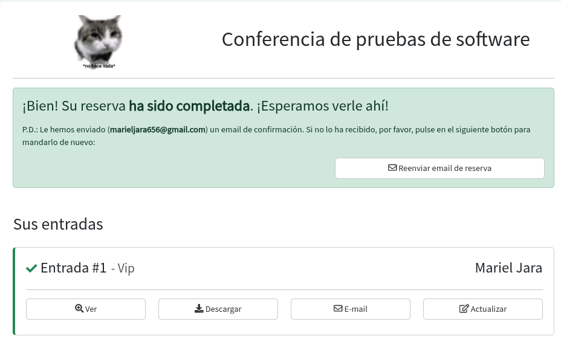
         
        Confirmación de reserva completada exitosamente.
      </td>
    </tr>
  </tbody>
</table>

**CPF-RES-05-003**
<table>
  <thead>
    <tr>
      <th>ID</th>
      <th>Descripción</th>
      <th>Tipo</th>
      <th>Estado</th>
      <th>Defectos</th>
    </tr>
  </thead>
  <tbody>
    <tr>
      <td>CPF-RES-05-003</td>
      <td>Verificar descarga de PDF de entradas.</td>
      <td>Manual</td>
      <td>Exitoso</td>
      <td>No se encontraron defectos</td>
    </tr>
    <tr>
      <th colspan="2">Resultado esperado</th>
      <th colspan="3">Resultado obtenido</th>
    </tr>
    <tr>
      <td colspan="2">Botón de descarga PDF visible</td>
      <td colspan="3">El sistema genera y permite descargar el PDF con los códigos QR.</td>
    </tr>
    <tr>
      <th colspan="5">Evidencia</th>
    </tr>
    <tr>
      <td colspan="5">
        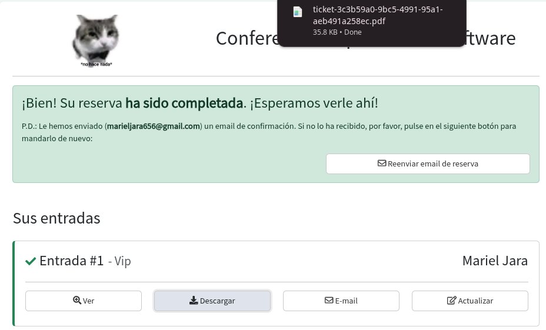
         
        Botón para descargar PDF de entradas.
      </td>
    </tr>
  </tbody>
</table>

**CPF-RES-05-004**
<table>
  <thead>
    <tr>
      <th>ID</th>
      <th>Descripción</th>
      <th>Tipo</th>
      <th>Estado</th>
      <th>Defectos</th>
    </tr>
  </thead>
  <tbody>
    <tr>
      <td>CPF-RES-05-004</td>
      <td>Verificar contenido del PDF generado.</td>
      <td>Manual</td>
      <td>Exitoso</td>
      <td>No se encontraron defectos</td>
    </tr>
    <tr>
      <th colspan="2">Resultado esperado</th>
      <th colspan="3">Resultado obtenido</th>
    </tr>
    <tr>
      <td colspan="2">Contiene códigos QR y datos completos</td>
      <td colspan="3">El PDF generado incluye la información completa de las entradas.</td>
    </tr>
    <tr>
      <th colspan="5">Evidencia</th>
    </tr>
    <tr>
      <td colspan="5">
        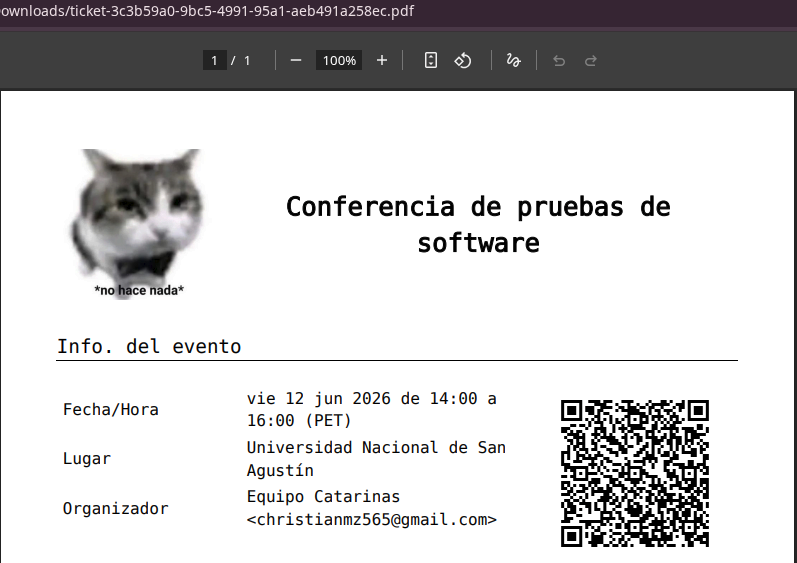
         
        Contenido del PDF con códigos QR y datos de entrada.
      </td>
    </tr>
  </tbody>
</table>

**CPF-RES-05-005**
<table>
  <thead>
    <tr>
      <th>ID</th>
      <th>Descripción</th>
      <th>Tipo</th>
      <th>Estado</th>
      <th>Defectos</th>
    </tr>
  </thead>
  <tbody>
    <tr>
      <td>CPF-RES-05-005</td>
      <td>Verificar envío de email de confirmación.</td>
      <td>Manual</td>
      <td>Exitoso</td>
      <td>No se encontraron defectos</td>
    </tr>
    <tr>
      <th colspan="2">Resultado esperado</th>
      <th colspan="3">Resultado obtenido</th>
    </tr>
    <tr>
      <td colspan="2">Email enviado con confirmación</td>
      <td colspan="3">El sistema muestra mensaje de "Email enviado" tras reenviar.</td>
    </tr>
    <tr>
      <th colspan="5">Evidencia</th>
    </tr>
    <tr>
      <td colspan="5">
        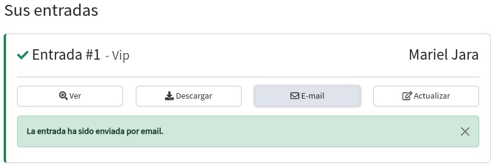
         
        Mensaje de confirmación de email enviado.
      </td>
    </tr>
  </tbody>
</table>

**CPF-RES-05-006**
<table>
  <thead>
    <tr>
      <th>ID</th>
      <th>Descripción</th>
      <th>Tipo</th>
      <th>Estado</th>
      <th>Defectos</th>
    </tr>
  </thead>
  <tbody>
    <tr>
      <td>CPF-RES-05-006</td>
      <td>Verificar visualización de entradas en el email.</td>
      <td>Manual</td>
      <td>Exitoso</td>
      <td>No se encontraron defectos</td>
    </tr>
    <tr>
      <th colspan="2">Resultado esperado</th>
      <th colspan="3">Resultado obtenido</th>
    </tr>
    <tr>
      <td colspan="2">Contiene entradas con códigos QR</td>
      <td colspan="3">El email recibido muestra las entradas registradas.</td>
    </tr>
    <tr>
      <th colspan="5">Evidencia</th>
    </tr>
    <tr>
      <td colspan="5">
        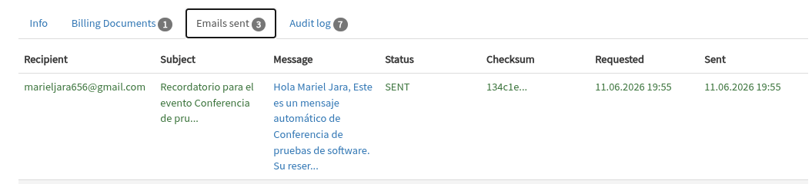
         
        Entradas visibles en el email de confirmación.
      </td>
    </tr>
  </tbody>
</table>

### Panel de Administración - Gestión de Reservas

**CPF-RES-06-001**
<table>
  <thead>
    <tr>
      <th>ID</th>
      <th>Descripción</th>
      <th>Tipo</th>
      <th>Estado</th>
      <th>Defectos</th>
    </tr>
  </thead>
  <tbody>
    <tr>
      <td>CPF-RES-06-001</td>
      <td>Verificar visualización de reserva en el panel de administración.</td>
      <td>Manual</td>
      <td>Exitoso</td>
      <td>No se encontraron defectos</td>
    </tr>
    <tr>
      <th colspan="2">Resultado esperado</th>
      <th colspan="3">Resultado obtenido</th>
    </tr>
    <tr>
      <td colspan="2">Reserva visible en el listado</td>
      <td colspan="3">La reserva completada se muestra correctamente en el manager.</td>
    </tr>
    <tr>
      <th colspan="5">Evidencia</th>
    </tr>
    <tr>
      <td colspan="5">
        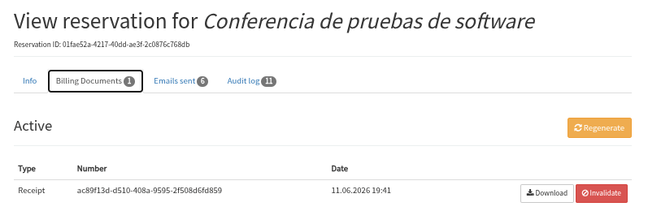
         
        Reserva visible en el panel de administración.
      </td>
    </tr>
  </tbody>
</table>

**CPF-RES-06-002**
<table>
  <thead>
    <tr>
      <th>ID</th>
      <th>Descripción</th>
      <th>Tipo</th>
      <th>Estado</th>
      <th>Defectos</th>
    </tr>
  </thead>
  <tbody>
    <tr>
      <td>CPF-RES-06-002</td>
      <td>Verificar opción de imprimir recibo desde el manager.</td>
      <td>Manual</td>
      <td>Exitoso</td>
      <td>No se encontraron defectos</td>
    </tr>
    <tr>
      <th colspan="2">Resultado esperado</th>
      <th colspan="3">Resultado obtenido</th>
    </tr>
    <tr>
      <td colspan="2">Boleta disponible para impresión</td>
      <td colspan="3">Se puede acceder a la impresión del recibo desde el panel.</td>
    </tr>
    <tr>
      <th colspan="5">Evidencia</th>
    </tr>
    <tr>
      <td colspan="5">
        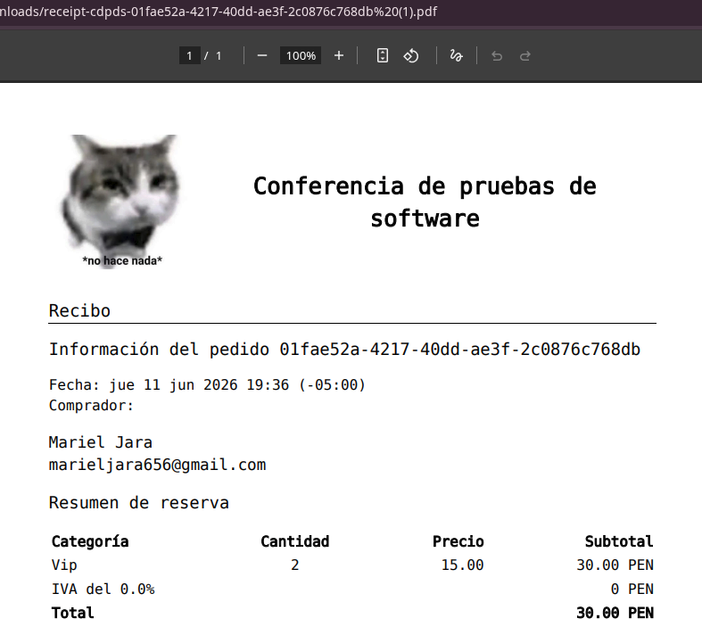
         
        Opción de imprimir boleta visible en el manager.
      </td>
    </tr>
  </tbody>
</table>

### Campos Personalizados

**CPF-RES-07-001**
<table>
  <thead>
    <tr>
      <th>ID</th>
      <th>Descripción</th>
      <th>Tipo</th>
      <th>Estado</th>
      <th>Defectos</th>
    </tr>
  </thead>
  <tbody>
    <tr>
      <td>CPF-RES-07-001</td>
      <td>Verificar campos personalizados en el formulario de asistente.</td>
      <td>Manual</td>
      <td>Exitoso</td>
      <td>No se encontraron defectos</td>
    </tr>
    <tr>
      <th colspan="2">Resultado esperado</th>
      <th colspan="3">Resultado obtenido</th>
    </tr>
    <tr>
      <td colspan="2">Campos personalizados visibles en formulario</td>
      <td colspan="3">Los campos personalizados aparecen condicionalmente según la configuración regional.</td>
    </tr>
    <tr>
      <th colspan="5">Evidencia</th>
    </tr>
    <tr>
      <td colspan="5">
        
         
        Campos personalizados visibles en el formulario (ej: configuración regional como Perú).
      </td>
    </tr>
  </tbody>
</table>

## 7. Limitaciones

- No se realizan pruebas de carga ni de rendimiento bajo estrés.
- Las pruebas no cubren la validación de la infraestructura en la nube ni del entorno de producción.

## 8. Estrategia y métodos de prueba aplicados

### 8.1 Técnicas de diseño de pruebas

- **Partición por equivalencia:** Los datos de entrada se agrupan en clases válidas e inválidas. Por ejemplo, los roles de usuario (administrador, organizador, operador de check-in) se prueban para verificar que cada uno tenga acceso exclusivo a las operaciones permitidas.
- **Análisis de valores límite:** Se prueban valores en los extremos de los rangos permitidos, como límites de caracteres en campos de texto, fechas próximas al evento, cupos mínimos y máximos de entradas, y montos de dinero en los límites de precisión de BigDecimal.
- **Pruebas de casos de uso:** Se recorren paso a paso los flujos principales del sistema: creación de un evento, configuración de categorías de entradas, proceso de compra, generación de entradas (incluyendo Apple Wallet), check-in y reporting.
- **Tablas de decisión:** Se aplican para validar reglas complejas de negocio, como el cálculo de precios con descuentos, impuestos (IVA), tarifas de servicio y promociones combinadas, donde múltiples condiciones booleanas determinan el resultado final.

## 9. Conclusión

El enfoque de pruebas de alf.io combina múltiples niveles con un fuerte énfasis en la automatización para garantizar entornos de prueba reproducibles y fiables. La cobertura es extensa en la capa de negocio y los flujos críticos de pago y reserva, con 141 archivos de prueba que abarcan desde validaciones unitarias hasta escenarios concurrentes complejos. El pipeline de CI verifica cada cambio contra tres versiones de PostgreSQL, asegurando compatibilidad y calidad continua.

## 10. Resumen de Ejecución

| Métrica | Valor |
|:---|:---|
| Navegador utilizado | Firefox 151.* |
| Entorno de aplicación | Imagen Docker ([ghcr.io/catarinas-ps-2026/alf.io](https://github.com/catarinas-ps-2026/alf.io/pkgs/container/alf.io)) compilada vía GitHub Actions (ubuntu-latest) y ejecutada en Kubernetes v1.34.5+k3s1 ([alfio.ynoacamino.me](https://alfio.ynoacamino.me)) |
| Total de casos de prueba diseñados | 155 |
| Total de casos de prueba ejecutados | 155 |
| Cobertura funcional (ejecutados / diseñados) | 100.0% |
| Casos con fallos | 15 |
| Tasa de éxito (sobre ejecutados) | 90.3% |
