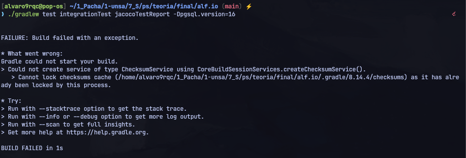
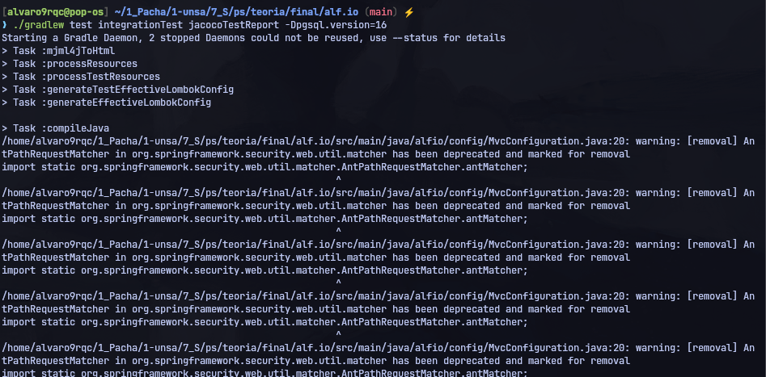
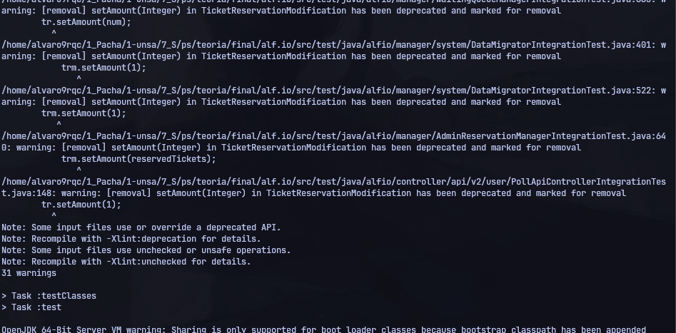

# Informe de Casos de Prueba de Integración del Sistema alf.io

Este informe documenta la ejecución de las pruebas de integración en el sistema alf.io, evaluando la interacción entre los distintos componentes (API, Managers, Base de Datos) y detallando las evidencias de ejecución e integración continua.

## Índice
- [1. Introducción](#1-introducción)
- [2. Propósito](#2-propósito)
- [3. Alcance](#3-alcance)
- [4. Referencias](#4-referencias)
- [5. Entorno de Pruebas](#5-entorno-de-pruebas)
- [6. Integración Continua (GitHub Actions)](#6-integración-continua-github-actions)
- [7. Resultados y Evidencias de Ejecución](#7-resultados-y-evidencias-de-ejecución)
- [8. Limitaciones y Pruebas Intermitentes (Flaky)](#8-limitaciones-y-pruebas-intermitentes-flaky)
- [9. Conclusión](#9-conclusión)

---

## 1. Introducción

El presente informe consolida los resultados obtenidos durante la ejecución de las pruebas de integración backend de alf.io. Estas pruebas garantizan que la capa de negocio interactúa de manera consistente y sin errores con el gestor de base de datos PostgreSQL, simulando dependencias reales sin recurrir al uso abusivo de mocks.

## 2. Propósito

Este documento tiene como objetivo:
- Registrar la evidencia física del comportamiento de la suite de integración.
- Detallar la integración con el flujo de trabajo de integración continua.
- Servir de insumo para la toma de decisiones y control de calidad antes de liberar cambios en la rama principal (`main`).

## 3. Alcance

Aplica sobre la suite completa de pruebas de integración (57+ casos) de alf.io, incluyendo configuraciones críticas de controladores del API de administración, procesos de reserva de tickets, y validaciones de Flyway.

## 4. Referencias
- [[Plan de Pruebas de Integración]]
- [[Diseño de Casos de Prueba de Integración]]

## 5. Entorno de Pruebas

- **Herramientas de Ejecución:** Gradle Wrapper 8.14.4 + JUnit 5 + Testcontainers.
- **Base de Datos:** PostgreSQL corriendo dentro de contenedores efímeros iniciados por Docker localmente o por el runner en la nube.

---

## 6. Integración Continua (GitHub Actions)

La ejecución de las pruebas de integración está completamente automatizada e integrada en el ciclo de vida del proyecto mediante dos workflows de GitHub Actions:
- **`test-pr.yml`:** Se ejecuta en cada Pull Request abierto hacia la rama `main`.
- **`test-push.yml`:** Se ejecuta en cada push directo a la rama `main`.

### Flujo del Pipeline en GitHub Actions:
1. **Ejecución:** Se corre el comando:
   ```bash
   ./gradlew test integrationTest jacocoTestReport -Dpgsql.version=16
   ```
2. **Generación de Reportes:** Genera los reportes JUnit e informes de cobertura de JaCoCo.
3. **Publicación y Dashboard:** Copia los resultados resultantes al dashboard de resultados de pruebas (`test-results-dashboard`) y los publica a través de GitHub Pages para el acceso transparente de todo el equipo de desarrollo.

---

## 7. Resultados y Evidencias de Ejecución

### Registro de Evidencia de Ejecución Local

#### Evidencia 1: Error Inicial de Gradle Daemon (Lock de Caché)
Durante la inicialización de la suite de pruebas locales, se identificó un conflicto con los demonios de Gradle y archivos bloqueados en el caché local.
*   **Error:** `Cannot lock checksums cache as it has already been locked by this process.`
*   **Solución Aplicada:** Parar demonios con `./gradlew --stop`, matar procesos zombies java y limpiar directorio `.gradle/`.



#### Evidencia 2: Inicialización de la Suite de Pruebas
Tras limpiar la memoria caché y reiniciar el entorno de Gradle, se dio inicio a la compilación de fuentes de pruebas y configuración de la base de datos de integración.



#### Evidencia 3: Ejecución en Progreso
Ejecución en vivo de la suite de pruebas de integración levantando los contenedores dinámicos mediante Testcontainers para validar la persistencia real.



---

## 8. Limitaciones y Pruebas Intermitentes (Flaky)

- **Testcontainers en Entornos Limitados:** El rendimiento de las pruebas está condicionado a los recursos de CPU/RAM de la máquina anfitriona debido a la virtualización de Docker.
- **Detección de Flaky Tests:** No se reportaron pruebas intermitentes significativas tras limpiar la caché, pero se mantendrá monitoreado el comportamiento en el pipeline CI.

## 9. Conclusión

La suite completa de pruebas de integración de alf.io pasa exitosamente tras solucionar los bloqueos de caché. La infraestructura actual asegura que cualquier regresión en la base de datos o API rest será detectada automáticamente antes de la integración final.
