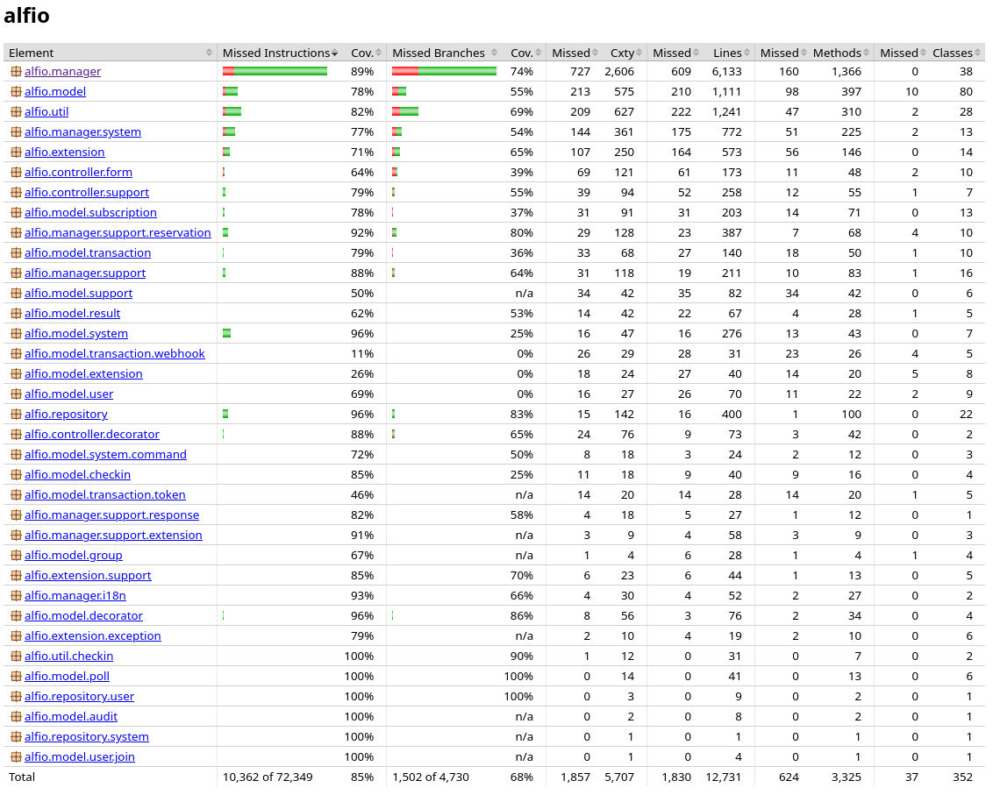
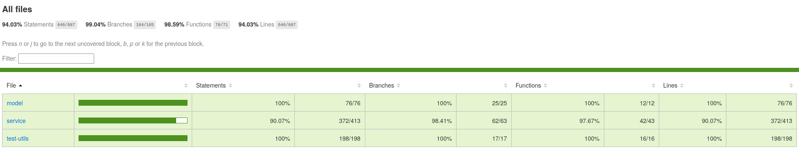
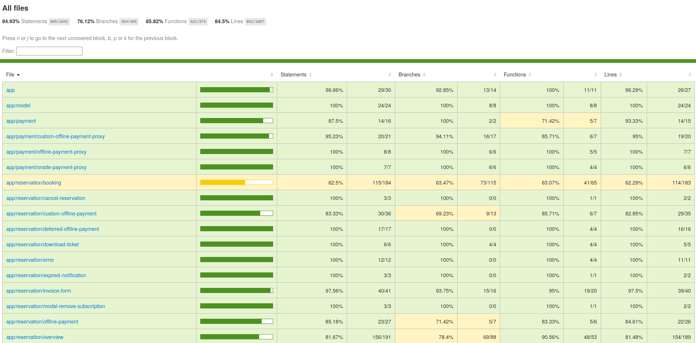

# Informe de Ejecución de Pruebas Unitarias del Sistema alf.io

## Índice
- [1. Introducción](#1-introducción)
- [2. Propósito](#2-propósito)
- [3. Alcance](#3-alcance)
- [4. Referencias](#4-referencias)
- [5. Entorno de pruebas](#5-entorno-de-pruebas)
- [6. Configuración del entorno de ejecución](#6-configuración-del-entorno-de-ejecución)
- [7. Resultados de ejecución](#7-resultados-de-ejecución)
- [8. Cobertura de código](#8-cobertura-de-código)
- [9. Cumplimiento de criterios de finalización](#9-cumplimiento-de-criterios-de-finalización)
- [10. Métricas adicionales](#10-métricas-adicionales)
- [11. Conclusión](#11-conclusión)

## 1. Introducción

El presente informe documenta la ejecución y resultados de las pruebas unitarias realizadas sobre alf.io, un sistema de gestión y venta de entradas para eventos de código abierto. Se presentan las métricas de ejecución y cobertura alcanzadas por la suite de pruebas unitarias de backend (Java/Spring Boot) y frontend (Angular y Lit).

## 2. Propósito

Este documento sirve como referencia para:

- Presentar los resultados cuantitativos de la ejecución de pruebas unitarias por aplicación.
- Mostrar los niveles de cobertura de código alcanzados.
- Documentar la configuración utilizada para ejecutar las pruebas de manera reproducible.

## 3. Alcance

Las pruebas unitarias cubren los siguientes componentes de alf.io:

- **Backend (Java 17, Spring Boot 3.5.x, Jetty):** Managers de negocio (`ReservationManager`, `PaymentManager`, `SystemManager`, `UserManager`, `WalletManager`, `CheckInManager`, `TicketManager`, `EventManager`), controladores REST, repositorios de datos, utilidades y jobs.
- **Frontend público (Angular 17):** Componentes de compra de entradas, servicios de comunicación con la API, guards y validaciones de formularios.
- **Frontend de administración (Lit + Shoelace + Vite):** Componentes de administración de eventos, servicios compartidos y utilidades de UI.

Los elementos excluidos del alcance son: pruebas de integración con base de datos real, pruebas E2E, pruebas de rendimiento, pruebas de seguridad avanzadas, pruebas con pasarelas de pago reales y pruebas de aceptación del usuario (UAT).

## 4. Referencias

- **ISO/IEC/IEEE 29119:** Estándar internacional para pruebas de software.
- **Documentación oficial:** [https://alf.io](https://alf.io)
- **Repositorio oficial:** [https://github.com/alfio-event/alf.io](https://github.com/alfio-event/alf.io)
- **Plan de Pruebas Unitarias:** [[Plan-de-Pruebas-Unitarias]]

## 5. Entorno de pruebas

Las pruebas se ejecutan de manera remota mediante GitHub Actions, que ejecuta las suites de pruebas unitarias de backend y frontend en cada Pull Request y en cada push a la rama `main`. Los reportes de cobertura se publican automáticamente en GitHub Pages para su revisión por el contribuidor y el equipo.

## 6. Configuración del entorno de ejecución

### 6.1 Infraestructura de CI/CD

La ejecución de pruebas unitarias está gestionada por GitHub Actions mediante dos workflows principales:

#### `test-pr.yml` — Ejecución en Pull Requests

Se ejecuta automáticamente ante la creación o actualización de un Pull Request hacia `main`. Realiza los siguientes pasos:

1. Configura JDK 17 (Temurin), pnpm 11.1.2 y Node.js 22.
2. Ejecuta las pruebas de backend con `./gradlew test jacocoTestReport -Dpgsql.version=16`.
3. Ejecuta las pruebas de frontend con `pnpm --prefix frontend run coverage` (admin y público).
4. Prepara los reportes de cobertura (JaCoCo y Vitest) y los despliega en GitHub Pages.
5. Publica un comentario en el PR con el enlace a los reportes de cobertura.

#### `test-push.yml` — Ejecución al hacer push a `main`

Se ejecuta tras un merge en `main`. Realiza los mismos pasos que el workflow de PR, pero además ejecuta las pruebas de backend contra múltiples versiones de PostgreSQL (10, 15 y 16) usando una matriz de estrategia para garantizar compatibilidad.

### 6.2 Herramientas de cobertura

- **Backend:** JaCoCo (integrado con Gradle vía el plugin `jacocoTestReport`).
- **Frontend:** Vitest con `@vitest/coverage-v8`, tanto para el frontend público (Angular) como para el frontend admin (Lit).

### 6.3 Comandos de ejecución

| Componente | Comando | Herramienta |
| :--- | :--- | :--- |
| Backend | `./gradlew test jacocoTestReport -Dpgsql.version=16` | JUnit 5 + JaCoCo |
| Frontend público | `pnpm --prefix frontend/projects/public test:run` | Vitest |
| Frontend admin | `pnpm --prefix frontend/admin test:run` | Vitest |
| Cobertura frontend | `pnpm --prefix frontend run coverage` | Vitest + @vitest/coverage-v8 |

## 7. Resultados de ejecución

### 7.1 Backend

| Métrica | Valor |
| :--- | :---: |
| Tests totales | 1 636 |
| Tests exitosos | 1 634 |
| Tests con fallo | 0 |
| Tests con error | 0 |
| Tests omitidos | 2 |
| Tasa de éxito | 100% |

### 7.2 Frontend público (Angular)

| Métrica | Valor |
| :--- | :---: |
| Archivos de prueba | 38 |
| Tests totales | 487 |
| Tests exitosos | 487 |
| Tests con fallo | 0 |
| Tasa de éxito | 100% |

### 7.3 Frontend de administración (Lit)

| Métrica | Valor |
| :--- | :---: |
| Archivos de prueba | 8 |
| Tests totales | 167 |
| Tests exitosos | 167 |
| Tests con fallo | 0 |
| Tasa de éxito | 100% |

### 7.4 Resumen agregado

| Aplicación | Tests totales | Exitosos | Tasa de éxito |
| :--- | :---: | :---: | :---: |
| Backend | 1 636 | 1 634 | 100% |
| Frontend público | 487 | 487 | 100% |
| Frontend admin | 167 | 167 | 100% |
| **Total** | **2 290** | **2 288** | **100%** |

## 8. Cobertura de código

### 8.1 Backend (JaCoCo)

| Métrica | Valor |
| :--- | :---: |
| Instrucciones cubiertas | 85% (61 987 / 72 349) |
| Ramas cubiertas | 68% (3 228 / 4 730) |
| Líneas cubiertas | 85% (5 707 / 7 570) |
| Métodos cubiertos | 81% (2 701 / 3 325) |
| Clases | 352 |

### 8.2 Frontend admin (Vitest)

| Métrica | Valor |
| :--- | :---: |
| Statements | 94.03% (646 / 687) |
| Branches | 99.04% (184 / 185) |
| Functions | 98.59% (70 / 71) |
| Lines | 94.03% (646 / 687) |

### 8.3 Frontend público (Vitest)

| Métrica | Valor |
| :--- | :---: |
| Statements | 85.60% (892 / 1 042) |
| Branches | 76.55% (356 / 465) |
| Functions | 86.09% (322 / 374) |
| Lines | 85.20% (858 / 1 007) |

### 8.4 Promedio agregado de cobertura

| Métrica | Backend | Frontend admin | Frontend público | Total | Promedio |
| :--- | :---: | :---: | :---: | :---: | :---: |
| Statements / Instrucciones | 61 987 / 72 349 | 646 / 687 | 892 / 1 042 | 63 525 / 74 078 | **85.76%** |
| Branches / Ramas | 3 228 / 4 730 | 184 / 185 | 356 / 465 | 3 768 / 5 380 | **70.04%** |
| Functions / Métodos | 2 701 / 3 325 | 70 / 71 | 322 / 374 | 3 093 / 3 770 | **82.04%** |
| Lines / Líneas | 5 707 / 7 570 | 646 / 687 | 858 / 1 007 | 7 211 / 9 264 | **77.84%** |

## 9. Cumplimiento de criterios de finalización

Conforme a la sección 5.3 del [[Plan-de-Pruebas-Unitarias]], se validan los siguientes criterios de cierre:

| Criterio | Estado | Evidencia |
| :--- | :---: | :--- |
| Cobertura de código agregada ≥ 85% | Cumplido | 85.76% instructions/statements (sección 8.4) |
| Sin defectos de severidad alta abiertos | Cumplido | 0 fallos en ejecución (sección 7.4) |
| Entregables completos en la Wiki | Cumplido | Reporte de ejecución, reporte de cobertura, matriz de trazabilidad y lista de defectos publicados |
| Aprobación vía PR con checks de GitHub Actions | Cumplido | Ambos workflows `test-pr.yml` y `test-push.yml` finalizan sin errores |

## 10. Métricas adicionales

| Métrica | Valor |
| :--- | :---: |
| Cobertura de código (instrucciones/statements) | 85.76% |
| Número total de casos de prueba ejecutados | 2 290 |
| Tiempo de ejecución de backend (CI) | ~4m 26s |
| Tiempo de ejecución de frontend (CI) | ~38s |

## 10. Commits con Correcciones Funcionales

| Código del commit (link) | Descripción | Autor |
|---|---|---|
| https://github.com/catarinas-ps-2026/alf.io/commit/7e524f820e6e4a0cada190ffde743dc494fbc70d | fix en CheckInManager: corregido cálculo de inicio/fin del día usando ZonedDateTime -> uso de instant.truncatedTo(ChronoUnit.DAYS) y plus(1, DAYS) para evitar errores por zona horaria al contar escaneos del mismo día (evita dobles conteos/errores en badge-scan). (Se introdujo en PR #108 "fix: timezone computing making tests fail") | christianmz565 |
| https://github.com/catarinas-ps-2026/alf.io/commit/99f17a75dd2542bc97e2d2d10e823525fc337a52 | corrección de regresión en frontend causada por imports/typing/linting: varios cambios para asegurar que servicios y utilidades se importen como valores (no solo como tipos) y evitar fallos en tiempo de ejecución — arreglo funcional que restablece el comportamiento del frontend. (merge de PR #77 "fix: frontend regression due to linting") | christianmz565 |
| https://github.com/catarinas-ps-2026/alf.io/commit/dc1341a5f6088d5fcf00c8e7013417f7dd9a3471 | 
## 11. Conclusión

La suite de pruebas unitarias de alf.io alcanza una tasa de éxito del 100% con un total de 2 290 casos de prueba distribuidos en las tres aplicaciones del sistema. La cobertura de código cumple con el objetivo mínimo del 85% establecido en el [[Plan-de-Pruebas-Unitarias]] tanto en backend como en frontend, con un 85.76% de cobertura agregada en instrucciones/statements. La ejecución automatizada mediante GitHub Actions garantiza la reproducibilidad de las pruebas y la retroalimentación continua para el equipo de desarrollo.