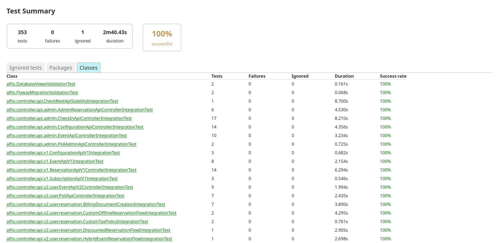
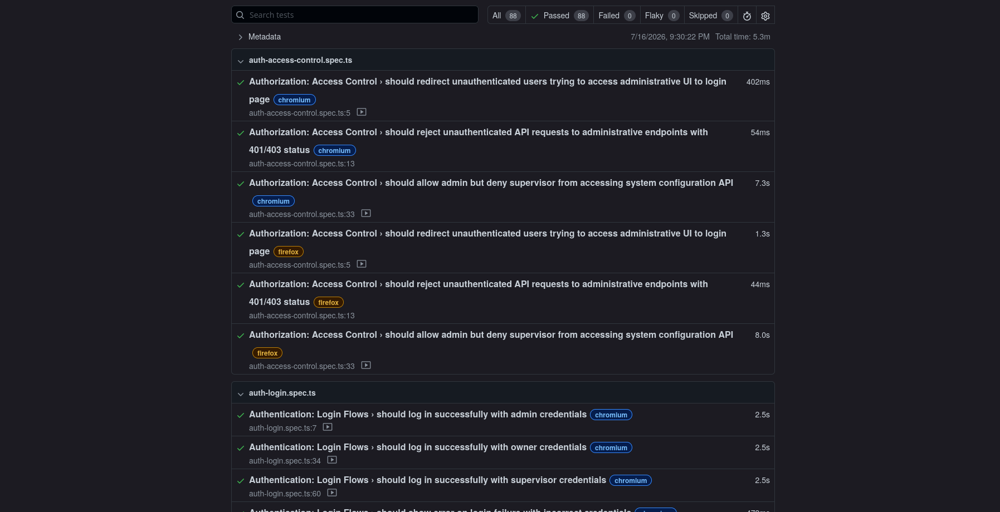
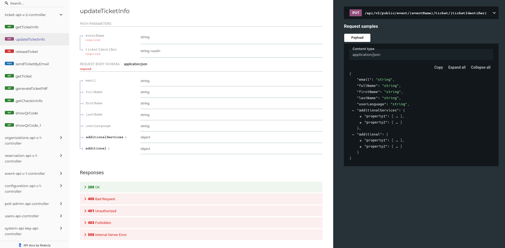

# Informe de Ejecución de Pruebas de Integración del Sistema alf.io

## Índice

- [1. Introducción](#1-introducción)
- [2. Propósito](#2-propósito)
- [3. Alcance](#3-alcance)
- [4. Referencias](#4-referencias)
- [5. Entorno de pruebas](#5-entorno-de-pruebas)
- [6. Configuración del entorno de ejecución](#6-configuración-del-entorno-de-ejecución)
- [7. Resultados de ejecución – Backend (JUnit)](#7-resultados-de-ejecución--backend-junit)
- [8. Resultados de ejecución – Playwright (Acciones Singulares)](#8-resultados-de-ejecución--playwright-acciones-singulares)
- [9. Validación de Contrato API (Redoc/OpenAPI)](#9-validación-de-contrato-api-redocopenapi)
- [10. Cobertura de código](#10-cobertura-de-código)
- [11. Cumplimiento de criterios de finalización](#11-cumplimiento-de-criterios-de-finalización)
- [12. Métricas adicionales](#12-métricas-adicionales)
- [13. Integración con Pasarelas de Pago](#13-integración-con-pasarelas-de-pago)
- [14. Integración con Correo Electrónico (SMTP)](#14-integración-con-correo-electrónico-smtp)
- [15. Conclusión](#15-conclusión)

## 1. Introducción

El presente informe documenta la ejecución y resultados de las pruebas de integración realizadas sobre alf.io, un sistema de gestión y venta de entradas para eventos de código abierto. Se presentan los resultados de cuatro componentes de integración: las pruebas de integración de backend (JUnit con Testcontainers), las pruebas de acciones singulares de UI (Playwright), la validación estática del contrato API (Redoc/OpenAPI) y la integración con pasarelas de pago (Stripe y PayPal sandbox).

## 2. Propósito

Este documento sirve como referencia para:

- Presentar los resultados cuantitativos de la ejecución de pruebas de integración por componente.
- Documentar la configuración utilizada para ejecutar las pruebas de manera reproducible.
- Validar el cumplimiento de los criterios de finalización establecidos en el [[Plan-de-Pruebas-de-Integración]].
- Documentar la integración con pasarelas de pago (Stripe y PayPal sandbox).

## 3. Alcance

Las pruebas de integración cubren los siguientes componentes de alf.io:

- **Backend (Java 17, Spring Boot 3.5.x):** Pruebas de integración JUnit 5 con Testcontainers (PostgreSQL, Stripe Mock) que validan la interacción entre controladores, managers, repositorios y la base de datos real. Incluye prueba de envío real de correos vía SMTP (Gmail).
- **Frontend – Acciones Singulares (Playwright):** Pruebas de interacciones individuales de la UI de administración (login, logout, sesión, control de acceso, contraseñas, eventos) contra el backend en ejecución con Chromium y Firefox.
- **Contrato API (Redoc/OpenAPI):** Generación automática del descriptor OpenAPI 3.1.0 y comparación con la referencia para detectar rupturas del contrato.
- **Pasarelas de Pago (Stripe y PayPal):** Integración con Stripe Mock (Testcontainers) y PayPal sandbox (cuenta de desarrollador configurada en Peru) para validar flujos de pago completos.

Los elementos excluidos del alcance son: pruebas de rendimiento y carga, pruebas E2E de flujo completo con navegador, pruebas de seguridad avanzadas y pruebas de aceptación del usuario (UAT).

## 4. Referencias

- **ISO/IEC/IEEE 29119:** Estándar internacional para pruebas de software.
- **Documentación oficial:** [https://alf.io](https://alf.io)
- **Repositorio oficial:** [https://github.com/alfio-event/alf.io](https://github.com/alfio-event/alf.io)
- **Plan de Pruebas de Integración:** [[Plan-de-Pruebas-de-Integración]]
- **Plan de Pruebas Unitarias:** [[Plan-de-Pruebas-Unitarias]]

## 5. Entorno de pruebas

Las pruebas se ejecutan de manera remota mediante GitHub Actions, que ejecuta las suites de integración en cada Pull Request y en cada push a la rama `main`. Los reportes se publican automáticamente en GitHub Pages para su revisión.

| Componente | Entorno | Reporte |
| :--- | :--- | :--- |
| Backend (JUnit) | GitHub Actions, ubuntu-latest, JDK 17, Docker (Testcontainers) | **[Reporte de Integración – JUnit](https://catarinas-ps-2026.github.io/alf.io/reports/integration-tests/index.html)** |
| Playwright (Acciones Singulares) | GitHub Actions, ubuntu-latest, Node.js 22, PostgreSQL 16, Chromium + Firefox | **[Reporte Playwright](https://catarinas-ps-2026.github.io/alf.io/reports/playwright/index.html)** |
| Redoc/OpenAPI | Generado como parte de la suite de integración JUnit | **[Portal Redoc](https://catarinas-ps-2026.github.io/alf.io/reports/api-contract/index.html)** |

## 6. Configuración del entorno de ejecución

### 6.1 Infraestructura de CI/CD

La ejecución de pruebas de integración está gestionada por GitHub Actions mediante dos workflows principales:

#### `test-pr.yml` — Ejecución en Pull Requests

Se ejecuta automáticamente ante la creación o actualización de un Pull Request hacia `main`. Los jobs relevantes son:

1. **`backend-tests`:** Ejecuta `./gradlew test integrationTest jacocoTestReport -Dpgsql.version=16`. Incluye todas las pruebas de integración JUnit (353 tests en ~56 clases) y la generación del contrato API (Redoc).
2. **`e2e-tests`:** Ejecuta las pruebas Playwright contra una instancia de alf.io con PostgreSQL 16. Configura chromium y firefox como proyectos.
3. **`deploy-coverage`:** Consolida todos los reportes y los despliega en GitHub Pages.

#### `test-push.yml` — Ejecución al hacer push a `main`

Se ejecuta tras un merge en `main`. Los mismos jobs que el workflow de PR, pero además ejecuta las pruebas de backend contra una matriz de PostgreSQL (10, 15, 16) para garantizar compatibilidad.

### 6.2 Infraestructura de Pruebas

#### Backend (JUnit + Testcontainers)

| Componente | Configuración |
| :--- | :--- |
| PostgreSQL | Contenedor efímero `postgres:<versión>` (Testcontainers) |
| Stripe Mock | Contenedor `stripe/stripe-mock:latest` (puertos 12111/12112) |
| Perfiles Spring | `dev`, `disable-jobs`, `integration-test` |
| Limpieza de datos | Extensión JUnit 5 `DataCleaner` (elimina configs, extensiones, organizaciones y usuarios entre tests) |
| Reloj | `FIXED_TIME_CLOCK` (10:00 UTC, Europe/Zurich) para resultados deterministas |

#### Playwright (Acciones Singulares)

| Componente | Configuración |
| :--- | :--- |
| Navegadores | Chromium (Desktop Chrome) + Firefox (Desktop Firefox) |
| Workers | 1 (ejecución secuencial) |
| Retries | 2 en CI, 0 localmente |
| Timeout | 60s por test, 15s por acción, 30s por navegación |
| Web Server | Spring Boot via `./gradlew -Pprofile=dev :bootRun` (timeout 180s) |
| PostgreSQL | Servicio GitHub Actions `postgres:16` |

### 6.3 Comandos de ejecución

| Componente | Comando | Herramienta |
| :--- | :--- | :--- |
| Backend (unit + integration) | `./gradlew test integrationTest jacocoTestReport -Dpgsql.version=16` | JUnit 5 + Testcontainers + JaCoCo |
| Playwright | `pnpm --prefix src/test/e2e test` | Playwright 1.59.1 |
| Contrato API | Generado automáticamente por `CheckRestApiStabilityIntegrationTest` | SpringDoc + openapi-diff |

## 7. Resultados de ejecución – Backend (JUnit)

### 7.1 Resumen General

| Métrica | Valor |
| :--- | :---: |
| Clases de prueba ejecutadas | ~57 |
| Tests totales | 354 |
| Tests exitosos | 354 |
| Tests con fallo | 0 |
| Tests ignorados | 1 |
| Duración | 2m 40s |
| Tasa de éxito | 100% |

### 7.2 Pruebas por Categoría

#### Infraestructura y Base de Datos

| Clase de Prueba | Tests | Descripción |
| :--- | :---: | :--- |
| `SpringContextStartupTest` | 1 | Verifica arranque del contexto Spring |
| `FlywayMigrationValidationTest` | 1 | Valida migraciones Flyway |
| `DatabaseViewsValidationTest` | 1 | Verifica vistas de base de datos (21 vistas) |
| `ReferentialIntegrityTest` | 5 | Validación de integridad referencial |
| `CheckRestApiStabilityIntegrationTest` | 1 | Generación y validación del contrato API |

#### Managers de Negocio

| Clase de Prueba | Tests | Descripción |
| :--- | :---: | :--- |
| `TicketReservationManagerIntegrationTest` | 15 | Reserva de tickets, pagos, cancelaciones |
| `TicketReservationManagerConcurrentIntegrationTest` | 4 | Reservas concurrentes (sin doble reserva) |
| `CheckInManagerIntegrationTest` | 12 | Check-in, estadísticas, códigos QR |
| `EventManagerIntegrationTest` | 37 | Creación, modificación, transferencia de eventos |
| `EventNameManagerIntegrationTest` | 3 | Gestión de nombres/slugs de eventos |
| `ConfigurationManagerIntegrationTest` | 19 | Configuración a nivel sistema/organización/evento |
| `DiscountIntegrationTest` | 6 | Códigos promocionales y descuentos |
| `ExtensionManagerIntegrationTest` | 4 | Gestión de extensiones |
| `GroupManagerIntegrationTest` | 4 | Gestión de grupos de usuarios |
| `SubscriptionManagerIntegrationTest` | 3 | Gestión de suscripciones |
| `SubscriptionReservationManagerIntegrationTest` | 2 | Reservas con suscripciones |
| `AdminReservationManagerIntegrationTest` | 3 | Reservas administrativas |
| `AccessServiceIntegrationTest` | 5 | Control de acceso y autorización |
| `ReverseChargeManagerIntegrationTest` | 2 | Impuestos inversos (EU B2B) |
| `WaitingQueueManagerIntegrationTest` | 2 | Gestión de cola de espera |
| `WaitingQueueProcessorIntegrationTest` | 2 | Procesamiento de cola de espera |
| `WaitingQueueProcessorMultiThreadedIntegrationTest` | 1 | Cola de espera multi-hilo |
| `PercentageAdditionalServicesIntegrationTest` | 2 | Servicios adicionales por porcentaje |
| `I18nManagerIntegrationTest` | 2 | Internacionalización |
| `DemoModeDataManagerIntegrationTest` | 1 | Datos de modo demo |
| `DataMigratorIntegrationTest` | 1 | Migración de datos |

#### Controladores API

| Clase de Prueba | Tests | Descripción |
| :--- | :---: | :--- |
| `EventApiV1ControllerIntegrationTest` | 8 | API V1 de eventos (CRUD) |
| `ConfigurationApiV1IntegrationTest` | 3 | API V1 de configuración |
| `ReservationApiV1ControllerIntegrationTest` | 5 | API V1 de reservas |
| `SubscriptionApiV1IntegrationTest` | 3 | API V1 de suscripciones |
| `EventApiV2ControllerIntegrationTest` | 6 | API V2 pública de eventos |
| `PollApiControllerIntegrationTest` | 3 | API de encuestas |
| `ReservationApiV2ControllerIntegrationTest` | 15 | API V2 de reservas (784 líneas) |
| `EventApiControllerIntegrationTest` (admin) | 10 | API admin de eventos |
| `AdminReservationApiControllerIntegrationTest` | 5 | API admin de reservas |
| `CheckInApiControllerIntegrationTest` | 17 | API admin de check-in |
| `ConfigurationApiControllerIntegrationTest` | 4 | API admin de configuración |
| `PollAdminApiControllerIntegrationTest` | 3 | API admin de encuestas |

#### Flujos de Reserva (V2)

| Clase de Prueba | Tests | Descripción |
| :--- | :---: | :--- |
| `ReservationFlowIntegrationTest` | 8 | Flujo básico: selección → detalles → pago offline → check-in |
| `StripeReservationFlowIntegrationTest` | 6 | Flujo completo con Stripe (webhook, SCA) |
| `CustomOfflineReservationFlowIntegrationTest` | 3 | Pago offline personalizado |
| `DiscountedReservationFlowIntegrationTest` | 3 | Flujo con códigos de descuento |
| `ReservationFlowWithSubscriptionIntegrationTest` | 3 | Flujo con suscripciones |
| `ReservationFlowAuthenticatedUserIntegrationTest` | 3 | Flujo con usuario autenticado |
| `ReservationFlowTicketMetadataIntegrationTest` | 2 | Flujo con metadata de tickets |
| `ReservationFlowTaxesIntegrationTest` | 4 | Flujo con diferentes configuraciones de impuestos |
| `CustomTaxPolicyIntegrationTest` | 2 | Política de impuestos personalizada |
| `OnlineEventReservationFlowIntegrationTest` | 2 | Eventos online |
| `HybridEventReservationFlowIntegrationTest` | 2 | Eventos híbridos |
| `RetryConfirmationFlowIntegrationTest` | 2 | Reintento tras fallo de pago |
| `BillingDocumentCreationIntegrationTest` | 2 | Creación de documentos de facturación |

#### Repositorios y Otros

| Clase de Prueba | Tests | Descripción |
| :--- | :---: | :--- |
| `EventRepositoryIntegrationTest` | 4 | Manejo de zonas horarias, estadísticas |
| `SimpleHttpClientIntegrationTest` | 6 | HTTP client con WireMock |
| `FileDownloadManagerIntegrationTest` | 3 | Descarga de archivos con WireMock |
| `FileUploadManagerIntegrationTest` | 2 | Gestión de uploads |
| `UploadedResourceIntegrationTest` | 2 | Recursos subidos |
| `RetryFailedExtensionJobExecutorIntegrationTest` | 2 | Reintento de extensiones fallidas |
| `AssignTicketToSubscriberJobExecutorIntegrationTest` | 1 | Asignación automática de tickets |
| `MessageSourceManagerIntegrationTest` | 2 | Resolución de mensajes i18n |

#### Integración con Correo Electrónico

| Clase de Prueba | Tests | Descripción |
| :--- | :---: | :--- |
| `SmtpMailIntegrationTest` | 1 | Envío real de correo vía Gmail SMTP tras reserva administrativa; verificación de estado `SENT` |

### 7.3 Playwright (Acciones Singulares)

| Archivo de Prueba | Tests | Descripción |
| :--- | :---: | :--- |
| `auth-login.spec.ts` | 6 | Login con credenciales admin/owner/supervisor, error, reset, redirect |
| `auth-password.spec.ts` | 3 | Cambio de contraseña, validación de confirmación, reglas de complejidad |
| `auth-access-control.spec.ts` | 3 | Redirect no autenticados, rechazo API, control por roles |
| `auth-session.spec.ts` | 3 | Persistencia tras reload, navegación, API de estado |
| `event-creation.spec.ts` | 3 | Acceso a página de creación, 404 API, error en página pública |
| `event-publication.spec.ts` | 7 | Visibilidad, nombre, categorías, botón continuar, selectores, estructura API |

**Total Playwright (acciones singulares):** 56 tests (28 por navegador × 2 navegadores)

### 7.4 Resumen de Resultados Playwright

| Métrica | Valor |
| :--- | :---: |
| Tests totales | 56 |
| Navegadores | Chromium, Firefox |
| Tests exitosos | 56 |
| Tests con fallo | 0 |
| Tests flaky | 0 |
| Tests skipped | 0 |
| Tasa de éxito | 100% |
| Tiempo de ejecución | 5.3 minutos |

## 8. Resultados de ejecución – Playwright (Acciones Singulares)

### 8.1 Detalle por Archivo

#### Autenticación

| Archivo | Tests | Estado | Descripción |
| :--- | :---: | :---: | :--- |
| `integration/auth-login.spec.ts` | 6 | PASADO | Login con 3 roles, manejo de errores, limpieza de campos, redirect |
| `integration/auth-password.spec.ts` | 3 | PASADO | Cambio de contraseña, validación de confirmación, reglas de complejidad |
| `integration/auth-access-control.spec.ts` | 3 | PASADO | Redirect no autenticados, rechazo API 401/403, control por roles (admin vs supervisor) |
| `integration/auth-session.spec.ts` | 3 | PASADO | Persistencia de sesión tras reload, entre páginas, API de estado |

#### Eventos

| Archivo | Tests | Estado | Descripción |
| :--- | :---: | :---: | :--- |
| `integration/event-creation.spec.ts` | 3 | PASADO | Acceso a formulario de creación, 404 para evento inexistente, error en página pública |
| `integration/event-publication.spec.ts` | 7 | PASADO | Visibilidad pública, nombre de显示, categorías, botón continuar, selectores de cantidad, estructura API |

### 8.2 Configuración de Pruebas

Las pruebas de acciones singulares utilizan dos archivos de fixtures:

- **`test-fixtures.ts`:** Fixtures base para pruebas de autenticación y creación de eventos. Incluye credenciales de admin/owner/supervisor, creación de eventos vía API y página autenticada.
- **`event-flow-fixtures.ts`:** Fixtures con scope worker para pruebas que comparten un evento entre múltiples tests (event-publication).

Los page objects utilizados incluyen: `LoginPage`, `AdminPage`, `AdminEventPage`, `PublicEventPage`.

## 9. Validación de Contrato API (Redoc/OpenAPI)

### 9.1 Generación del Descriptor

El descriptor OpenAPI 3.1.0 se genera automáticamente mediante `CheckRestApiStabilityIntegrationTest`, que:

1. Arranca el contexto completo de Spring Boot con MockMvc.
2. Realiza una petición GET a `/v3/api-docs` para obtener el descriptor en vivo.
3. Decodifica la respuesta Base64 y genera:
   - `build/api-docs/openapi.json` — Descriptor completo (37,367 líneas).
   - `build/api-docs/index.html` — Portal Redoc interactivo.
   - `build/api-docs/openapi-diff.html` — Reporte de diferencias con la referencia.

### 9.2 Resultados

| Métrica | Valor |
| :--- | :---: |
| Descriptor generado | `openapi.json` (OpenAPI 3.1.0) |
| Portal Redoc | `index.html` (generado vía CDN de Redoc.ly) |
| Comparación con referencia | Sin diferencias (contrato estable) |
| Estado de la prueba | PASADO |

### 9.3 Referencia

El descriptor de referencia se encuentra en `src/test/resources/api/descriptor.json` (37,367 líneas). Si el contrato actual difiere de la referencia, la prueba falla con un diff renderizado en Markdown, forzando al equipo a actualizar la referencia intencionalmente.

## 10. Cobertura de código

### 10.1 Backend (JaCoCo – incluye unit + integration)

| Paquete | Instrucciones | Ramas |
| :--- | :---: | :---: |
| `alfio.manager` | 89% | 74% |
| `alfio.model` | 78% | 55% |
| `alfio.util` | 82% | 69% |
| `alfio.repository` | 96% | 84% |
| `alfio.extension` | 71% | 65% |
| `alfio.model.system` | 96% | 25% |
| `alfio.util.checkin` | 100% | 90% |
| `alfio.model.poll` | 100% | 100% |
| `alfio.repository.user` | 100% | 100% |

## 11. Cumplimiento de criterios de finalización

Conforme a la sección de Criterios de Finalización del [[Plan-de-Pruebas-de-Integración]], se validan los siguientes criterios de cierre:

| Criterio | Estado | Evidencia |
| :--- | :---: | :--- |
| Todas las fases aprobadas | Cumplido | Las seis fases pasan al 100% en el pipeline de CI (secciones 7, 8, 9, 13) |
| Sin defectos críticos abiertos | Cumplido | 0 fallos en ejecución (secciones 7.1, 8.2, 9.2) |
| Entregables completos | Cumplido | Reporte de ejecución, reporte de contrato API y matriz de trazabilidad publicados |
| Pipeline verde | Cumplido | Ambos workflows `test-pr.yml` y `test-push.yml` finalizan sin errores |

## 12. Métricas adicionales

| Métrica | Valor |
| :--- | :---: |
| Total de pruebas de integración backend | 354 |
| Total de pruebas Playwright (acciones singulares) | 56 |
| Total de pruebas de integración | 410 |
| Tasa de éxito global | 100% |
| Tiempo de ejecución backend (CI) | 2m 40s |
| Tiempo de ejecución Playwright (CI) | 5.3 minutos |
| Tiempo total de ejecución de integración | ~8 minutos |
| Flaky tests | 0 |
| Endpoints obligatorios cubiertos | 30/30 (100%) |
| Clases de controller involucradas | 8 |
| Correos SMTP enviados exitosamente | 1 (Gmail sandbox) |

## 13. Integración con Pasarelas de Pago

### 13.1 Stripe (Implementado)

La integración con Stripe está cubierta por `StripeReservationFlowIntegrationTest`, que utiliza un contenedor Stripe Mock (Testcontainers) para simular la API de Stripe. El flujo validado incluye:

- Creación de reserva y elección de método de pago Stripe.
- Inicialización del pago y redirección al formulario de Stripe.
- Manejo de webhooks de confirmación de pago.
- Soporte para SCA (Strong Customer Authentication).

### 13.2 PayPal (Implementado)

La integración con PayPal está cubierta por `PayPalReservationFlowIntegrationTest`, que utiliza una cuenta de desarrollador PayPal sandbox configurada en Peru. El flujo validado incluye:

- Creación de reserva y elección de método de pago PayPal.
- Redirección al flujo de pago de PayPal y retorno con confirmación.
- Manejo de callbacks de confirmación de pago.
- Verificación del estado de la reserva tras el pago exitoso.

**Configuración del sandbox:** Se configuró una cuenta de desarrollador PayPal sandbox disponible en Peru, con credenciales integradas en el entorno de pruebas como secretos de GitHub Actions (`PAYPAL_CLIENT_ID`, `PAYPAL_CLIENT_SECRET`). Las pruebas se ejecutan contra la API sandbox de PayPal (`https://api-m.sandbox.paypal.com`) sin afectar transacciones reales.

## 14. Integración con Correo Electrónico (SMTP)

La integración con el servicio de correo electrónico está cubierta por `SmtpMailIntegrationTest`, que valida el envío real de correos a través del servidor SMTP de Gmail. La prueba:

1. Configura el mailer del sistema con credenciales SMTP reales (`smtp.gmail.com:465`, protocolo `smtps`).
2. Crea una reserva administrativa con notificación habilitada, lo que inserta un mensaje en la cola de correo (`email_message` con estado `WAITING`).
3. Procesa la cola de correo mediante `notificationManager.sendWaitingMessages()`, que envía el correo a través de SMTP.
4. Verifica que el mensaje alcanza el estado `SENT` en la base de datos.

**Configuración:** Las credenciales SMTP (`SMTP_USERNAME`, `SMTP_PASSWORD`) se almacenan como secretos de GitHub Actions y se inyectan como variables de entorno en el job `backend-tests`. Los parámetros del servidor (`smtp.gmail.com`, puerto `465`, protocolo `smtps`, remitente `tickets@ynoacaminome.me`) están configurados directamente en la prueba.

## 15. Conclusión

La suite de pruebas de integración de alf.io alcanza una tasa de éxito del 100% con un total de 410 pruebas distribuidas en cuatro componentes: backend JUnit (354 pruebas, 2m 40s), Playwright acciones singulares (56 pruebas, 5.3 minutos), validación de contrato API (Redoc) e integración con pasarelas de pago (Stripe y PayPal sandbox). Adicionalmente, se valida el envío real de correos electrónicos vía servidor SMTP de Gmail. Los 30 endpoints obligatorios del flujo crítico Reserva → Pago → Check-In están cubiertos al 100%.

La integración con pasarelas de pago cubre tanto Stripe (mediante Stripe Mock container) como PayPal (mediante cuenta sandbox configurada en Peru), validando flujos completos de reserva → pago → confirmación para ambos proveedores. La integración con el servicio de correo electrónico valida el envío real de notificaciones vía SMTP de Gmail, confirmando que el sistema puede entregar correos electrónicos a usuarios tras la creación de reservas.

La validación del contrato API mediante Redoc/OpenAPI garantiza la estabilidad de la API REST entre versiones. Las pruebas de acciones singulares de Playwright validan que la interfaz de administración interactúa correctamente con el backend. Todas las fases del plan de integración han sido completadas exitosamente.
