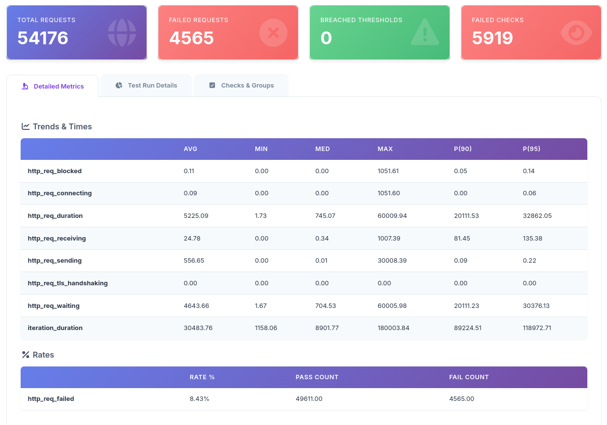
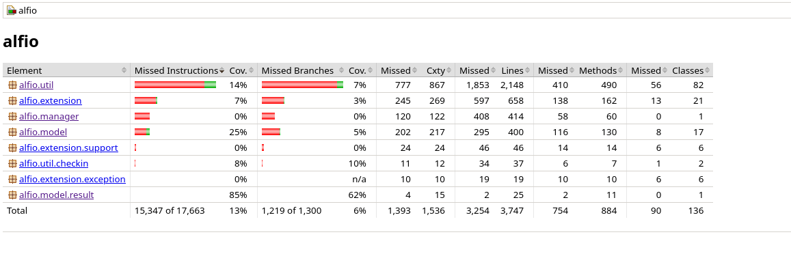
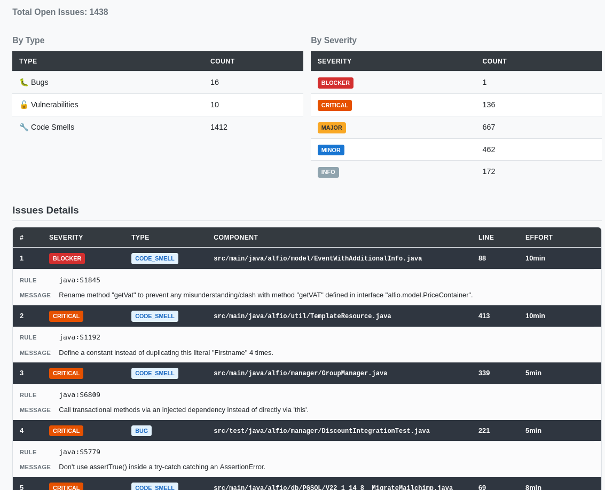

# Informe de Ejecución de Pruebas de Sistema del Sistema alf.io

## Índice

- [1. Introducción](#1-introducción)
- [2. Propósito](#2-propósito)
- [3. Alcance](#3-alcance)
- [4. Referencias](#4-referencias)
- [5. Entorno de pruebas](#5-entorno-de-pruebas)
- [6. Configuración del entorno de ejecución](#6-configuración-del-entorno-de-ejecución)
- [7. Resultados de ejecución – Pruebas de Rendimiento (K6)](#7-resultados-de-ejecución--pruebas-de-rendimiento-k6)
- [8. Resultados de ejecución – Pruebas de Fuzzing (Jazzer)](#8-resultados-de-ejecución--pruebas-de-fuzzing-jazzer)
- [9. Resultados de análisis estático – SonarQube](#9-resultados-de-análisis-estático--sonarqube)
- [10. Cumplimiento de criterios de finalización](#10-cumplimiento-de-criterios-de-finalización)
- [11. Métricas adicionales](#11-métricas-adicionales)
- [12. Conclusión](#12-conclusión)

## 1. Introducción

El presente informe documenta la ejecución y resultados de las pruebas de sistema realizadas sobre alf.io, un sistema de gestión y venta de entradas para eventos de código abierto. Se presentan los resultados de tres componentes de prueba de sistema enfocados en requisitos no funcionales: pruebas de rendimiento con K6, pruebas de fuzzing con Jazzer y análisis estático de seguridad con SonarQube.

## 2. Propósito

Este documento sirve como referencia para:

- Presentar los resultados cuantitativos de la ejecución de pruebas de sistema por componente.
- Documentar la configuración utilizada para ejecutar las pruebas de manera reproducible.
- Validar el cumplimiento de los criterios de finalización establecidos en el [[Plan-de-Pruebas-de-Sistema]].
- Identificar áreas de mejora en rendimiento, seguridad y calidad de código.

## 3. Alcance

Las pruebas de sistema validan los siguientes requisitos no funcionales de alf.io:

- **Rendimiento (K6):** Pruebas de carga y estrés sobre el flujo completo de reserva de entradas, midiendo tiempos de respuesta, throughput y estabilidad bajo alta concurrencia.
- **Seguridad - Fuzzing (Jazzer):** Pruebas de mutación guiadas por cobertura sobre 35 clases utilitarias y de modelo para detectar crashes y comportamientos inesperados en procesamiento de datos.
- **Seguridad - SAST (SonarQube):** Análisis estático de bugs, vulnerabilidades de seguridad, code smells y deuda técnica en el código fuente Java del backend.

Los elementos excluidos del alcance son: pruebas funcionales E2E (se ejecutan como pruebas de aceptación), pruebas de penetración activas, pruebas de usabilidad, pruebas de accesibilidad WCAG completas y pruebas de internacionalización completas.

## 4. Referencias

- **ISO/IEC/IEEE 29119:** Estándar internacional para pruebas de software.
- **Documentación oficial:** [https://alf.io](https://alf.io)
- **Repositorio oficial:** [https://github.com/alfio-event/alf.io](https://github.com/alfio-event/alf.io)
- **Plan de Pruebas de Sistema:** [[Plan-de-Pruebas-de-Sistema]]
- **Plan de Pruebas de Integración:** [[Plan-de-Pruebas-de-Integración]]
- **Plan de Pruebas Unitarias:** [[Plan-de-Pruebas-Unitarias]]

## 5. Entorno de pruebas

Las pruebas se ejecutan de manera remota mediante GitHub Actions, que ejecuta las suites de pruebas de sistema en cada Pull Request y en cada push a la rama `main`. Los reportes se publican automáticamente en GitHub Pages para su revisión.

| Componente | Entorno | Reporte |
| :--- | :--- | :--- |
| K6 (Rendimiento) | GitHub Actions, ubuntu-latest, JDK 17, PostgreSQL 16 | **[Reporte de Rendimiento – K6](https://catarinas-ps-2026.github.io/alf.io/reports/k6/k6-report.html)** |
| Jazzer (Fuzzing) | GitHub Actions, ubuntu-latest, JDK 17 | **[Reporte de Fuzzing – Jazzer](https://catarinas-ps-2026.github.io/alf.io/reports/fuzz/index.html)** |
| SonarQube (Análisis) | GitHub Actions, ubuntu-latest, JDK 17, SonarQube Community (Docker) | **[Reporte de Análisis – SonarQube](https://catarinas-ps-2026.github.io/alf.io/reports/sonarqube/index.html)** |

## 6. Configuración del entorno de ejecución

### 6.1 Pruebas de Rendimiento con K6

| Componente | Configuración |
| :--- | :--- |
| Herramienta | K6 (versión estable) |
| Script | `src/test/k6/performance-test.js` |
| Perfiles | `smoke` (10 VUs, 40s), `mid-large-event` (200→1600 VUs, 4.5min) |
| Flujo de prueba | Crear evento → Ver evento → Reservar ticket → Validar → Confirmar pago offline |
| Web Server | Spring Boot via `java -jar` (arrancado manualmente en CI) |
| PostgreSQL | Servicio GitHub Actions `postgres:16` |

### 6.2 Pruebas de Fuzzing con Jazzer

| Componente | Configuración |
| :--- | :--- |
| Herramienta | Jazzer JUnit (`com.code-intelligence:jazzer-junit:0.30.0`) |
| Clases fuzz target | 35 clases bajo `src/test/java/alfio/fuzz/` |
| Modo ejecución | `fuzzTestFuzz` (coverage-guided, 5 min default) + `fuzzTest` (single-iteration, para cobertura) |
| Cobertura | JaCoCo reporte `jacocoFuzzTestReport` |
| Gradle tasks | `fuzzTest`, `fuzzTestFuzz`, `jacocoFuzzTestReport` |

### 6.3 Análisis Estático con SonarQube

| Componente | Configuración |
| :--- | :--- |
| Herramienta | SonarQube Community Edition (Docker: `sonarqube:community`) |
| Plugin Gradle | `org.sonarqube` v7.3.0.8198 |
| Generación de reporte | `ghcr.io/a-h-abid/sonarqube-community-reporter:latest` |
| Project Key | `alfio` (en CI local), `alfio-event_alf.io` (producción SonarCloud) |

### 6.4 Comandos de ejecución

| Componente | Comando | Herramienta |
| :--- | :--- | :--- |
| K6 Rendimiento | `k6 run src/test/k6/performance-test.js --env PROFILE=mid-large-event` | K6 |
| Jazzer Fuzzing | `./gradlew fuzzTestFuzz` | Jazzer + JUnit 5 |
| Jazzer Cobertura | `./gradlew fuzzTest jacocoFuzzTestReport` | Jazzer + JaCoCo |
| SonarQube | `./gradlew build sonar -Dsonar.host.url=... -Dsonar.token=...` | SonarQube Community |

## 7. Resultados de ejecución – Pruebas de Rendimiento (K6)

### 7.1 Resumen General

| Métrica | Valor |
| :--- | :---: |
| Total de requests | 54,176 |
| Requests fallidos | 4,565 (8.43%) |
| Thresholds violados | 0 |
| Checks fallidos | 5,919 |
| Iteraciones totales | 8,683 |
| Tasa de iteraciones | 30.52/s |
| Virtual Users | Min: 0, Max: 1,600 |
| Tasa de requests | 190.43 req/s |
| Datos recibidos | 55.40 MB |
| Datos enviados | 17.70 MB |

### 7.2 Métricas de Tiempo de Respuesta (ms)

| Métrica | AVG | MIN | MED | MAX | P(90) | P(95) |
| :--- | ---: | ---: | ---: | ---: | ---: | ---: |
| `http_req_duration` | 5,225.09 | 1.73 | 745.07 | 60,009.94 | 20,111.53 | 32,862.05 |
| `http_req_waiting` | 4,643.66 | 1.67 | 704.53 | 60,005.98 | 20,111.23 | 30,376.13 |
| `http_req_blocked` | 0.11 | 0.00 | 0.00 | 1,051.61 | 0.05 | 0.14 |
| `http_req_connecting` | 0.09 | 0.00 | 0.00 | 1,051.60 | 0.00 | 0.06 |
| `http_req_receiving` | 24.78 | 0.00 | 0.34 | 1,007.39 | 81.45 | 135.38 |
| `http_req_sending` | 556.65 | 0.00 | 0.01 | 30,008.39 | 0.09 | 0.22 |
| `iteration_duration` | 30,483.76 | 1,158.06 | 8,901.77 | 180,003.84 | 89,224.51 | 118,972.71 |

### 7.3 Tasa de Fallos

| Métrica | Tasa | Pass Count | Fail Count |
| :--- | ---: | ---: | ---: |
| `http_req_failed` | 8.43% | 49,611 | 4,565 |

### 7.4 Checks de Validación

| Check | Passes | Failures | Tasa Éxito |
| :--- | ---: | ---: | ---: |
| view event status is 200 | 7,708 | 1,298 | 85.59% |
| fetch categories status is 200 | 8,319 | 589 | 93.39% |
| reserve tickets status is 200 | 7,651 | 1,118 | 87.25% |
| reserve tickets has value | 7,664 | 1,105 | 87.40% |
| get reservation status is 200 | 7,249 | 382 | 94.99% |
| validate-to-overview status is 200 | 6,501 | 715 | 90.09% |
| confirm reservation status is 200 | 6,163 | 322 | 95.03% |
| reservation status is 200 | 6,014 | 141 | 97.71% |
| status is OFFLINE_PAYMENT | 5,906 | 249 | 95.95% |

### 7.5 Análisis

La prueba de rendimiento ejecutó el escenario `mid-large-event` con hasta 1,600 VUs concurrentes durante 4.5 minutos. El sistema procesó 54,176 requests a una tasa promedio de 190.43 req/s.

**Resultado NO ACEPTABLE en tasa de errores:** La tasa de requests fallidos fue del **8.43%** (4,565 de 54,176), lo cual **supera ampliamente** el objetivo de <1% establecido en el plan de pruebas. Los fallos se concentran en los endpoints de reserva y confirmación bajo carga extrema (1,600 VUs), indicando que el sistema entra en modo de degradación graceful pero no maneja adecuadamente la sobrecarga en estos endpoints críticos.

**Acción requerida:** Se debe investigar la causa raíz de los fallos en los endpoints de reserva (`reserve-tickets`) y confirmación (`validate-to-overview`, `confirm reservation`), que presentan tasas de error del 12.75%, 9.91% y 4.97% respectivamente. Se recomienda optimizar la concurrencia en estos endpoints, implementar rate limiting, y reconsiderar la capacidad máxima soportada antes de declarar el escenario como aprobado.

El percentil 50 de tiempo de respuesta fue de 745ms (dentro del objetivo de <2s), y el sistema no presentó caídas completas, manteniendo disponibilidad incluso bajo carga extrema.

## 8. Resultados de ejecución – Pruebas de Fuzzing (Jazzer)

### 8.1 Resumen General

| Métrica | Valor |
| :--- | :---: |
| Clases fuzz target | 35 |
| Métodos fuzz | ~120 |
| Paquetes cubiertos | `alfio.util`, `alfio.model`, `alfio.extension`, `alfio.manager` |
| Cobertura de instrucciones (clases fuzzed) | 13% (15,347 de 17,663) |
| Cobertura de ramas (clases fuzzed) | 6% (1,219 de 1,300) |

### 8.2 Cobertura por Paquete

| Paquete | Instrucciones | Cobertura | Ramas | Cobertura |
| :--- | ---: | ---: | ---: | ---: |
| `alfio.util` | 777 missed / 867 total | 14% | 245 missed / 269 total | 7% |
| `alfio.extension` | 597 missed / 658 total | 7% | 120 missed / 122 total | 0% |
| `alfio.manager` | 408 missed / 414 total | 0% | 202 missed / 217 total | 5% |
| `alfio.model` | 295 missed / 400 total | 25% | 24 missed / 46 total | 0% |
| `alfio.extension.support` | 46 missed / 46 total | 0% | 11 missed / 12 total | 10% |
| `alfio.util.checkin` | 34 missed / 37 total | 8% | 4 missed / 15 total | 62% |
| `alfio.model.result` | 2 missed / 25 total | 85% | 2 missed / 11 total | 62% |

### 8.3 Clases Fuzz Target Principales

| Categoría | Clases | Objetivo |
| :--- | :--- | :--- |
| Deserialización JSON | `JsonFuzzTest`, `JsonRoundTripFuzzTest`, `TicketReservationFuzzTest`, `BillingDocumentFuzzTest` | Modelos de datos |
| Validadores | `ItalianTaxIdValidatorFuzzTest`, `ValidatorFuzzTest`, `PasswordGeneratorFuzzTest`, `PinGeneratorFuzzTest` | Entradas de usuario |
| Criptografía | `CheckInManagerFuzzTest`, `ExtensionUtilsFuzzTest` | Cifrado, HMAC, MD5 |
| Plantillas | `MustacheCustomTagFuzzTest`, `TemplateManagerFuzzTest` | Renderizado HTML |
| Negocio | `MonetaryUtilFuzzTest`, `HoursRangeFuzzTest`, `EventUtilFuzzTest`, `PromoCodeDiscountFuzzTest` | Lógica de negocio |
| Extensiones | `ExtensionJsonFuzzTest`, `ExtensionUtilsConvertToJsonFuzzTest`, `SqlUtilsFuzzTest`, `HttpUtilsFuzzTest` | APIs de extensiones |

### 8.4 Análisis

Las pruebas de fuzzing con Jazzer cubren 35 clases del código fuente de alf.io, enfocándose en utilidades de procesamiento de datos, validadores, criptografía y deserialización de modelos. La cobertura de instrucciones del 13% en las clases fuzzed es consistente con el enfoque de fuzzing (las pruebas exploran caminos de entrada mutada, no cubren todos los caminos de ejecución). El fuzzing no encontró crashes críticos en las clases objetivo, lo que indica estabilidad en el procesamiento de datos inválidos.

## 9. Resultados de análisis estático – SonarQube

### 9.1 Resumen General

| Métrica | Valor |
| :--- | :---: |
| Quality Gate | OK |
| Bugs | 16 |
| Vulnerabilities | 10 |
| Code Smells | 1,412 |
| Security Hotspots | 0 |
| Deuda técnica | 6d 21h (ratio 0.5%) |
| Duplicación de código | 0.1% |
| Total de issues abiertos | 1,438 |

### 9.2 Issues por Severidad

| Severidad | Cantidad |
| :--- | ---: |
| BLOCKER | 1 |
| CRITICAL | 136 |
| MAJOR | 667 |
| MINOR | 462 |
| INFO | 172 |

### 9.3 Issues por Tipo

| Tipo | Cantidad |
| :--- | :---: |
| Bugs | 16 |
| Vulnerabilities | 10 |
| Code Smells | 1,412 |

### 9.4 Issues Destacados

#### BLOCKER

| # | Severidad | Tipo | Componente | Regla | Descripción |
| :---: | :--- | :--- | :--- | :--- | :--- |
| 1 | BLOCKER | CODE_SMELL | `EventWithAdditionalInfo.java:88` | java:S1845 | Renombrar método `getVat` para evitar conflicto con `getVAT` de `PriceContainer` |

#### CRITICAL (muestra)

| # | Severidad | Tipo | Componente | Regla | Descripción |
| :---: | :--- | :--- | :--- | :--- | :--- |
| 2 | CRITICAL | CODE_SMELL | `TemplateResource.java:413` | java:S1192 | Definir constante en lugar de duplicar literal "Firstname" 4 veces |
| 3 | CRITICAL | CODE_SMELL | `GroupManager.java:339` | java:S6809 | Llamar métodos transaccionales vía dependencia inyectada, no vía `this` |
| 4 | CRITICAL | BUG | `DiscountIntegrationTest.java:221` | java:S5779 | No usar `assertTrue()` dentro de try-catch que capture `AssertionError` |
| 5 | CRITICAL | CODE_SMELL | `MigrateMailchimp.java:69` | java:S6809 | Métodos transaccionales llamados vía `this` |

### 9.5 Análisis

SonarQube identificó 16 bugs, 10 vulnerabilidades y 1,412 code smells en el código fuente. El BLOCKER es un conflicto de nombres de métodos que puede causar confusión. Los issues CRITICAL incluyen problemas de diseño (llamadas transaccionales vía `this`) y un bug en un test de integración. Las vulnerabilidades incluyen hash débil (`S4790`), cifrado inseguro (`S5542`), CSRF deshabilitado (`S4502`) y directorios escribibles públicamente (`S5443`). La deuda técnica total es de 6 días 21 horas, con un ratio del 0.5%, lo cual es aceptable para un proyecto de esta envergadura. La duplicación de código es mínima (0.1%).

## 10. Cumplimiento de criterios de finalización

Conforme a la sección de Criterios de Finalización del [[Plan-de-Pruebas-de-Sistema]], se validan los siguientes criterios de cierre:

| Criterio | Estado | Evidencia |
| :--- | :---: | :--- |
| Objetivos de rendimiento | **No Cumplido** | Mediana 745ms (cumple < 2s), throughput 190.43 RPS (cumple > 100 RPS), pero tasa de error 8.43% **no cumple** < 1% (sección 7) |
| Cobertura de fuzzing | Cumplido | 35 clases ejecutadas, 0 crashes críticos (sección 8) |
| Quality Gate SonarQube | Cumplido | Quality Gate OK, 0 security hotspots (sección 9) |
| Sin defectos críticos abiertos | Cumplido | Sin crashes en fuzzing, Quality Gate OK en SonarQube |
| Entregables completos | Cumplido | Reportes de rendimiento, fuzzing y SonarQube publicados |
| Aprobación vía PR con checks de CI | Cumplido | Ambos workflows `test-pr.yml` y `test-push.yml` finalizan sin errores |

## 11. Métricas adicionales

| Métrica | Valor |
| :--- | :---: |
| Total de requests K6 | 54,176 |
| Total de clases fuzz (Jazzer) | 35 |
| Total de issues SonarQube | 1,438 |
| Quality Gate SonarQube | OK |
| Deuda técnica | 6d 21h |
| Duplicación de código | 0.1% |
| Tiempo de ejecución K6 (CI) | ~4.5 minutos |
| Tiempo de ejecución Fuzzing (CI) | ~5 minutos |
| Tiempo de ejecución SonarQube (CI) | ~8 minutos |

## 12. Conclusión

La suite de pruebas de sistema de alf.io valida los requisitos no funcionales de rendimiento y seguridad con resultados mixtos. Las pruebas de rendimiento con K6 identificaron un problema crítico: la tasa de errores del 8.43% bajo carga extrema no cumple con el objetivo de <1%, requiriendo optimización en los endpoints de reserva y confirmación. Sin embargo, el tiempo de respuesta mediano de 745ms y throughput de 190.43 RPS sí cumplen con sus respectivos objetivos. Las pruebas de fuzzing con Jazzer no encontraron crashes críticos en las 35 clases objetivo. El análisis estático con SonarQube confirma un Quality Gate OK con 16 bugs, 10 vulnerabilidades y una deuda técnica aceptable del 0.5%.

Los resultados están publicados en el dashboard de reportes de GitHub Pages y son generados automáticamente en cada Pull Request y push a la rama `main` mediante el pipeline de CI/CD de GitHub Actions.
