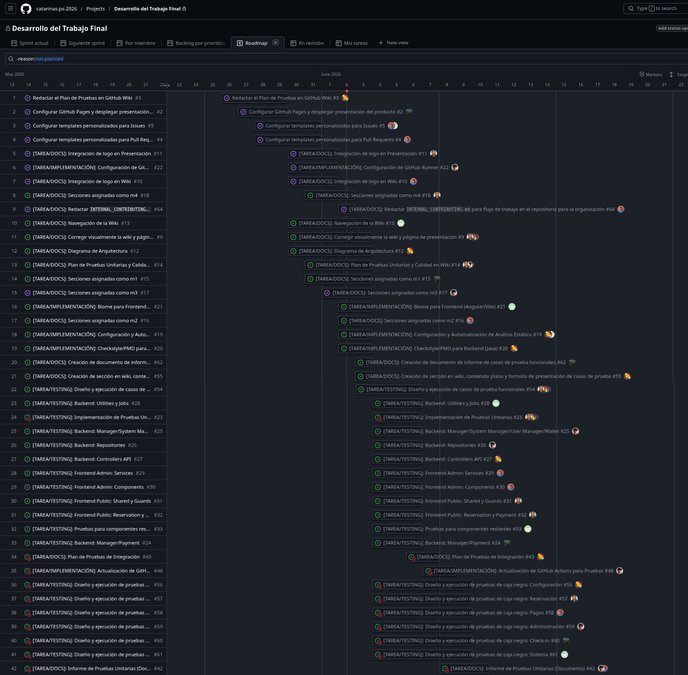

# Plan de Pruebas Unitarias del Sistema alf.io

## Índice
- [1. Información General](#1-información-general)
- [2. Especificaciones de las Pruebas](#2-especificaciones-de-las-pruebas)
- [3. Comunicación de las Pruebas](#3-comunicación-de-las-pruebas)
- [4. Registro de Riesgos](#4-registro-de-riesgos)
- [5. Metodología](#5-metodología)
- [6. Estructura de Pruebas](#6-estructura-de-pruebas)
- [7. Organización](#7-organización)
- [8. Cronograma](#8-cronograma)

## 1. Información General

### 1.1 Alcance
El plan se centra en las pruebas unitarias de los componentes lógicos de alf.io, usando mocks o dobles de prueba para aislar dependencias. El foco está en validar el comportamiento interno de backend y frontend sin depender de servicios externos ni de una base de datos real.

### 1.2 Referencias
1. Estándares de Ingeniería de Software y Pruebas
- **ISO/IEC/IEEE 29119:** Estándar internacional para pruebas de software (conceptos, procesos, documentación y técnicas de diseño de pruebas).
- **Repositorio de Código Abierto de alf.io:** [GitHub - alfio-event/alf.io](https://github.com/alfio-event/alf.io)
- **Documentación de Arquitectura de alf.io:** [[Arquitectura]] del proyecto.
- **Backend:** 
    - Documentación de Spring Boot 3.x y Spring Security.
    - Documentación de JUnit 5 y Mockito (frameworks de pruebas y simulación).
    - Documentación de Gradle (gestor de dependencias y tareas de construcción).
- **Frontend:**
    - Guía oficial de pruebas de Angular con Vitest.
    - Documentación de Lit 3 y Vite para la interfaz administrativa.
    - Documentación de Node.js y pnpm (gestión de dependencias del monorepo de frontend).

### 1.3 Glosario
A continuación se definen los términos y siglas técnicas clave utilizados a lo largo de esta documentación de pruebas unitarias:

- **API (Application Programming Interface):** Interfaz que permite la comunicación y el intercambio de datos entre la interfaz de usuario (frontend) y el servidor (backend).
- **REST (Representational State Transfer):** Estilo de arquitectura para el diseño de servicios web que utiliza verbos HTTP estándar (GET, POST, PUT, DELETE) para gestionar recursos de forma ligera.
- **SSO (Single Sign-On):** Mecanismo de autenticación única que permite acceder a varios sistemas con una sola credencial. En alf.io se utiliza para la autenticación administrativa.
- **OIDC (OpenID Connect):** Capa de identidad simple sobre el protocolo OAuth 2.0 que permite a los clientes verificar la identidad del usuario final basándose en la autenticación realizada por un servidor de autorización.
- **PKPass / PassKit:** Formato oficial desarrollado por Apple para guardar y distribuir pases digitales (tickets, cupones) en la aplicación Apple Wallet.
- **reCAPTCHA:** Servicio gratuito de Google que protege los sitios web de spam y abusos mediante técnicas avanzadas de análisis de riesgos para distinguir humanos de bots.
- **SPA (Single Page Application):** Tipo de aplicación web que carga una sola página HTML y actualiza dinámicamente el contenido a medida que el usuario interactúa con ella. En alf.io se implementa con Angular (Public SPA) y Lit (Admin SPA).
- **Flyway:** Herramienta de migración de bases de datos que automatiza el versionamiento del esquema relacional en PostgreSQL.
- **JUnit 5:** Framework estándar de pruebas unitarias para el lenguaje de programación Java, utilizado para validar la lógica del backend de alf.io.
- **Mock / Mocking:** Objeto o componente simulado que imita el comportamiento de un objeto real para aislar la unidad de código que se está probando.
- **Cobertura de Código (Code Coverage):** Métrica de software que describe el porcentaje de líneas de código fuente que han sido ejecutadas al menos una vez por la suite de pruebas.
- **Pruebas de Caja Negra (Black-Box Testing):** Método de pruebas centrado en la validación funcional de entradas y salidas, sin requerir visibilidad ni conocimiento de la estructura interna del código.

## 2. Especificaciones de las Pruebas

### 2.1 Proyecto y Subprocesos de Prueba
Este documento detalla la estructura general del proyecto alf.io y desglosa los subprocesos de prueba unitaria que garantizan la calidad y el correcto funcionamiento del software.

alf.io es una plataforma autohospedada de código abierto orientada a la venta de entradas y gestión de asistencia para eventos. Sus objetivos de negocio principales son:
- **Seguridad y Privacidad:** Almacenar datos confidenciales de los asistentes de manera aislada (mediante Row-Level Security en PostgreSQL).
- **Flexibilidad Transaccional:** Soporte para múltiples pasarelas de pago y generación nativa de pases digitales para Apple Wallet (PassKit) y Google Wallet.
- **Flujos de Alta Demanda:** Gestión de colas de reserva y salas de espera virtuales en eventos de alta concurrencia.

El proceso de pruebas del proyecto se divide en los siguientes subprocesos específicos para garantizar el correcto aislamiento y validación de componentes:

#### Subproceso de Pruebas Unitarias de Backend (Java / Spring Boot)
- **Objetivo:** Validar la lógica de negocio y las reglas transaccionales de forma aislada.
- **Técnica:** Mocks de dependencias utilizando Mockito e inyección de contexto de prueba mediante JUnit 5.
- **Foco de Validación:**
  - Managers de dominio (e.g., cálculo de tarifas de tickets, vencimiento automático de reservas en el `ReservationManager`).
  - Controladores API (e.g., verificar respuestas HTTP y serializaciones JSON correctas).
  - Repositorios de datos (e.g., simular queries e interacciones del ORM sin persistir en la base de datos real).
  - Jobs y procesos en segundo plano (e.g., lógica de envío de emails transaccionales programados).

#### Subproceso de Pruebas Unitarias de Frontend (Angular / Lit)
- **Objetivo:** Validar el comportamiento de las interfaces de usuario de cara al cliente (Public SPA) y al organizador (Admin SPA).
- **Técnica:** Emulación de respuestas HTTP con `HttpTestingController` de Angular y test runners con Vitest.
- **Foco de Validación:**
  - Controladores de componentes (e.g., renderizado de formularios de compra de entradas, manejo de estados de la cola de espera).
  - Servicios de comunicación (e.g., correcto mapeo y envío de peticiones REST hacia el backend).
  - Route Guards (e.g., evitar accesos no autorizados a rutas de administrador o páginas de checkout expiradas).
  - Validaciones locales de formularios (e.g., verificar reglas sintácticas del email y formato de campos de entrada).

#### Subproceso de Ejecución Automatizada e Integración Continua (CI)
- **Objetivo:** Garantizar que no ocurran regresiones lógicas al integrar nuevos desarrollos en el repositorio central.
- **Técnica:** Configuración de workflows automatizados en GitHub Actions.
- **Foco de Validación:** Ejecución automática de las suites de prueba de backend (`./gradlew test`) y frontend (`pnpm test`) en cada Pull Request y push hacia las ramas de desarrollo.

### 2.2 Elementos de Prueba
- **Backend**
  - Managers de negocio, cálculo de precios, pagos, reservas, check-in y eventos.
  - Repositorios y mapeos JPA donde se pueda aislar la lógica.
  - Controladores API cuando el comportamiento dependa de Spring y convenga validar la capa de borde.
  - Utilidades, validadores, formateadores y jobs.
- **Frontend público**
  - Componentes Angular de reserva, checkout, pago y formularios.
  - Servicios de consumo de API.
  - Guards y validaciones locales.
- **Frontend admin**
  - Componentes Lit de configuración y administración.
  - Servicios compartidos y utilidades de UI.
- **Infraestructura de pruebas**
  - Configuración de Gradle, pnpm, Vitest, JaCoCo y GitHub Actions.

### 2.3 Alcance de la Prueba

#### Elementos Incluidos en el alcance
Backend
- **Controladores REST API:** Validación de la lógica de los endpoints de la API pública y de administración, verificando las respuestas HTTP y el manejo correcto de parámetros.
- **Lógica de Negocio (Layer Managers):** Pruebas unitarias sobre componentes como `ReservationManager`, `PaymentManager`, `SystemManager`, `UserManager`, `WalletManager`, `CheckInManager`, `TicketManager` y `EventManager`.
- **Acceso a Datos (Layer Repositories):** Verificación de las consultas personalizadas y comportamientos de mapeo en los repositorios utilizando mocks de la base de datos PostgreSQL.
- **Clases de Utilidad y Jobs:** Pruebas unitarias sobre tareas programadas (`job`), utilitarios de formateo, generación de PDF/tickets, cálculo de precios y validadores (incluyendo integraciones simuladas de reCAPTCHA).

Frontend
- **Componentes de la Interfaz de Usuario:** Pruebas unitarias de controladores visuales de reserva, pago y administración.
- **Servicios e Integración con API:** Validación de las llamadas a los endpoints REST mediante la emulación de respuestas del servidor (`HttpTestingController`).
- **Validaciones del Lado Cliente:** Comprobación de que los formularios de entrada de datos (información del asistente, métodos de pago, etc.) apliquen las reglas de negocio necesarias antes del envío.
- **Guardianes de Ruta (Guards):** Pruebas de lógica sobre la seguridad y el flujo de navegación de la aplicación pública y de administración.

#### Elementos Excluidos del Alcance

- **Pruebas de Integración con Base de Datos Real:** Las consultas reales a PostgreSQL y la validación física de esquemas quedan fuera de este plan de pruebas unitarias.
- **Pruebas End-to-End (E2E):** Flujos completos de navegación automatizada desde la UI del usuario hasta la base de datos.
- **Pruebas de Rendimiento y Carga:** Pruebas de estrés para medir el comportamiento del sistema bajo alta concurrencia de reservas de tickets.
- **Pruebas de Seguridad Avanzadas (Penetration Testing):** Auditoría activa de vulnerabilidades de red, inyección SQL o XSS.
- **Pruebas con Pasarelas de Pago Reales:** Toda transacción con Stripe o PayPal se realizará de manera simulada (mockeada).
- **Pruebas de Aceptación del Usuario (UAT):** Sesiones de prueba por parte de clientes finales o el docente a cargo antes de la liberación final.

### 2.4 Suposiciones y Restricciones
**Suposiciones**
- El equipo dispone de Java 17, Node.js 22 y Docker.
- Se dispone de acceso al repositorio de GitHub del proyecto alf.io.
- Las dependencias se instalan con Gradle y pnpm.
- El código se ejecuta en GitHub Actions y en entornos locales equivalentes.

**Restricciones**
- Las pruebas unitarias deben ejecutarse en menos de 6 minutos por ciclo.
- Los mocks de servicios externos se utilizarán para evitar llamadas reales a APIs externas.
- La cobertura mínima objetivo es del 85% para código nuevo.

### 2.5 Partes Interesadas
| Rol | Responsabilidades |
| :--- | :--- |
| Docente a cargo | Aprobación de criterios de aceptación académicos, validación y aprobación del plan de pruebas, definición de escenarios de uso real, supervisión general del proyecto. |
| Test Lead | Liderazgo y coordinación del equipo de pruebas, planificación de pruebas unitarias en sprints, supervisión de actividades de testing, comunicación con stakeholders, gestión de riesgos y escalaciones, aprobación de entregables de prueba, revisión de código. |
| Desarrolladores | Implementación de funcionalidades necesarias, planificación eimplementación de casos de prueba, documentación del desarrollo de sus tareas, solicitud de revisiones al equipo de revisión. |

## 3. Comunicación de las Pruebas

En esta sección se explican las pautas para comunicar de manera efectiva durante el proceso de pruebas unitarias. Se define cómo debe ser la comunicación dentro del equipo y con las personas o grupos externos que estén involucrados. Además, se especifica quién es responsable de comunicar qué, por qué medios se debe hacer, con qué frecuencia y qué hacer cuando surjan conflictos o desacuerdos, se busca asegurar que todos los miembros del equipo estén informados sobre el avance de las pruebas, defectos encontrados, prioridades de resolución, y mejoras del proceso.

### 3.1. Gestión

- **Comunicación Interna:** Se usará WhatsApp para conversaciones rápidas, reuniones sincrónicas por Google Meet, y GitHub Projects para registro de tareas y seguimiento.
- **Comunicación Externa:** Se mantendrá en constante actualización la plataforma de GitHub para las revisiones periódicas por parte del docente.
- **Resolución de Conflictos:** Se gestionará en primera instancia por el Tech Lead. Si no se resuelve, se eleva al docente.
- **Metodología:** Se utiliza Scrum como marco de trabajo, con sprints de 2 semanas.

| Punto de Comunicación | Propósito | Frecuencia | Medios | Responsable | Audiencia |
| :--- | :--- | :--- | :--- | :--- | :--- |
| Sprint Planning | Planificar pruebas del sprint, definir prioridades | Inicio de cada sprint | Meet + GitHub Projects | Tech Lead | Equipo de desarrollo |
| Daily Standup | sincronización diaria de avances y bloqueos | Diario | WhatsApp | Desarrollador | Equipo de desarrollo |
| Sprint Review | Demostrar pruebas completadas y resultados | Fin de cada sprint | Meet | Tech Lead | Equipo + Docente |
| Sprint Retrospective | Evaluar qué mejorar en el proceso | Fin de cada sprint | Meet | Tech Lead | Equipo de desarrollo |
| Reporte de defectos | Reporte de bugs encontrados en pruebas | Cuando se encuentre | GitHub Issues | Desarrollador | Tech Lead |
| Reunión con docente | Validar avances y recibir feedback | 2 veces en la semana | Meet + Documento de avances | Tech Lead | Docente |

> [!IMPORTANT]
> Todos los acuerdos relevantes se documentan en la wiki del proyecto en GitHub. Se fomenta la comunicación asertiva y la colaboración proactiva. Los defectos se reportan como issues en GitHub con etiquetas de prioridad, y el estado de las pruebas se actualiza en GitHub Projects (columnas: Backlog, Ready, In Progress, In Review, Done). Se utiliza Scrum como metodología de trabajo, con sprints que incluyen planificación, revisión y retrospectiva.

### 3.2. Participantes del equipo

1. Robert Edison Arisaca Mamani (Docente del curso)
2. Mestas Zegarra, Christian Raúl (Tech Lead)
3. Sequeiros Condori, Luis Gustavo (Desarrollador)
4. Jara Mamani, Mariel Alisson (Desarrollador)
5. Fernández Huarca, Rodrigo Alexander (Desarrollador)
6. Quispe Condori, Álvaro Raúl (Desarrollador)
7. Barrios Medina, Mathías Alonso (Desarrollador)

## 4. Registro de Riesgos

En esta sección se identifican los riesgos que afectan directamente al proceso de ejecución de las pruebas unitarias por parte del equipo. No se consideran riesgos del producto, sino aquellos factores internos o de gestión que podrían impedir el cumplimiento del plan.

La severidad se calcula como: **Probabilidad (1-5) * Impacto (1-5)**.

| N° | Riesgo | Probabilidad | Impacto | Severidad | Plan de Mitigación |
| :--- | :--- | :---: | :---: | :---: | :--- |
| 1 | Desconocimiento profundo de Spring Boot | 4 | 4 | 16 | Revisión de código por pares. |
| 2 | Plazo de entrega ajustado (10 de junio) | 5 | 4 | 20 | Priorización de los módulos críticos según su impacto en el negocio y estimado de 10 horas semanales de trabajo. |
| 3 | Conflictos en la integración (merging) por alta velocidad de trabajo | 4 | 3 | 12 | Uso estricto de ramas `category/task`, comunicación constante y validación automática en Pull Requests. |
| 4 | Dificultades técnicas con las herramientas de automatización | 2 | 3 | 6 | Soporte técnico interno por parte de los encargados de estas herramientas. |

## 5 Metodología

### 5.1 Entregables de Prueba

Para el proceso de pruebas unitarias de `alf.io`, se generarán los siguientes artefactos como evidencia del cumplimiento de los objetivos de calidad, integrando tanto el backend como el frontend. Los entregables se están en la sección [[Informe de Pruebas Unitarias]] de esta Wiki.

- **Reporte de Ejecución de Pruebas Unitarias (Backend):** Resultados detallados generados por JUnit para la lógica en Java.
- **Reporte de Ejecución de Pruebas Unitarias (Frontend):** Resultados de las pruebas de componentes y servicios generados por Vitest.
- **Reporte de Cobertura de Código Agregado:** Evidencia técnica que demuestre que se ha alcanzado el 85% de cobertura total utilizando herramientas como JaCoCo y el reporter de cobertura de Vitest.
- **Matriz de Trazabilidad:** Documento que vincula los casos de prueba unitarios con los requisitos funcionales del sistema. 
- **Lista de Defectos Encontrados:** Registro de todos los bugs identificados durante la ejecución de las pruebas unitarias, detallando su severidad y estado.

### 5.2 Técnicas de diseño de Prueba
Para asegurar la calidad y el cumplimiento de la cobertura en las pruebas unitarias de alf.io, se aplicarán las siguientes técnicas basadas en el estándar ISTQB:

- **Caja negra:** Se utilizarán para diseñar casos de prueba basados en las especificaciones funcionales sin considerar la estructura interna del código:
    - *Partición por equivalencia:* Los datos de entrada se agrupan en clases válidas e inválidas. Por ejemplo, los roles de usuario (administrador, organizador, operador de check-in) se prueban para verificar que cada uno tenga acceso exclusivo a las operaciones permitidas.
    - *Análisis de valores límite:* Se prueban valores en los extremos de los rangos permitidos, como límites de caracteres en campos de texto, fechas próximas al evento, cupos mínimos y máximos de entradas, y montos de dinero en los límites de precisión de BigDecimal.
    - *Pruebas de casos de uso:* Se recorren paso a paso los flujos principales del sistema: creación de un evento, configuración de categorías de entradas, proceso de compra, generación de entradas (incluyendo Apple Wallet), check-in y reporting.
    - *Tablas de decisión:* Se aplican para validar reglas complejas de negocio, como el cálculo de precios con descuentos, impuestos (IVA), tarifas de servicio y promociones combinadas, donde múltiples condiciones booleanas determinan el resultado final.

### 5.3 Criterio de Finalización y Prueba
El proceso de pruebas unitarias se dará por concluido únicamente cuando se cumplan satisfactoriamente los siguientes criterios:

1. **Cobertura de Código Agregada:** Se debe haber alcanzado y verificado un mínimo del 85% de cobertura de líneas calculado de forma agregada sobre la totalidad del proyecto.
2. **Severidad de Defectos:** No deben existir defectos abiertos con una severidad calificada como alta o superior. La severidad se define mediante la fórmula: `Probabilidad de ocurrencia * Impacto del fallo`.
3. **Integridad de Entregables:** Todos los entregables definidos en la sección 5.2 (Reportes de pruebas unitarias, reportes de cobertura cobertura, matriz de trazabilidad y lista de defectos) deben estar completos y publicados en la Wiki.
4. **Aprobación y Verificación:** Toda contribución debe pasar obligatoriamente por un Pull Request (PR) hacia `main`. El proceso de cierre de tareas requiere:
   - **Checks Exitosos:** La suite de GitHub Actions debe finalizar sin errores (Pruebas unitarias y cobertura).
   - **Revisión Obligatoria:** Contar con la aprobación formal del Test Lead (Christian Mestas) tras la revisión de código y resultados de pruebas.

### 5.4 Métricas
Esta sección detalla el conjunto de métricas que se recogerán durante el transcurso de ejecución de las pruebas correspondientes a este hito:

- **Cobertura de código:** El objetivo es alcanzar 85% de cobertura agregada.
- **Cantidad de líneas de código:** Líneas de código efectuadas exclusivamente para la implementación de los casos de prueba unitarios.
- **Número de casos de prueba ejecutados:** Total de pruebas unitarias ejecutadas en el entorno controlado.

### 5.5 Requisitos del entorno de Pruebas
Este documento detalla la configuración del entorno necesario para la ejecución de las pruebas unitarias.

#### Infraestructura de CI/CD

Se utilizará GitHub Actions como plataforma de integración continua.

- **Runners:** Se utilizarán runners de GitHub con el sistema operativo `ubuntu-latest`.
- **Estrategia de Ramas:** Se sigue una estructura de ramas optimizada para desarrollo ágil: `main` (producción/estable) y ramas de tarea categorizadas como `category/task` (ej. `feat/login`, `fix/bug-123`).
- **Disparadores:**
  - **Pull Requests:** La suite completa de pruebas unitarias se ejecuta automáticamente ante la creación o actualización de cualquier Pull Request hacia la rama `main`, esta también genera el reporte de cobertura y lo publica temporalmente para su revisión por el contribuidor.
  - **Push a Main:** Tras la aprobación y merge en `main`, se dispara un flujo de construcción que genera y publica la imagen del contenedor en el GitHub Container Registry (GHCR), además de la publicación de reportes de cobertura en GitHub Pages.

#### Requisitos de Software
- **Java JDK 17:** Distribución Temurin.
- **Gradle:** Utilizado como herramienta de construcción (gestión de dependencias y ejecución de tareas).
- **Node.js:** Versión 22.x (gestionada automáticamente por el plugin de Gradle para las tareas de frontend).
- **Docker:** Para la ejecución de Testcontainers.

#### Base de Datos y Servicios
- **PostgreSQL:** Las pruebas utilizan contenedores efímeros de PostgreSQL gestionados por Testcontainers. Se soportarán oficialmente las versiones 10, 15 y 16.
- **Testcontainers:** Facilita la creación y destrucción automática de los servicios necesarios, garantizando la replicabilidad de las pruebas en cualquier entorno que soporte Docker.

## 6 Estructura de Pruebas

En este capítulo se presenta la organización general del proceso de pruebas. Se describe la estructura utilizada para clasificar las actividades, los niveles de prueba considerados y la relación entre los diferentes componentes involucrados en la validación del sistema.

La suite se organiza por capa y por aplicación:

- `src/test/java/alfio/...` para backend.
- `frontend/projects/public/src/...` para el frontend público.
- `frontend/admin/src/...` para el frontend admin.

Los tests de backend que requieren infraestructura aparecen como `*IntegrationTest` y usan soporte de integración, los tests puramente unitarios se concentran en managers, utilidades y componentes aislables.

## 7 Organización

Esta sección establece la distribución de funciones dentro del equipo de pruebas. Se detallan los roles participantes, las actividades asignadas a cada uno y las responsabilidades que deben asumir durante el ciclo de vida de las pruebas.

### 7.1 Roles y Responsabilidades

Para asegurar un proceso de pruebas bien organizado durante estas 2 semanas de ejecución de pruebas unitarias, se definen claramente los roles y responsabilidades del equipo. Se utiliza una matriz RACI para estructurar las actividades clave:

* **R – Responsable:** Las personas que ejecutan la tarea o actividad, es decir, son quienes hacen el trabajo de desarrollo y codificación de las pruebas.
* **A – Aprobador / Responsable final (Accountable):** La persona que tiene la autoridad final sobre la actividad y se asegura de que se complete correctamente. Solo hay un “A” por actividad.
* **C – Consultado:** Expertos o partes clave que brindan asesoría o información técnica antes o durante la ejecución.
* **I – Informado:** Personas que deben ser notificadas del avance o resultados de la actividad.

Dado que todo el equipo actúa en el rol técnico de desarrollo para cumplir con la meta de cobertura del proyecto, las responsabilidades se distribuyen de la siguiente manera bajo el liderazgo de Christian Mestas y en alineación con los entregables específicos de la plataforma:

| Actividad Clave / Tarea | Christian Mestas (Lead) | Mariel Jara (DEV/QA) | Gustavo Sequeiros (DEV/QA) | Mathias Barrios (DEV/QA) | Rodrigo Fernandez (DEV/QA) | Alvaro Quispe (DEV/QA) | Instructor (Docente) |
| :--- | :---: | :---: | :---: | :---: | :---: | :---: | :---: |
| **1. Definición de Estructura y Plan de Pruebas** | **A** | **R** | **R** | **C** | **C** | **C** | **I** |
| **2. Análisis de Cobertura Inicial (Línea base en GitHub)** | **A** | **C** | **C** | **R** | **R** | **R** | **I** |
| **3. Configuración del Entorno y CI (Local / GitHub Actions)** | **A** | **R** | **C** | **C** | **C** | **C** | **I** |
| **4. Pruebas Backend: Core & Transaccional**   *(Manager, SystemManager, UserManager, Wallet, Payment)* | **A** | **R** | **R** | **R** | **R** | **R** | **I** |
| **5. Pruebas Backend: Infraestructura**   *(Repositories, Controllers API, Utilities y Jobs)* | **A** | **R** | **R** | **R** | **R** | **R** | **I** |
| **6. Pruebas Frontend Admin**   *(Services y Components)* | **A** | **R** | **R** | **R** | **R** | **R** | **I** |
| **7. Pruebas Frontend Public**   *(Shared, Guards, Reservation, Payment, Waiting Room)* | **A** | **R** | **R** | **R** | **R** | **R** | **I** |
| **8. Consolidación de Reporte y Validación de Cobertura ($\ge 85\%$)** | **R** | **C** | **C** | **C** | **C** | **C** | **I** |

### Roles
- **Test Lead:** coordina, prioriza y valida entregables.
- **Equipo de desarrollo y pruebas:** implementa y mantiene la suite.
- **Instructor:** revisa el cierre académico del plan.

## 8 Cronograma

El cronograma con las actividades detalladas para el ciclo de pruebas del proyecto se gestiona y centraliza a través de la sección de Roadmap de GitHub del equipo. Esta vista permite realizar un seguimiento dinámico del progreso, plazos y asignaciones durante las dos semanas planificadas, tal como se presenta en la figura.

