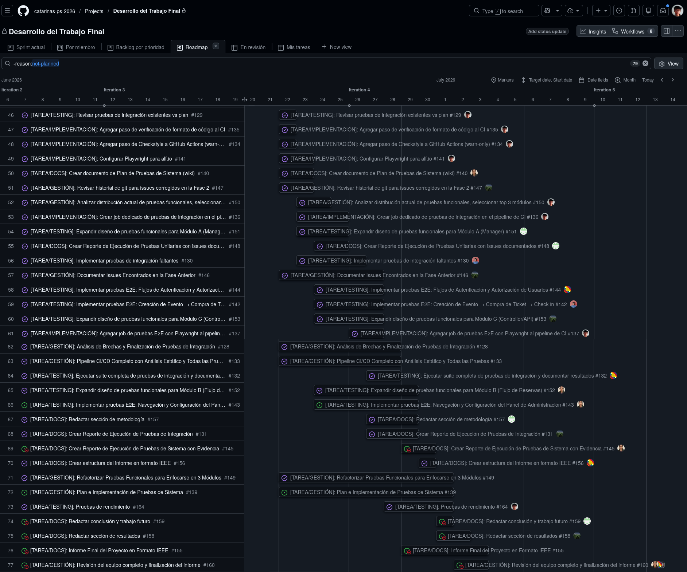

# Plan de Pruebas de Integración del Sistema alf.io

## Índice
- [Información General](#información-general)
- [Especificaciones de las Pruebas](#especificaciones-de-las-pruebas)
- [Comunicación de las Pruebas](#comunicación-de-las-pruebas)
- [Registro de Riesgos](#registro-de-riesgos)
- [Metodología](#metodología)
- [Organización](#organización)
- [Cronograma](#cronograma)
- [Cobertura de Endpoints Obligatorios](#cobertura-de-endpoints-obligatorios)

## Información General

### Alcance
Este plan cubre las pruebas de integración de alf.io, cuyo objetivo es verificar que los módulos del sistema interactúan correctamente entre sí y con sus dependencias reales (base de datos PostgreSQL, pasarelas de pago simuladas, interfaz de administración). A diferencia de las pruebas unitarias, aquí **no se usan mocks** para las capas internas del sistema; se valida la colaboración real entre componentes como controladores, managers, repositorios y la base de datos. Además, se incluyen pruebas de acciones singulares de la UI de administración con Playwright y validación estática del contrato API mediante Redoc/OpenAPI.

La estrategia de integración adoptada es **Big Bang incremental**: primero se integran y validan los módulos de infraestructura (base de datos, migraciones Flyway, configuración de Spring), luego los flujos de negocio críticos (reservas, pagos, check-in) a través de los endpoints, seguido de la validación del contrato API y las pruebas de UI.

### Referencias
1. Estándares de Ingeniería de Software y Pruebas
   - **ISO/IEC/IEEE 29119:** Estándar internacional para pruebas de software.
   - **Repositorio de Código Abierto de alf.io:** [GitHub - alfio-event/alf.io](https://github.com/alfio-event/alf.io)
   - **Documentación de Arquitectura de alf.io:** [[Arquitectura]] del proyecto.
   - **Plan de Pruebas Unitarias:** [[Plan-de-Pruebas-Unitarias]] (base de referencia para este documento).
    - **Backend:**
      - Documentación de Spring Boot 3.x y Spring Test.
      - Documentación de JUnit 5 y Testcontainers.
      - Documentación de Flyway (migraciones de esquema).
    - **API Contract:**
      - Documentación de SpringDoc OpenAPI.
      - Documentación de openapi-diff.
    - **Frontend (Playwright):**
      - Documentación oficial de Playwright.

### Glosario

- **Prueba de Integración:** Tipo de prueba que valida la interacción correcta entre dos o más módulos o componentes del sistema, incluyendo capas reales como la base de datos.
- **Testcontainers:** Librería Java que levanta contenedores Docker efímeros (PostgreSQL, etc.) durante la ejecución de pruebas, garantizando un entorno real y reproducible.
- **Flyway:** Herramienta de migración de base de datos. En las pruebas de integración, se ejecuta sobre un contenedor PostgreSQL real para validar que el esquema es coherente.
- **@SpringBootTest:** Anotación de Spring Test que levanta el contexto completo de la aplicación para pruebas de integración de backend.
- **Estrategia Big Bang incremental:** Estrategia de integración donde los módulos se van conectando en grupos lógicos (de infraestructura a negocio) antes de integrar el sistema completo.
- **API Contract:** Acuerdo implícito sobre la forma (endpoints, schemas JSON, códigos HTTP) de la API REST. Las pruebas de integración validan su cumplimiento.
- **Endpoint obligatorio:** Endpoint seleccionado del flujo crítico Reserva → Pago → Check-In para el cual se exige cobertura de prueba de integración.
- **OpenAPI / Redoc:** Estándar para describir APIs REST. SpringDoc genera automáticamente el descriptor OpenAPI 3.1.0 desde los controladores Spring. Redoc renderiza este descriptor como documentación interactiva.
- **Acción singular (Playwright):** Prueba que valida una interacción individual y aislada de la UI (ej. enviar formulario de login, verificar error de validación) sin depender de un flujo multi-paso.
- **Stripe Mock:** Contenedor Docker que simula la API de Stripe para pruebas de integración de pagos sin transacciones reales.

---

## Especificaciones de las Pruebas

### Proyecto y Subprocesos de Prueba

alf.io es una plataforma de venta de entradas y gestión de eventos. Para las pruebas de integración, el sistema se divide en los siguientes subprocesos de validación:

#### Subproceso 1 – Integración de Infraestructura y Base de Datos
- **Objetivo:** Verificar que Flyway aplica correctamente todas las migraciones sobre PostgreSQL y que el contexto de Spring Boot carga sin errores.
- **Técnica:** `@SpringBootTest` con Testcontainers (PostgreSQL).
- **Foco:** Migraciones de esquema, configuración de datasource, inicialización de beans críticos.

#### Subproceso 2 – Integración de Capas de Negocio
- **Objetivo:** Validar que los flujos de negocio completos (Controller → Manager → Repository → DB) funcionan correctamente de extremo a extremo en el backend.
- **Técnica:** Tests `@SpringBootTest` con invocación directa de controladores contra un PostgreSQL real.
- **Foco:**
  - Flujo de creación y configuración de eventos.
  - Flujo de reserva y compra de entradas (incluyendo cálculo de precios e impuestos).
  - Flujo de check-in y validación de tickets.
  - Flujo de gestión de reservas por parte del administrador.

#### Subproceso 3 – Integración de API REST (Contrato de API)
- **Objetivo:** Verificar que los endpoints REST devuelven los códigos HTTP, esquemas JSON y respuestas correctas según el contrato de la API.
- **Técnica:** Invocación directa de controladores con assertions sobre el cuerpo de la respuesta.
- **Foco:** Endpoints de creación de eventos, reserva de entradas, pago, check-in y gestión administrativa.

#### Subproceso 4 – Validación Estática de Contrato API (Redoc/OpenAPI)
- **Objetivo:** Verificar que el contrato de la API REST se mantiene estable y sin rupturas entre versiones.
- **Técnica:** Generación automática del descriptor OpenAPI 3.1.0 mediante SpringDoc, comparación con el descriptor de referencia (`descriptor.json`) usando `openapi-diff`.
- **Foco:** Endpoints públicos y de administración, esquemas de respuesta, códigos HTTP, estructura del contrato.
- **Herramienta:** `CheckRestApiStabilityIntegrationTest` (parte de la suite de integración JUnit).

#### Subproceso 5 – Pruebas de Integración de Frontend con Playwright (Acciones Singulares)
- **Objetivo:** Validar que las acciones individuales de la interfaz de administración funcionan correctamente contra el backend en ejecución.
- **Técnica:** Pruebas Playwright contra una instancia real de alf.io (Spring Boot + PostgreSQL) con navegador Chromium y Firefox.
- **Foco:** Acciones aisladas de autenticación (login, logout, sesión, control de acceso, gestión de contraseñas), creación y publicación de eventos, y verificación de estructura de API.

#### Subproceso 6 – Integración con Pasarelas de Pago 
- **Objetivo:** Validar el flujo completo de pago con pasarelas de pago reales en modo sandbox.
- **Técnica:** Conexión con cuentas de desarrollador sandbox de Stripe y PayPal.
- **Foco:** Flujo de reserva → pago → confirmación con Stripe y PayPal.
- **Nota:** Proveedores no disponibles en Peru como Stripe solo se probarán mediante mocks, para las pruebas con Paypal, se configurará una cuenta de desarrollador sandbox.

#### Subproceso 7 – Integración con Servicio de Correo Electrónico (SMTP)
- **Objetivo:** Validar que el sistema envía correos electrónicos reales a través de un servidor SMTP después de una reserva.
- **Técnica:** Configuración de credenciales SMTP reales (Gmail) vía variables de entorno, creación de reserva administrativa que dispara el envío de correo, y verificación del estado del mensaje.
- **Foco:** Flujo completo de notificación por correo: reserva → inserción en cola → envío SMTP → confirmación de entrega.
- **Herramienta:** `SmtpMailIntegrationTest` (parte de la suite de integración JUnit).
- **Credenciales:** `SMTP_USERNAME` y `SMTP_PASSWORD` configuradas como secretos de GitHub Actions.

### Elementos de Prueba

| Capa | Elementos bajo prueba |
| :--- | :--- |
| Infraestructura | Migraciones Flyway, arranque del contexto Spring, configuración de datasource |
| Repositorios | Queries personalizadas contra PostgreSQL real, paginación y filtros |
| Managers de negocio | `TicketReservationManager`, `CheckInManager`, `EventManager`, `AdminReservationManager` |
| Controladores REST | Endpoints públicos (`/api/v2/public/...`) y de administración (`/admin/api/...`) |
| Contrato API | Descriptor OpenAPI 3.1.0 generado por SpringDoc, comparación con referencia |
| Frontend (Playwright) | Acciones singulares de UI: login, logout, sesión, control de acceso, contraseñas, eventos |
| Correo Electrónico (SMTP) | Envío real de correos vía Gmail SMTP tras reserva administrativa |

### Alcance de la Prueba

#### Elementos Incluidos
- Validación de migraciones de base de datos con Flyway sobre PostgreSQL real.
- Flujos completos Controller → Manager → Repository → DB para los 30 endpoints obligatorios del flujo crítico.
- Contrato de la API REST: códigos HTTP, respuestas JSON, manejo de errores.
- Generación y validación estática del descriptor OpenAPI 3.1.0 (Redoc) y comparación con referencia.
- Pruebas de acciones singulares de la UI de administración con Playwright (login, logout, sesión, control de acceso, contraseñas, eventos).
- Integración con la base de datos real para verificación de estado persistido.
- Integración con Stripe Mock container para pruebas de flujo de pago.
- Integración con PayPal sandbox para pruebas de flujo de pago.
- Integración con servidor SMTP real (Gmail) para envío de correos electrónicos tras reserva.

#### Elementos Excluidos
- **Pruebas de rendimiento y carga:** No se valida el comportamiento bajo alta concurrencia (cubierto por pruebas de rendimiento con k6).
- **Pruebas E2E de flujo completo con navegador:** Los flujos completos (creación → compra → check-in) quedan fuera del alcance de integración; se cubren como pruebas de aceptación.
- **Pruebas de seguridad avanzadas (Penetration Testing):** No se auditan vulnerabilidades de red ni inyección SQL.

### Suposiciones y Restricciones

**Suposiciones**
- Existe un entorno con Docker disponible para levantar contenedores de Testcontainers.
- Las pruebas unitarias ya están aprobadas y con cobertura ≥ 85% antes de iniciar la integración.
- El esquema de base de datos se crea exclusivamente vía Flyway (sin scripts manuales).

**Restricciones**
- Las suites de integración deben completarse en menos de 15 minutos en el pipeline de CI.
- Las pruebas de integración deben ser reproducibles: no deben depender de datos preexistentes en la base de datos.
- Cada test debe limpiar su estado al finalizar (uso de `DataCleaner` o truncado de tablas).

### Partes Interesadas

| Rol | Responsabilidades |
| :--- | :--- |
| Docente a cargo | Aprobación de criterios de aceptación académicos, validación del plan, supervisión general. |
| Test Lead | Coordinación del equipo, definición de la estrategia de integración, revisión de código y entregables. |
| Desarrolladores | Implementación de pruebas de integración, documentación de resultados, reporte de defectos. |

---

## Comunicación de las Pruebas

Se mantiene el mismo esquema de comunicación definido en el [[Plan-de-Pruebas-Unitarias]]:

- **Comunicación Interna:** WhatsApp (daily), Google Meet (planning/review/retrospective), GitHub Projects (seguimiento de tareas).
- **Comunicación Externa:** GitHub Wiki y Pull Requests para revisión del docente.
- **Resolución de Conflictos:** Gestionada por el Tech Lead; se escala al docente si no hay resolución.

| Punto de Comunicación | Propósito | Frecuencia | Responsable |
| :--- | :--- | :--- | :--- |
| Sprint Planning | Planificar pruebas de integración del sprint | Inicio de sprint | Tech Lead |
| Sprint Review | Demostrar pruebas y resultados al docente | Fin de sprint | Tech Lead |
| Reporte de defectos | Reportar fallos de integración encontrados | Al encontrarse | Desarrollador |

### Participantes del Equipo

1. Robert Edison Arisaca Mamani (Docente del curso)
2. Mestas Zegarra, Christian Raúl (Tech Lead)
3. Sequeiros Condori, Luis Gustavo (Desarrollador)
4. Jara Mamani, Mariel Alisson (Desarrollador)
5. Fernández Huarca, Rodrigo Alexander (Desarrollador)
6. Quispe Condori, Álvaro Raúl (Desarrollador)
7. Barrios Medina, Mathías Alonso (Desarrollador)

---

## Registro de Riesgos

La severidad se calcula como: **Probabilidad (1–5) × Impacto (1–5)**.

| N° | Riesgo | Prob. | Impacto | Severidad | Plan de Mitigación |
| :--- | :--- | :---: | :---: | :---: | :--- |
| 1 | Lentitud en el pipeline de CI por pruebas de integración pesadas | 4 | 3 | 12 | Paralelizar suites; usar caché de dependencias en GitHub Actions. |
| 2 | Datos de prueba inconsistentes que causan fallos intermitentes (flaky tests) | 4 | 4 | 16 | Usar `DataCleaner` para limpiar estado entre tests y fixtures controlados por prueba. |
| 3 | Incompatibilidades entre versiones de PostgreSQL en contenedor y producción | 2 | 4 | 8 | Fijar la versión del contenedor Testcontainers a la misma que producción (v15). |
| 4 | Dificultad para reproducir flujos de pago sin acceso a sandbox de Stripe | 3 | 3 | 9 | Implementar stubs de alto nivel para la pasarela; validar solo la lógica de orquestación. |
| 5 | Deuda técnica de pruebas unitarias incompletas que bloquea integración | 3 | 5 | 15 | Completar al 100% las pruebas unitarias de los módulos críticos antes de integrar. |

---

## Metodología

### Estrategia de Integración

Se adopta la estrategia incremental por módulos, dividida en seis fases:

| Fase | Descripción | Módulos Involucrados |
| :--- | :--- | :--- |
| **Fase 1 – Infraestructura** | Arranque del contexto Spring con PostgreSQL real; validación de todas las migraciones Flyway. | DataSource, Flyway, Spring Context |
| **Fase 2 – Negocio Core** | Pruebas de los flujos críticos de negocio sobre la base de datos real: creación de eventos, reserva, pago y check-in. | EventManager, TicketReservationManager, CheckInManager, AdminReservationManager |
| **Fase 3 – API y Contrato** | Validación del contrato REST de los 30 endpoints obligatorios del flujo crítico. | EventApiController, ConfigurationApiController, CheckInApiController, AdminReservationApiController, EventApiV2Controller, ReservationApiV2Controller, TicketApiV2Controller |
| **Fase 4 – Contrato API (Redoc)** | Generación y validación estática del descriptor OpenAPI 3.1.0; comparación con referencia para detectar rupturas. | SpringDoc, CheckRestApiStabilityIntegrationTest |
| **Fase 5 – Acciones Singulares UI** | Pruebas Playwright de acciones aisladas de la interfaz de administración contra el backend en ejecución. | auth-login, auth-logout, auth-password, auth-session, auth-access-control, event-creation, event-publication |
| **Fase 6 – Pagos** | Integración con pasarelas de pago sandbox. | PayPalManager, StripeReservationFlowIntegrationTest |
| **Fase 7 – Correo Electrónico** | Integración con servidor SMTP real para envío de notificaciones. | SmtpMailIntegrationTest, NotificationManager |

Las fases son **secuenciales**: cada fase solo comienza cuando la anterior ha sido aprobada.

### Entregables de Prueba

- **Reporte de Ejecución de Pruebas de Integración (Backend):** Resultados generados por JUnit / GitHub Actions con detalle por test y suite.
- **Reporte de Ejecución de Pruebas de Integración (Playwright):** Resultados de las pruebas de acciones singulares de UI, generado por el reportador HTML de Playwright.
- **Portal de Contrato API (Redoc):** Documentación interactiva de la API generada automáticamente desde SpringDoc.
- **Reporte de Diferencias API:** Comparación del contrato actual con la referencia usando openapi-diff.
- **Matriz de Trazabilidad de Integración:** Documento que vincula cada prueba de integración con el endpoint obligatorio que valida (ver sección 8).
- **Registro de Defectos de Integración:** Lista de bugs encontrados durante la integración, con severidad, estado y responsable de corrección.

### Técnicas de Diseño de Prueba

- **Pruebas de Flujo (Use-Case driven):** Se diseñan pruebas que recorren el flujo completo de un caso de uso real (ej. crear evento → publicar → reservar entrada → pagar → hacer check-in).
- **Pruebas de Contrato de API:** Se verifica que cada endpoint devuelva el código HTTP esperado y la respuesta correcta.
- **Pruebas de Estado de Base de Datos:** Tras ejecutar una operación, se consulta directamente la base de datos para verificar que el estado persistido es el esperado.
- **Pruebas de Regresión de Integración:** Se re-ejecutan pruebas de integración previas ante cada cambio en los módulos integrados para detectar regresiones.
- **Pruebas de Acciones Singulares (Playwright):** Se validan interacciones individuales de la UI de administración (login, logout, sesión, control de acceso, contraseñas, eventos) contra el backend en ejecución.
- **Validación Estática de Contrato (OpenAPI/Redoc):** Se genera el descriptor OpenAPI 3.1.0 automáticamente y se compara con una referencia para detectar rupturas sin ejecutar pruebas funcionales.

### Criterios de Finalización

El proceso de pruebas de integración se dará por concluido cuando:

1. **Todas las fases aprobadas:** Las seis fases de la estrategia incremental pasan al 100% en el pipeline de CI.
2. **Sin defectos críticos abiertos:** No existen bugs de integración con severidad ≥ 12 (según la fórmula Probabilidad × Impacto) sin resolver.
3. **Entregables completos:** El reporte de ejecución, el reporte de cobertura, el reporte de contrato API y la matriz de trazabilidad están publicados en la Wiki.
4. **Aprobación del Tech Lead:** Cada suite debe estar revisada y aprobada mediante Pull Request por Christian Mestas.
5. **Pipeline verde:** El workflow de GitHub Actions finaliza sin errores en todas las suites de integración (backend JUnit, Playwright acciones singulares, Redoc).

### Métricas

| Métrica | Descripción | Objetivo |
| :--- | :--- | :--- |
| Tasa de éxito de pruebas backend | % de pruebas JUnit que pasan en el pipeline de CI | 100% en rama `main` |
| Tasa de éxito de pruebas Playwright | % de pruebas de acciones singulares que pasan | 100% en rama `main` |
| Envío SMTP exitoso | Correo electrónico enviado y confirmado vía servidor Gmail real | 100% en rama `main` |
| Estabilidad del contrato API | Diferencias detectadas entre descriptor actual y referencia | 0 rupturas |
| Tiempo de ejecución de suite | Tiempo total de ejecución de todas las pruebas de integración en CI | ≤ 15 min |
| Flaky tests | Número de pruebas con resultados inconsistentes (fallan entre ejecuciones) | 0 en `main` |

### Requisitos del Entorno de Pruebas

#### Infraestructura de CI/CD
- **Plataforma:** GitHub Actions con runners `ubuntu-latest`.
- **Disparadores:** Pull Request hacia `main` y push a `main`.
- **Paralelismo:** Las suites de Fase 1, 2, 3, 4 y 5 se ejecutan en jobs paralelos dentro del mismo workflow.
- **Jobs de integración:** `backend-tests` (Fases 1-4), `e2e-tests` (Fase 5), ambos en `test-pr.yml` y `test-push.yml`.

#### Requisitos de Software
- **Java JDK 17** (distribución Temurin).
- **Gradle** (construcción y ejecución de pruebas de backend).
- **Docker** (obligatorio para Testcontainers y Stripe Mock).
- **Node.js 22 + pnpm 11.1.2** (para pruebas Playwright de acciones singulares).
- **Playwright** (navegadores Chromium y Firefox).

#### Base de Datos y Servicios
- **PostgreSQL 15** en contenedor efímero gestionado por Testcontainers (Fases 1-3).
- **PostgreSQL 16** como servicio en GitHub Actions (Fase 5 – Playwright).
- **Stripe Mock** en contenedor efímero gestionado por Testcontainers (Fase 2 – pagos).
- **Chromium y Firefox** instalados vía Playwright CLI (Fase 5 – acciones singulares UI).

---

## Organización

### Roles y Responsabilidades

Matriz RACI para las actividades de pruebas de integración:

| Actividad Clave | Christian Mestas (Lead) | Mariel Jara | Gustavo Sequeiros | Mathias Barrios | Rodrigo Fernandez | Alvaro Quispe | Docente |
| :--- | :---: | :---: | :---: | :---: | :---: | :---: | :---: |
| **1. Definición de Estrategia de Integración** | **A** | **R** | **R** | **C** | **C** | **C** | **I** |
| **2. Configuración de Testcontainers y entorno CI** | **A** | **R** | **C** | **C** | **C** | **C** | **I** |
| **3. Fase 1 – Infraestructura (Flyway, Spring Context)** | **A** | **C** | **R** | **R** | **C** | **C** | **I** |
| **4. Fase 2 – Negocio Core (Reservas, Pagos, Check-in)** | **A** | **R** | **R** | **R** | **R** | **R** | **I** |
| **5. Fase 3 – API y Contrato (30 endpoints obligatorios)** | **A** | **R** | **R** | **C** | **R** | **R** | **I** |
| **6. Fase 4 – Contrato API (Redoc/OpenAPI)** | **A** | **C** | **R** | **C** | **C** | **C** | **I** |
| **7. Fase 5 – Acciones Singulares UI (Playwright)** | **A** | **R** | **R** | **C** | **C** | **C** | **I** |
| **8. Fase 6 – Integración PayPal** | **A** | **C** | **C** | **C** | **C** | **C** | **I** |
| **9. Fase 7 – Integración SMTP** | **A** | **C** | **R** | **C** | **C** | **C** | **I** |
| **10. Consolidación de Reportes y Matriz de Trazabilidad** | **R** | **C** | **C** | **C** | **C** | **C** | **I** |
| **11. Revisión y Cierre del Plan** | **A** | **C** | **C** | **C** | **C** | **C** | **I** |

---

## Cronograma

El cronograma de las pruebas de integración se extiende durante 1 sprint de 2 semanas (del 11 al 24 de junio de 2026), en continuidad con el cronograma del plan de pruebas unitarias. Las fases se ejecutan de manera secuencial: la Fase 2 solo comienza cuando la Fase 1 tiene el pipeline verde, y la Fase 3 cuando la Fase 2 ha sido aprobada. El detalle de las tareas planificadas es el siguiente:

| N° | Semana | Fecha Entrega | Fase | Tarea | Asignado(s) |
| :---: | :--- | :--- | :--- | :--- | :--- |
| 1 | Semana 1 | 11 jun | Fase 1 | Configurar `BaseIntegrationTest` con Testcontainers (PostgreSQL 15) y `@DynamicPropertySource` | Christian Mestas |
| 2 | Semana 1 | 11 jun | Fase 1 | Configurar pipeline de GitHub Actions para suites de integración (jobs paralelos, caché de Docker) | Christian Mestas |
| 3 | Semana 1 | 12 jun | Fase 1 | Validar aplicación de las migraciones Flyway sobre contenedor PostgreSQL real | Mariel Jara |
| 4 | Semana 1 | 12 jun | Fase 1 | Verificar arranque del contexto Spring Boot (`@SpringBootTest`) con datasource de Testcontainers | Mariel Jara |
| 5 | Semana 1 | 13 jun | Fase 1 | Test de repositorios de eventos y tickets: CRUD y queries contra PostgreSQL real | Gustavo Sequeiros |
| 6 | Semana 1 | 13 jun | Fase 1 | Test de repositorios de reservas y configuración: persistencia y paginación | Gustavo Sequeiros |
| 7 | Semana 1 | 16 jun | Fase 1 | Test de repositorios de servicios adicionales y códigos promocionales | Mathias Barrios |
| 8 | Semana 1 | 16 jun | Fase 1 | Validar scripts de post-migración y vistas de estadísticas | Mathias Barrios |
| 9 | Semana 1 | 17 jun | Fase 1 | Test de integridad referencial: foreign keys y constraints entre tablas principales | Rodrigo Fernandez |
| 10 | Semana 1 | 17 jun | Fase 1 | Test de repositorios de usuarios y organizaciones | Alvaro Quispe |
| 11 | Semana 2 | 18 jun | Fase 2 | Test del flujo de creación y configuración de eventos | Mariel Jara |
| 12 | Semana 2 | 18 jun | Fase 2 | Test del flujo de reserva con cálculo de precios e impuestos | Rodrigo Fernandez |
| 13 | Semana 2 | 19 jun | Fase 2 | Test del flujo de check-in y validación de tickets | Alvaro Quispe |
| 14 | Semana 2 | 19 jun | Fase 2 | Test del flujo de gestión de reservas administrativas | Gustavo Sequeiros |
| 15 | Semana 2 | 20 jun | Fase 2 | Test del flujo completo de reserva → pago → check-in | Christian Mestas |
| 16 | Semana 2 | 23 jun | Fase 3 | Test de endpoints de administración: creación y publicación de eventos, configuración del sistema, check-in y gestión de reservas | Mariel Jara, Alvaro Quispe |
| 17 | Semana 2 | 23 jun | Fase 3 | Test de endpoints públicos: consulta de eventos, reserva de entradas, pago y casos de borde de reserva | Gustavo Sequeiros, Mathias Barrios |
| 18 | Semana 2 | 24 jun | Fase 3 | Test de webhooks de confirmación de pago (Stripe y Mollie) | Alvaro Quispe |
| 19 | Semana 2 | 24 jun | Fase 3 | Consolidación de reportes y actualización de documentación | Christian Mestas, Mariel Jara |
| 20 | Semana 3 | 25 jun | Fase 4 | Configurar generación de OpenAPI con SpringDoc y `CheckRestApiStabilityIntegrationTest` | Christian Mestas |
| 21 | Semana 3 | 25 jun | Fase 4 | Validar contrato API: comparar descriptor actual con referencia y generar reporte Redoc | Gustavo Sequeiros |
| 22 | Semana 3 | 26 jun | Fase 5 | Configurar Playwright para pruebas de acciones singulares de UI de administración | Christian Mestas |
| 23 | Semana 3 | 26 jun | Fase 5 | Implementar pruebas de login, logout, sesión y control de acceso | Mariel Jara |
| 24 | Semana 3 | 27 jun | Fase 5 | Implementar pruebas de gestión de contraseñas y creación/publicación de eventos | Gustavo Sequeiros |
| 25 | Semana 3 | 30 jun | Fase 5 | Integrar pruebas Playwright en pipeline de CI y consolidar reportes | Christian Mestas |
| 26 | Semana 3 | 30 jun | Fase 6 | Investigar configuración de cuenta sandbox PayPal para pruebas de integración (Peru) | Gustavo Sequeiros |
| 27 | Semana 3 | 30 jun | Fase 3 | Consolidación final de reportes y cierre del plan de integración | Christian Mestas, Mariel Jara |

