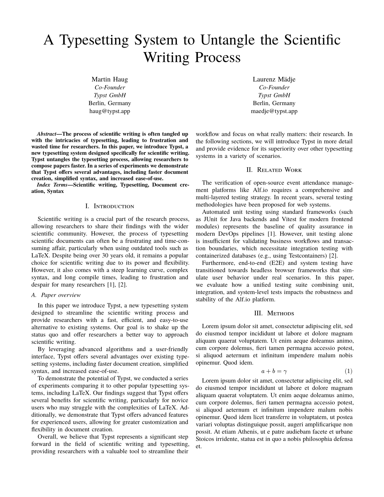

# Wiki de alf.io

Bienvenido a la wiki del proyecto. Aquí encontrarás toda la documentación relacionada con el diseño de pruebas, arquitectura del sistema y maquetación de informes científicos.

## Índice de Contenidos

* [[Home]]
* [[Plan de Pruebas Unitarias]]
* [[Informe de Ejecución de Pruebas Unitarias]]
* [[Diseño de Casos de Prueba Funcionales]]
* [[Informe de Casos de Prueba Funcionales]]
* [[Plan de Pruebas de Integración]]
* [[Plan de Pruebas de Sistema]]
* [[Plantilla de Typst]]

---

## Plantilla de Typst (IEEE)

Hemos integrado una plantilla de Typst para generar documentación académica y científica con el estilo estándar de la IEEE. Puedes encontrar los archivos fuente de la plantilla en el directorio `wiki/typst-template/`.

### Previsualización de la Plantilla

  

